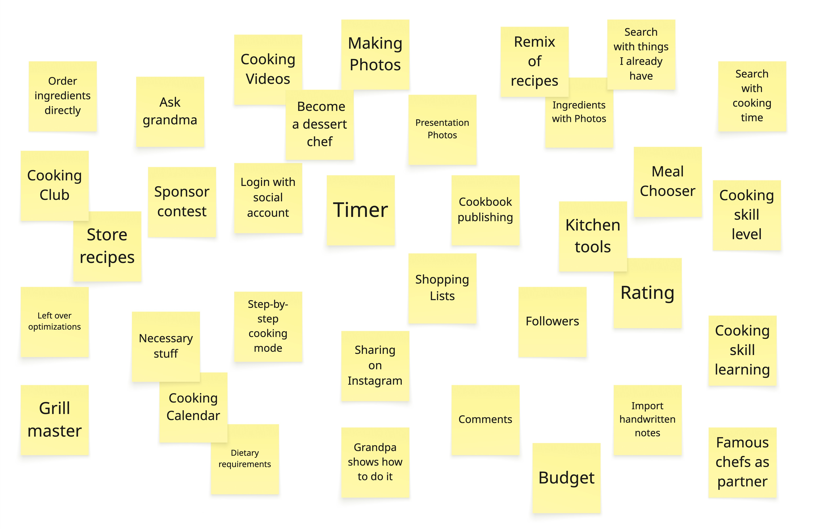

Prompt 2026-05-31:

You are a participant in a brainstorming session. Add your ideas. The current result is provided in Brainstorming.jpg. Use the provided Brainstorming skill.

[Skill.md](./BrainstormingSkill/SKILL.md)
[Critic technices](./BrainstormingSkill/references/Critique%20techniques.md)
[References](./BrainstormingSkill/references/Research%20basis.md)

Answer:

Assuming this brainstorm is for a cooking/recipe platform or app, here are additional ideas that don't seem to be on the board yet:

### AI & Personalization

* AI meal planner for the whole week
* "What can I cook right now?" from fridge photo
* Automatic recipe difficulty adjustment
* Portion scaler for families, couples, or solo cooking
* AI substitute ingredients when something is missing
* Personalized nutrition coach
* Seasonal recipe recommendations

### Social & Community

* Live cook-along sessions
* Family recipe vault
* Recipe challenges with friends
* Collaborative cookbooks
* Local cooking groups
* Mentor matching (amateur ↔ expert cook)
* Recipe request marketplace

### Learning

* Knife skills training
* Technique-focused lessons (sautéing, baking, grilling)
* Cooking certifications / badges
* Mistake detection while cooking
* Flavor pairing education
* Cultural cooking journeys
* Cooking for kids mode

### Smart Kitchen

* Connect to smart ovens and appliances
* Automatic timer synchronization across recipe steps
* Voice-controlled hands-free mode
* Ingredient inventory tracking
* Expiration-date alerts
* Smart temperature monitoring

### Health & Lifestyle

* Medical diet support (low sodium, diabetic, etc.)
* Macro and calorie optimization
* Allergy-safe recipe verification
* Fitness-goal meal planning
* Pregnancy-friendly recipes
* Sustainable cooking recommendations

### Shopping & Budget

* Price comparison across stores
* Pantry cost calculator
* Budget meal challenges
* Bulk-buy optimization
* Automatic coupon integration
* Food waste tracker

### Content Creation

* AI-generated recipe videos
* Recipe-to-blog conversion
* Recipe-to-shopping-card export
* Cookbook templates
* Nutrition label generator
* Recipe photography guidance

### Gamification

* Cooking streaks
* Achievement system
* Level up by mastering techniques
* Regional cuisine quests
* "Beat the chef" challenges
* Leaderboards for community events

### Accessibility

* Voice-only cooking mode
* Large-text mode
* Color-blind friendly instructions
* One-handed cooking mode
* Multilingual recipe translation

### Unique / Unusual Ideas

* Virtual taste profile (learn what flavors users like)
* Dinner-party planner
* Emergency meals from 3 ingredients
* Travel mode (recipes based on destination cuisine)
* Historical recipes recreated
* AR ingredient recognition
* AI-generated fusion recipes
* "Cook with leftovers only" challenge mode
* Food pairing recommendations for wine, coffee, tea, and cocktails
* Household meal voting system

Some of the highest-impact ideas from a product perspective are likely:

1. Fridge-photo recipe generation
2. AI ingredient substitution
3. Weekly meal planner
4. Pantry inventory + expiration tracking
5. Voice-controlled cooking mode
6. Smart shopping list with price optimization
7. Family recipe vault
8. Mistake detection while cooking
9. Personalized nutrition coach
10. Dinner-party planner with automatic shopping and timing coordination.
