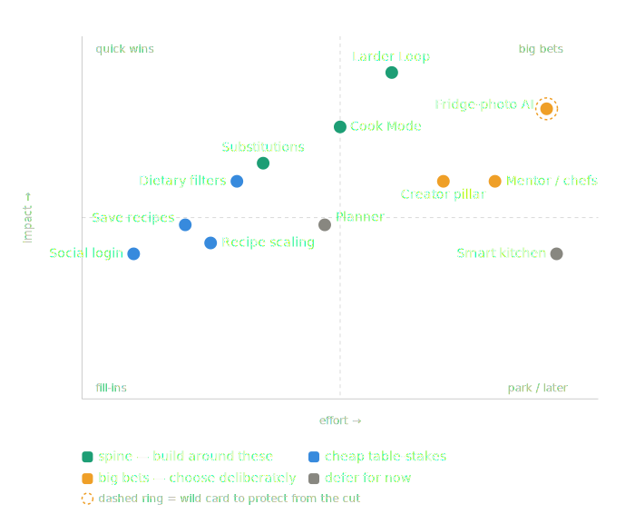

# Prompt 2026-06-04:

You are a participant in a brainstorming session in the convergence phase. Add your ideas. The current result is provided in Brainstorming.jpg. Use your Brainstorming skill.

#  Answer:

I read the map before jumping in — it's a recipe/cooking app called **Larder**, and we're past divergence, so my job here is to sharpen and cut, not pile on. Let me play that role: cluster, merge, flag the orphans, add a few gap-fillers, then propose a cut.

First, the single most important read of the board:

**The name is telling you where the spine is.** "Larder" = pantry. And the four highest-value notes are scattered across *four different green branches* but they're actually one feature: **Larder tracker** (Shopping), **Search with things I already have** (Recipe Search), **Leftover optimizations** (Recipe Search), **Order ingredients directly** (Shopping), and the wild one, **Fridge-photo recipe generation**. Those aren't five features — they're one loop: *know what you have → cook it → waste less → reorder the gaps.* That loop is the reason this app isn't just another recipe site.

Now the convergence work.

**Merges (dedupe + combine):**

1. **The Larder Loop** — fuse Larder tracker + cook-what-I-have search + leftover optimization + order-ingredients-directly + fridge-photo into one flagship. Stop treating them as scattered stickies.
2. **Cook Mode** — Step-by-step cooking mode + Timer + Voice control + Smart kitchen are all "hands-free, in-the-moment cooking." Collapse them. This also lets you **kill "Helper"** as a category — it's a grab-bag (a timer, voice, and cookbook publishing have nothing to do with each other).
3. **Mentor/Guided learning** — Ask grandma + Grandpa shows how + Famous chefs as partner + Cooking skill learning + Cooking skill level are one thread: guided instruction, tiered free → premium. "Cooking skill level" is the input that personalizes the rest.
4. **Creator pillar** — Content Creation + Content Rating + Community + Creator Support + Cookbook publishing overlap heavily (Instagram sharing, cookbook publishing, remix, followers all live here). One pillar, not five branches.
5. **Orphan to fold or cut** — "Special / Historical recipes" is a near-empty branch. Make it a search filter or drop it.

**A few gaps I'd add (keeping it to stickies that hitchhike on what's there, not net-new sprawl):**

6. **Substitutions** — "out of butter, use X" — pure Larder synergy, cheap, beloved.
7. **Recipe scaling / servings** — table stakes, trivial effort.
8. **Batch / meal-prep mode** — the Planner covers calendars but not cooking-once-eating-thrice.
9. **Waste / sustainability score** — gamifies the leftover optimization you already have.
10. **Offline kitchen mode** — phones die mid-recipe; practical, differentiating.

Here's how I'd cut it — react to the placements, they're a proposal, not a verdict:

**My proposed cut:**

Build v1 around the **green spine** — the Larder Loop + Cook Mode + Substitutions. That's the smallest set that makes the *name* mean something and that nobody else does well. Pick up the four blue table-stakes alongside it because they're nearly free.

Protect the wild card: **Fridge-photo recipe generation**. It's expensive and risky, but it's the demo that makes people screenshot your app — don't let it get voted off just because it's hard. Keep it as a flagged "v2 hero," not deleted.

Defer Smart kitchen and the full Planner; fold Mentor/chefs and the Creator pillar in once you have an audience to create *for*.

Two things I'd flag for the group rather than decide for you: your **blue stickies** don't share an obvious theme (Larder tracker, Voice control, Smart kitchen, Allergenes, Fridge-photo, Dinner-party planner, Food pairing, Historical recipes) — if blue encodes something (one person's ideas? "ambitious"? already-voted?), tell me and I'll re-cut accordingly. And the impact/effort placements above are *my* guesses — you know your constraints, so move the dots.

One question to land it: for v1, are you committing to the **consumer pantry-loop** (reduce-waste, cook-what-you-have, the heart of "Larder") — or to the **social/creator** side (videos, followers, contests)? They pull engineering in different directions, and trying to seed both at once is the usual way an app like this stalls. Which spine?