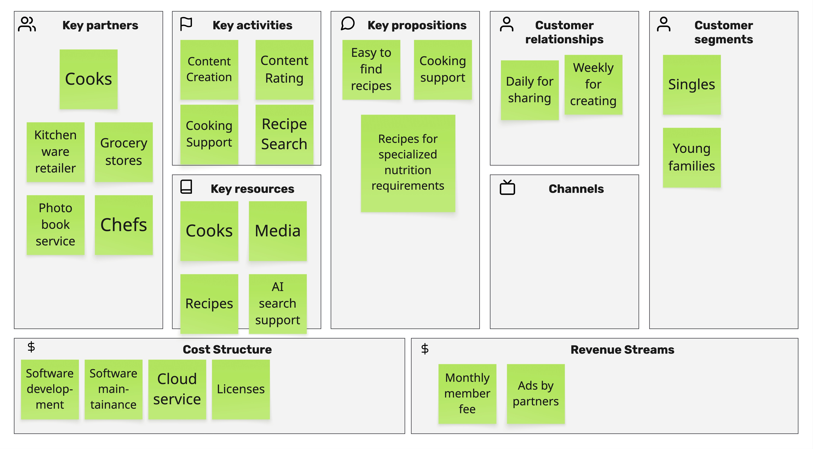
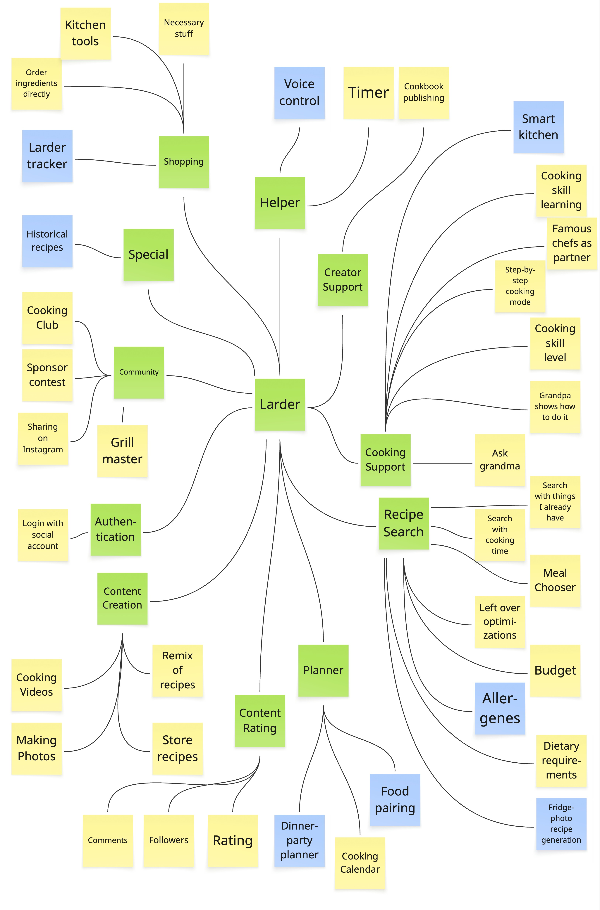

# Prompt 2026-06-05:

Check the provided Business Model Canvas based on the provided Brainstorming result. Use the provided skill.

[SKILL.md](../Skills/BusinessModelCanvasSkill/SKILL.md)

[Brainstorming cross check](../Skills/BusinessModelCanvasSkill/references/brainstorm-cross-check.md)

[Fit and coherence check](../Skills/BusinessModelCanvasSkill/references/fit-and-coherence.md)

[Nine-block checklist](../Skills/BusinessModelCanvasSkill/references/nine-blocks-checklist.md)

# Answer

## One-line read

The canvas tells a plausible story: **“Larder is an app for singles and young families that helps them find recipes and get cooking support, powered by cooks/media/AI search, monetized by membership fees and partner ads.”** It mostly reflects the brainstorm, but it **converges too early on a broad recipe/cooking-support app** and drops several sharper, more differentiated ideas from the brainstorming board.

## Biggest risks first

### 1. The customer segment is too broad for the value proposition

“Singles” and “young families” are not wrong, but they have very different jobs-to-be-done. A single person may care about speed, leftovers, budget, and low effort. A young family may care about allergies, picky eaters, planning, nutrition, and time pressure.

Why it worries me: the canvas promises **easy recipe finding**, **cooking support**, and **specialized nutrition requirements**, but it does not say which segment hurts most or would pay first.

Cheap test: interview 10 singles and 10 young-family households with the same prompt: “Tell me about the last time cooking was stressful.” Then test whether they would pay for recipe search, meal planning, dietary support, or guided cooking.

What would resolve it: choose one beachhead segment, for example **busy young families with dietary restrictions** or **single beginners who waste food**, and tune the whole canvas around that.

---

### 2. The strongest brainstorm differentiators are underused

The brainstorm contains distinctive ideas such as **larder tracker**, **fridge-photo recipe generation**, **search with things I already have**, **leftover optimization**, **budget**, **allergens**, **dietary requirements**, **cooking skill level**, **step-by-step cooking mode**, **ask grandma**, and **famous chefs as partner**.

The canvas keeps only the safer synthesis: recipe search, cooking support, content creation, rating, AI search. That is coherent, but it makes Larder look like another recipe app.

Cheap test: create four landing-page variants:
A) “recipes from what’s already in your fridge”
B) “AI cooking support while you cook”
C) “recipes for dietary restrictions”
D) “social cooking community”
Measure signups or willingness to pay.

What would resolve it: pick one “sharp edge” from the brainstorm and make it the central value proposition, not a supporting feature.

---

### 3. Revenue depends on assumptions not yet supported by the canvas

The canvas lists **monthly member fee** and **ads by partners**. Both are possible, but they imply different models.

A member-fee model needs a strong reason to pay repeatedly. A partner-ad model needs advertisers or partners as a real customer segment, not only “partners.” Right now, grocery stores, kitchenware retailers, chefs, cooks, and photo book services are listed as partners, but not as paying customer segments.

Cheap test: before building, test pre-orders or “join the waitlist at €X/month.” Separately, talk to 5 grocery/kitchenware partners and ask what targeting, audience size, and conversion data they would need before paying.

What would resolve it: either make it a clean subscription model with a must-have user pain, or make it explicitly multi-sided: **home cooks use the app; grocery/kitchenware/chef partners pay for access, placement, or campaigns.**

---

## Block-by-block notes

| Canvas block               | Check                                                                                                                                                                                                                                |
| -------------------------- | ------------------------------------------------------------------------------------------------------------------------------------------------------------------------------------------------------------------------------------ |
| **Customer Segments**      | Too broad. “Singles” and “young families” should probably be split, because their pain points, channels, and willingness to pay differ.                                                                                              |
| **Value Propositions**     | “Easy to find recipes” is weakly differentiated. “Cooking support” is stronger. “Recipes for specialized nutrition requirements” is probably the most concrete value proposition on the canvas.                                      |
| **Channels**               | “App” is delivery, not enough of a channel strategy. How do users discover it? App Store search, influencers, grocery partners, Instagram cooking content, family nutrition communities?                                             |
| **Customer Relationships** | “Daily for sharing” and “weekly for creating” are usage rhythms, not relationship types. The brainstorm suggests stronger relationship ideas: community, cooking club, comments, followers, ratings, co-creation.                    |
| **Revenue Streams**        | Monthly fee and partner ads are plausible but untested. If ads matter, partner-side value needs to be clearer.                                                                                                                       |
| **Key Resources**          | Cooks, media, recipes, AI search support are relevant. Missing likely key resources: ingredient/recipe database quality, dietary/allergen data, user pantry/fridge data, recommendation engine, trusted food-safety/nutrition rules. |
| **Key Activities**         | Good match with brainstorm: content creation, content rating, cooking support, recipe search. Missing if AI/fridge/larder tracking is central: data ingestion, personalization, moderation, partner integration.                     |
| **Key Partners**           | Good list, especially cooks, chefs, grocery stores, kitchenware retailers. But “why would they partner?” needs to be explicit: sales leads, sponsored recipes, affiliate revenue, brand visibility?                                  |
| **Cost Structure**         | Software, maintenance, cloud, licenses are reasonable. Missing likely big costs: user acquisition, content moderation, cook/chef payments, recipe data licensing, AI/API costs, support, privacy/compliance work.                    |

The nine-block critique method asks whether each block is specific, evidenced, and complete, and then whether the blocks reinforce each other as a system.  The main system weakness here is that the right side is not yet specific enough to prove the left side and cost base are the right ones.

## Canvas vs. brainstorm

### Dropped or underweighted ideas worth reviving

The most important dropped ideas are:

**Larder tracker / shopping integration**
The brainstorm has a full shopping branch: larder tracker, order ingredients directly, necessary stuff, kitchen tools. In the canvas this becomes only “AI search support” and partner grocery stores/kitchenware retailers. That loses a potentially strong loop: know what I have → suggest what to cook → buy missing items.

**Fridge-photo recipe generation**
This is one of the most distinctive ideas on the board, but it does not appear clearly in the canvas. It could be a real differentiator versus generic recipe search.

**Budget and leftover optimization**
These are strong practical pains, especially for singles and families. They are missing from the value proposition despite being concrete and monetizable.

**Cooking skill level / step-by-step cooking mode**
These would make “cooking support” more specific. Without them, “support” is vague.

**Ask grandma / grandpa shows how to do it / famous chefs as partner**
The brainstorm suggests emotionally rich coaching concepts. The canvas reduces this to “cooks” and “chefs,” which may be correct, but it loses the human trust angle.

**Community, followers, comments, rating, sponsor contest, cooking club**
The canvas includes content rating and daily sharing, but the community mechanics are not yet integrated into the model. Are users passive recipe consumers, or is this a creator/community platform?

The cross-check discipline is to treat these as questions rather than accusations: dropped ideas may have been deliberately cut, but high-potential orphans should be brought back for a decision.

### Unsupported or over-converged canvas items

**“Recipes for specialized nutrition requirements”** is supported by brainstorm notes like allergens and dietary requirements, but it is elevated very strongly in the canvas. That may be good, but if it becomes the main proposition, the model needs more nutrition/allergen credibility in resources, activities, and partners.

**“Monthly member fee”** is not clearly visible in the brainstorm. It may be a later business decision, but it needs validation.

**“Photo book service”** as a key partner appears weakly connected to the core app model. It may come from “cookbook publishing” or “store recipes,” but it feels peripheral unless content creation and publishing become central.

## What’s strong

The canvas does a good job carrying over the main brainstorm clusters: **recipe search, cooking support, content creation, rating, community, grocery/kitchenware partners, cooks/chefs, and app delivery**.

The strongest path forward is to make the model less generic by choosing one of these strategic centers:

**Option A: “Cook from what you already have.”**
Center the model on larder tracking, fridge photos, leftovers, budget, and shopping.

**Option B: “Guided cooking for beginners.”**
Center it on skill level, step-by-step mode, voice control, timer, grandma/chef support.

**Option C: “Safe meal planning for dietary restrictions.”**
Center it on allergens, dietary requirements, nutrition rules, trusted recipes, and family use.

Right now, I would bet on **Option A or C** as the clearest business model, because they solve a sharper pain than “easy to find recipes.”
