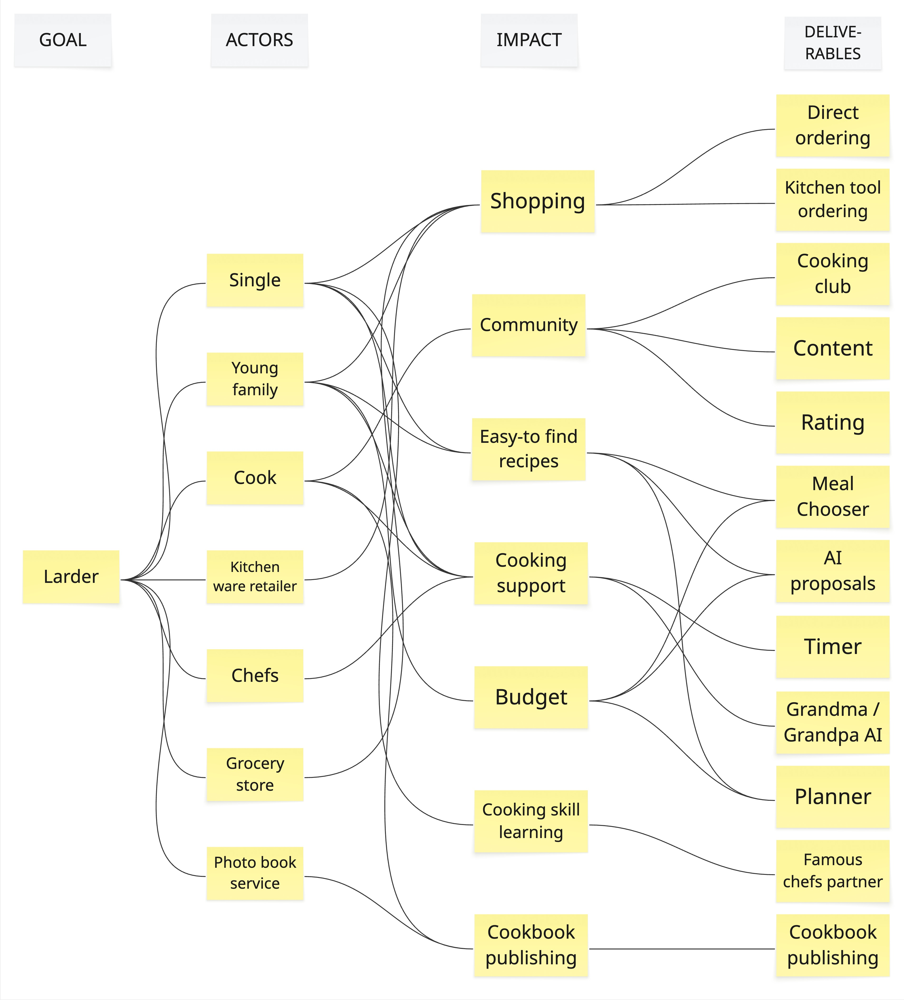

# Prompt 2026-06-06:

Criticize the Impact Map based on the Brainstorming result and Business Model Canvas. 

[SKILL.md](../Skills/ImpactMappingSkill/SKILL.md)

[Canvas cross check](../Skills/ImpactMappingSkill/references/canvas-cross-check.md)

[Collaboration cross check](../Skills/ImpactMappingSkill/references/collaboration-cross-check.md)

[Coherence and tracibility](../Skills/ImpactMappingSkill/references/coherence-and-traceability.md)

[Four level checklist](../Skills/ImpactMappingSkill/references/four-level-checklist.md)

# Answer:

I read the impact map against both sources you gave me — the brainstorm mind-map and the Business Model Canvas. Here's where I think it will bite, held as hypotheses you're free to reject.

## One-line read

As a sentence the map currently reads: *"In order to **Larder**, the **Single** will **Shopping**, and we will support that with **Direct ordering**."* It breaks at the first two words, and that break propagates down every branch. The bones are good — the actors are faithful and the deliverables are concrete — but the spine (goal → impact) isn't doing its job yet.

## Biggest risks first

**1. The goal is a product name, not an outcome.** "Larder" is the app, not a business objective. There's no metric, target, or deadline, so nothing below it can be judged "worked" or "didn't." More tellingly, the canvas tells you what the goal *should* serve — two revenue streams, *monthly member fee* and *ads by partners* — and the map's goal points at neither. Nothing on the map is about anyone *becoming or staying a paying member*, or a partner *buying ads*. *Why it worries me:* the whole monetization half of your strategy is invisible here, so you can't tell which branch earns its keep. *Cheap test:* restate the goal as a number ("X paying subscribers retained at 3 months by Qn") and re-walk each impact asking "does this move that?" Branches that don't are candidates for the cut list. *What resolves it:* a measured goal that traces to a revenue stream.

**2. The "impacts" are feature themes, not behaviour changes.** Shopping, Community, Easy-to-find recipes, Cooking support, Budget — these are the *green cluster headings* from your brainstorm promoted one column to the right. None of them is something an actor *does differently*. "Shopping" isn't "the single buys ingredients in-app instead of a separate trip"; "Community" isn't "young families post a recipe weekly." *Why it worries me:* this is the signature of a map built outside-in from a feature list — the exact failure mapping exists to prevent — and it means you never named the behaviour change you're actually buying. *Test:* for each impact, finish "we'll know it worked when [actor] starts/stops/does-more-of ___." If you can't, the real impact is missing and the box is a feature.

**3. The namesake feature isn't on the map.** Your goal is literally "Larder," and the brainstorm is full of pantry-aware ideas — *Larder tracker, Search with things I already have, Leftover optimizations, Fridge-photo recipe generation*. Almost none survived into the deliverables (the map's recipe branch collapses to Meal Chooser + AI proposals). If "larder" is the differentiator, the map currently doesn't deliver it.

## Level-by-level notes

- **Goal** — covered above; this is the load-bearing fix.
- **Actors** — strong on fidelity (all four canvas partners and both segments are present). Two gaps: no *obstructer* anywhere (app-store/review gatekeepers, content moderation, a regulator for the "specialized nutrition" claims), and the partner-actors each feed exactly one deliverable (retailer→kitchen-tool ordering, grocery→direct ordering, photo-book→cookbook). That pattern suggests they were reverse-derived to justify a deliverable rather than discovered from a behaviour you need to change.
- **Impacts** — feature-as-impact throughout (above). Also entirely positive — no "impacts to avoid" (e.g. a single churning after one bad AI proposal).
- **Deliverables** — concrete and mostly traceable, but one option per impact and held as scope, not bets. Which one branch is the *shortest path* to the goal, and which are you explicitly *not* building first? If you can't name the cut, prioritisation hasn't happened.

## Map vs. the Business Model Canvas

- **A value proposition vanished.** *"Recipes for specialized nutrition requirements"* is one of only ~five value props on the canvas, and the brainstorm backs it (Allergenes, Dietary requirements). It appears nowhere on the map — no impact, no deliverable. Either the map dropped a promised value, or the canvas is promising something you've decided not to build. Which?
- **The "creating" relationship isn't driven.** The canvas bets users engage *"weekly for creating"*, but the map has no real content-creation impact — just a "Content" deliverable. The behaviour the relationship depends on has no branch.
- **The whole cost/infrastructure side is unrepresented.** Cloud, licenses, AI, and *Marketing* sit on the canvas; the map's deliverables (AI proposals, Grandma/Grandpa AI, fridge-photo) are AI-heavy with hidden cost, and there's no acquisition impact even though growth (if that's the goal) needs Marketing. Feasibility and cost never entered the branch selection.

## Map vs. the brainstorm

Synthesis *should* drop detail, so the question is whether it dropped the *right* detail. A few I'd revive or at least decide on consciously: the **specialized-nutrition / allergens** thread (above), the **pantry-aware search** cluster (above), and **Content Creation** as its own theme (Cooking Videos, Making Photos, Remix, Store recipes) — it's a green cluster *and* a canvas Key Activity, yet it collapsed to one "Content" sticky.

One thing I genuinely can't read: the **blue stickies**. There's a consistent yellow/blue convention across all three artifacts (blue = Voice control, Smart kitchen, Larder tracker, Historical recipes, Allergenes, Food pairing, Fridge-photo on the brainstorm). Most of the *brainstorm's* blue notes — which look like your novel/differentiating bets — didn't make the map, while the obvious ones did. If blue marks "innovative" or "flagged," that's premature convergence on the safe ideas. **What does blue mean in your legend?** It changes whether that's a real finding or a non-issue.

## What's strong (protect this)

Actor fidelity to the canvas is genuinely good — every paying segment and key partner made it across, which is where many maps fail. The deliverables are concrete and mostly verifiable, and the four-level structure is clean enough that the fixes above are *re-labelling and re-centring*, not a rebuild.

The single highest-leverage move: replace "Larder" at the centre with a measured outcome tied to one of your two revenue streams, then re-ask each impact "what behaviour change moves *that*?" Most of your current impacts will resolve into real behaviours or fall away — and the specialized-nutrition and pantry threads will probably re-enter on their own, because they're where your differentiated value lives.

Want me to take a pass at a reframed version — a measurable goal plus behaviour-shaped impacts — so you can compare it side by side with the current map?