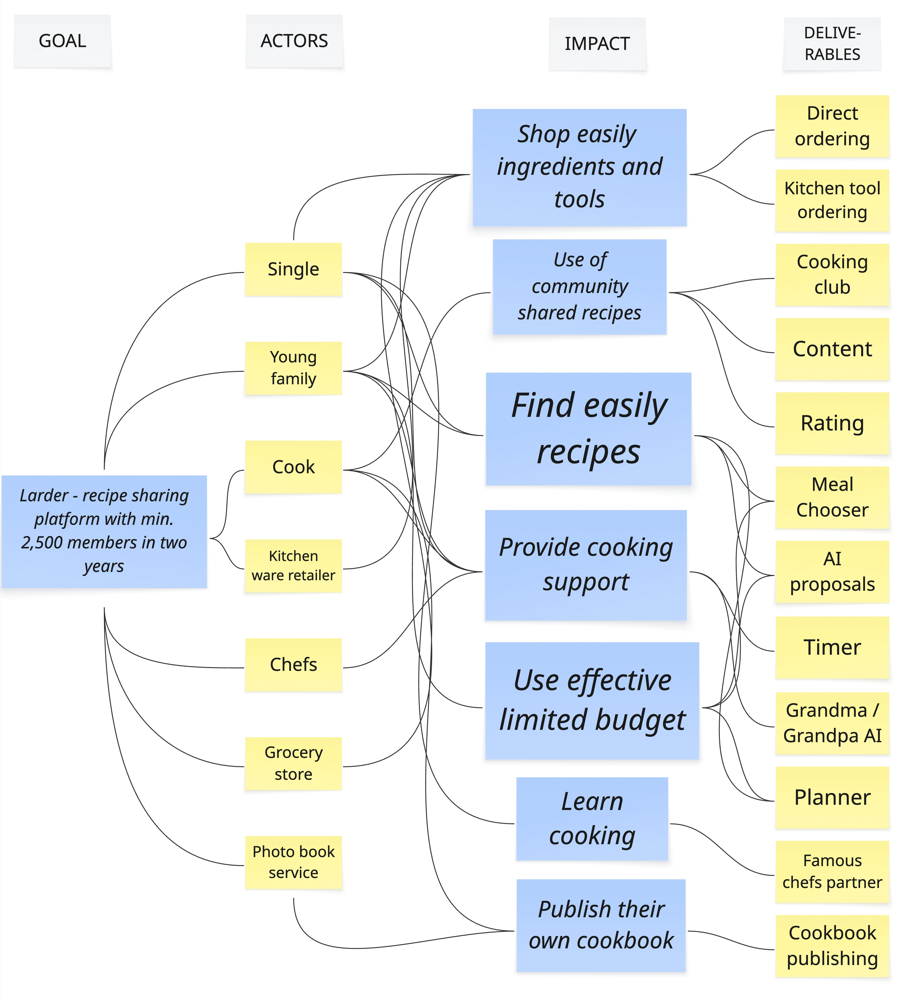
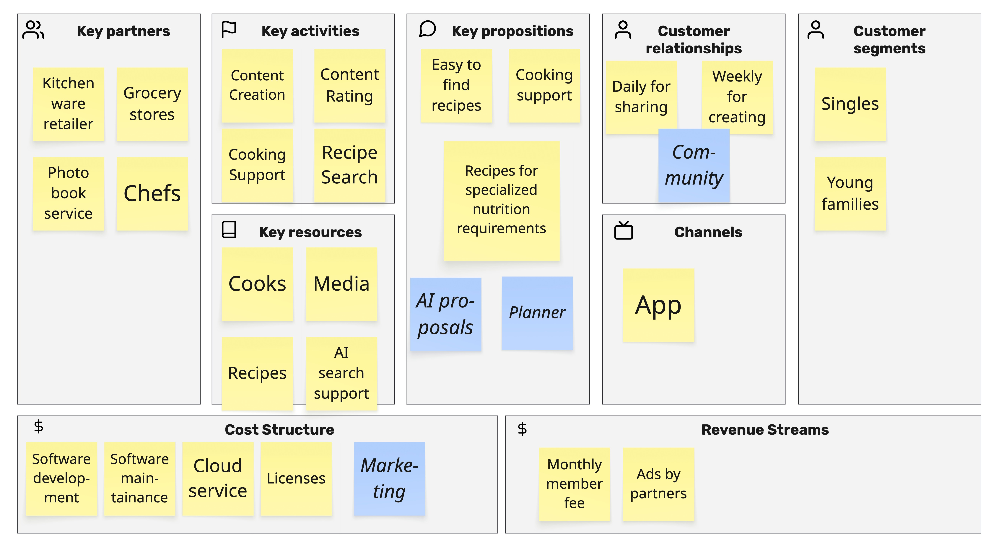

# Prompt 2026-06-06:

Criticize the Impact Map based on the Brainstorming result and Business Model Canvas.
Use the provided skill.

[SKILL.md](../Skills/ImpactMappingSkill/SKILL.md)
[Canvas cross check](../Skills/ImpactMappingSkill/references/canvas-cross-check.md)
[Collaboration cross check](../Skills/ImpactMappingSkill/references/collaboration-cross-check.md)
[Coherence and tracibility](../Skills/ImpactMappingSkill/references/coherence-and-traceability.md)
[Four level checklist](../Skills/ImpactMappingSkill/references/four-level-checklist.md)

# Answer:

Here is a strategic, Devil’s Advocate review of the Impact Map presented in `ImpactMappingWithAi.jpg`, cross-checked against the raw brainstorming session in `BrainstormingConvergence.jpg` and the strategic blueprint in `BusinessModelCanvasEnhanced.jpg`.

---

## One-Line Read

The map reads as: *"In order to build a recipe-sharing platform with 2,500 members, we will change the behaviors of seven distinct customer and partner groups simultaneously across seven different behavioral impacts using a complex suite of AI and publishing tools."*

**The Verdict:** The map currently suffers from extreme **scope creep (boiling the ocean)** and has a critical **strategic blind spot**—it completely drops the unique value proposition that both the canvas and the brainstorming prioritized.

---

## The Biggest Risks

### 1. The Critical Blind Spot: Dropping Specialized Nutrition

* **The Worry:** In `BusinessModelCanvasEnhanced.jpg`, a core yellow sticky under Key Propositions is **"Recipes for specialized nutrition requirements."** In the brainstorming file `BrainstormingConvergence.jpg`, this was heavily emphasized with explicit blue stickies for **"Allergens"** and **"Dietary requirements."** Yet, on the final Impact Map, *this entire value proposition has vanished.* There is no impact or deliverable addressing nutrition, restrictions, or allergens.
* **The Risk:** You are building a generic recipe platform competing with giants, while completely abandoning the specialized market niche your strategy identified as a differentiator.
* **How to test cheaply:** Before building generic "AI proposals," run a simple landing page test or survey targeting groups with specific dietary needs (e.g., gluten-free, vegan) to see if this drives your member sign-ups faster.

### 2. Lack of Shortest Path (Boiling the Ocean)

* **The Worry:** To reach a modest goal of 2,500 members, the map activates **seven different actors** at the same time, including B2B partners like grocery stores, photo book services, and professional chefs.
* **The Risk:** This is a classic "feature factory" trap. Attempting to build an ingredient-ordering system, an AI Grandma, an automated meal planner, *and* a physical cookbook publishing workflow all at once will destroy your runway long before you hit 2,500 members.
* **How to resolve it:** Relentlessly prune. Focus initial execution entirely on the *Singles* or *Young families* actors, and cut out the complex partner integrations (Chefs, Photo Book, Grocery) for Version 1.0.

---

## Level-by-Level Notes

### WHY — The Goal

* **Solution-as-Goal:** The phrasing *"Larder - recipe sharing platform with..."* smuggles the solution into the goal box. The goal should be the business outcome, not a description of the product.
* **Vague Metric:** The metric is "2,500 members." According to the Cost Structure and Revenue Streams in `BusinessModelCanvasEnhanced.jpg`, your survival relies on a **"Monthly member fee."** A "member" could just be a free sign-up. The goal must specify *active, paying members* to validate the business model.

### WHO — The Actors

* **Role Confusion:** The map introduces "Cook" and "Chefs" as distinct user segments. However, the Business Model Canvas explicitly categorizes "Chefs" as *Key Partners* and "Cooks" as *Key Resources*. Treating internal resources/partners with the exact same behavioral loops as your core customer segments (`Singles` and `Young families`) dilutes your user experience focus.

### HOW — The Impacts

* **Features/Capabilities Wearing Impact Hats:** "Find easily recipes" and "Provide cooking support" are product capabilities, not observable actor behavior changes. Stated as true behaviors, these should be: *"Users spend less time deciding what to cook"* or *"Amateur cooks successfully attempt advanced recipes without abandoning them."*

### WHAT — The Deliverables

* **Premature Tech Convergence:** The deliverables rely heavily on high-friction tech like "Grandma / Grandpa AI" and "AI proposals." Looking at `BrainstormingConvergence.jpg`, the team had brilliant, tangible search ideas like *"Search with things I already have"* and *"Search with cooking time."* The map flattens these highly actionable ideas into generic "AI proposals."

---

## Map vs. Brainstorming Result

A direct cross-check with `BrainstormingConvergence.jpg` reveals that several highly innovative, prioritized concepts were dropped during synthesis:

| Prioritized Brainstorm Item (Blue Stickies) | Status on Impact Map | Strategic Impact |
| --- | --- | --- |
| **Allergens & Dietary requirements** | **Dropped** | Missing your core competitive advantage. |
| **Fridge-photo recipe generation** | **Dropped** | Replaced by vague "AI proposals," losing a highly marketable viral feature. |
| **Voice control** | **Dropped** | Useful for hands-free cooking support, but completely absent. |
| **Larder tracker** | **Dropped** | Left out an automated inventory mechanism for shopping. |

---

## What's Strong about this Map

To be entirely fair, this map has excellent foundational elements that are worth preserving:

* **Measurable Anchor:** Unlike many maps, your goal actually features a target number (2,500) and an explicit deadline (two years), which gives the team an absolute boundary line for success.
* **Excellent Strategic Alignment on Partners:** The inclusion of the "Photo book service" tracing directly to "Publish their own cookbook" -> "Cookbook publishing" perfectly echoes the `Ads by partners` and `Photo book service` connection on your canvas. It's a creative revenue stream; it just shouldn't be part of your immediate launch scope.