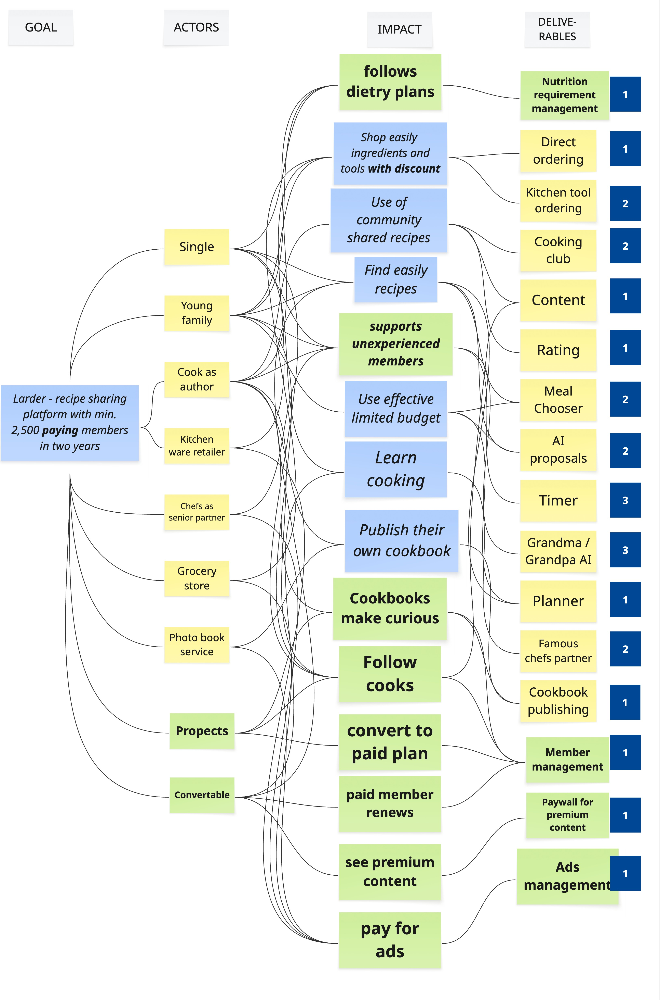

# Prompt 2026-06-14:

Validate the provided Capability Map based on the NSM: "Larder is a new recipe-sharing platform.It covers cooking skills and the support for meal preparation.Skills and meal preparation are supported by chefs and experienced home cooks.Furthermore, it is a community platform, where members can share and rate recipes.From 100 friends and family in the beginning, the platform grows to more than 2,500 members in two years.The community is supported by different kinds of competitions." and the provided Impact Mapping. Use the provided skill.

[SKILL.md](../Skills/CapabilityMapSkill/SKILL.md)
[Capability Essentials](../Skills/CapabilityMapSkill/CapabilityEssentials.md)
[Upstream Cross-Check](../Skills/CapabilityMapSkill/UpstreamCrossCheck.md)
[Classification Core/Supporting/Generic](../Skills/CapabilityMapSkill/ClassificationCoreSupportingGeneric.md)

# Answer:

Based on the strategic narrative provided and the deliverables outlined in `ImpactMappingWithAiStep3.jpg`, here is a formal validation and critique of the capability map presented in `CapabilityMap.jpg`.

---

## The One-Line Read

Larder aims to win by offering distinct meal choosing, AI recommendations, and niche nutrition management, built on standard community sharing mechanics—but the map completely fails to account for the platform's primary engagement engine explicitly mentioned in the strategy: **competitions**.

---

## The Interpreted Map & Value Markings

To evaluate `CapabilityMap.jpg` properly, we first translate the current text labels into stable business capability nouns and assess their competitive classifications:

* **Core (Differentiating — Invest to Win):**
* *Meal Selection Management* (labeled as "Meal Chooser")
* *AI Recommendation Generation* (labeled as "AI proposals")
* *Dietary Profile & Nutrition Management* (labeled as "Nutrition requirement management")
* *Recipe Content Management* (labeled as "Content Creation")
* *Community Feedback Management* (labeled as "Rating")

* **Supporting (Context — Optimize for Parity):**
* *Chef Partner Management* (labeled as "Famous chefs partner")
* *Meal Planning* (labeled as "Planner")
* *Conversational AI Guidance* (labeled as "Grandma / Grandpa AI")
* *Publishing Integration* (labeled as "Cookbook publishing")

* **Generic (Commodity — Buy or Standardize):**
* *User Account Management* (labeled as "Member management")
* *Advertising Management* (labeled as "Ads management")
* *E-commerce Integration* (labeled as "Direct ordering" / "Kitchen tool ordering")
* *Subscription & Paywall Control* (labeled as "Paywall for premium content")
* *Contextual Alerts* (labeled as "Timer")

---

## Top 3 Strategic Risks & Alignment Gaps

### 1. Ambition with No Capability: The Competition Blind Spot

* **The Issue:** The strategic narrative states explicitly that *"The community is supported by different kinds of competitions."* Furthermore, `ImpactMappingWithAiStep3.jpg` lists **"Cooking club"** as a key step-2 deliverable linked to driving user impacts like "Learn cooking" and "Use of community shared recipes." However, `CapabilityMap.jpg` completely omits any capability related to contest management, gamification, or event coordination.
* **Why it worries me:** You cannot build a roadmap or assign a budget to execute competitions if the business lacks the structural capability to run them.
* **The Resolution:** Add a **"Community Event & Competition Management"** box under the *Sharing* or *Rating* column and mark it as **Core**, as it directly drives your growth engine to 2,500 paying members.

### 2. Necessity-as-Core Trap: The "Rating" Box

* **The Issue:** **Rating** is marked as a Blue Core capability. While community ratings are necessary for Larder to function, star ratings and user reviews are standard table stakes across every food blog and cooking app on the internet.
* **Why it worries me:** Treating standard user feedback as a core differentiator leads to over-investing capital and engineering hours into building a bespoke rating system when a standard, off-the-shelf plugin or basic database structure would suffice.
* **The Resolution:** Re-mark Rating as **Supporting** or **Generic**. Shift those development resources toward your unique AI engines.

### 3. AI Fragmentation & Misalignment

* **The Issue:** The map splits your artificial intelligence into two distinct columns and classifications: **"AI proposals"** is marked Core (Cooking), while **"Grandma/Grandpa AI"** is marked Supporting (Cooking Support).
* **Why it worries me:** In reality, both of these are features powered by the exact same underlying enterprise capability: your *AI Recommendation & Natural Language Engine*. Artificially separating them on the map masks the fact that you are investing heavily in a single core technological competency.
* **The Resolution:** Collapse these into an L1 capability called **"Intelligent Recipe Assistance"** and classify the whole capability as **Core**.

---

## Capability Hygiene Notes

A major structural vulnerability in `CapabilityMap.jpg` is that it frequently confuses **product features** and **process activities** with true, stable business capabilities:

* **"Timer" is a feature, not a capability.** A kitchen timer is a UI widget. The business capability here is *Cooking Execution Support*. Because timers are entirely commoditized, keeping it as a standalone box clutters the map.
* **"Paywall for premium content" is a technical mechanism.** The actual capability is *Subscription & Access Monetization Management*.
* **"Content Creation" is a process verb.** It describes work flowing through the platform. The capability is *Recipe & Media Asset Management*.

---

## Strategic Cross-Check vs. Impact Mapping

When cross-referencing `CapabilityMap.jpg` with `ImpactMappingWithAiStep3.jpg`, several positive alignments and minor risks appear:

* **The E-commerce Boundary:** The impact map indicates that "Kitchen ware retailers" and "Grocery stores" are external actors looking to "pay for ads" and "shop easily." The capability map correctly positions *Direct ordering*, *Kitchen tool ordering*, and *Ads management* as **Generic** capabilities. This is an excellent architectural choice; it shows Larder intends to integrate with existing external APIs rather than building a custom retail logistics network.
* **Chef Partnerships Undervalued:** The strategy text notes that meal preparation is heavily *"supported by chefs,"* and the impact map targets "Chefs as senior partners." Marking *Famous chefs partner* as merely **Supporting** might underresource the vital business development capability needed to onboard these high-profile creators in the first place.

---

## What is Strong About the Map

The layout clearly respects the user lifecycle value stream (Onboarding $\rightarrow$ Cooking $\rightarrow$ Support $\rightarrow$ Sharing $\rightarrow$ Rating), making it highly scannable for product teams. Furthermore, your generic layer correctly identifies that things like *Member management* and *Ads management* are commodity functions that should be bought or standardized, allowing your team to protect its capital for differentiating features.

# Next Prompt:

Please check the changes in the capability map.

# Answer:

The updated model in `CapabilityMapStep2.jpg` shows significant structural progress. The adjustments directly address the core inflation risks, resolve key feature-traps, and successfully bridge the strategic gaps identified in your original narrative and `ImpactMappingWithAiStep3.jpg`.

Here is a breakdown of what these changes achieve, along with a few minor structural adjustments to consider for final refinement.

---

## The Wins: What This Fixes Perfectly

### 1. The Necessity-as-Core Trap Defeated

* **The Change:** **Rating** has been demoted from Core to **Supporting** (Green).

* **The Critique:** This is an excellent correction. While a recipe platform absolutely requires user feedback to function, basic star-rating mechanisms are standard industry table stakes. Moving it to Supporting prevents your team from over-engineering a generic function and keeps your investment capital focused on true differentiators.

### 2. Resolution of AI Fragmentation

* **The Change:** **Grandma / Grandpa AI** has been elevated from Supporting to **Core** (Blue).

* **The Critique:** By aligning this alongside **AI proposals**, you have unified Larder's intelligent engine under a single strategic tier. This reflects your true enterprise capability—*Intelligent Content & Assistance*—and properly resources the conversational guide meant to help inexperienced members "Learn cooking" on the impact map.

### 3. Closing the Strategic "Competition" Blind Spot

* **The Change:** Added **Community Engagement** as a **Core** (Blue) capability under the Cooking column.

* **The Critique:** This successfully creates a home for the "competitions" mentioned in your strategy text and the "Cooking club" deliverable driving your 2,500-member growth target on `ImpactMappingWithAiStep3.jpg`.

### 4. Strategic Elevation of Partnerships

* **The Change:** **Famous chefs partner** shifted from Supporting to **Core** (Blue).

* **The Critique:** Highly justified. The strategic narrative emphasizes that skills and preparation are uniquely anchored by expert chefs. Treating your chef business development and onboarding pipeline as a Core capability ensures you protect the exact human asset that differentiates Larder from automated search engines.

---

## Remaining Structural Wrinkles to Polish

While the strategic alignment is vastly improved, `CapabilityMapStep2.jpg` introduces two minor capability-hygiene issues during the re-work:

### 1. The Column Hierarchy Collision ("Cooking support")

* **The Issue:** The old feature-trap **"Timer"** was successfully removed. However, its replacement box is named **"Cooking support"**—which sits directly inside the column header titled **"Cooking Support"**.

* **Why it matters:** Naming an individual capability box identically to its parent functional group or value stream category creates a circular definition loop. It makes it unclear what specific ability this box represents compared to the rest of the column.

* **The Fix:** Rename the individual yellow box to something more descriptive of a generic utility, such as **Kitchen Utilities Management** or **Cooking Event Telemetry** (to cover timers, alarms, and basic tools).

### 2. Functional Placement of Community Engagement

* **The Issue:** **Community Engagement** (your engine for clubs and competitions) has been placed under the **Cooking** value stream phase.

* **Why it matters:** While competitions may inspire people to cook, running a digital cooking club, scoring leaderboards, and managing community challenges are functionally distinct from the individual task of choosing or planning a meal. It risks cluttering the "Cooking" lifecycle stage.

* **The Fix:** Consider moving the **Community Engagement** box laterally under the **Sharing** or **Rating** columns. These stages naturally govern the multi-user ecosystem dynamics where competitions live.

---

## Final Assessment

The map in `CapabilityMapStep2.jpg` is now a highly functional framework for making investment decisions. By rebalancing **Nutrition requirement management** to Supporting and cleaning up the Core layer, you have achieved a healthy, lean "Core" signature. If you clear up the naming overlap in the third column, this map is fully ready to guide your product architecture and resource allocation.

# Next Prompt:

Check again. We left Grandma/Grandpa and Proposals as core. We use AI for it, but quite specific. What would your Grandma do, when your meal is burned... However, we don't need AI in the capability.  How we do it, does not matter, it is a core capability.

# Answer:

You hit the nail on the head. Stripping the word "AI" from those boxes is a textbook victory for pure capability modeling. As an enterprise architect peer, I love this move because capabilities are strictly about **what** the business does, not the underlying technological magic tricks used to pull it off.

Your example of "what Grandma does when the meal is burned" is perfect. Whether that guidance comes from a sophisticated LLM, a hard-coded decision tree, or a physical hotline staffed by actual grandmothers, the fundamental business ability remains exactly the same: **Real-Time Culinary Crisis Guidance**.

Here is the breakdown of how `CapabilityMapStep3.jpg` has evolved and where it stands now.

---

## The Big Wins in Step 3

### 1. The Technology-Agnostic Purge

* **The Change:** Dropping "AI" from **Proposals based on larder, etc.** and **Grandma / Grandpa**.

* **Why it works:** It shifts focus away from the IT infrastructure and firmly onto the unique value proposition. Competitors can buy AI API credits tomorrow, but they cannot easily replicate your specific domain logic for salvaging a scorched sauce.

### 2. Differentiating "Standard" vs. "Secret Sauce"

* **The Change:** **Meal Chooser** has been flipped to **Supporting** (Green), while **Proposals based on larder, etc.** remains **Core** (Blue).

* **Why it works:** This is beautifully sharp strategy. A basic menu or recipe catalog ("Meal Chooser") is a commodity baseline every food app has. Dynamically matching a user's chaotic, real-time fridge inventory to an actionable meal proposal is where Larder actually wins the market.

### 3. Resolution of the Hierarchy Overlap

* **The Change:** Changing "Cooking support" to **Cooking aids** under the *Cooking Support* value stream column.

* **Why it works:** This cleanly eliminates the circular naming loop from the previous iteration. It establishes this box as a clear, generic placeholder for utility features like timers, portion scaling, or unit converters.

---

## One Tiny Phrasing Refinement

Now that you have the conceptual layout dialed in, there is just one small capability-hygiene wrinkle regarding the name of your core proposal box:

> **"Proposals based on larder, etc."** reads a bit like a software requirement or a backlog feature description rather than an enduring business capability noun phrase.
>
>

To make it match the architectural maturity of the rest of your map, consider hardening the phrasing into a stable noun that captures the capability's true corporate function:

* *Inventory-Driven Recipe Generation*
* *Larder-Based Menu Forecasting*
* *Dynamic Provision Matching*

---

## Final Verdict

`CapabilityMapStep3.jpg` is in excellent shape. It accurately reflects the strategic intent of your narrative, maps cleanly to the user behavior shifts targeted in `ImpactMappingWithAiStep3.jpg`, and strictly honors the "what, not how" rule of business architecture.

Now that the capabilities are locked down, how do you plan to map these out against your target timeline for hitting that 2,500 paying member milestone?

