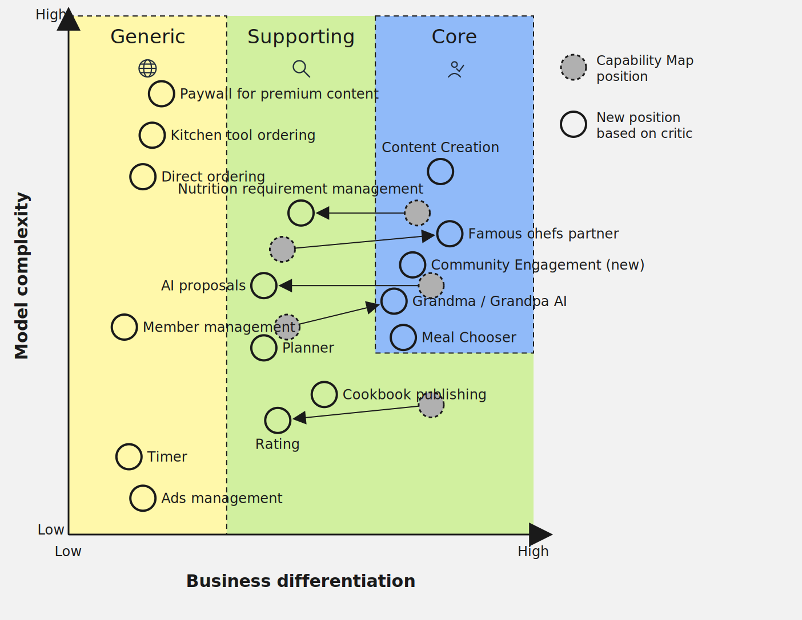

# Prompt 2026-06-15:

Create a Core Domain Chart based on the provided Capability Map and the provided critique.

# Answer:

I'll create a Core Domain Chart from this. Let me start by reading the relevant skill, since it defines the house style and synthesis approach.Let me read the two references the skill points to before deriving positions.Now let me look at the example spec and the generator to understand the exact input format.Now let me view the uploaded capability map image to confirm the markings myself before deriving positions.I've read the map and the critique. The legend confirms the markings: blue = Core (person-check), green = Supporting (magnifier), yellow = Generic (globe). Now I'll derive origin→target moves from the critique and write the spec.Let me render it to PNG to check for collisions before presenting.Strong overall — markers, regions, and arrows read clearly. Two label spots are slightly tight (Member management near the Grandma origin). Let me nudge those and regenerate.One tweak spot: the AI proposals arrow grazes the Grandma origin marker. I'll drop the Grandma origin clear of that line.The chart is clean now — the arrow clears the origin marker, no circle overlaps, and all 16 capabilities read clearly. Let me move the final SVG to outputs and present it.Here's the Core Domain Chart, synthesizing the Capability Map (grey = where each capability sits today) with the critique (black = where it argues each should sit). Grey→black arrows are the recommended moves.

**The five moves (origin → target, and the finding that drove each):**

- **Famous chefs partner** — Supporting → **Core** (right). The headline move: the critique's *under-placed driver* finding — this is the NSM's stated differentiator ("supported by chefs and experienced home cooks"), so it belongs in Core, not as context.
- **Grandma / Grandpa AI** — Supporting → **Core** (right). Same *under-placed driver* logic: part of the expert-backing moat, flagged as a core *candidate* rather than a certainty.
- **AI proposals** — Core → **Supporting** (left). *Core inflation / "AI"-as-core* — wiring up an LLM isn't differentiation a clone couldn't copy.
- **Nutrition requirement management** — Core → **Supporting** (left). *Necessity-as-core* — it keeps the lights on for the dietary segment, but it isn't the moat.
- **Rating** — Core → **Supporting** (left, low complexity). *Commodity-as-core* — a rating widget is simple and copyable. Note its origin already sits *below* the Core box: at low complexity it never qualified for Core even at the map's "core" differentiation marking, which doubly supports the move.

**Static (endorsed as placed, single black circle):** Content Creation (genuine Core), Planner and Cookbook publishing (fine as Supporting), and the six commodity rails — Member management, Ads management, Direct ordering, Kitchen tool ordering, Timer, Paywall — held in Generic.

**Held pending validation:** Meal Chooser sits low in Core as a single black circle — the critique didn't firmly move it ("plausible core *if* it's more than a filter"), so it stays put until the test resolves.

**One addition, flagged:** "Community Engagement (new)" appears as a black circle in Core with *no grey origin and no arrow* — it's the competitions/community capability the NSM demands but the map omits entirely, so there's nothing to move *from*.

Two assumptions worth naming: the map only gave the core/supporting/generic marking (the horizontal axis), so every **vertical** (complexity) position is my inference about how hard each capability is to build — adjust any that feel off. And I treated "Famous chefs partner" as the explicit home for the critique's proposed "Creator & Expert Network" capability rather than drawing a separate box.

Want me to redraw with Meal Chooser committed one way or the other, or split the chef-network capability out from "Famous chefs partner" as its own node?

