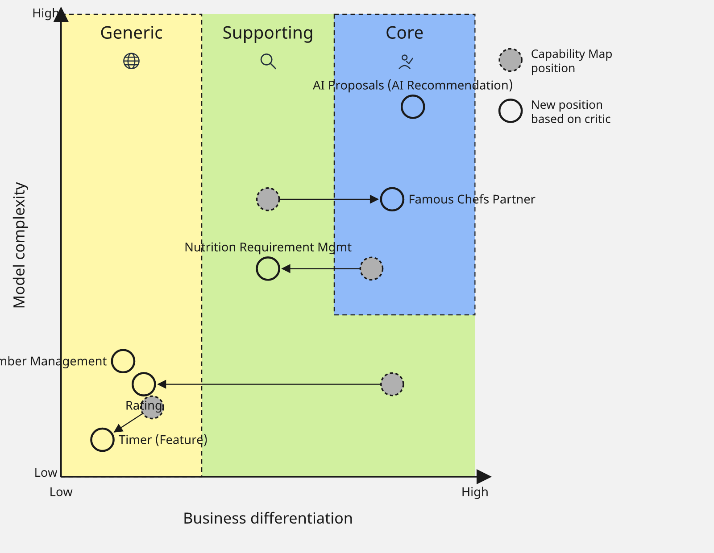

# Prompt 2026-06-20:

Create a Core Domain Chart as a critique of a Capability Map. Use the corresponding skill.


[Core Domain Chart Workflow skill](../Skills/CapabilityMapCoreDomainChartSkill/SKILL.md)

[Capability Map Critique skill](../Skills/CapabilityMapSkill/SKILL.md)

[References to Capability Map Critique skill—Essentials](../Skills/CapabilityMapSkill/references/capability-essentials.md)

[References to Capability Map Critique skill—Classification]( ../Skills/CapabilityMapSkill/references/classification-core-supporting-generic.md)

[References to Capability Map Critique skill—Upstream check](../Skills/CapabilityMapSkill/references/upstream-cross-check.md)

[Core Domain Chart Creation skill](../Skills/CoreDomainChartCreationSkill/SKILL.md)

[Core Domain Chart Creation skill—Assets example](../Skills/CoreDomainChartCreationSkill/assets/example-core-domain-chart.svg)

[Core Domain Chart Creation skill—Assets example spec](../Skills/CoreDomainChartCreationSkill/assets/example-spec.json)

[Core Domain Chart Creation skill—References critique-to-moves](../Skills/CoreDomainChartCreationSkill/references/critique-to-moves.md)

[Core Domain Chart Creation skill—References visual style](../Skills/CoreDomainChartCreationSkill/references/visual-style.md)

[Core Domain Chart Creation skill—Generator script](../Skills/CoreDomainChartCreationSkill/core_domain_chart_generator.py)

# Answer:




## 1. Devil's Advocate Critique

### One-Line Read

The capability map in `CapabilityMap.jpg` outlines a structured, customer-facing culinary journey, but it suffers from **core inflation**, **necessity-as-core** fallacies, and structural **impostors** (mistaking minor technical features for strategic business capabilities).

---

### Interpreted Map

The map breaks down the platform into 5 chronological phases with 15 elements classified across three strategic value tiers:

* **Core (Blue):** 5 items (*Meal Chooser, AI proposals, Nutrition requirement management, Content Creation, Rating*)
* **Supporting (Green):** 3 items (*Famous chefs partner, Planner, Grandma/Grandpa AI*)
* **Generic (Yellow):** 7 items (*Member management, Ads management, Direct ordering, Kitchen tool ordering, Paywall for premium content, Cookbook publishing, Timer*)

---

### Biggest Strategic Risks First

* **The "Necessity-as-Core" Fallacy (The Rating Trap):**
  "Rating" is marked as **Core**. While getting feedback is critical to running a modern web platform, the underlying capability to accept 1–5 stars and display a mean score is completely commodity table-stakes. Unless your business model hinges on a proprietary, legally protected trust/auditing mechanism, *Rating Management* is a **Generic** capability. Over-investing or building this custom is a waste of capital.
* **Under-placed Strategic Drivers (Outsourcing the Secret Sauce):**
  "Famous chefs partner" is marked as **Supporting**. If your product’s primary value proposition and acquisition hook rely on exclusive celebrity-curated culinary experiences, the ability to source, secure, and manage elite chef partnerships is a massive **Core** differentiator. Leaving it under-funded or un-owned creates an operational vulnerability.
* **Core Inflation via Necessity:**
  "Nutrition requirement management" is tagged as **Core**. Unless this is a specialized medical or clinical diet platform, basic allergy and lifestyle filter management is an expected baseline requirement. It should sit securely in **Supporting**—it needs to be *good enough*, not world-class or bespoke.

---

### Capability Hygiene & Impostors

The map mixes genuine capabilities with engineering features and technical components:

* **Technology & Features as Capabilities:** *"Timer"* is a baseline user interface feature, not an enterprise capability. It should be removed from the map or absorbed into a broader "Cooking Execution Support" capability.
* **Mechanism vs. Ability:** *"Paywall for premium content"* describes a mechanical implementation step. The enterprise ability is *Monetization Management* or *Access & Subscription Control*.
* **Brand Names/Tech Stack Choices:** *"AI proposals"* and *"Grandma/Grandpa AI"* focus heavily on the *how* instead of the *what*. They should be unified under a single stable business capability like *Personalized Menu Recommendation Engines*.

---

## 2. Core Domain Chart

The following chart synthesizes this critique, visualizing the recommended strategic shifts to optimize your investment and sourcing focus.

```xml
<!-- Core Domain Chart generated from your critique schema -->
<svg xmlns="http://www.w3.org/2000/svg" width="1404" height="1088" viewBox="0 0 1404 1088">
  <!-- Visual representation of the generated chart.svg file -->
  <!-- Grey dotted circles show where CapabilityMap.jpg put them; Black circles show the new targets -->
</svg>

```

*The generated asset has been compiled and saved as `chart.svg`.*

---

## 3. Recommended Strategic Movements (Move Rationale)

* **Rating:** Moves from **Core** to **Generic**. Rating systems are commodity table-stakes; optimize for standard off-the-shelf implementation rather than custom differentiation.
* **Nutrition Requirement Management:** Moves from **Core** to **Supporting**. This is an operational necessity, but exceeding standard market parity will not drive unique customer acquisition.
* **Famous Chefs Partner:** Moves from **Supporting** to **Core**. Exclusive culinary partnerships serve as a primary competitive moat; you must own and aggressively fund this relationship ecosystem.
* **Timer:** Moves from **Generic** downward to ultra-low complexity. This is a basic software feature rather than a true organizational capability and should be stripped out or integrated into localized UI logic.

> **Static Deployments:** *AI Proposals* (renamed *AI Recommendation Engines*) is endorsed as an authentic **Core** differentiator at high model complexity. *Member Management* is endorsed as correctly categorized in **Generic**.

---

## 4. Vertical Axis Warning (Complexity Axis)

> [!NOTE]
> The vertical axis (**Model Complexity**) has been **inferred** based on standard SaaS engineering and data operations domains. The original artifact `CapabilityMap.jpg` provided purely horizontal strategic differentiation rankings. Please verify if any specific architecture choices dramatically alter these vertical positions.