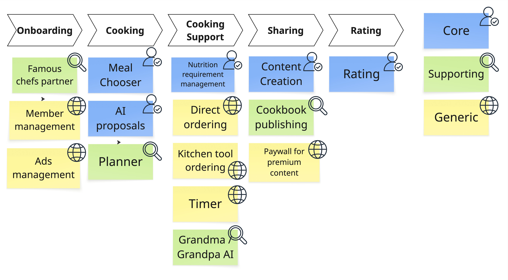
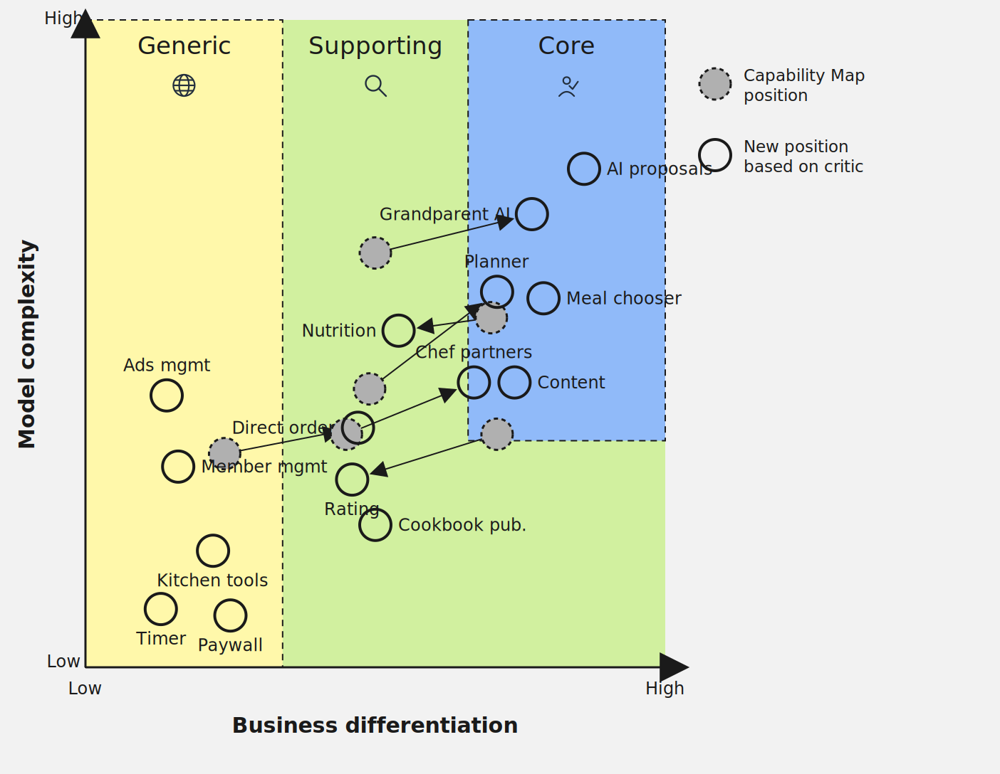

# Prompt 2026-06-10:

Create a Core Domain Chart as a critique of a Capability Map. Use the corresponding skill.

[Core Domain Chart Workflow skill](../Skills/CapabilityMapCoreDomainChartSkill/SKILL.md)

[Capability Map Critique skill](../Skills/CapabilityMapSkill/SKILL.md)

[References to Capability Map Critique skill—Essentials](../Skills/CapabilityMapSkill/references/capability-essentials.md)

[References to Capability Map Critique skill—Classification]( ../Skills/CapabilityMapSkill/references/classification-core-supporting-generic.md)

[References to Capability Map Critique skill—Upstream check](../Skills/CapabilityMapSkill/references/upstream-cross-check.md)

[Core Domain Chart Creation skill](../Skills/CoreDomainChartCreationSkill/SKILL.md)

[Core Domain Chart Creation skill—Assets example](../Skills/CoreDomainChartCreationSkill/assets/example-core-domain-chart.svg)

[Core Domain Chart Creation skill—Assets example spec](../Skills/CoreDomainChartCreationSkill/assets/example-spec.json)

[Core Domain Chart Creation skill—References critique-to-moves](../Skills/CoreDomainChartCreationSkill/references/critique-to-moves.md)

[Core Domain Chart Creation skill—References visual style](../Skills/CoreDomainChartCreationSkill/references/visual-style.md)

[Core Domain Chart Creation skill—Generator script](../Skills/CoreDomainChartCreationSkill/core_domain_chart_generator.py)

# Answer:

Created the Core Domain Chart critique.

## One-line critique

The map reads like a cooking assistant / food-content platform that wants to win through **meal choice, AI recommendations, planning, content, and an AI companion** — but several boxes marked core look more like parity capabilities, and no strategy anchor was supplied, so the core/supporting/generic calls remain hypotheses.

## Biggest moves shown in the chart

* **Grandparent AI: Supporting → Core** — this looks like a differentiating product concept, not just a support capability.
* **Planner: Supporting → Core** — if the product promise is “help me decide and execute meals,” planning is part of the value engine.
* **Chef partnerships: Supporting → Core edge** — potentially core if famous chefs are meant to create a content moat or acquisition advantage.
* **Nutrition management: Core → Supporting** — important, but likely table stakes unless nutrition personalization is the primary strategy.
* **Rating: Core → Supporting** — useful feedback/reputation plumbing, but unlikely to differentiate by itself.
* **Direct ordering: Generic → Supporting** — ordering integrations are domain-specific enough to deserve attention, but probably not the secret sauce.

Static placements: **Meal chooser, AI proposals, and Content** stay in Core; **member management, ads, kitchen tools, timer, paywall, and cookbook publishing** stay outside Core.

I inferred the **model-complexity axis** from the domain and the map labels; the original capability map only gave the core/supporting/generic view.
