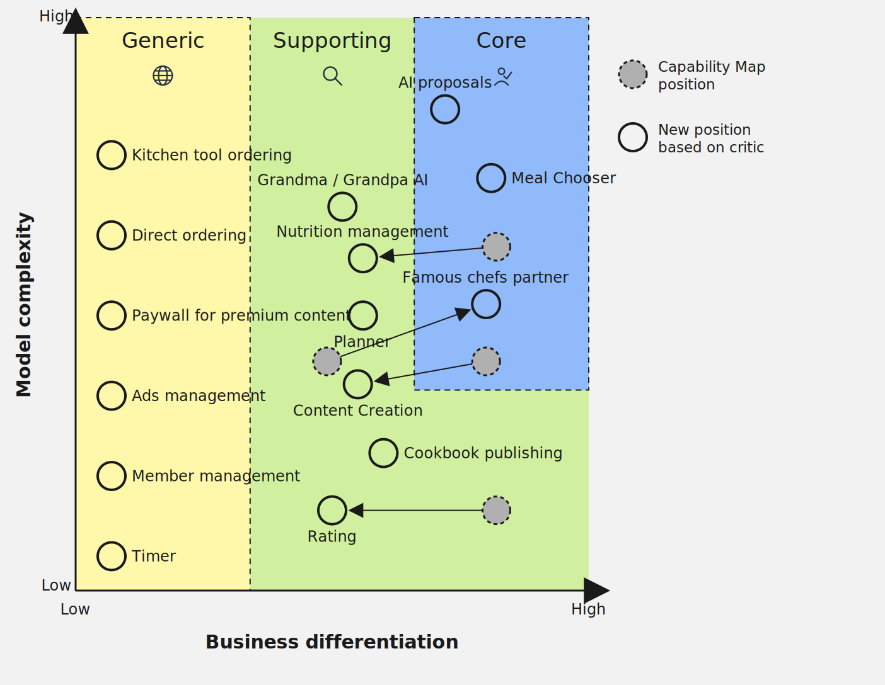

# Prompt 2026-06-20:

Create a Core Domain Chart as critique of a Capability Map. Use the corresponding skill.

# Answer:

I'll start by reading the relevant skill, since this task — critiquing a Capability Map and rendering it as a Core Domain Chart — maps directly to one of the available skills.This orchestrator chains two sub-skills. Let me read both before proceeding.Let me see the truncated lines and the key reference files for the critic.Now the upstream cross-checks reference, then I'll move to the chart-author skill.Now the chart-author skill and its references.Let me look at the visual style reference, the example spec, and the generator script.I have a thorough understanding of the pipeline now. Let me look at the example output briefly, then set up my working directory.No SVG renderer available. Let me install one so I can render to PNG and check for label collisions.cairosvg works. Now I'll write the chart spec encoding my critique as moves, render it, and check for collisions.Good render, but there are label collisions in the crowded middle. Let me restructure the layout — stack the generic capabilities in a clean left column and spread the supporting/core markers — then re-render.Cleaner. One remaining issue: the very long "Nutrition requirement management" label collides with the "Direct ordering" label. I'll use a faithful short form for that one over-long label (noting the map's full wording in the write-up) and re-render.Very close. Two small label overlaps remain: "Ads management" touches "Content Creation," and "Kitchen tool ordering" sits close to "Grandma / Grandpa AI." Let me nudge those two markers.One more tweak: move "Content Creation" to clearly mid-supporting with a right-label so it clears "Ads management."Almost there — "Content Creation" with a right-label crosses its own arrow. Since its arrow comes from the right, the label should sit below. Final adjustment:The chart is clean — every label is legible and the four recommended moves read clearly. Let me copy it to the outputs directory.Here's the review. I've read the map as a sharp-but-friendly enterprise architect would — attacking the boxes, not the author — and turned the findings into a Core Domain Chart where grey = where the map puts each capability today and black = where the critique argues it should sit.

## The critique

**One-line read.** This cooking app says it must be able to *recommend meals with AI, manage nutrition, create content, and run ratings* (core), supported by *chef partnerships, planning, a Grandma/Grandpa AI persona, and cookbook publishing*, on a commodity base of *membership, ads, ordering, timers, and a paywall*. Five of fifteen capabilities — a full third — are marked core, and the marking looks subtly pointed the wrong way: the generic *act* of making content is called core while the exclusive-content *relationship* that's genuinely hard to copy is only supporting.

**The map as drawn.** Core: Meal Chooser, AI proposals, Nutrition requirement management, Content Creation, Rating. Supporting: Famous chefs partner, Planner, Grandma/Grandpa AI, Cookbook publishing. Generic: Member management, Ads management, Direct ordering, Kitchen tool ordering, Timer, Paywall for premium content.

**The three load-bearing risks:**

1. **Core inflation, worsened by a likely double-count.** A third of the map is core, and two of those — *Meal Chooser* and *AI proposals* — read as one capability (AI-driven meal recommendation) split into a feature and the technology behind it. Collapse them and your core shrinks on the spot. *Test:* state plainly what each does that the other doesn't; if you can't, they're one capability.

2. **The marking may be aimed the wrong way (the headline).** *Content Creation* — making recipe content, which every rival also does — is marked core, while *Famous chefs partner* — exclusive relationships a competitor can't simply buy — is only supporting. That's the classic mirror error: necessity-as-core sitting right next to an under-marked driver. For a content business the moat is usually the *exclusive content itself*, not the act of producing it. *Test:* which would hurt a competitor more to lack — your content pipeline, or your named-chef exclusives?

3. **Necessity-as-core on Rating, and partly Nutrition.** Ratings and reviews are near-universal; being *better* at a star-rating feature than a rival wins no customers by itself (unless the community/network is the asset — and "Rating" as a box isn't that). Nutrition management is domain-necessary but likely parity unless health is your actual positioning. Both read as "must be good enough," not "must be better." *Test:* name the customer who chose you *because* of your ratings, or your nutrition tracker.

**Hygiene.** Several boxes are features, widgets, or mechanisms wearing capability costumes, and the leveling is inconsistent: *Timer* (a stopwatch) sits as a sibling of whole commerce capabilities like *Direct ordering* and *Nutrition requirement management*. *Meal Chooser, AI proposals, Paywall, Grandma/Grandpa AI* are components/features — restate them as stable abilities ("AI meal recommendation," "subscription monetization," "conversational cooking guidance"). Also worth noting: your columns are a value stream (Onboarding → … → Rating), which is a fine lens but is not the same thing as capability grouping — a capability map is meant to be process-independent.

**Markings are unvalidated — and that's the honest headline.** You gave me no North Star Metric, impact map, or business model canvas, so every "core" here is an assertion I can pressure-test for internal consistency (above) but cannot adjudicate against an external definition of value. One line — e.g. an NSM like "weekly cooks per active member" — would let me actually validate which capabilities are core rather than just sanity-check them. Offer stands if you want a sharper pass.

**What's strong, so you protect it.** AI meal recommendation is a credible core for a cooking app — a recommender is customer-visible and hard to copy. The generic band is honest: ordering, membership, ads, billing, and the timer are correctly marked buy/standardize. And Grandma/Grandpa AI is a genuinely distinctive idea.

## The chart

[Core Domain Chart rendered above]

**One line per move:**
- **Famous chefs partner — Supporting → Core** (right, and up to defend it): under-placed driver / hidden core. Exclusive chef relationships are the asset rivals can't trivially buy; move them to the centre and invest to scale and protect them.
- **Content Creation — Core → Supporting** (left): parity-as-core. Producing content is table stakes; keep it good-enough, not a flagship.
- **Nutrition management — Core → Supporting** (left): necessity-as-core. Needed and domain-specific, but parity unless health is the positioning. *(Labelled "Nutrition management" on the chart for space; your map reads "Nutrition requirement management.")*
- **Rating — Core → Supporting** (left): commodity-as-core. A rating feature is near-universal; any real edge would come from community/network effects, which this box isn't.

**Endorsed as placed (no arrow):** Meal Chooser and AI proposals stay in Core — but should merge into one capability. Planner, Grandma/Grandpa AI, and Cookbook publishing stand as Supporting. The six generic boxes (Member management, Ads management, Direct ordering, Kitchen tool ordering, Timer, Paywall) stand as Generic — buy or standardize, don't build bespoke.

**Two I deliberately left static rather than move,** because the critique can't decide them alone: *Grandma/Grandpa AI* could be core (if it's proprietary and hard to copy) or generic (if it's a thin LLM wrapper) — falsifiable, your call; and *Paywall* — the billing tech is commodity, but if subscription is your revenue model, monetization as a *capability* is strategically central even though the tooling is bought.

**One seam to flag:** the critique sets the horizontal axis (differentiation); the **vertical axis (model complexity) is my inference**, not something the critique proved. I placed AI recommendation high (ML), Grandma/Grandpa AI mid-high, Nutrition mid, content/publishing/rating low, and the generic widgets low. If you'd place any differently, tell me and I'll re-render.The strongest single takeaway: shrink the core to two genuinely defensible capabilities — **AI meal recommendation** (merge Meal Chooser + AI proposals) and **exclusive chef content** (promote Famous chefs partner) — and re-test everything else against a North Star Metric. If you can share one strategic anchor (an NSM, impact map, or business model canvas), I can validate the markings properly instead of only sanity-checking them, and re-render the chart accordingly.