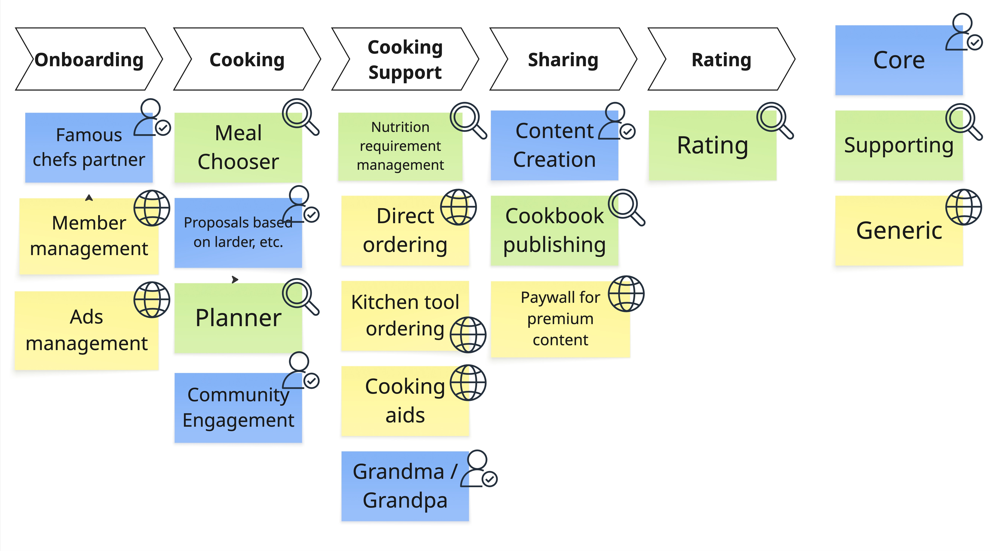

# Prompt 2026-06-20:

Check the Wardley Map of the Larder application based on its Capability Map.

[Skill: Wardley Map critique](../Skills/WardleyMapSkill/SKILL.md)

[References—Evolution and patterns](../Skills/WardleyMapSkill/references/evolution-and-patterns.md)

[References—Map essentials](../Skills/WardleyMapSkill/references/map-essentials.md)

[References—Upstream cross check](../Skills/WardleyMapSkill/references/upstream-cross-checks.md)

# Answer:

## One-line read

This is a **usable first Wardley Map**, because it has a user/value-chain axis and an evolution axis, but the **anchor is too broad** and the map currently mixes **user needs, capabilities, features, data stores, infrastructure, channels, and personas** in one layer. The biggest strategic risk is that the map may drive build/buy decisions from an unclear value chain rather than from a clear user need. A Wardley Map should be anchored on a user need, with components positioned by dependency and evolution, not by process sequence or product modules.

## What I read from the Capability Map

The capability map suggests these main business/product capabilities:

**Core / supporting capabilities**

* Meal chooser
* Planner
* Rating
* Nutrition requirement management
* Cookbook publishing
* Supporting / generic capabilities

**User/community/content capabilities**

* Famous chefs partner
* Content creation
* Community engagement
* Grandma / Grandpa support
* Proposals based on larder
* Member management
* Ads management

**Commerce / ordering capabilities**

* Direct ordering
* Kitchen tool ordering
* Cooking aids
* Paywall for premium content

So the Wardley Map should probably explain how Larder creates value for users such as **young families, singles, home cooks, prospects, members, and content creators** through cooking support, meal planning, content, rating, and membership.

## Main issue: the anchor is not yet sharp enough

At the top of the Wardley Map you have several user/persona notes: **Young families, Singles, Home cook, Prospect**. Beneath them are needs such as **better cooking skills, efficient usage of groceries, create content, rate content, search recipes with nutrition/meals, support cooking, become a member**.

That is a good start, but it is not yet a single clear anchor.

A Wardley Map normally starts with a **specific user and need**. For example:

> “Home cooks need to plan and cook meals using what they already have.”

or

> “Busy families need reliable meal suggestions that match larder contents, nutrition needs, and available time.”

Right now the map tries to serve multiple journeys at once: cooking, content creation, rating, membership, community, publishing, and commerce. That makes the value chain hard to read.

**What would resolve it:** create one map per primary need, or make the top anchor explicit. For example:

* Map 1: “Home cook gets a meal plan from existing larder contents.”
* Map 2: “Content creator publishes and monetizes recipes.”
* Map 3: “Member gets premium cooking support.”

## Value-chain hygiene: several dependencies look inverted or noisy

Some components are well placed as visible user-facing things:

* **Ask chef**
* **Ask Grandma / Grandpa**
* **Ask community**
* **Meal**
* **Nutrition**
* **Write recipe**
* **Upload media**
* **Timer**
* **Free hand control**
* **Member management**

But there are many crossing lines, and it is hard to tell whether the arrows mean “depends on,” “is used by,” “belongs to,” or “is related to.” In a Wardley Map, links should mean dependency in a chain of needs: “this visible thing needs that less visible thing underneath.”

A few examples where I would challenge the dependency structure:

| Component                                                              | Concern                                                                                                                                                                           |
| ---------------------------------------------------------------------- | --------------------------------------------------------------------------------------------------------------------------------------------------------------------------------- |
| **Young families / Singles / Home cook / Prospect**                    | These are personas, not components. They should anchor the map, not sit as map components.                                                                                        |
| **Better cooking skills / efficient grocery usage / support cooking**  | These are user outcomes or needs. Good anchors, but they should not be mixed with internal components.                                                                            |
| **Ask chef / Ask Grandma / Ask community**                             | These look like channels or interaction modes, not core capabilities. They may depend on content, chat, GenAI, scheduling, community, identity, etc.                              |
| **Recipe database / Rating database / Media storage / Cloud / Mobile** | These are implementation/data/infrastructure components and should sit lower in the value chain. That part is mostly correct.                                                     |
| **IDM and Member Management**                                          | These are supporting capabilities. They should probably serve membership, content creation, rating, paywall, and personalization, not appear as a separate right-edge chain only. |

The line density is also hiding the important strategic message. A Wardley Map should make strategic choices easier to see; this one is at risk of becoming a systems diagram.

## Evolution positioning: what looks right

Several placements are defensible:

| Component                 |                    Current position | Comment                                                                                                 |
| ------------------------- | ----------------------------------: | ------------------------------------------------------------------------------------------------------- |
| **Cloud**                 |                           Commodity | Correct. Cloud infrastructure is a utility in most cases. Renting is the default.                       |
| **Mobile**                |                 Commodity / utility | Mostly correct if this means mobile platform/device capability.                                         |
| **Media Storage**         |                           Commodity | Correct. Storage should be rented unless there is a very unusual differentiator.                        |
| **IDM**                   |                           Commodity | Correct. Identity management is usually bought/rented.                                                  |
| **Chat / Remote meeting** |                Product to commodity | Reasonable. These are widely available capabilities.                                                    |
| **Recipe database**       |                         Product-ish | Reasonable if it is a structured internal product capability, but commodity recipe datasets also exist. |
| **Rating database**       |                         Product-ish | Reasonable if it captures proprietary user feedback; otherwise database tech itself is commodity.       |
| **Timer**                 |                           Commodity | Correct; do not build this as strategic.                                                                |
| **Free hand control**     | Product/commodity depending on tech | Reasonable if using existing voice/gesture/assistant platforms.                                         |

This is the strongest part of the map: common enabling technologies are mostly on the right, which suggests you are not over-novelising infrastructure. That is good Wardley discipline. Commodity components should usually be rented/standardized rather than custom-built.

## Evolution positioning: where I would challenge the map

### 1. “Specific AI” may be too far left, but “differentiated cooking intelligence” may belong left

You place **Specific AI** around Custom and **Gen AI** nearer Commodity/Product.

That split is useful, but needs sharper wording.

* **Generic GenAI** is becoming a product/utility capability.
* **Larder-specific cooking intelligence** could be Custom if it combines larder contents, preferences, nutrition, recipes, household habits, and cooking context in a way competitors cannot easily copy.
* But if “Specific AI” just means calling a model with prompts, it is not Custom; it is a product integration.

**Cheap test:** could a competitor reproduce 80% of this using an LLM API, a recipe database, and user preferences within a few weeks? If yes, it is not strongly Custom. If not, name the proprietary data/model/workflow that makes it different.

### 2. “Ask Grandma / Grandpa” looks over-novelised unless the social mechanic is genuinely unique

This appears high visibility and far left, which implies novelty/differentiation. That might be correct if it is a distinctive brand/community experience.

But technically, “ask a person for cooking advice” is not novel. The novelty would have to be in the **trusted social cooking network**, **elder knowledge capture**, **matching**, **conversation design**, or **community loop**.

**What would resolve it:** rename the component to the actual differentiator, e.g. “trusted family cooking advice network” or “elder cooking knowledge marketplace.” Otherwise it may just be a communication feature sitting on top of chat/video/community tools.

### 3. “Ask chef” and “Competitions” need clearer stage logic

Both sit around Custom. That may be defensible if Larder has exclusive chef partnerships or unique competition mechanics. But if these are standard engagement/marketing features, they are more Product than Custom.

From the Capability Map, “Famous chefs partner” is explicitly highlighted, so there may be a differentiating partnership play. In that case, the map should show **chef partnership / content rights / brand trust** as the component, not merely “Ask chef.”

### 4. “Nutrition” may be too visible and too far left/right depending on meaning

The Capability Map has **Nutrition requirement management**, while the Wardley Map shows **Nutrition** as a visible component near Product. This is ambiguous.

* Nutrition facts and dietary categories are commodity/product data.
* Personalized nutrition requirement management for a household could be Custom/Product.
* Medical-grade nutrition advice would involve regulatory and trust components that are missing.

**What would resolve it:** split it into:

* “nutrition data” — commodity/product
* “personalized nutrition constraints” — product/custom
* “nutrition recommendation logic” — custom/product depending on differentiation

### 5. “Meal” is too vague

“Meal” appears as a component, but it is unclear whether it means:

* meal suggestion,
* meal plan,
* cooked meal,
* recipe result,
* shopping basket,
* nutrition-balanced plan.

From the Capability Map, **Meal Chooser** and **Planner** are core. The Wardley Map should probably include **Meal recommendation**, **Meal planning**, and **Larder-aware proposal generation** instead of just “Meal.”

That matters because “meal planning” is a productized market, while “larder-aware personalized planning” may be more differentiating.

## Missing or underrepresented components from the Capability Map

The Wardley Map does not fully reflect some capabilities from the capability map:

| Capability Map item                      | Wardley Map treatment                           | Concern                                                                                 |
| ---------------------------------------- | ----------------------------------------------- | --------------------------------------------------------------------------------------- |
| **Planner**                              | Not clearly present                             | This seems core, but it is not visible as a named component.                            |
| **Meal Chooser**                         | Only partly represented by “Meal”               | Too vague for a core capability.                                                        |
| **Proposals based on larder**            | Not explicit enough                             | This may be one of the strongest differentiators and should be central.                 |
| **Direct ordering**                      | Not clearly mapped                              | Ordering likely needs partner APIs, basket creation, payment, fulfillment.              |
| **Kitchen tool ordering / cooking aids** | Mostly absent                                   | If commerce is strategic, the supporting chain is missing.                              |
| **Paywall for premium content**          | Not clearly mapped                              | Membership, payment, entitlement, content access should appear if monetization matters. |
| **Ads management**                       | Not visible                                     | If ads are part of the business model, ad serving/targeting/sales/privacy are missing.  |
| **Cookbook publishing**                  | Partly represented by write recipe/upload media | Publishing workflow, rights, formatting, distribution, monetization are missing.        |

The biggest omission is **Planner / larder-based proposal generation**. In the capability map it appears central; in the Wardley Map it is not prominent enough. If Larder’s value proposition is “use what you already have,” that component is probably strategic.

## Biggest strategic risks

### Risk 1: The map hides the real differentiator

The strongest potential differentiator seems to be:

> personalized, larder-aware meal planning that helps people cook with what they already have.

But the Wardley Map gives comparable visual weight to chat, remote meetings, upload media, timer, member management, and generic infrastructure. That dilutes the strategy.

**How to test:** ask: “Which component would make users choose Larder over a recipe site, ChatGPT, YouTube, or a meal-planning app?” Then make that component obvious on the map.

**What would resolve it:** put **larder-aware meal planning / proposal engine** high in visibility and left enough to show differentiation, with dependencies on larder data, recipe data, preferences, nutrition constraints, and recommendation logic.

### Risk 2: The map may encourage building too many engagement features

“Ask chef,” “Ask Grandma / Grandpa,” “Ask community,” “Competitions,” “Remote meeting,” and “Chat” all appear. That is a lot of social/engagement surface area.

Some of these may be product differentiators, but many could become distractions unless tied to the primary user need.

**Cheap test:** for each feature, ask whether it directly improves one of the core outcomes:

* better meal choice,
* less food waste,
* better cooking success,
* more repeat usage,
* paid conversion.

If not, put it lower priority or map it separately.

### Risk 3: Monetization capabilities are under-mapped

The Capability Map includes **member management**, **ads management**, **paywall**, **premium content**, **direct ordering**, and **tool ordering**. The Wardley Map shows member management and IDM, but not the full monetization chain.

That is risky because monetization choices shape architecture. Ads, subscriptions, affiliate ordering, and premium content need different components and different data/privacy constraints.

**What would resolve it:** create a separate monetization map or add missing components: payment, entitlement, subscription billing, ad targeting, partner catalog, affiliate/order API, consent/privacy, content rights.

## Map-integrity notes

The map is close, but I would clean up four things:

1. **Separate personas, needs, and components.** Personas sit above the map; needs anchor it; components form the value chain.
2. **Reduce crossing lines.** Keep only true dependency links.
3. **Use consistent component grain.** “Cloud” and “Ask Grandma” are not the same level of abstraction.
4. **Show movement.** The map is mostly static. Wardley strategy comes from movement: what is evolving right, what will be commoditized, and where new differentiation appears. Evolution is about ubiquity and certainty, not time or internal maturity.

## What is strong

The map has several good instincts:

* It correctly pushes infrastructure such as **cloud, mobile, storage, IDM** toward commodity.
* It recognizes that **generic GenAI** is not the whole differentiator.
* It includes both visible user-facing components and invisible enabling components.
* It attempts to connect the capability map to strategic positioning rather than just listing features.
* The Capability Map’s color/icon distinctions appear useful for separating core/supporting/generic and user-facing elements.

## Suggested next version

I would redraw the Wardley Map around one primary anchor:

> **Home cook wants to choose and cook a meal using available larder contents, preferences, and nutrition needs.**

Then build the chain:

Top:

* choose meal
* cook successfully
* reduce wasted groceries

Middle:

* larder-aware proposal engine
* meal planner
* recipe search/recommendation
* nutrition constraint handling
* cooking support

Lower:

* recipe database
* user/larder/preference data
* rating data
* content/media
* GenAI/model integration

Bottom/right:

* cloud
* storage
* identity
* mobile platform
* payments/subscription
* commodity communication tools

That would make the strategic question much sharper: **what should Larder own because it differentiates the cooking experience, and what should it rent because the market has already commoditized it?**
