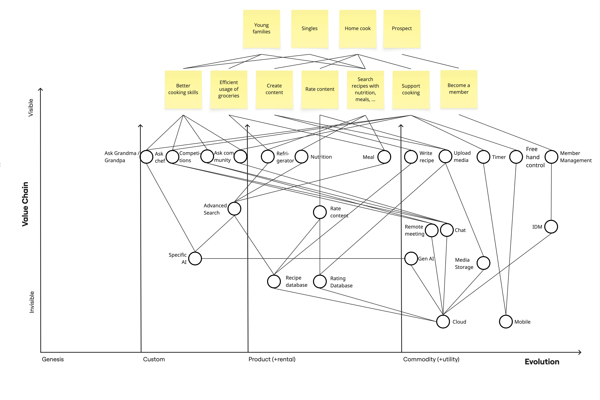
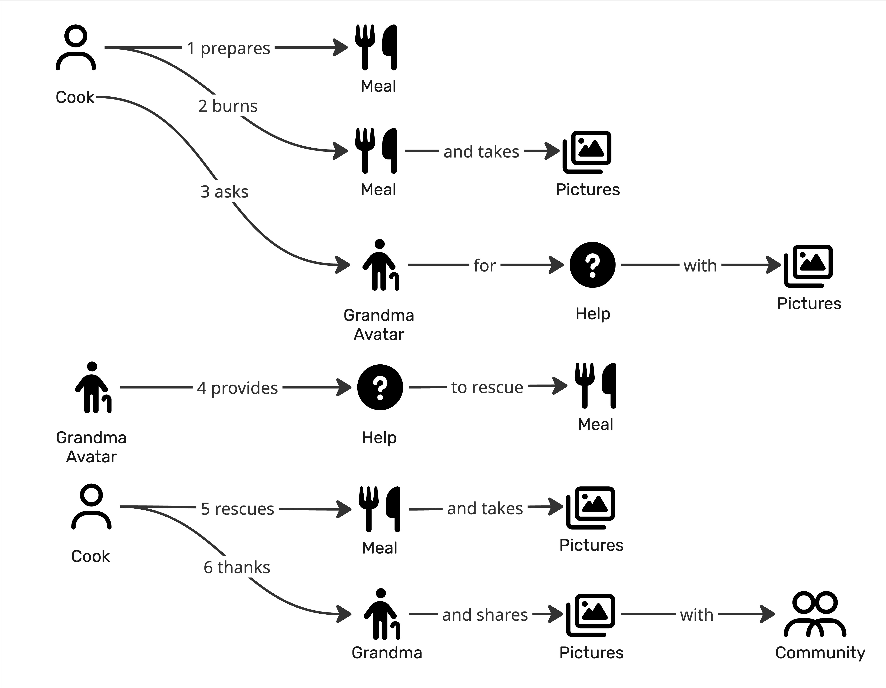

# Prompt 2026-07-03:

Critique the provided domain story based on the provided Wardley Map. Use the provided skill.

[Skill](../Skills/DomainStoryCritiqueSkill/SKILL.md)
[References—Coherence and Story](../Skills/DomainStoryCritiqueSkill/references/coherence-and-story.md)
[References—Grammar and Scope](../Skills/DomainStoryCritiqueSkill/references/grammar-and-scope-checklist.md)
[References—Related Artifacts](../Skills/DomainStoryCritiqueSkill/references/related-artifact-cross-check.md)
[Referneces-Visual Glossary](../Skills/DomainStoryCritiqueSkill/references/visual-glossary-cross-check.md)

# Answer:

## One-line read

The story is a clear “burned meal rescue” scenario: a Cook burns a Meal, sends Pictures to a Grandma Avatar, receives Help, rescues the Meal, then shares Pictures with the Community. It mostly holds together as **one concrete domain story**, but compared with the Wardley Map it risks modelling a polished product vignette rather than the strategically important domain.

I’m applying the uploaded Domain Story Critic guidance and its Wardley/capability cross-check lens.

## Biggest risks first

### 1. “Grandma Avatar” collapses several Wardley-map things into one actor

The Wardley Map separates several capabilities/systems that the story compresses into one pictogram: **Ask Grandma/Grandpa**, **Ask Chef**, **Ask Community**, **Gen AI**, **Chat**, **Remote meeting**, **Recipe database**, and maybe **Specific AI**. In the story, “Grandma Avatar” both receives the request and provides the rescue help. That may be intentional, but it hides whether the actor is:

a human elder, an AI persona, a chat service, a remote expert, or a product feature.

That matters because the map shows these as different components at different stages of evolution. If the story treats them as one actor, the team may miss which parts are custom/differentiating and which are utility infrastructure.

**Cheap test:** ask the domain expert: “When the cook asks Grandma Avatar, who or what actually reasons about the pictures and gives advice?”
**What would resolve it:** split the actor if needed, for example: `Cook asks Cooking Assistant for Help with Pictures`; then `Cooking Assistant uses Gen AI / Recipe Knowledge / Chat` if this is a digitalized story.

### 2. The story spends detail on pictures and sharing, but the map’s main value seems to be cooking support

The story’s most concrete loop is: take Pictures → ask for Help → rescue Meal → take Pictures → share with Community. That is coherent, but the Wardley Map’s visible user needs include **better cooking skills**, **efficient usage of groceries**, **search recipes with nutrition/meals**, and **support cooking**. The story strongly covers “support cooking” and “upload/share media,” but it barely touches learning, groceries, recipe/nutrition search, or why this rescue improves skill rather than just saves one meal.

This is a **misplaced-emphasis risk**: the domain story gives more attention to media/community than to the differentiating cooking-support logic. The Wardley cross-check explicitly asks whether the story spends its detail where the map says the value is.

**Cheap test:** ask: “Is this story about rescuing a burned meal, creating social content, or teaching the cook to avoid the mistake next time?”
**What would resolve it:** if the strategic need is cooking support, add the domain act that makes the help valuable, such as diagnosing the problem, suggesting a rescue technique, or adapting the recipe. Do not just add generic “AI provides help.”

### 3. Several core map capabilities are absent from the scenario

The map shows components that look relevant to this exact rescue story but are missing or only implied:

**Recipe database / Advanced Search / Specific AI / Gen AI / Nutrition / Meal / Upload media / Media Storage / Cloud / Mobile / Chat / Remote meeting.**

Not all should be in one story. But for this scenario, at least some are likely load-bearing. For example, if Grandma Avatar gives advice based on Pictures, then **image analysis, recipe knowledge, chat, and media storage** may be involved. If the user takes and shares Pictures, **Upload media**, **Media Storage**, **Cloud**, and **Mobile** are implied but not shown as software-system actors.

**Cheap test:** decide whether this is a **pure domain story** or a **digitalized story**.
**What would resolve it:** either remove product/infrastructure implications and keep it pure, or show the relevant systems as actors. The checklist warns that a digital flow with no software actors often means systems have been silently absorbed into human verbs.

## Block-by-block notes

**Actors.** “Cook” is good: specific and domain-relevant. “Community” is also plausible, though passive. “Grandma Avatar” is the weak point: it sounds like a UX/product construct rather than a stable domain role. The Wardley Map uses “Ask Grandma/Grandpa,” not “Grandma Avatar,” so the terminology may already be drifting.

**Activities.** “Prepares,” “burns,” “asks,” “provides,” “rescues,” “thanks,” and “shares” are mostly domain-readable. “Takes pictures” is borderline: it may be a real domain action if photos are the diagnostic evidence, but it may also be a UI/media gesture. The real domain verb might be “documents the burned meal,” “shows the damage,” or “sends evidence,” depending on intent.

**Work objects.** “Meal,” “Pictures,” and “Help” are understandable, but “Help” is a weak work object. Is it advice, a rescue instruction, a cooking technique, a corrected recipe, or a step-by-step intervention? “Help” is too broad to model downstream.

**Sequence.** The numbered story is coherent and causal. It does not visibly branch, loop, or contain mutually exclusive outcomes, which is a strength. The one stumble is step 4 → 5: “provides Help to rescue Meal” and then “Cook rescues Meal” may be two views of the same act unless the distinction is: Grandma gives advice; Cook applies it.

**Scope consistency.** The story mixes pure-domain language with product/digital elements. “Cook prepares meal” is pure domain. “Takes pictures,” “Grandma Avatar,” and “shares with Community” are digitalized. That is not automatically wrong, but it should be declared. The grammar/scope checklist treats this pure-vs-digitalized consistency as a key scope decision.

## Story vs. Wardley Map

The story covers these mapped elements reasonably well: **Home cook**, **Support cooking**, **Meal**, **Upload media / Pictures**, **Ask Grandma/Grandpa**, and **Ask Community / Community**.

It underplays or omits these mapped elements that may matter:

**Better cooking skills** — the cook is rescued, but does not visibly learn.
**Efficient usage of groceries** — a burned meal is exactly where waste matters, but groceries are absent.
**Search recipes with nutrition/meals** — the rescue advice does not connect to recipe, nutrition, or meal knowledge.
**Gen AI / Specific AI / Chat / Remote meeting** — likely mechanisms behind “Grandma Avatar,” but hidden.
**Media Storage / Cloud / Mobile** — implied by pictures and sharing, but not named if this is a digitalized story.
**Ask Chef** — map says it exists, but the story chooses Grandma only; that may be fine, but it should be deliberate.

## What’s strong

The scenario is concrete, memorable, and easy for a domain expert to validate. The burned-meal rescue gives the story a real narrative shape rather than an abstract “user gets cooking support” flow. The numbered order is readable, and the core value moment — advice that saves the meal — is present.

## Path forward

I would tighten it by deciding the story’s purpose:

**If this is the differentiating cooking-support story**, make the help more domain-specific: the assistant diagnoses the burned meal from pictures, suggests a rescue technique, and the cook applies it.

**If this is the social/community story**, make sharing and community feedback the center, and move the rescue logic into a separate story.

Right now it tries to do both, and the Wardley Map suggests the team should be careful not to let the media/community tail wag the cooking-support dog.
