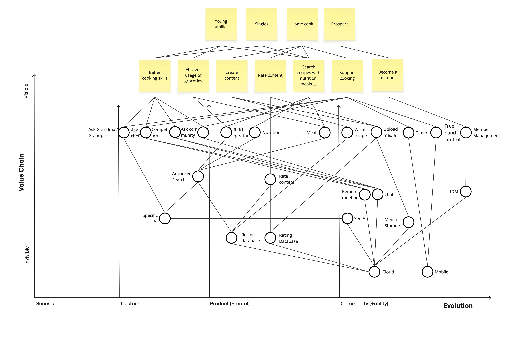

# Prompt 2026-06-28

Create a Domain Story as preparation for a workshop session for "Ask Grandma/Grandpa" in the Wardley Map provided. Use the provided skill.

[Skill](../Skills/DomainStorySeederSkill/SKILL.md)
[References-worked-examples](../Skills/DomainStorySeederSkill/references/worked-examples.md)

# Answer

# Seed domain stories — Ask Grandma/Grandpa

## Source & focus

Input used: the Wardley Map image, focused on **Ask Grandma/Grandpa**. I read it as a visible, **Custom** component serving cooking help needs such as **Better cooking skills** and **Support cooking**, mainly for actors like **Home cook**, **Young families**, and possibly **Singles**.

I also see likely downstream dependencies around **Specific AI**, **Gen AI**, **Cloud**, and collaboration components such as **Remote meeting** and **Chat**. Following the provided skill, I’m treating this as a likely **human-vs-AI fulfillment fork**: “Ask Grandma/Grandpa” may mean a human mentor, an AI persona, or an avatar-first path with human escalation.

Granularity: **medium**, suitable as a workshop strawman.

## Story 1 — Home cook asks a Grandma avatar

1. Home cook selects a Recipe for a Dish.
2. Home cook reaches a difficult Step in the Recipe.
3. Home cook opens Ask Grandma for the Step.
4. Ask Grandma avatar receives the Question with the Recipe context.
5. Ask Grandma avatar explains the Technique for the Step.
6. Home cook applies the Technique to the Dish.
7. Home cook marks the Step as completed.
8. Ask Grandma avatar saves the Question to the Cooking history.

## Story 2 — Home cook asks a human Grandma mentor

1. Home cook selects a Recipe for a Dish.
2. Home cook reaches a difficult Step in the Recipe.
3. Home cook requests a Grandma mentor for the Step.
4. Platform matches the Home cook with a Grandma mentor.
5. Home cook shares the Recipe context with the Grandma mentor.
6. Grandma mentor reviews the Step with the Home cook over a Remote meeting.
7. Grandma mentor explains the Technique for the Step.
8. Home cook applies the Technique to the Dish.
9. Home cook thanks the Grandma mentor for the Help.

## Story 3 — Avatar hands the cook to a human mentor

1. Home cook asks Ask Grandma avatar about a difficult Step.
2. Ask Grandma avatar reviews the Question with the Recipe context.
3. Ask Grandma avatar marks the Question as unresolved.
4. Ask Grandma avatar offers a Grandma mentor to the Home cook.
5. Home cook accepts the Grandma mentor.
6. Platform starts a Remote meeting with the Grandma mentor.
7. Grandma mentor reviews the Question with the Home cook.
8. Grandma mentor explains the Technique for the Step.
9. Home cook applies the Technique to the Dish.
10. Platform records the unresolved Question for future improvement.

## For the session

**Assumptions to confirm:** “Grandma/Grandpa” is a persona or mentor role, not necessarily the user’s actual relative; the cook is usually a **Home cook**; the first design choice is AI avatar, human mentor, or avatar-first escalation; Recipe context is available to the helper; the human interaction happens through Remote meeting or Chat.

**Candidate groups / bounded contexts:** Recipe context, Ask Grandma experience, Mentor matching, Live cooking support, Cooking history and improvement.

**Questions for the room:** Should Ask Grandma/Grandpa feel like a real person, a branded AI persona, or a pool of human mentors? What information may the helper see from the recipe, user profile, and cooking history? What makes a question “unresolved”? Who curates or trains the Grandma/Grandpa advice style?
