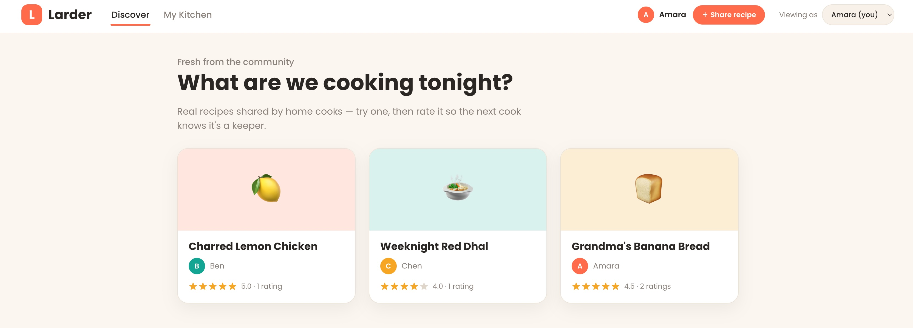

# Prompt 2026-07-11:

Create a prototype based on the Domain Story and the provided screenshot. The Domain Story is part of the Larder application. Use the provided skills.

[Prototype Skill](../Skills/PrototypeSkill/SKILL.md)
[Domain Story Skill](../Skills/DomainStorytellingSkill/SKILL.md)
[Refererences Domain Story Skill Pictographic Language](../Skills/DomainStorytellingSkill/references/pictographic-language.md)
[References Domain Story Skill Worked Examples](../Skills/DomainStorytellingSkill/references/worked-examples.md)
[Webapp Style Extractor Skill](../Skills/WebappStyleExtractorSkill/SKILL.md)
[References Webapp Extractor Skill](../Skills/WebappStyleExtractorSkill/references/schema.md)

# Answer:

Created the clickable Larder prototype implementing the full Grandma meal-rescue flow, with Cook/Grandma persona switching, live meal-state transitions, photo-request screens, guidance, rescue confirmation, and community sharing. It follows the supplied domain-story workflow and the visual-token extraction approach from the provided skills.

[Open the prototype](./LarderGrandmaChatGpt55Medium.html)

[README](./LarderGrandmaChatGpt55-README.md)
[Style](./LarderGrandmaChatGpt55-README.md)

The package also contains a style specification and README documenting the story mapping, assumptions, extrapolated components, and unresolved domain questions.
