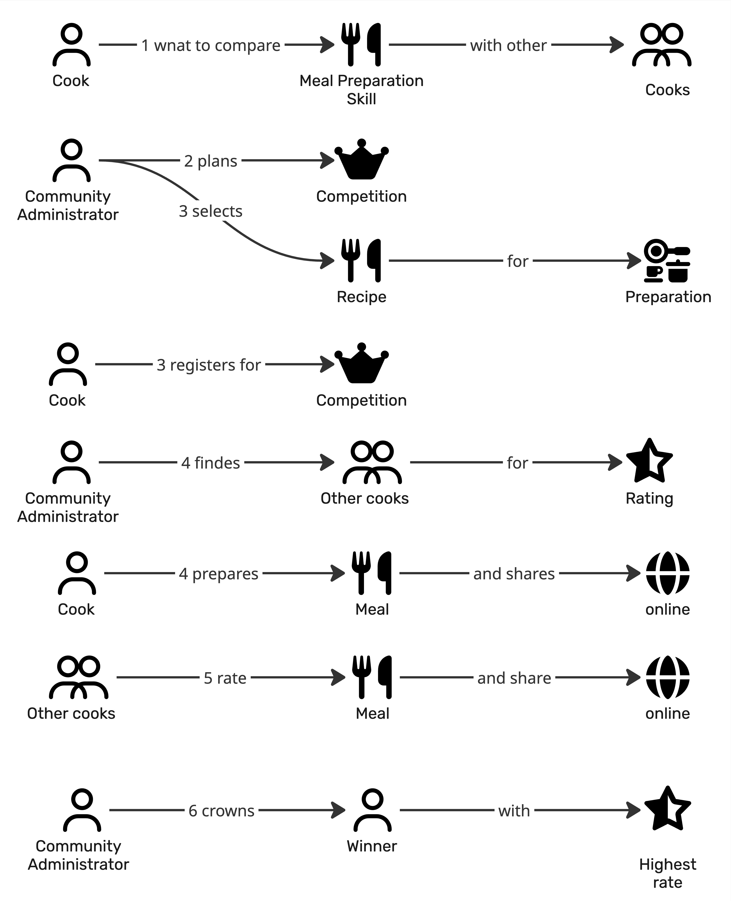
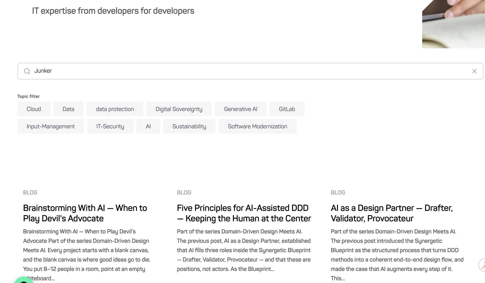

# Prompt 2026-07-05:

Create a prototype from the provided domain story and the provided screenshot.

[Skill](../Skills/PrototypeSkill/SKILL.md)

# Answer:

Here is the build plan and the clickable prototype based on your inputs.

### Track C — Reconciliation Build Plan

Here is how the structural elements of the domain story map to the visual tokens extracted from your screenshot:

| From the Prototype Brief | Becomes in the prototype | Styled using (from style spec) |
| --- | --- | --- |
| **Modules / Entities** | Competitions, Meals, Recipes. | Clean, borderless cards organized in a responsive 3-column grid. |
| **Screens** | 1. Competition Board 

 2. Competition Detail (Registration/Prep/Rating) | White backgrounds, generous spacing, minimalist layout with `16px`–`24px` gaps. |
| **State machines** | States: Planned → Registration → Preparation → Rating → Concluded | Pill-shaped tags (`#F4F5F7` background) functioning as filters and status indicators. |
| **Use-case order** | Plan → Select Recipe → Register → Find Judges → Prepare & Share → Rate → Crown Winner | Main call-to-action text links under the excerpt on each card, gated by role. |
| **Domain model** | Competitions containing recipes, participants, and meals. | Text heavy layout: Bold titles, uppercase gray meta text (`#666666`), dark body copy. |
| **Actors & roles** | Roles: Community Administrator, Cook, Other Cook (Judge) | A minimalist dropdown at the top right of the navigation. |

---

### Track D — Clickable Prototype

Save the following code as an `.html` file and open it in any modern web browser to view and interact with the prototype. It is a fully self-contained React application using Tailwind CSS to faithfully reproduce the visual tokens of your screenshot.

[html](./cooking-competition-prototype-gemini35high.html)

### Track E — Readme & Delivery

**A. Story Mapping**

* **Competitions:** Act as the primary entity blocks in the UI, replacing the "Blog Posts" seen in the screenshot.
* **Roles:** Added a prototype-only role switcher at the top to toggle between *Community Administrator*, *Cook*, and *Other Cook (Judge)* to expose role-gated interactions.
* **State Machine:** The domain flows linearly: *Planned → Registration → Preparation → Rating → Concluded*. Controls for these appear as underlined action links inside the cards, updating the badge and moving the card through the workflow.

**B. Style Caveats**

* **Typography:** The screenshot uses a clean, modern sans-serif. In the absence of the exact font file, system fonts (`-apple-system`, `Roboto`, `Helvetica`) are used as a fallback token.
* **Colors:** Exact hex values were estimated from the screenshot (`#F4F5F7` for pills, `#666666` for meta-text). No extra colors were introduced.

**C. Extrapolations**

* The screenshot only showed blog posts. I extrapolated the blog card UI to fit **Competition states and actionable buttons**, mimicking the exact visual hierarchy (Meta Title -> Main Title -> Excerpt).
* I utilized the "Topic Filter" UI purely as a state-machine status filter since navigating by status represents the core utility of the app.

**D. Open Questions**

1. **Registration Capacity:** Does a competition have a maximum amount of Cooks that can register before the Administrator moves it to the "Preparation" stage?
2. **Judges pool:** Does a cook automatically become a judge ("Other Cook") for competitions they are *not* participating in, or is that a strictly distinct account type?