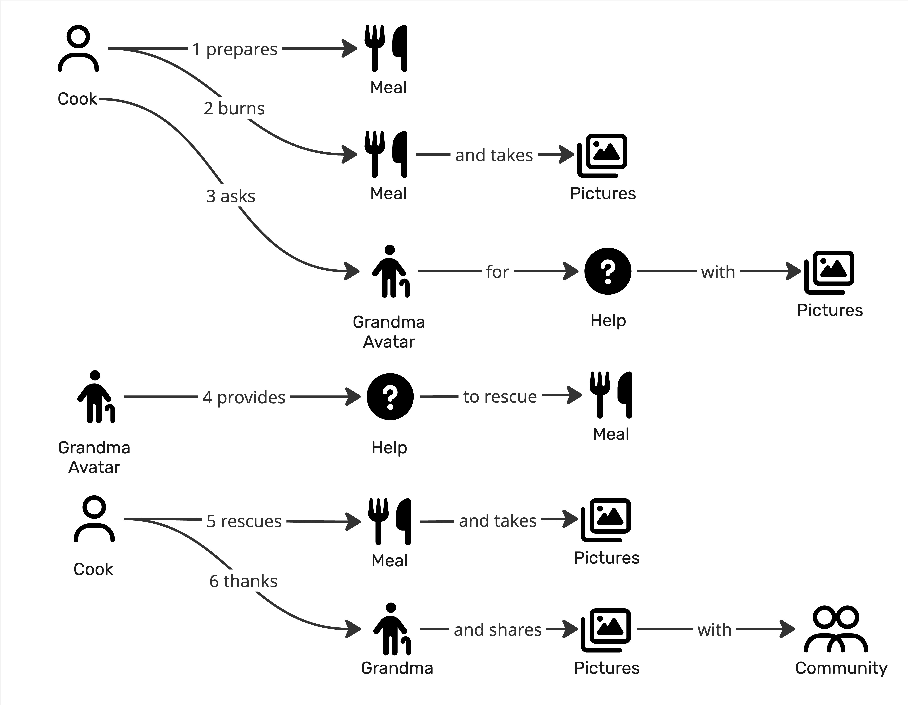
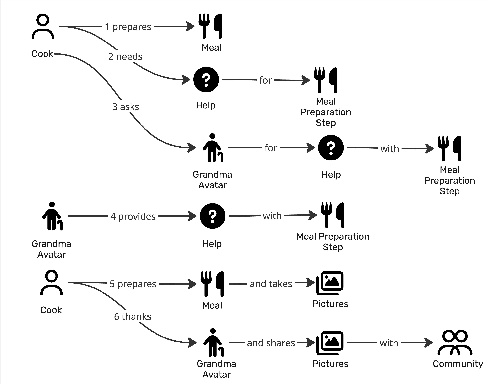
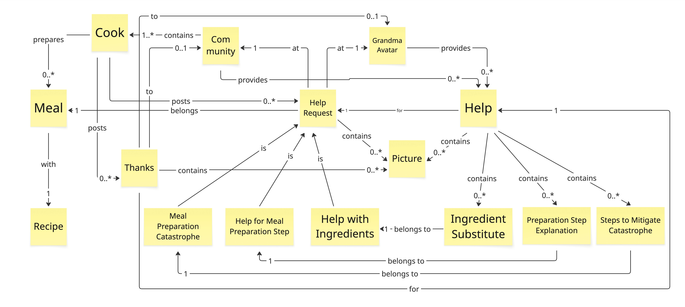

# Prompt 2026-08-01

Check the consistency of the three provided Domain Stories with the provided Visual Glossary.

[Skill](../Skills/DomainStoryVsVisualGlossaryConsistencySkill/SKILL.md)
[Worked example](../Skills/DomainStoryVsVisualGlossaryConsistencySkill/references/worked-example.md)
[Checks](../Skills/DomainStoryVsVisualGlossaryConsistencySkill/references/checks.md)

# Answer

# Consistency Report — 3 Domain Stories × Grandma Cooking Visual Glossary

## 0. Scope Checked

* **Stories Checked:**
* **Story 1 — "Community" (`Community.jpg`):** As-is story where a Cook asks the Community for help with ingredients.
* **Story 2 — "Grandma" (`Grandma.jpg`):** As-is story where a Cook burns a meal and asks Grandma Avatar for help to rescue it.
* **Story 3 — "GrandmaII" (`GrandmaII.jpg`):** As-is story where a Cook asks Grandma Avatar for help with a specific meal preparation step.

* **Visual Glossary (`VisualGlossaryGrandma.jpg`):** 15 terms (3 actors, 12 work objects/subtypes) and 24 structural relationships.
* **Unchecked / Notes:** All diagram elements in the four provided images are legible. A minor spelling typo in the Visual Glossary box (`Preparation Step Expanation`) was noted and included in findings.

---

## 1. Verdict

**Aligned with minor drift.**

The three Domain Stories and the Visual Glossary display strong structural alignment. Crucially, each of the three domain stories maps directly to one of the three `Help Request` sub-types defined in the glossary.

* **Findings by Severity:** 0 Blocking · 4 Significant · 3 Minor.
* **Coverage Denominator:** 3 stories, 15 glossary terms (12 exercised across the union of stories).

---

## 2. Term Ledger

| Glossary Term | Story 1 (Community) | Story 2 (Grandma) | Story 3 (GrandmaII) | Status |
| --- | --- | --- | --- | --- |
| **Cook** | Cook | Cook | Cook | `=` exact |
| **Community** | Community | Community | Community | `=` exact |
| **Grandma Avatar** | — | Grandma Avatar / **Grandma** | Grandma Avatar | `✗` mismatch in Grandma S2.6 |
| **Meal** | Meal | Meal | Meal | `=` exact |
| **Recipe** | — | — | — | `—` unused |
| **Thanks** | thanks *(verb)* | thanks *(verb)* | thanks *(verb)* | `~` used as activity verb |
| **Help Request** | Help | Help | Help | `~` expressed via Help + topic |
| **Help** | Help | Help | Help | `=` exact |
| **Picture** | Pictures | Pictures | Pictures | `~` plural |
| **Meal Preparation Catastrophy** | — | *burns/rescues Meal* | — | `~` implied via verb/state |
| **Help for Meal Preparation Step** | — | — | Meal Preparation Step | `~` step named directly |
| **Help with Ingredients** | Help with Ingredients | — | — | `=` exact (S1.2, S1.3) |
| **Ingredient Substitute** | Ingredients Substitutes | — | — | `~` plural/variant (S1.4) |
| **Preparation Step Expanation** | — | — | — | `—` unused (+ glossary typo) |
| **Steps to Mitigate Catastrophy** | — | *rescue Meal* | — | `~` implied via verb |

* **Story-only Nouns:** `Ingredients` (Community S1.2/S1.3; used as topic noun) and `Pictures` as a help topic (Grandma S2.3).
* **Out of Glossary Scope:** None.

---

## 3. Findings

### **F1 · `DRIFT` / `TERM` · Significant**

* **Evidence:** Story Grandma step 6 uses `Grandma` ("Cook thanks Grandma"), whereas steps 3 & 4 use `Grandma Avatar`. Story GrandmaII uses `Grandma Avatar` consistently in step 6, as defined in the Visual Glossary.
* **Why it matters:** Internal drift within Story Grandma creates ambiguity between the physical person and the digital avatar persona.
* **Story Moves:** In Story Grandma sentence 6, rename `Grandma` to `Grandma Avatar`.
* **Recommendation:** Adopt `Grandma Avatar` in Story Grandma step 6.

### **F2 · `UNDEF` · Significant**

* **Evidence:** Story Grandma sentence 3 states that Cook asks for "Help with Pictures".
* **Why it matters:** The Visual Glossary categorizes `Help Request` into three specific sub-types (`Meal Preparation Catastrophy`, `Help for Meal Preparation Step`, `Help with Ingredients`). "Help with Pictures" is not a defined request sub-type; `Picture` is modeled as an attached work object (`contains Picture`), not a request classification.
* **Story / Glossary Moves:** Rephrase Story Grandma S2.3 to align with `Meal Preparation Catastrophy` (matching S2.2, S2.4, and S2.5), or explicitly add `Help with Pictures` as a 4th sub-type in the glossary if photo-related help is a distinct scenario.
* **Recommendation:** Rephrase Story Grandma S2.3 to reference `Meal Preparation Catastrophy`.

### **F3 · `REL-X` · Significant**

* **Evidence:** All three stories (Community S1.5, Grandma S2.2/S2.5, GrandmaII S3.5) feature Cook "takes Pictures" of the `Meal` or situation and shares them when thanking.
* **Why it matters:** The glossary attaches `Picture` inside `Help Request`, `Help`, and `Thanks`, but lacks an explicit relationship connecting `Cook` or `Meal` to `Picture` (e.g., photographing a meal).
* **Glossary Moves:** Add a relationship `Cook — takes → 0..* Picture` or `Meal — depicted in → 0..* Picture`.
* **Recommendation:** Update the glossary to explicitly represent picture capture of a `Meal`.

### **F4 · `REL-X` · Significant**

* **Evidence:** Story Grandma (S2.2, S2.4, S2.5) relies on verbs "burns Meal" and "rescues Meal".
* **Why it matters:** The glossary models catastrophes structurally via `Meal Preparation Catastrophy` and `Steps to Mitigate Catastrophy`, but does not depict state transitions on `Meal`.
* **Recommendation:** Keep action verbs in the story for narrative flow, but ensure the work object explicitly links to `Meal Preparation Catastrophy` in step 2/3.

### **F5 · `UNUSED` + `REL-0` · Minor**

* **Evidence:** `Recipe` and `Preparation Step Expanation` are never explicitly named in any story's work objects, leaving `Meal — with → 1 Recipe` unexercised.
* **Why it matters:** Indicates either dead glossary terms or scenarios/stories that haven't been drawn yet.
* **Recommendation:** Keep in glossary if recipe-driven cooking stories are planned.

### **F6 · Minor, Grouped**

* **S1.4:** `Ingredients Substitutes` vs glossary `Ingredient Substitute` (plural & extra 's'). Rename in story to singular.
* **Glossary Typo:** "Preparation Step Expanation" in Visual Glossary is missing an 'l'. Patch diagram box to `Preparation Step Explanation`.

---

## 4. Relationships & Cardinalities

| Glossary Relationship | Cardinality | Exercised By | Verdict |
| --- | --- | --- | --- |
| **Cook — prepares → Meal** | `0..*` | Community (1,5), Grandma (1), GrandmaII (1,5) | Consistent |
| **Meal — with → Recipe** | `1` | — | Never exercised (F5) |
| **Community — contains → Cook** | `1..*` | All stories (1 Cook + Community) | Consistent |
| **Community — to → Grandma Avatar** | `0..1` | — | Implied link |
| **Cook — posts → Help Request** | `0..*` | Community (2,3), Grandma (3), GrandmaII (2,3) | Consistent |
| **Cook — posts → Thanks** | `0..*` | Community (6), Grandma (6), GrandmaII (6) | Consistent |
| **Thanks — to → Community** | `0..1` | Community (6), Grandma (6), GrandmaII (6) | Consistent |
| **Thanks — to → Grandma Avatar** | — | Grandma (6), GrandmaII (6) | Consistent |
| **Thanks — contains → Picture** | `0..*` | Community (6), Grandma (6), GrandmaII (6) | Consistent |
| **Thanks — belongs → Help Request** | — | All stories (step 6) | Consistent |
| **Community — at → Help Request** | `1` | Community (3) | Consistent |
| **Grandma Avatar — at → Help Request** | `1` | Grandma (3), GrandmaII (3) | Consistent |
| **Help Request — contains → Picture** | `0..*` | Grandma (3) | Consistent |
| **Help — for → Help Request** | `1` | All stories (4) | Consistent |
| **Community — provides → Help** | `0..*` | Community (4) | Consistent |
| **Grandma Avatar — provides → Help** | `0..*` | Grandma (4), GrandmaII (4) | Consistent |
| **Help — contains → Picture** | `0..*` | — | Never exercised directly |
| **Help — contains → Ingredient Substitute** | `0..*` | Community (4) | Consistent |
| **Help — contains → Preparation Step Expanation** | `0..*` | GrandmaII (4) | Consistent |
| **Help — contains → Steps to Mitigate Catastrophy** | `0..*` | Grandma (4) | Consistent |
| **Ingredient Substitute — belongs to → Help with Ingredients** | `1` | Community (4) | Consistent |
| **Preparation Step Expanation — belongs to → Help for Meal Prep Step** | `1` | GrandmaII (4) | Consistent |
| **Steps to Mitigate Catastrophy — belongs to → Meal Prep Catastrophy** | `1` | Grandma (4) | Consistent |
| **Steps to Mitigate Catastrophy — for → Help** | `1` | Grandma (4) | Consistent |

---

## 5. Bounded Contexts

* **Glossary Subdomains:**
1. **Ingredients Context:** `Help with Ingredients` + `Ingredient Substitute`
2. **Meal Preparation Step Context:** `Help for Meal Preparation Step` + `Preparation Step Explanation`
3. **Catastrophy Context:** `Meal Preparation Catastrophy` + `Steps to Mitigate Catastrophy`

* **Story Mapping:**
* **Story 1 (Community):** Exercises the **Ingredients Context**.
* **Story 2 (Grandma):** Exercises the **Catastrophy Context**.
* **Story 3 (GrandmaII):** Exercises the **Meal Preparation Step Context**.

* **Alignment:** Excellent 1-to-1 alignment. Each domain story cleanly exercises one of the three primary subdomains defined in the Visual Glossary.

---

## 6. Patch List

### **Edits to Stories**

* **Story Grandma (`Grandma.jpg`):**
* Sentence 3: Rephrase work object "Help with Pictures" to reference `Meal Preparation Catastrophy`.
* Sentence 6: Change actor `Grandma` → `Grandma Avatar`.

* **Story Community (`Community.jpg`):**
* Sentence 4: Change `Ingredients Substitutes` → `Ingredient Substitute`.

### **Edits to Visual Glossary**

* Fix sticky box spelling typo: `Preparation Step Expanation` → `Preparation Step Explanation`.
* Add explicit photo capture relationship (`Cook — takes → Picture`).

---

## 7. Already Aligned

* **Core Concepts:** Key actors (`Cook`, `Community`, `Grandma Avatar`) and primary work objects (`Meal`, `Help`, `Pictures`) are standard across all artifacts.
* **Structural Alignment:** The 3-part hierarchy of `Help Request` in the Visual Glossary maps directly onto the three separate scenarios.
* **Scenario Pattern:** All three stories share the exact same 6-step lifecycle:
1. Cook prepares Meal.
2. Cook encounters an issue/need.
3. Cook asks helper (`Community` / `Grandma Avatar`) for Help.
4. Helper provides Help.
5. Cook completes/rescues Meal and takes Pictures.
6. Cook thanks helper and shares Pictures with Community.