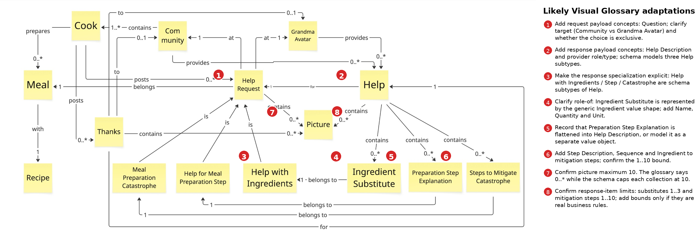

# Prompt 2026-08-02

Check the Visual Glossary against the provided schema. Use the provided skill. Mark where the Visual Glossary might need to be adapted.


[Help Schema](../code/Help.yaml)

[Skill](../Skills/VisualGlossaryAgainstSchemaSkill/SKILL.md)
[Checks](../Skills/VisualGlossaryAgainstSchemaSkill/references/checks.md)
[Mechanical checks](../Skills/VisualGlossaryAgainstSchemaSkill/references/mechanical-checks.md)
[Worked example](../Skills/VisualGlossaryAgainstSchemaSkill/references/worked-example.md)
[Example](../Skills/VisualGlossaryAgainstSchemaSkill/references/example-files/delivery-v1.yaml)

# Answer

# Visual Glossary check — `Help(3).yaml`

**Verdict: aligned with meaningful drift.** The main concepts correspond, but the schema contains payload vocabulary and a response-specialization structure that the Visual Glossary does not currently show. I marked the locations most likely to need adaptation:

[Download the marked Visual Glossary](sandbox:/mnt/data/VisualGlossaryGrandma_marked.png)

The assessment follows the supplied consistency skill, including its matching ladder, abstraction guards, and separation of schema defects from glossary differences.

## Recommended Visual Glossary adaptations

### 1. Add the content of a Help Request

The schema makes every `HelpRequest` contain:

* a `Question`;
* a reference to the requesting `Cook`;
* optionally, `Picture` values.

The Cook and Picture relationships are already visible, but **Question** is absent. Add `Question` as a mandatory value belonging to `Help Request`.

Also clarify the request destination. The diagram appears to say that a request is “at” both `Community` and `Grandma Avatar`, while the schema contains no explicit request-recipient field. The intended rule may be an exclusive choice:

> A Help Request is directed to either the Community or the Grandma Avatar.

A glossary generally cannot express XOR cleanly, so this rule may need a note or annotation rather than two mandatory `1` relationships.

### 2. Add the content and provider information of Help

The schema introduces domain vocabulary not shown as terms:

* `Help Description`;
* `Help Provider Type`;
* `Helping Cook`.

`Help Description` is especially important because it carries the actual explanation for ordinary preparation-step help. Add it under `Help`.

The diagram shows both `Community` and `Grandma Avatar` providing Help. The schema represents that choice through `helpProviderType`, with an additional `helpingCook` identifier when a community cook responds. The glossary should document that realization, including whether exactly one provider must always be known.

### 3. Make the response specialization explicit

The glossary clearly specializes `Help Request` into:

* `Meal Preparation Catastrophe`;
* `Help for Meal Preparation Step`;
* `Help with Ingredients`.

The schema also specializes **Help responses** into three corresponding types:

* `HelpCatastrophe`;
* `HelpStep`;
* `HelpIngredients`.

The glossary currently depicts `Ingredient Substitute`, `Preparation Step Explanation`, and `Steps to Mitigate Catastrophe` as content contained by a generic `Help`, rather than depicting three types of Help.

That is an asymmetric family. Adapt the glossary to show one of these two designs explicitly:

1. `Ingredient Help`, `Preparation Step Help`, and `Catastrophe Help` **are kinds of Help**; or
2. `Help` remains generic and contains one of three response-content value objects.

The schema currently implements option 1, except that the subtype names differ slightly from the glossary’s response terms.

### 4. Clarify that Ingredient Substitute is a role of Ingredient

The schema has one reusable `Ingredient` shape with:

* `Name`;
* `Quantity`;
* `Unit`.

`HelpIngredients.substitutes` contains one or more instances of that shape. This is a legitimate role-of mapping: an ingredient offered in place of another ingredient is an **Ingredient Substitute**.

The glossary should therefore:

* introduce the general `Ingredient` concept, or explicitly state that `Ingredient Substitute` is an Ingredient in the substitute role;
* add `Name`, `Quantity`, and `Unit` as its values;
* document the measurement-unit convention, particularly because the schema defines US cup and spoon measurements.

This should not be reported as a missing schema type; the supplied matching rules explicitly allow one shape to serve two domain roles.

### 5. Explain how Preparation Step Explanation is flattened

The glossary has a distinct `Preparation Step Explanation` term. The schema has no corresponding object. A `HelpStep` response uses the generic `Help.helpDescription` text instead.

This may be intentional. The glossary should record that:

> A Preparation Step Explanation is carried as the Help Description of a preparation-step Help response.

Alternatively, retain it as an independently structured term and adapt the schema. The deciding question is whether another system must process the explanation structurally or whether it is only human-readable prose.

### 6. Add the structure of Steps to Mitigate Catastrophe

The schema represents each mitigation step as a structured `MitigationStep` containing mandatory:

* `Sequence`;
* `Ingredient`;
* `Step Description`.

The glossary currently shows only `Steps to Mitigate Catastrophe`. Add those three subordinate concepts or relationships.

The mandatory Ingredient deserves explicit review: the schema currently says **every** mitigation step involves an ingredient. That may be too strong for instructions such as “turn off the oven” or “move the pan away from the heat.” This is more likely a schema question than a glossary adaptation.

### 7. Confirm the Picture bound

The glossary gives `0..* Picture` for requests, responses, and thanks. The schema gives all three collections:

```yaml
minItems: 0
maxItems: 10
```

A numeric bound present in only one artifact is a minor finding rather than proof that either artifact is wrong. If ten pictures is a real business rule, change the glossary cardinalities to `0..10`. If it is merely a user-interface or storage limit, leave the glossary unbounded and document the implementation constraint separately.

### 8. Confirm response-item bounds

The schema introduces two more bounds not shown in the glossary:

| Relationship                                  |          Glossary |  Schema |
| --------------------------------------------- | ----------------: | ------: |
| Help with Ingredients → Ingredient Substitute | apparently `0..*` |  `1..3` |
| Catastrophe Help → Mitigation Step            | apparently `0..*` | `1..10` |

Both schema collections are mandatory and non-empty. The glossary should adopt these cardinalities only when they are genuine domain rules. In particular, ask what should happen when four valid substitutes exist or when a catastrophe requires eleven steps.

## Other glossary decisions to record

### Meal and Recipe boundary

The diagram says a Help Request belongs to one `Meal`, and a Meal has one `Recipe`. The schema does not represent Meal. Instead, the three request subtypes may carry a `recipe` identifier:

* mandatory for ingredient and preparation-step requests;
* optional for catastrophe requests.

This is not automatically a missing-type defect. `Meal` may be structurally subsumed by the request occasion, while `Recipe` belongs to another context and is referenced by identifier. The glossary should mark that boundary explicitly rather than suggesting that the Help API owns full Meal and Recipe models.

### Thanks content

The schema adds `Thank Text`, which is not shown in the glossary. Add it as mandatory content of `Thanks`. The identifiers used for the thanking Cook and the referenced Help do not need separate glossary terms; identifiers are implementation-level constructs and belong on the abstraction allowlist.

## Schema-side questions rather than glossary adaptations

These should not be solved merely by changing the picture:

1. **Request destination is absent.** The schema does not say whether a Help Request is sent to the Community or Grandma Avatar.
2. **Provider information is optional.** `Help` requires its description and request identifier but does not require `helpProviderType`, despite the glossary indicating that Help is provided by one of the two provider types.
3. **Catastrophe recipe consistency.** `HelpRequestCatastrophe.recipe` exists but is optional, whereas the other recipe-related request subtypes require it.
4. **Every mitigation step requires an Ingredient.** Confirm that this is true for non-ingredient actions.
5. **Preparation-step response has no step-specific structure.** Its only subtype-specific property is the discriminator value; all explanatory content is generic `helpDescription`.

## Mechanical pass

The uploaded YAML parses successfully. The local `$ref` targets resolve, the `required` values are lists, required names correspond to declared or inherited properties, discriminator mappings point to existing schemas, and the supplied examples have compatible basic types. I found no obvious blocking defect from the supplied mechanical-check catalogue. Entry-point/orphan status cannot be determined because the supplied file contains components but no API paths.

## Already aligned

The following mappings are strong:

* `Cook` → `HelpRequest.cook`, `Thanks.thankingCook`, `Help.helpingCook`;
* `Help Request` → `HelpRequest`;
* `Help` → `Help`;
* `Thanks` → `Thanks`;
* `Picture` → the shared `Picture` value type;
* the three Help Request specializations → the three `HelpRequest…` subtypes;
* `Ingredient Substitute` → `HelpIngredients.substitutes`;
* `Steps to Mitigate Catastrophe` → `HelpCatastrophe.mitigationSteps`;
* `Thanks —for→ Help` → mandatory `Thanks.help`;
* `Help —for→ Help Request` → mandatory `Help.helpRequestIdentifier`.

The schema also uses discriminators for both specialization families, which is the faithful wire-level realization recommended by the supplied checks. The overall adaptation pattern is consistent with the worked example: add schema-only domain vocabulary to the glossary, document deliberate flattening and role-of mappings, and treat identifiers and technical constraints as abstractions rather than missing business terms. 

