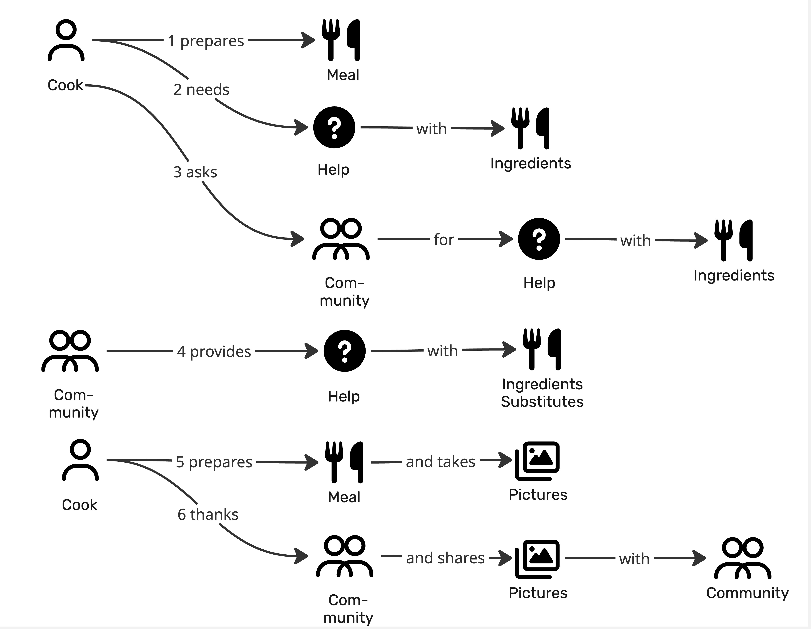
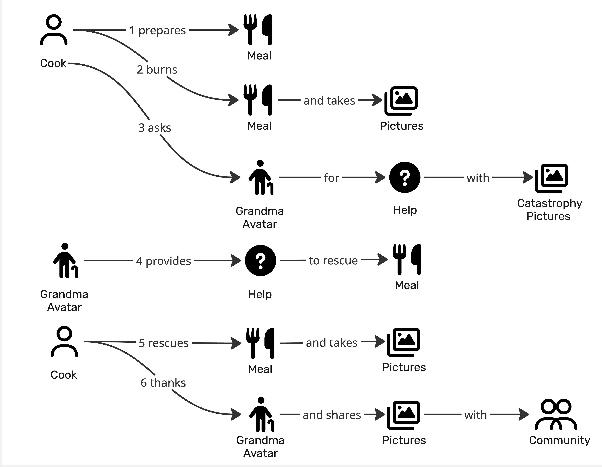

# Prompt 2026-08-15

Create a couple of events as start points of an EventStorming session based on the provided Domain Stories.

# Answer

Both uploads are domain stories, so I read them as the seed input rather than as diagrams to critique. Here's my transcription first, since everything below is traceable to it:

**A — AskCommunity:** 1 Cook prepares Meal · 2 Cook needs Help with Ingredients · 3 Cook asks Community for Help with Ingredients · 4 Community provides Help with Ingredients Substitutes · 5 Cook prepares Meal and takes Pictures · 6 Cook thanks Community and shares Pictures with Community

**B — AskGrandma:** 1 Cook prepares Meal · 2 Cook burns Meal and takes Pictures · 3 Cook asks Grandma Avatar for Help with Catastrophy Pictures · 4 Grandma Avatar provides Help to rescue Meal · 5 Cook rescues Meal and takes Pictures · 6 Cook thanks Grandma Avatar and shares Pictures with Community

# Seed domain events — cooking with help

## Sources
**A** — a cook runs short of an ingredient and the community supplies substitutes.
**B** — a cook burns the meal, photographs the damage, and an avatar talks them through a rescue.
**How they relate:** variants of one process. Identical shape — prepare, hit trouble, ask, get help, finish, thank and share — differing only in *what went wrong* and *who helped*. I built one spine and pushed B's diverging steps into Alternatives. Altitude: **coarse**, ~9 spine events.

## Events
1. Meal preparation started  (A1, B1)
2. Missing ingredient discovered  (A2)
3. Help requested  (A3, B3)
4. Help request picked up by a helper  (—)
5. Help provided  (A4, B4) — A's flavour is *Substitute ingredient suggested*, B's is *Rescue step advised*
6. Meal completed  (A5)
7. Pictures of meal taken  (A5, B5)
8. Helper thanked  (A6, B6)
9. Pictures shared with community  (A6, B6)

## Alternatives & failures
- Meal burned  *(2 — B's trouble, same slot, not a lesser path)*  (B2)
- Catastrophe pictures attached to help request  *(3 — B3)*
- Meal rescued  *(6 — B's outcome)*  (B5)
- Help request left unanswered  *(3–4 — time passing)*  (—)
- Advice arrived after the meal was past saving  *(5 — time passing)*  (—)
- Conflicting advice received  *(5 — several answers, human judgement)*  (—)
- Advice rejected by the cook  *(5 — rejection)*  (—)
- Suggested substitute not at hand either  *(5 — rejection)*  (—)
- Help request withdrawn  *(3–5 — reversal)*  (—)
- Meal abandoned  *(6 — rejection)*  (—)
- Second help request raised for the same meal  *(after 5 — threshold)*  (—)
- Avatar failed to answer  *(4 — the outside world)*  (—)
- Advice marked as helpful  *(after 8 — human judgement)*  (—)
- Pictures unshared  *(9 — reversal)*  (—)

## Made up
Event 4 in full — neither story draws how a request reaches a helper, but somebody has to see it. Every item tagged (—) above: both stories are single happy paths, so nothing failing, timing out, or being undone could have been drawn in them. Also mine: generalising A2 and B2 into one "trouble" slot, and naming 5 as `Help provided` rather than keeping the two concrete verbs.

## Questions for the room
- Are **Community** and **Grandma Avatar** the same slot — two channels for one ask — or two different processes? The stories are otherwise identical, which is suspicious in a productive way.
- Is `Missing ingredient discovered` (A2) a fact the business ever learns, or only something in the cook's head? If it never leaves the kitchen, sticky 2 doesn't exist.
- Pictures do two different jobs: evidence of a catastrophe (B3) and celebration of the result (A5, B5). One work object or two?
- In B the cook thanks the **avatar** but shares with the **community** — different parties. Does thanking mean anything to the business (reputation, points, feedback loop), or is it politeness that leaves no trace?
- Does `Help provided` end the request, or does the cook accept/close it? Is one answer enough when several arrive?
- Does a Meal exist in the system before the pictures, or do pictures bring it into being?

Deliberately absent: no commands, aggregates, actors, or boundaries — those are the room's work once people argue with these stickies. If you want the modules, entities, and state machines from the same two stories, that's the full prototype brief and a separate deliverable.