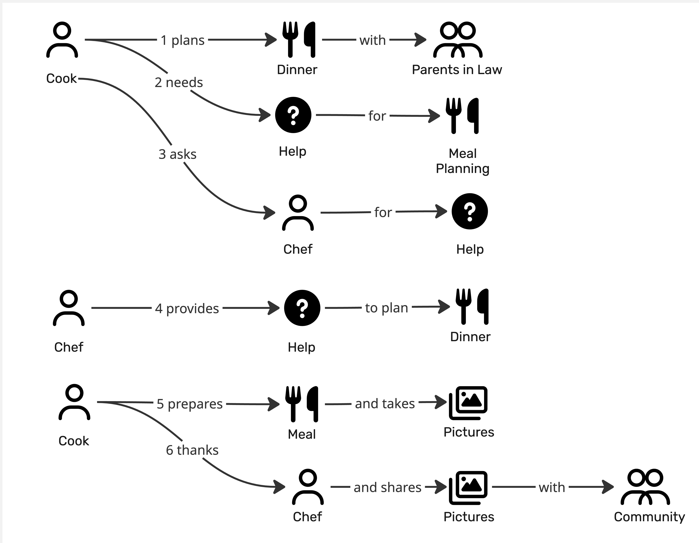

# Prompt 2026-08-09

Make Domain Event proposals for the provided Domain Stories. Use the provided skill.

# Answer

# Seed domain events — four cooking-help stories

Orange stickies only. No commands, no aggregates, no actors, no contexts — those
are the room's work. Everything below is a proposal to be argued with.

All four seeds are at **fine** altitude: each story is already step-by-step, so
each story sentence becomes roughly one fact, and the sweep for rejections,
timeouts, reversals, outside answers, human judgement and thresholds supplies the
rest.

---

## 1. Ask the Chef — planning a dinner

### What I understood

A cook planning a dinner for the parents in law, getting stuck on the menu, and
buying in a chef's planning help. Trigger: a dinner is planned for guests.
Outcome: the finished meal's pictures are shared with the community.

### Events

1. Dinner planned for guests
2. Meal planning stalled
3. Planning help requested from chef
4. Chef took on the request
5. Menu proposed by chef
6. Menu settled
7. Meal prepared
8. Meal photographed
9. Chef thanked
10. Pictures shared with community

### Alternatives & failures

- No chef available to take the request *(3 — rejection)*
- Chef declined the request *(4 — human judgement)*
- Planning request expired unanswered *(3–5 — time passing)*
- Planning request withdrawn by cook *(3–5 — reversal)*
- Proposed menu rejected by cook *(5–6 — human judgement)*
- Revised menu proposed *(after rejection)*
- Guests' dietary restriction disclosed late *(6–7 — the outside world)*
- Dinner date moved *(after 1 — reversal)*
- Dinner called off *(after 1 — reversal)*
- Meal failed despite the plan *(7 — rejection)*
- Chef's promised response time exceeded *(3–5 — threshold)*
- Pictures kept private *(10 — human judgement)*
- Shared pictures withdrawn *(after 10 — reversal)*
- Chef rated by cook *(after 9 — human judgement)*

### Made up

Events 2, 4, 6 and 8 in full — the story says "needs Help" and "provides Help",
not that stalling, acceptance, a settled menu and a separate photo moment are
distinct facts. *Chef's promised response time exceeded* assumes a response-time
promise exists, which the story never mentions. Anything about money is absent
here on purpose: the story shows no payment, which I doubt.

### Questions

- Is *needing* help a fact the business records, or does only the request count?
- Does a chef accept a request, or is it broadcast and first-answer-wins?
- Is the chef paid? If so, where does the money fact sit — at request, at answer,
  or at thanks?
- Is "thanks" a courtesy, or is it the fact that closes the request?
- Is the dinner with the parents in law a distinct thing from the meal, or the
  same fact seen twice? The story names both `Dinner` and `Meal`.

---

## 2. Ask the Community — a missing ingredient

### What I understood

A cook already mid-preparation discovers an ingredient problem and crowd-sources a
substitute. Trigger: preparation is under way. Outcome: the meal is made with a
substitute and photographed for the community.

### Events

1. Meal preparation started
2. Missing ingredient discovered
3. Substitution help requested from community
4. Substitute suggested by community member
5. Substitute chosen by cook
6. Meal prepared with substitute
7. Meal photographed
8. Community thanked
9. Pictures shared with community

### Alternatives & failures

- Request went unanswered *(3 — time passing)*
- Suggestion arrived after the meal was finished *(4 — time passing)*
- Conflicting substitutes suggested *(4 — bulk)*
- Suggestion count crossed the point of no more value *(4 — threshold)*
- Suggested substitute also unavailable *(5 — rejection)*
- Suggested substitute rejected by cook *(5 — human judgement)*
- Substitute flagged as an allergen risk *(4–5 — rejection)*
- Suggestion reported as unsafe *(4 — human judgement)*
- Suggestion withdrawn by its author *(after 4 — reversal)*
- Request closed as already asked *(3 — rejection)*
- Meal abandoned and food ordered in *(6 — reversal)*
- Meal failed with the substitute *(6 — rejection)*
- Best suggestion marked by cook *(5 — human judgement)*
- Suggester's reputation crossed a level *(after 8 — threshold)*
- Shared pictures removed by moderation *(after 9 — human judgement)*

### Made up

Events 2 and 5 — the story says "needs Help with Ingredients" and I read that as
a discovery of something missing plus a separate choosing moment; both are bets.
Everything about reputation, moderation, marking a best answer and closing
duplicates is invented wholesale — the story has none of it, but a community that
answers questions grows those facts fast.

### Questions

- Does the cook wait for the community, or cook on and use whatever arrives?
- What is the fact when three people answer differently — is choosing recorded?
- Who owns a suggestion once it's given: can it be edited, withdrawn, corrected?
- Is the community that answers the same community the pictures go to? The story
  draws them as the same pictogram; the room should say whether that's true.
- Was the ingredient missing, unavailable, or unusable? Three different facts.

---

## 3. Ask Grandma — rescuing a burnt meal

### What I understood

A cooking catastrophe: the meal burns, the cook photographs the damage and sends
it to the Grandma Avatar, which advises a rescue. Trigger: the meal burns.
Outcome: the meal is rescued and the pictures are shared.

### Events

1. Meal preparation started
2. Meal burnt
3. Catastrophe photographed
4. Rescue help requested from Grandma Avatar
5. Catastrophe pictures assessed
6. Rescue advice given
7. Rescue attempted
8. Meal rescued
9. Rescued meal photographed
10. Grandma Avatar thanked
11. Pictures shared with community

### Alternatives & failures

- Pictures too poor to assess *(5 — rejection)*
- Nothing recognisable as food in the pictures *(5 — rejection)*
- Meal declared beyond rescue *(6 — human judgement)*
- Kitchen safety warning issued *(5–6 — threshold)*
- Rescue attempt failed *(7 — rejection)*
- Second rescue attempted *(after a failed attempt)*
- Advice ignored by cook *(6–7 — human judgement)*
- Advice arrived after the meal was binned *(6 — time passing)*
- Meal binned *(after 2 — reversal)*
- Grandma Avatar unreachable *(4 — the outside world)*
- Meal burnt again *(after 8 — reversal)*
- Rescue rated unsuccessful by cook *(after 8 — human judgement)*
- Catastrophe pictures kept private *(11 — human judgement)*
- Same dish burnt repeatedly by the same cook *(threshold)*

### Made up

Events 5, 7 and 8 as separate facts — the story has one "provides Help to rescue"
arrow, and I split assessment from advice, and attempt from success. *Kitchen
safety warning issued* is entirely mine; a burning kitchen seems like something
the business would want a fact for. *Same dish burnt repeatedly* assumes anyone
is counting.

### Questions

- Is "burnt" one fact, or does the business distinguish scorched / ruined /
  dangerous?
- Does the avatar assess the pictures, or does the cook describe the damage?
- What is the fact when a rescue half-works — is a partly-rescued meal a thing?
- Are the burnt pictures shared too, or only the rescued ones? The story shares
  `Pictures` without saying which.
- Is there a point where the honest answer is "order a pizza", and is that a fact
  worth keeping?

---

## 4. Ask Grandma II — stuck on a preparation step

### What I understood

Ordinary cooking, not a catastrophe: the cook reaches a step they can't do and
asks the Grandma Avatar to talk them through it. Trigger: a preparation step is
reached. Outcome: the step is done, the meal is finished and photographed.

### Events

1. Meal preparation started
2. Preparation step reached
3. Cook got stuck on the step
4. Step help requested from Grandma Avatar
5. Step guidance given
6. Preparation step completed
7. Meal prepared
8. Meal photographed
9. Grandma Avatar thanked
10. Pictures shared with community

### Alternatives & failures

- Step not recognised by the avatar *(5 — rejection)*
- Clarification asked by cook *(5 — human judgement)*
- Further guidance given *(after clarification)*
- Guidance contradicted the recipe *(5 — rejection)*
- Guidance judged unhelpful *(5–6 — human judgement)*
- Step attempted and failed *(6 — rejection)*
- Step redone *(after a failed attempt)*
- Step skipped *(6 — human judgement)*
- Step timer elapsed *(6 — time passing)*
- Food left unattended past the safe point *(6 — time passing)*
- Preparation abandoned mid-step *(6 — reversal)*
- Help requested for the same step again *(threshold)*
- The same step tripped up many cooks *(threshold — a fact about the recipe, not the cook)*
- Guidance arrived too late to be usable *(5 — time passing)*

### Made up

Events 2, 3 and 6 — the story has "needs Help for Meal Preparation Step" and I
split reaching a step, being stuck on it, and completing it into three facts.
Timers, safe points and the recipe-level threshold events are all invented; none
of them appear in any of the four stories, but a step-by-step guide that never
notices time seems unlikely.

### Questions

- Is a `Meal Preparation Step` part of a recipe the system knows, or just
  something the cook describes in words?
- Is being stuck distinct from asking? Story 4 draws both; stories 2 and 3 draw
  only one.
- What closes a help request — the guidance, the completed step, or the thanks?
- Does the meal have to be finished for the help to have counted?

---

## Questions that span all four stories

These are the ones I'd most want the room to settle, because the answers change
half the stickies above.

- **Is the helper part of the fact?** I wrote `Planning help requested from chef`,
  `… from community`, `… from Grandma Avatar`. The alternative is one fact,
  `Help requested`, with the helper as a detail. Four stories that differ mainly
  in who answers is exactly the argument worth having out loud.
- **Is the kind of help part of the fact?** Menu planning, ingredient
  substitution, catastrophe rescue and step guidance may be four facts or one.
- **What does a help request look like when it is over?** Answered, used, thanked,
  abandoned and expired are five different endings and I invented most of them.
- **Are `Dinner` and `Meal` the same fact under two names?** Story 1 uses both.
- **Do pictures always get shared?** All four stories end that way, which is
  suspiciously tidy — a happy path repeated four times is usually a happy path,
  not a rule.
- **Where does the money go?** No story shows a payment, a subscription or a fee,
  and one of the helpers is a professional chef.

---

## What this is not

This seeds the orange stickies only. Commands, aggregates, policies, read models
and bounded contexts belong to the session, after people who know the domain have
argued with the list above. When the wall has been corrected, a photo of it can be
turned into a buildable brief; and if you'd rather publish these events as a
contract, that's an AsyncAPI job.