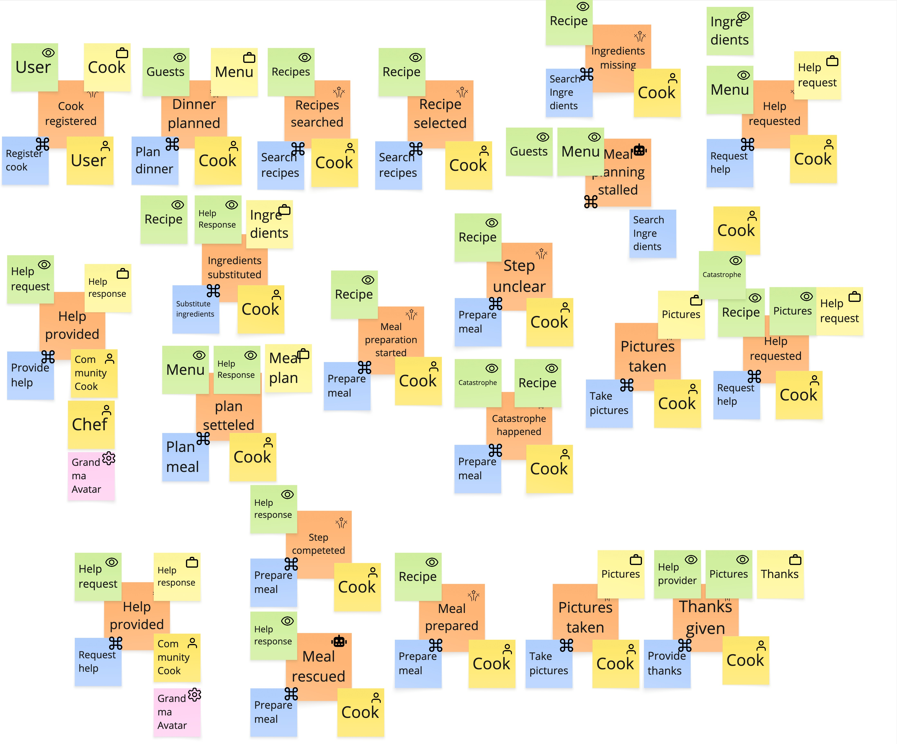

# Prompt 2026-08-23

/pivotal-event-boundara-finder
Find Bounded Contexts on the provided EventStorming result. Use the provided skill.

# Answer

# Pivotal Event Cut — Community Cooking board (independent re-run)

> **Revision 2.** The first version of this cut under-reported **Cook
> Assistance**: it appeared only as two half-bullets in §7 — *Community Help*
> for the human responders and *AI Assistance* for the Grandma Avatar — in my
> vocabulary rather than the board's, with no context entry, no owned
> aggregates and no border contract, while its events were distributed into the
> two segments at screening as "branch outcomes". It is now written up as a
> first-class context in §5b, with border contracts in §6. §7, §8 and the
> reconciliation are revised accordingly. What the revision changes and why the
> method let it through is set out in §9.

**Mode: propose.** No divider lines, no phase labels, no context bubbles are
drawn on the board, so this proposes a cut rather than reviewing one. No scope
exclusion was claimed. **No red hotspot stickies anywhere** — on a board whose
own events include *stalled*, *unclear* and *catastrophe*, an empty hotspot
column reads as "disagreement was never captured", not as "nobody disagreed".

This was worked from the image alone. The comparison with the earlier cut in
this project is at the end, and was made only after the analysis was finished.

---

## 1. Event line as read

21 domain events, left-to-right and top-to-bottom in three rows.
Colour convention as read: orange = domain event · blue = command ·
bright yellow = actor · green = read model consumed · pale yellow = business
object produced · pink = external system.

| # | Event | Command | Actor(s) | Reads (green) | Produces (pale) | Marks |
|---|-------|---------|----------|---------------|-----------------|-------|
| 1 | Cook registered | Register cook | User | User | Cook | board edge |
| 2 | Dinner planned | Plan dinner | Cook | Guests | Menu | |
| 3 | Recipes searched | Search recipes | Cook | Recipes | — | **loop** with 4 |
| 4 | Recipe selected | Search recipes | Cook | Recipe | — | **loop** with 3 |
| 5 | Ingredients missing | Search Ingredients | Cook | Recipe, Ingredients | — | **branch** |
| 6 | Meal planning stalled | Prepare meal | Cook | Guests, Menu | — | **branch**, no-progress event |
| 7 | Help requested | Request help | Cook | Menu | Help request | **recurs at 15** |
| 8 | Help provided | Provide help | Community Cook, Chef, *Grandma Avatar* (pink) | Help request | Help response | **recurs at 16** |
| 9 | Ingredients substituted | Substitute ingredients | Cook | Recipe, Help Response | Ingredients | branch resolution of 5 |
| 10 | Meal plan settled | Plan meal | Cook | Menu, Help Response | **Meal plan** | |
| 11 | Meal preparation started | Prepare meal | Cook | Recipe | — | |
| 12 | Step unclear | Prepare meal | Cook | Recipe | — | **loop** — per step |
| 13 | Catastrophe happened | Prepare meal | Cook | Catastrophe, Recipe | — | **branch** |
| 14 | Pictures taken | Take pictures | Cook | Catastrophe | Pictures | **recurs at 20** |
| 15 | Help requested | Request help | Cook | Recipe, Pictures | Help request | repeat of 7 |
| 16 | Help provided | Request help | Community Cook, *Grandma Avatar* (pink) | Help request | Help response | repeat of 8 |
| 17 | Step completed | Prepare meal | Cook | Help response | — | **loop** — per step |
| 18 | Meal rescued | Prepare meal | Cook | Help response | — | branch resolution of 13 |
| 19 | Meal prepared | Prepare meal | Cook | Recipe | **nothing** | |
| 20 | Pictures taken | Take pictures | Cook | — | Pictures | repeat of 14 |
| 21 | Thanks given | Provide thanks | Cook | Help provider, Pictures | Thanks | board edge |

**Assumptions flagged.**

- Events 5–9 are read as **one detour off the planning line**: the chosen recipe
  turns out to need something the cook does not have → help → a substitution →
  the plan settles. If the room reads 5/6 as two independent branches, nothing
  in the cut below changes; both are screened out either way.
- Events 12–18 are read as an **inner loop around `Prepare meal`**, not a
  straight sequence. The four repetitions of the same blue `Prepare meal`
  command are the evidence.
- The loose stickies at the top right — a green *Ingredients*, a blue
  *Search Ingredients*, a yellow *Cook* — are read as belonging to cluster 5.
- Event 16's command is written *Request help*, where the parallel cluster at 8
  says *Provide help*. Read as a slip on the wall; treated as *Provide help*.
- **No provenance markers on this rendering.** There are no icons, no
  second-hand annotations, no colour anomalies except the pink *Grandma Avatar*,
  which is pink in the notation's own sense: an external system. No argument
  below rests on a marker.

---

## 2. Screening

| Removed | Why |
|---------|-----|
| **1, 21** | First and last events — the edges of the board, not internal borders. The board does not start mid-process. §7 picks 1 back up as a cross-cutting context. |
| **3, 4** | Inside the search-and-select loop; a divider is crossed exactly once. |
| **5, 13** | Branch outcomes — "it went wrong" — not transitions of the whole process. |
| **6, 18** | Branch outcomes too: the stall and the rescue are the two ends of a detour, not points on the main line. |
| **7, 8, 15, 16** | The *same two clusters drawn twice*, once in planning and once in cooking — same commands, same objects, overlapping responders. A recurring capability, not a point on the line. See §7. |
| **9** | Resolution of the 5–8 detour. The fact the business names is the plan settling at 10, not the substitution that unblocked it. |
| **12, 17** | Inside the per-step loop. |
| **14, 20** | `Take pictures` twice, for two different purposes. Recurring; see the Media smell in §7. |

Survivors scored: **2, 10, 11, 19**.

---

## 3. Scoring

| # | Event | Phase | Irrev. | Handover | Language | Commit | Clock | Narrow interface | Verdict |
|---|-------|-------|--------|----------|----------|--------|-------|------------------|---------|
| 2 | Dinner planned | wanting to host → working out what to cook | no — replan freely, no compensating action | no — Cook throughout | *Menu* minted, *Guests* appears | no — an intention; nobody is owed anything | none | narrow-ish (guest count, constraints, menu), but the same person keeps working | **Milestone** — phase + 1 of 2–6 only |
| 10 | Meal plan settled | deciding what will be cooked → cooking it | going back means **re-planning** — a differently named activity, usually with new shopping | **helpers leave**: Community Cook, Chef and the Avatar are in 8, gone from 11–14; the cook is alone at the stove | *Recipes*, *Ingredients*, *substitution*, *Help response* stop; *step*, *catastrophe*, *rescue* start. **BO *Meal plan* minted** | to the guests: a date and a menu they are expecting | **hours to days** between settling and cooking | recipe ref · portions/guests · post-substitution ingredients · occasion · intended time = 5 stable fields. Cooking never reads the search history, the rejected recipes or the help thread | **Divider** — 5 of 6, no veto |
| 11 | Meal preparation started | the same transition seen from the far side | — | — | — | — | — | — | **Contested** — the mirror of 10; §8 |
| 19 | Meal prepared | cooking → being seen to have cooked | **you cannot un-cook a meal**; the compensation is ordering a takeaway | audience changes: cook-alone → guests, plus the helpers re-entering at 21 | *step*, *catastrophe*, *rescue* stop; *Pictures*, *Help provider*, *Thanks* start | the guests eat it — weak as an obligation | minutes of pressure → an unhurried evening | meal identity · recipe ref · who helped · finished-at. Sharing never needs step progress, the catastrophe or the substitutions | **Divider** — but the weakest of the two; see §7 |

**Two dividers on 21 events.** The band for a 16–30 event board is 2–4, alarm
above 6. This is at the conservative end, which is where a fast timeline cut
belongs.

---

## 4. The dividers

**After #10 — Meal plan settled.** The strongest border on the wall, and the
only candidate where five of the six tests fire with evidence you can point at.
It is also the *cheapest*: the business already tolerates hours or days between
settling a plan and standing at the stove, so eventual consistency across this
line costs nothing to introduce. Serious caveat in §7 — the artefact it mints is
currently read by nobody on the board.

**After #19 — Meal prepared.** Irreversibility in its most literal form, plus a
clean vocabulary swap and a change of audience. Weaker than #10 on two counts:
*Meal prepared* mints **no business object at all**, and only two events sit
downstream of it — below the four-event floor where a segment starts looking
like a phase. Accepted with the reservation in §7 and the alternative in §8.

**Convention.** The pivotal event is produced by the upstream context and
consumed by the downstream one; the line is drawn immediately after it. So
planning owns the schema of *Meal plan settled*, and cooking owns
*Meal prepared* — even though the cook, downstream, may call the first fact
something else internally. That translation is what the border is for.

---

## 5. Candidate contexts

A pivotal-event cut produces *segments* — stretches between dividers. Segments
are contexts, but they are not the only contexts on a board, and on this board
they are not the most important ones. §5a is what the dividers produced; §5b is
what sits beside the line and has no divider by construction.

### 5a. Segments on the line

**Meal Planning** — events 2–10.
Turns an intention to host into a plan somebody could actually cook.
Owns: *Menu*, *Guests*, *Meal plan*, *Ingredients* (the substituted list).
Reads, does not own: *Recipe*.
Actors: Cook.
Terms: guests · menu · recipe · ingredients · substitution · meal plan · stalled.

**Cooking Session** — events 11–19.
Carries the cook through the plan in real time and gets them out of trouble.
Owns: **nothing on the board.** This is the sharpest gap in the cut — see §7.
It should own a *Cooking session* with a current step, progress and incidents.
Reads: *Recipe*, *Help response*.
Actors: Cook.
Terms: step · unclear · catastrophe · rescue · prepared.

**Meal Recognition** — events 20–21.
Turns a finished meal into something shown, and someone thanked.
Owns: *Pictures*, *Thanks*. Reads: *Help provider*.
Actors: Cook.
Terms: pictures · thanks · help provider.
Thin at two events; §8 names what to do about it.

### 5b. Contexts beside the line

**Cook Assistance** — the largest context on this board, and the one the
dividers cannot see.

*Responsibility:* when a cook is stuck, get them unstuck — take the request,
route it to somebody who can answer (human or avatar), carry the answer back,
and close the reciprocity loop.

*Events it owns:* 7 and 15 (*Help requested*), 8 and 16 (*Help provided*),
21 (*Thanks given*).
*Events it listens to, owned by others:* 5 (*Ingredients missing*),
6 (*Meal planning stalled*), 12 (*Step unclear*), 13 (*Catastrophe happened*).
*Events in other contexts that consume its output:* 9 (*Ingredients
substituted*), 17 (*Step completed*), 18 (*Meal rescued*) — all three read
*Help response* but run under Planning's and Cooking's own commands.
**Thirteen of the board's twenty-one events touch this context.**

*Owns:* **Help request**, **Help response**, **Help provider**, **Thanks**.
*Reads:* Menu · Recipe · Pictures · Catastrophe — whatever situational detail a
stranger needs to answer.
*Commands:* Request help · Provide help · Provide thanks.
*Actors:* Cook (as requester) · Community Cook · Chef.
*External system:* **Grandma Avatar** (pink), appearing in **both** help
clusters alongside the human responders.
*Terms:* help request · help response · help provider · responder · thanks.

*Policies — implied, and **not drawn anywhere on the board**:* whatever turns
*Ingredients missing*, *Meal planning stalled*, *Step unclear* and *Catastrophe
happened* into an offer of help. The board shows the trouble and it shows the
request, with nothing between them. Those four missing lilac stickies are where
this product's behaviour actually lives.

*Why it has no divider:* it recurs. The team drew the identical
request → respond cluster **twice**, once in planning (7/8) and once in cooking
(15/16), with the same commands, the same *Help request* / *Help response*
objects and overlapping responders. A divider must be crossed exactly once, so
this context is invisible to the scoring in §3 by construction — and reading the
two clusters as two points on a line, rather than as one context drawn twice,
is precisely how it gets lost.

*Why it is probably the core domain:* everything else here is available
off the shelf. Recipe search is a catalogue, registration is identity, pictures
are media, and a meal plan is a list. The thing that is hard, that nobody can
buy, and that the whole board bends around is **a stranger answering a panicking
cook fast enough to save dinner** — with an avatar standing in when no stranger
does. Every branch on the board exists to reach it, and the only reciprocity
mechanism on the board (*Thanks given*) exists to sustain it. Worth running
through `core-domain-chart-author` before any build decision.

**Cook Membership** — event 1, *off the line.*
Establishes who a cook is and keeps them being that.
Owns: *Cook*. Actors: User. Terms: user · cook · registration.
The board's upstream edge, not a segment: it never hands the process on, it
serves every context continuously. **Open host service** — everyone consumes
*Cook*, nobody negotiates with registration.

**Recipe Catalogue** and **Media** are also contexts beside the line; both are
off-board or unresolved, and are argued in §7 rather than specified here.

**Divider strip — the redraw spec:**

| # | Event | Segment | Divider after? |
|---|-------|---------|----------------|
| 1 | Cook registered | *(Cook Membership — cross-cutting)* | board edge |
| 2–9 | … | Meal Planning | |
| 10 | Meal plan settled | Meal Planning | **yes** |
| 11–18 | … | Cooking Session | |
| 19 | Meal prepared | Cooking Session | **yes** |
| 20–21 | … | Meal Recognition | |

The strip describes the *line only*. **Cook Assistance runs underneath rows 5
through 21** and Cook Membership stands before all of them; neither can be drawn
as a column. On the wall, draw them as horizontal bands under the timeline
rather than as segments in it — otherwise the redraw will lose exactly what this
revision recovered.

---

## 6. Border contracts

### Meal Planning → Cooking Session, on *Meal plan settled*

- **Crosses:** recipe reference(s) · portions and guest count · the ingredient
  list *after* substitution · the occasion · the intended time.
- **Stays upstream:** rejected recipes, the whole search history, guest
  preferences and the reasoning behind the menu, the entire help thread that
  produced the substitution, the fact that planning stalled at all.
- **Relationship:** **customer/supplier.** Cooking negotiates back what a plan
  must contain to be cookable — portions, timings, an ingredient list that
  matches what is in the kitchen — and planning owns the schema.
- **Consistency:** hours. The gap between settling a plan and cooking it is the
  domain's own slack; nothing downstream needs the plan the instant it exists.

### Cooking Session → Meal Recognition, on *Meal prepared*

- **Crosses:** meal identity · recipe reference · who helped (help-provider
  references) · finished-at.
- **Stays upstream:** step-by-step progress, every *Step unclear*, the
  catastrophe, the rescue, and the pictures taken *during* trouble.
- **Relationship:** **customer/supplier** — but see §7: if recognition and
  community help are the same context, this is an internal boundary and the
  divider should be reconsidered rather than defended.
- **Consistency:** minutes to hours. Nobody is upset if thanks lag the meal.

### Meal Planning / Cooking Session → Cook Assistance, on the trouble events

The same contract on both sides — which is itself the argument that this is one
context and not two.

- **Crosses inward:** who is stuck · what they are trying to do (menu reference
  in planning, recipe + current step in cooking) · what went wrong, in the
  cook's own words · any evidence attached (the *Pictures* taken at 14) ·
  how urgent.
- **Crosses back out:** *Help response* · who answered (*Help provider*) ·
  whether a human or the avatar answered.
- **Stays inside the requesting context:** the search history, the rejected
  recipes, the guest list, the full step sequence, everything else about the
  meal.
- **Relationship:** **customer/supplier**, assistance as supplier to both
  segments. Not a shared kernel — resist the temptation to let responders read
  the meal plan directly.
- **Consistency:** the one place on this board where lag is the *product*.
  Planning help can wait; cooking help cannot — a step-unclear request that
  takes twenty minutes to answer has failed even if it is answered perfectly.
  **This is the sharpest open question in §8.**

**The interface-width warning.** This is the one border here where the interface
is not obviously narrow: a stranger cannot answer without enough of the cook's
situation to understand it. Either the help request carries a **snapshot** taken
at request time — narrow, stale, and the modelling this board's *Help request*
business object already implies — or responders **reach back** into planning and
cooking for live detail, which is a wide interface and would pull all three
contexts back together. **Decide this deliberately.** It is the single design
decision most likely to determine whether these boundaries survive contact with
an implementation.

---

## 7. What the timeline cannot see

### Missing-consumer test, per divider — the most important result here

- ***Meal plan settled*** mints **Meal plan**. **Nothing on the board reads it.**
  Every downstream event reads *Recipe*; `Prepare meal` goes straight to the
  recipe, never to the plan. This is the orphaned-artefact anti-signal, and it
  means one of three things:
  **(a)** the read model is simply undrawn and cooking really does start from the
  plan — most likely, and cheap to fix on the wall; **(b)** a
  **Shopping / Mise-en-place context is missing** between the two, which is
  exactly where a settled meal plan gets consumed in real life; or **(c)** the
  meal plan is a report, in which case the divider is in the wrong place.
  **Do not build on this divider until the team says which.**
- ***Meal prepared*** mints **nothing at all** — no business object. *Pictures*
  arrives one command later, produced by a different command. That is precisely
  why this divider is the weaker of the two.

### Stretches with no aggregate

Events **11–19 — the entire Cooking Session — carry not one pale-yellow business
object.** Only green *Recipe* and *Help response* read models, and four
repetitions of the same `Prepare meal` command. Yet *Step unclear*,
*Step completed*, *Catastrophe happened* and *Meal rescued* all presuppose
something with state: which step am I on, what has gone wrong, what is still
outstanding.

Read as **undiscovered, not absent** — and corroborated, because that same
stretch produces *Pictures* (14) and *Help request* (15), which other contexts
demonstrably consume. Something in there is real and unnamed.
**Naming it is the single highest-value change to this board.**

### Cross-cutting contexts

No pivotal event of their own; visible in the actors, systems and read models.

- **Cook Assistance** — specified in full in **§5b**, because it is too large to
  sit in this list. Named here for completeness: the team has already discovered
  it and drawn it twice, and both the human responders and the Grandma Avatar
  belong to the same context, not to two.
- **Recipe Catalogue.** *Recipe* / *Recipes* appears in **seven clusters
  spanning every segment**, and **no event on the board ever creates, edits or
  retires a recipe.** Recipes arrive from off-board. Supplier relationship;
  conformist, unless the team decides it wants its own recipe model — at which
  point divider 1 gets expensive.
- **Cook Membership.** Event 1. *User* goes in, *Cook* comes out, and the word
  *User* never appears again on the whole board — the one unambiguous
  re-modelling of a noun anywhere here. It is the board's upstream edge, and an
  **open host service** to every segment: everyone consumes *Cook*, nobody
  negotiates with registration.
- **Media.** `Take pictures` appears twice for two unrelated reasons —
  **evidence** attached to a help request (14) and a **trophy shot** (20). One
  word, two meanings. A language smell worth resolving before either is built.
- **Notification.** Not on the board at all, but *Help requested* only works if
  somebody is told. Implied, unmodelled — and it is the mechanism the whole
  community proposition rests on.
- **The Grandma Avatar is not a context of its own.** The pink sticky appears in
  **both** help clusters, alongside the human responders, answering the same
  *Help request* and producing the same *Help response*. Pink is the notation's
  external-system colour, so the board is already saying it is a system rather
  than a person — but it is a **responder inside Cook Assistance**, not a
  parallel *AI Assistance* context. Splitting the avatar out from the humans it
  substitutes for was the first version's error and would have produced two
  services sharing one aggregate. What remains open is only whether it is an
  actor the context owns or an external system it wraps behind an
  anticorruption layer — question 4 in §8.

### Recurring contexts

**Cook Assistance appears on both sides of divider 1 and again after divider
2.** That is the definition of a recurring context: the dividers are still real
phase borders, but assistance is a supplier to all three segments rather than a
fourth segment. Drawing it as two clusters on the line is the board's own way of
saying so — and reading those clusters as two points rather than one band is how
it disappears.

### Straddling aggregates — checked last, as the method requires

- ***Recipe*** — read at 4, 5, 9 (planning) and 11, 12, 13, 19 (cooking).
  **Crosses divider 1.** Resolved by placing it **outside both**, in Recipe
  Catalogue; each segment holds a reference plus whatever it copied at the
  border.
- ***Pictures*** — created at 14 (cooking, as evidence) and at 20 (recognition,
  as a result). **Crosses divider 2.** **Split it:** an attachment on the help
  request upstream, a distinct shared-meal picture downstream. One name for both
  will pull the two contexts back together.
- ***Help request* / *Help response*** — created and consumed on both sides of
  divider 1. **Owned by Cook Assistance**; neither segment should hold their
  lifecycle. This is the straddle that mattered most and the one the first
  version handled weakest: an aggregate whose lifecycle crosses a divider *and*
  whose owner had not been named as a context is the standing invitation to
  implement it twice.
- ***Menu*** — created at 2, read at 6, 7, 10, never mentioned again. Clean;
  stays in Meal Planning.
- ***Meal plan*** — created at 10, read nowhere. Not a straddle; an orphan.
  See the missing-consumer test above.

---

## 8. Contested calls & alternatives

**#10 *Meal plan settled* vs #11 *Meal preparation started*.** The same
transition seen from two sides; only one is the border. Chose **10**, by the
ownership convention: the pivotal event is produced upstream and consumed
downstream, and *Meal plan settled* is planning's own vocabulary while
*Meal preparation started* is cooking's. **If** the team finds that a cook
routinely skips planning and starts cooking from a bare recipe, 11 becomes the
better border — and the existence of a second entry path into cooking is a more
interesting finding than the divider itself.

**#2 *Dinner planned* — rejected as a milestone.** Phase and language both fire
(*Menu* minted, *Guests* appears) but nothing else does: the same cook keeps
working, a plan can be torn up freely, nobody is owed anything, and there is no
wait. It opens the planning phase; it does not border it.

**#4 *Recipe selected* — rejected twice over.** It sits inside the
search-and-select loop, and the narrow-interface test would veto it anyway:
everything downstream — ingredients, substitutions, steps, the finished meal —
reads the whole *Recipe*. That is depth inside a context, not a border.

**#1 *Cook registered* — rejected as a divider, kept as a context.** The
language evidence is the strongest on the board (*User* → *Cook*, and *User*
never returns), which is a real argument for a line here. It loses on two
counts: it is the first event, and registration never *hands the process on* —
it stands beside every segment rather than before one. Filed as a cross-cutting
context in §7 instead. **This is a judgement call, and it is where the earlier
cut in this project went the other way** — see the reconciliation below.

**#18 *Meal rescued* — rejected.** A branch outcome inside the cooking loop, and
its resolution is 19, which is already a divider.

**Coarser cut — drop divider 2.** Merge Meal Recognition back into the Cooking
Session. Cheap: the segment is two events and *Meal prepared* mints nothing.
What is lost is the distinction between *cooking* and *being seen to have
cooked* — which is exactly where the reciprocity loop lives, since thanks flow
back to the people who helped. **If assistance is the point of this product,
that is the wrong economy.** The honest alternative is not to merge recognition
into cooking but to dissolve it: **move *Thanks given* into Cook Assistance**,
which already owns *Help provider*, and **move *Pictures taken* into Media**.
Meal Recognition then stops existing, leaving a **single-divider cut** —
Planning | Cooking — with **Cook Assistance**, Membership, Recipe Catalogue and
Media as bands beneath them.

**That challenger is now the stronger picture, and it is a direct consequence of
naming Cook Assistance.** Meal Recognition was only ever two events, and with
assistance named, both of them have better owners. Take it into the next session
as the proposal, not the alternative.

**Finer cut — split Meal Planning at #4.** Recipe Discovery (2–4) and Meal
Composition (5–10). Rejected: same cook, same vocabulary, and composition reads
the recipe constantly. Revisit the moment discovery grows its own ranking,
personalisation or recommendation model — that is when it stops being a search
box and starts being a context.

### What would settle it

1. **Who reads a settled meal plan, and what happens between settling it and
   standing at the stove?** Shopping? A calendar entry? Prep the night before?
   *(Decides whether divider 1 is sound and whether a Shopping context is
   missing — the single most consequential open question here.)*
2. **What is the cook holding while cooking?** A session? A checklist? Nothing?
   *(Names the missing aggregate in 11–19.)*
3. **Can a cook prepare a meal without planning one — just pick a recipe and
   start?** *(If yes, cooking has a second entry path and #11 beats #10.)*
4. **Is help during cooking the same thing as help during planning?** Same
   request type, same responders — but *not* the same urgency: a stalled plan
   can wait overnight, an unclear step cannot wait five minutes. **If the
   response-time requirement differs by an order of magnitude, that is the one
   argument for splitting Cook Assistance in two**, and it is the question to
   put in front of the room first. *(Everything else — same objects, same
   commands, same responders — says one context.)*
5. **What actually happens between the trouble and the request?** Does the cook
   press a button, or does something notice they are stuck and offer? *(The four
   missing policies in §5b. If the system offers, Cook Assistance is a listener
   with real behaviour; if the cook always asks, it is a request board.)*
6. **Can thanks be given to the Grandma Avatar, or only to human helpers?**
   *(Settles whether the avatar is an actor Cook Assistance owns or an external
   system it wraps behind an anticorruption layer.)*
7. **Does a help request carry a snapshot, or do responders look things up?**
   *(The interface-width decision in §6 — the one most likely to collapse these
   boundaries in implementation.)*
8. **Are the pictures taken during a catastrophe the same kind of thing as the
   pictures taken of the finished meal?** *(Decides whether Media is one concept
   or two.)*

**Hotspots verbatim:** none. The board carries no red stickies. On a domain
whose own events include *stalled*, *unclear* and *catastrophe*, that is worth a
minute at the start of the next session.

---

## Reconciliation with the earlier cut in this project

Run independently from the image, then compared. Same skill, same board.

**Agreed, in full:**

- The two strongest dividers: **after *Meal plan settled*** and **after *Meal
  prepared***, with the same evidence — helpers leaving, the vocabulary swap,
  the hours-to-days gap, and the literal irreversibility of a cooked meal.
- The segment names: **Meal Planning · Cooking Session · Meal Recognition**.
- The *Meal plan* **orphaned-artefact** finding, and the three explanations for
  it — undrawn read model, missing Shopping context, or a misplaced divider.
- The **Cooking Session owns no aggregate** finding, read as undiscovered rather
  than absent, and named as the highest-value change to the board.
- Every cross-cutting context, and — worth noting — **both runs made the same
  mistake about the biggest one.** The earlier cut also split assistance into a
  *Community Help* bullet and a conditional *AI Assistance* bullet, also left it
  in §7, and also never gave it a context entry or a border contract. Two
  independent runs converging on the same omission is not reassurance; it is a
  systematic weakness of a timeline-first cut, discussed in §9.
- Every straddling aggregate and its resolution.
- The contested #10 vs #11 call, decided the same way for the same reason.
- The coarser-cut recommendation: dissolve Meal Recognition by rehoming its two
  events, rather than merging it into cooking. Both runs reached for the help
  context to house *Thanks given* — which, in hindsight, was each run telling
  itself that assistance was more central than it had written down.

**Disagreed, once:**

**Is *Cook registered* a divider?** The earlier cut drew a line after it, on the
strength of the *User* → *Cook* re-modelling, then immediately noted in its own
§7 that the resulting segment "is really a cross-cutting context… it serves every
other segment continuously and never hands the process on." This run applies the
screening rule instead — first event, therefore scope edge — and files Cook
Membership straight into §7. **Both runs reach the same architecture**; they
disagree only about whether Membership gets drawn on the line or beside it. That
is worth knowing about the method: the disagreement is bookkeeping, not
substance, and the earlier cut had already argued itself into this run's
position.

**Different on the board itself:** the earlier reading noted ✨ and 🤖 icons on
several stickies and spent a section hedging about whether they meant "raised by
the system" or "proposed by an assistant". **This rendering carries no icons at
all.** The hedge turns out to have been the right call — no divider in either run
rests on them — and the AI Assistance question survives here on the pink
*Grandma Avatar* alone, which is stronger evidence anyway.

**Verdict on reproducibility:** two dividers reproduced exactly, with matching
evidence; one boundary-vs-cross-cutting classification differs without changing
the resulting contexts; every §7 finding reproduced — **including the
under-reporting of Cook Assistance, which both runs got wrong the same way.**
The dividers are reproducible. The blind spot is reproducible too.

---

## 9. What revision 2 changes, and why the method missed it

**What changed.** Cook Assistance moved from two half-bullets in §7 to a full
context in §5b with owned aggregates, actors, terms, four missing policies and
two border contracts in §6. The Grandma Avatar stopped being a separate *AI
Assistance* context and became a responder inside it. Meal Recognition is now
recommended for dissolution rather than offered as an alternative, since both
its events have better owners once assistance is named. **The two dividers
themselves are unchanged** — the segments they produce were right; the mistake
was treating segments as the whole answer.

**Why the method missed it, structurally.** Three mechanisms compounded, and
each is worth recognising on the next board:

1. **A divider must be crossed exactly once, so screening deletes anything that
   recurs.** Cook Assistance recurs by its nature. Its two clusters were removed
   at §2 as "the same clusters drawn twice", which is the correct screening call
   and simultaneously the moment the largest context on the board left the
   analysis.
2. **The trouble events looked like branch noise.** *Ingredients missing*,
   *Meal planning stalled*, *Step unclear* and *Catastrophe happened* were each
   screened as "branch outcomes" of whichever segment they sat in. Individually
   that reading is defensible. Together they are one context's trigger set —
   and screening events one at a time cannot see a set.
3. **§7 is a list, and lists flatten.** The skill's §7 caught assistance twice
   over and then filed it at the same weight as *Notification* — a context that
   is not even on the board. A cross-cutting context with thirteen events and
   four aggregates does not belong in the same bullet list as one that is merely
   implied.

**The generalisable check.** Before publishing a pivotal-event cut, count how
many events each §7 cross-cutting context touches. **Anything touching more
events than a segment is not a bullet — it is a context, and it needs the same
treatment the segments got.** Had that count been run here, Cook Assistance
(13 events) would have outranked Meal Planning (9), Cooking Session (9) and Meal
Recognition (2) immediately.

**The honest framing for the next session.** This board is not a planning
process and a cooking process with some help attached. It is **an assistance
product**, observed through two phases of the activity it assists. The dividers
after *Meal plan settled* and *Meal prepared* are real and worth drawing — but
they cut the setting, not the subject.

