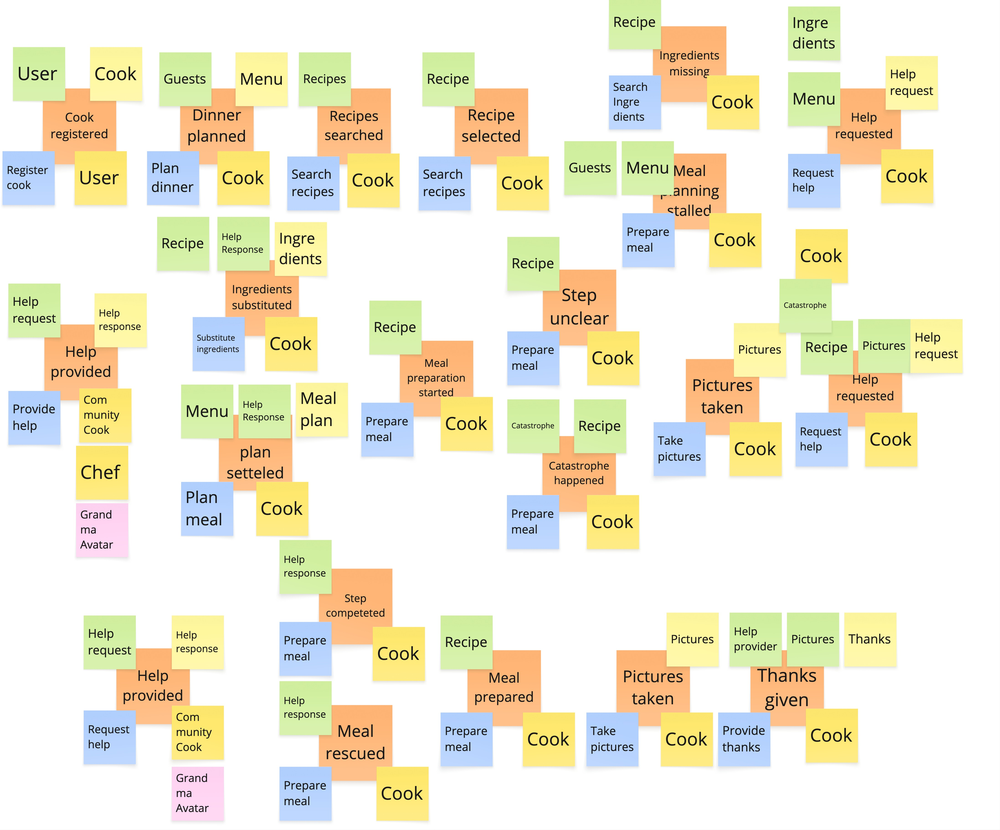

# Prompt 2026-08-23

Find Bounded Contexts on the provided EventStorming result. Use the provided skill.

[SKILL](../Skills/FindBoundedContextsSkill/SKILL.md)

[Pivotal tests](../Skills/FindBoundedContextsSkill/references/pivotal-tests.md)

[Worked example](../Skills/FindBoundedContextsSkill/references/worked-example.md)

# Answer

Using the uploaded **Pivotal Event Boundary Finder** skill, I’m treating this as **propose mode**: the board does not contain explicit bounded-context dividers, so the task is to infer pivotal events and then name the segments between them. The method requires a whole-process phase change plus additional evidence, with the **narrow-interface test able to veto an otherwise dramatic event**.

Because the board contains several exception/help strands rather than one perfectly clean horizontal timeline, some ordering below is inferred from the layout. I would use this as a candidate cut for workshop validation rather than as a final service decomposition.

## 1. Event line as I read it

The main flow appears to be approximately:

1. **Cook registered**
2. **Dinner planned**
3. **Recipes searched**
4. **Recipe selected**
5. **Ingredients missing** — exception/branch
6. **Ingredients substituted**
7. **Plan settled**
8. **Meal preparation started**
9. **Step unclear** — exception/branch
10. **Help requested / Help provided** — recurring exception flow
11. **Catastrophe happened** — exception/branch
12. **Meal rescued**
13. **Step completed**
14. **Meal prepared**
15. **Pictures taken**
16. **Thanks given**

There are repeated **Help requested / Help provided** and **Pictures taken** occurrences. Per the skill, recurring events cannot be pivotal dividers because a genuine divider must be crossed exactly once.

## 2. Screening

I would remove these as divider candidates:

| Event                    | Why not a divider                                                 |
| ------------------------ | ----------------------------------------------------------------- |
| **Cook registered**      | First event / scope edge                                          |
| **Ingredients missing**  | Exception outcome inside planning                                 |
| **Help requested**       | Repeats in several places; therefore not crossed once             |
| **Help provided**        | Repeats and supports several phases                               |
| **Step unclear**         | Exception inside meal preparation                                 |
| **Catastrophe happened** | Dramatic, but an exception rather than a whole-process transition |
| **Pictures taken**       | Appears repeatedly                                                |
| **Thanks given**         | End-of-flow activity / likely board edge                          |

This follows the skill's screening rule that loops, branches, board edges and consequence events should not become dividers simply because they are prominent.

## 3. Strongest pivotal-event candidates

| Event                        | Phase                                                 | Other evidence                                                                        | Narrow interface                                                             | Verdict                              |
| ---------------------------- | ----------------------------------------------------- | ------------------------------------------------------------------------------------- | ---------------------------------------------------------------------------- | ------------------------------------ |
| **Dinner planned**           | registration → planning a dinner                      | Guests/Menu vocabulary appears                                                        | Downstream needs dinner/guest requirements                                   | **Contested**                        |
| **Recipe selected**          | searching → committing to a particular cooking option | Recipe becomes the concrete object used downstream                                    | A recipe selection is a relatively small contract                            | **Contested / possible divider**     |
| **Plan settled**             | deciding/adapting → executing the meal                | Menu/plan gives way to preparation/recipe execution; planning exceptions are resolved | Preparation can plausibly consume a settled plan without planning history    | **Strongest divider**                |
| **Meal preparation started** | planning → cooking                                    | Clear clock/tempo change                                                              | But adjacent to *Plan settled* and belongs naturally to the preparation side | **Milestone; prefer previous event** |
| **Meal prepared**            | cooking → post-meal sharing/closure                   | Prepared meal replaces active preparation; pictures/thanks follow                     | Post-meal work needs the result, not detailed preparation history            | **Possible divider**                 |

The scoring rubric says a normal divider needs **phase + at least two additional signals + no interface veto**; a candidate with only phase plus one signal is better classified as contested.

The difficult call is therefore **Plan settled vs. Meal preparation started**. The skill says that when adjacent candidates both look strong, choose only one, preferably the event the business treats as the point of no return.  I would put the line **after `Plan settled`**, because the settled plan is naturally produced by planning and consumed by preparation.

## 4. Proposed bounded contexts

### **Cook Profile**

Responsibility: establish the cook/user who will participate in the experience.

Visible events:

* Cook registered

Owned concepts suggested by the board:

* User / Cook profile

This is a very thin segment. It may actually be a cross-cutting **Identity/Profile** context rather than the first sequential bounded context.

---

### **Meal Planning**

Responsibility: decide what dinner should be, taking guests, menu, recipes and available ingredients into account.

Visible events:

* Dinner planned
* Recipes searched
* Recipe selected
* Ingredients missing
* Ingredients substituted
* Plan settled

Likely owned concepts:

* Guests
* Menu
* Meal plan
* Recipe selection
* Ingredient substitutions

Domain language:

* dinner
* guests
* menu
* recipes
* ingredients
* substitution
* meal plan

**Primary outgoing pivotal event: `Plan settled`.**

This is the clearest coherent capability on the board.

---

### **Meal Preparation**

Responsibility: guide and track execution of the settled meal until the meal is complete.

Visible events:

* Meal preparation started
* Step unclear
* Step completed
* Catastrophe happened
* Meal rescued
* Meal prepared

Likely owned concepts:

* preparation/session state
* current recipe/step
* cooking incident or problem state

Domain language:

* prepare meal
* step
* catastrophe
* rescue
* prepared meal

This context is important even though the physical cooking itself may be manual. The skill explicitly warns that manual work can still belong in the software boundary when the application tracks the current step or provides contextual help.

---

### **Meal Sharing / Completion**

Responsibility: capture the finished result and close out the cooking experience.

Visible events:

* Pictures taken
* Thanks given

Likely owned concepts:

* Pictures
* acknowledgement / thanks

I have **lower confidence** in this as an independent bounded context. There are only a couple of events and no strong handover. It could remain part of Meal Preparation unless photo handling or sharing has a substantially independent lifecycle.

## 5. Recommended divider strip

The redraw I would start with is:

| Flow                                                                                                               | Candidate context             | Divider?                            |
| ------------------------------------------------------------------------------------------------------------------ | ----------------------------- | ----------------------------------- |
| Cook registered                                                                                                    | **Cook Profile / Identity**   | probably not a timeline divider     |
| Dinner planned → Recipes searched → Recipe selected → Ingredients missing/substituted → **Plan settled**           | **Meal Planning**             | **YES — after Plan settled**        |
| Meal preparation started → Step unclear → Step completed → Catastrophe happened → Meal rescued → **Meal prepared** | **Meal Preparation**          | **CONTENDED — after Meal prepared** |
| Pictures taken → Thanks given                                                                                      | **Meal Sharing / Completion** | —                                   |

So the strongest sequential decomposition is:

**Meal Planning**
→ `Plan settled`
**Meal Preparation**
→ possibly `Meal prepared`
**Meal Sharing / Completion**

I would **not** split at every prominent orange sticky.

## 6. Border contracts

For **Meal Planning → Meal Preparation**, triggered by `Plan settled`:

**What crosses:** selected recipe, portions/guest count, chosen substitutions, perhaps the ordered preparation instructions.

**What stays in planning:** search history, rejected recipes, why alternatives were rejected, previous menu candidates, the reasoning that produced the substitutions.

That looks like a reasonably narrow interface—the exact property the skill uses to justify a context split.

For **Meal Preparation → Meal Sharing**, triggered by `Meal prepared`:

**What crosses:** identity/reference of the completed meal, perhaps final result and associated metadata.

**What stays in preparation:** step history, temporary problems, unclear-step state, catastrophe/rescue history.

This border needs domain confirmation; the board alone does not show enough evidence that sharing has its own rules or ownership.

## 7. What the timeline cut cannot see

This is important here because the board strongly suggests at least one **cross-cutting context**, which pivotal-event analysis intentionally does not discover through sequential cuts alone. The skill explicitly requires these to be called out.

### **Help / Cooking Assistance — strong cross-cutting context**

This is the clearest additional bounded-context candidate on the board.

It appears repeatedly around different phases:

* Help requested
* Help provided
* Help response
* Community Cook
* Chef
* Grandma Avatar
* contextual help around ingredients
* contextual help around preparation steps
* contextual help around catastrophes

I would model **Help / Cooking Assistance** once, not as multiple contexts. It serves Meal Planning and Meal Preparation.

Its likely responsibility is:

> Match a cooking problem or question with an appropriate source of assistance and return a useful response.

The repeated help flows are actually evidence *against* making `Help requested` a timeline divider and evidence *for* a cross-cutting context. The worked example applies exactly this distinction: recurring/supporting capabilities are named separately rather than turned into extra timeline segments.

### **Recipe Knowledge / Catalogue — possible cross-cutting context**

`Recipes`, `Recipe`, search commands and recipe usage occur in both planning and preparation. This raises a straddling-model question:

* Does **Meal Planning** own recipes?
* Or is there an independent **Recipe Catalogue/Knowledge** context that supplies recipes to both Planning and Preparation?

The timeline alone cannot settle this. If recipes have their own creation, editing, versioning, classification, attribution or publishing lifecycle, I would strongly favour a separate **Recipe Catalogue** context.

### **Identity / Cook Profile — likely cross-cutting**

`Cook registered` is isolated from the rest of the cooking flow. Rather than manufacturing a tiny sequential context, I would probably treat **Cook Profile / Identity** as a supporting context consumed by the others.

### **Pictures / Media — uncertain**

Repeated `Pictures taken` suggests Media may also have its own lifecycle. If photos are merely attached to the current meal, keep them inside Meal Preparation/Sharing. If they are stored, curated, published or reused independently, promote this to a **Meal Media** context.

## Result

My candidate context map is therefore:

**Sequential/core flow**

**Meal Planning**
→ **Meal Preparation**
→ *(possibly)* **Meal Sharing / Completion**

**Cross-cutting/supporting**

**Cooking Assistance / Help** — **high confidence**
**Recipe Catalogue / Knowledge** — medium confidence
**Cook Profile / Identity** — medium-high confidence
**Meal Media / Pictures** — low-to-medium confidence

The **one divider I would draw confidently now is immediately after `Plan settled`**. The next most useful workshop question is whether `Meal prepared` creates a genuinely independent post-cooking capability, or whether pictures and thanks are simply the final steps of the same Meal Preparation context.

