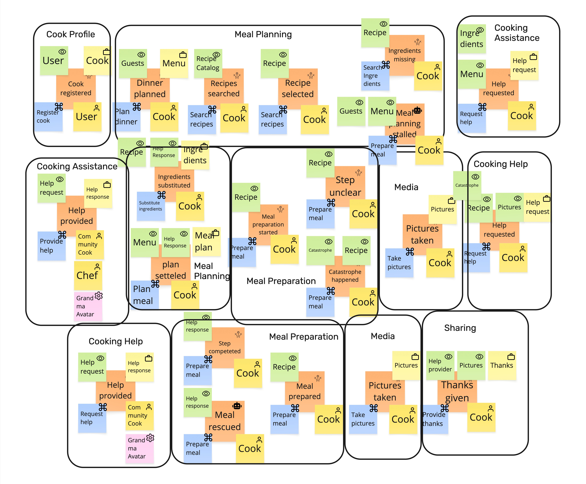

# Prompt 2023-08-23

Find the invariants based on the provided EventStorming board. Use the provided skill.



[Skill](../Skills/FindInvariantsSkill/SKILL.md)

[Invariant catalog](../Skills/FindInvariantsSkill/references/invariant-catalogue.md)

[Worked example](../Skills/FindInvariantsSkill/references/worked-example.md)

# Answer

Using the supplied **EventStorming Invariant Finder**, I treated blue stickies as commands, orange as events, yellow-with-briefcase as aggregates, yellow-with-person as actors, and green-with-eye as read models. This follows the catalogue’s role-based interpretation rather than relying only on color.

A key limitation is that I do **not** see explicit business-state stickies such as *Planned / Preparing / Finished*. Therefore I have not fabricated full state machines. The skill explicitly says processing/activity information should not be promoted into states and missing states should be reported as gaps.  In addition, several `Prepare meal` commands have no visible yellow aggregate; according to the supplied method, those are unowned commands rather than permission to guess an aggregate.

## 1. Board as read

The important command/event pairs I can read are:

| Bounded context    | Command                  | Event                      | Aggregate visible | Actor                     | Read models consulted               |
| ------------------ | ------------------------ | -------------------------- | ----------------- | ------------------------- | ----------------------------------- |
| Cook Profile       | `Register cook`          | `Cook registered`          | `Cook`            | `User`                    | `User`                              |
| Meal Planning      | `Plan dinner`            | `Dinner planned`           | `Menu`            | `Cook`                    | `Guests`                            |
| Meal Planning      | `Search recipes`         | `Recipes searched`         | unclear           | `Cook`                    | `Recipe Catalog`                    |
| Meal Planning      | `Search recipes`*        | `Recipe selected`          | unclear           | `Cook`                    | `Recipe`                            |
| Meal Planning      | `Search Ingredients`     | `Ingredients missing`      | unclear           | `Cook`                    | `Recipe`                            |
| Meal Planning      | `Prepare meal`           | `Meal planning stalled`    | unclear           | `Cook`                    | `Guests`, `Menu`                    |
| Meal Planning      | `Substitute ingredients` | `Ingredients substituted`  | `Ingredients`     | `Cook`                    | `Recipe`, `Help Response`           |
| Meal Planning      | `Plan meal`              | `plan settled`             | `Meal plan`       | `Cook`                    | `Menu`, `Help Response`             |
| Cooking Assistance | `Request help`           | `Help requested`           | `Help request`    | `Cook`                    | `Ingredients`, `Menu`               |
| Cooking Assistance | `Provide help`           | `Help provided`            | `Help response`   | `Community Cook` / `Chef` | `Help request`                      |
| Meal Preparation   | `Prepare meal`           | `Meal preparation started` | **not visible**   | `Cook`                    | `Recipe`                            |
| Meal Preparation   | `Prepare meal`           | `Step unclear`             | **not visible**   | `Cook`                    | `Recipe`                            |
| Meal Preparation   | `Prepare meal`           | `Catastrophe happened`     | **not visible**   | `Cook`                    | `Catastrophe`, `Recipe`             |
| Meal Preparation   | `Prepare meal`           | `Step completed`           | **not visible**   | `Cook`                    | `Help response`                     |
| Meal Preparation   | `Prepare meal`           | `Meal rescued`             | **not visible**   | `Cook`                    | `Help response`                     |
| Meal Preparation   | `Prepare meal`           | `Meal prepared`            | **not visible**   | `Cook`                    | `Recipe`                            |
| Media              | `Take pictures`          | `Pictures taken`           | `Pictures`        | `Cook`                    | —                                   |
| Cooking Help       | `Request help`           | `Help requested`           | `Help request`    | `Cook`                    | `Catastrophe`, `Recipe`, `Pictures` |
| Sharing            | `Provide thanks`         | `Thanks given`             | `Thanks`          | `Cook`                    | `Help provider`, `Pictures`         |

*The `Recipe selected` event appears to have another `Search recipes` command beneath it. That may be intentional or a mislabeled `Select recipe`; I have preserved what is actually visible rather than silently correcting it.

## 2. Strong invariant candidates

These are the rules I think are sufficiently supported to put in an initial invariant sheet. The supplied method requires every invariant to sit inside one context/aggregate and to have a meaningful refusal.

### Cook Profile

**INV-PROF-01 · Registration belongs to a User**
A `Cook` registration MUST be associated with an existing `User`.

* Kind: lifecycle / precondition
* Aggregate: `Cook`
* Trigger: `Register cook`
* Rejection: registration is refused when no corresponding User can be established
* Evidence: `User` is consulted by `Register cook`, which changes `Cook`
* Confidence: **implied**

```gherkin
Scenario: A cook cannot be registered without a User
  Given no User exists for the requested registration
   When the User issues Register cook
   Then the command is rejected
    And no Cook is registered
```

I would **not yet assert "one Cook per User"**. That is plausible, but the board does not establish the cardinality.

### Cooking Assistance

**INV-ASSIST-01 · A help response answers a help request**
A `Help response` MUST NOT be created without an existing `Help request` to which it responds.

* Kind: lifecycle / precondition
* Aggregate: `Help response`
* Trigger: `Provide help`
* Rejection: help cannot be provided for a request that does not exist
* Evidence: `Help request` is the read model immediately consulted by `Provide help`
* Confidence: **implied**

```gherkin
Scenario: Help cannot be provided for a nonexistent request
  Given there is no Help request to answer
   When a Community Cook issues Provide help
   Then the command is rejected
    And no Help response is created
```

This is one of the strongest invariants on the board.

**INV-ASSIST-02 · Only a help provider may provide help**
`Provide help` may be issued only by an actor recognized by this context as a help provider.

* Kind: authorization
* Aggregate: `Help response`
* Trigger: `Provide help`
* Evidence: the board explicitly places `Community Cook` and `Chef` actors on the successful path; `Grandma Avatar` appears as an additional system/provider element
* Confidence: **on the board for the listed actors; exact role rule needs confirmation**

I would not turn this into an IT rule such as “must be logged in”; the catalogue specifically distinguishes business authorization from infrastructure authentication.

### Meal Planning — Ingredients

**INV-PLAN-01 · Substitution applies to a recipe's ingredients**
`Substitute ingredients` MUST operate on ingredients associated with the relevant `Recipe`.

* Kind: intra-aggregate consistency / precondition
* Aggregate: `Ingredients`
* Trigger: `Substitute ingredients`
* Rejection: a substitution unrelated to the recipe is refused
* Evidence: `Recipe` is consulted immediately before `Ingredients substituted`
* Confidence: **implied**

```gherkin
Scenario: An unrelated ingredient cannot be substituted
  Given the Ingredients belong to the current Recipe
   When the Cook issues Substitute ingredients for an ingredient outside that Recipe
   Then the command is rejected
    And the Ingredients are unchanged
```

**INV-PLAN-02 · A settled meal plan is based on a Menu**
`Plan meal` MUST operate against a `Menu` belonging to the meal being planned.

* Kind: consistency / precondition
* Aggregate: `Meal plan`
* Trigger: `Plan meal`
* Rejection: the plan is not settled when there is no applicable Menu
* Evidence: `Menu` is consulted by `Plan meal`
* Confidence: **implied**

### Cooking Help

**INV-HELP-01 · Help must concern an identifiable cooking problem**
A `Help request` MUST be tied to the cooking situation for which help is requested.

* Kind: lifecycle / consistency
* Aggregate: `Help request`
* Trigger: `Request help`
* Evidence: `Catastrophe`, `Recipe`, and `Pictures` are consulted on the request path
* Confidence: **implied**
* Caveat: the board does **not** establish whether all three are mandatory. I would not write “a help request must have a picture” from this board alone.

That distinction is important: a green read model tells us that data is consulted, but by itself does not prove a mandatory field or a transactional invariant. The supplied method specifically warns that guards based only on read models may be advisory.

### Sharing

**INV-SHARE-01 · Thanks targets a help provider**
A `Thanks` aggregate MUST identify a `Help provider`.

* Kind: lifecycle / referential consistency
* Aggregate: `Thanks`
* Trigger: `Provide thanks`
* Rejection: thanks cannot be recorded without a provider to receive it
* Evidence: `Help provider` is consulted immediately before `Thanks given`
* Confidence: **implied**

```gherkin
Scenario: Thanks cannot be given without a help provider
  Given no Help provider is associated with the interaction
   When the Cook issues Provide thanks
   Then the command is rejected
    And no Thanks is recorded
```

I would **not** assert that pictures are mandatory for thanks. `Pictures` is consulted, but the board does not demonstrate that gratitude without a picture is forbidden.

### Media

I do **not** find a defensible invariant for `Pictures` beyond lifecycle/data integrity.

`Take pictures → Pictures taken` tells us a `Pictures` aggregate exists, but there is no visible guard, state, limit, ownership rule, or rejection. Under the provided skill, a statement such as “Pictures can be taken” is merely description, not an invariant. A rule with no rejection should be dropped.

## 3. Candidate invariants that need confirmation

These are plausible, but I would **not implement them as aggregate constraints yet**.

| Candidate                                                    | Why plausible                            | Why not yet an invariant                              |
| ------------------------------------------------------------ | ---------------------------------------- | ----------------------------------------------------- |
| One `Cook` per `User`                                        | registration reads User and creates Cook | cardinality not shown                                 |
| A dinner must have at least one `Guest`                      | `Guests` is read by `Plan dinner`        | dinner for one may be valid                           |
| A recipe must be selected before ingredients can be checked  | board order supports it                  | command for `Recipe selected` is ambiguous            |
| A meal can only be prepared after a recipe has been selected | `Recipe` is repeatedly consulted         | no aggregate/state makes the ordering enforceable yet |
| A help request may have only one response                    | request → response looks singular        | multiple helpers may legitimately respond             |
| Pictures must belong to one meal/help request                | likely business model                    | ownership isn't shown                                 |
| A Cook may thank a provider only once                        | plausible uniqueness rule                | no repetition/cardinality evidence                    |
| A Cook may thank only the provider who helped them           | plausible authorization                  | ownership relationship is not drawn                   |

This follows the skill's confidence discipline: distinguish **on the board**, **implied**, and **inferred**, rather than turning domain intuition into database constraints.

## 4. Important cross-context rules — these are policies, not invariants

This is where the board is especially interesting. Several apparent “rules” cross bounded-context boundaries. The skill says those must be demoted to policies rather than presented as strongly consistent invariants.

### X-01 · Missing ingredients lead to assistance

> `Ingredients missing` in **Meal Planning** → `Request help` in **Cooking Assistance**

This cannot be a Meal Planning invariant because the resulting `Help request` belongs to another context.

**Policy form:** whenever `Ingredients missing` occurs in Meal Planning, request cooking assistance.

**Staleness:** not specified by the board.

**Compensation:** not specified.

---

### X-02 · A stalled meal plan leads to assistance

> `Meal planning stalled` → `Request help`

Again, this is a cross-context reaction, not an invariant of `Meal plan`.

---

### X-03 · An unclear preparation step leads to help

> `Step unclear` in **Meal Preparation** → `Request help` in **Cooking Assistance/Cooking Help**

This is an event-to-command policy.

It should not become something like:

> “A preparation step may never remain unclear.”

That would be false during the interval while the Cook waits for assistance.

---

### X-04 · A catastrophe leads to cooking help

> `Catastrophe happened` → `Request help`

Same pattern: temporary failure is explicitly allowed, so the “problem is always resolved” claim fails the skill's **always test**.

---

### X-05 · Help responses affect planning/preparation

A `Help Response` is consulted by:

* `Substitute ingredients`
* `Plan meal`
* `Prepare meal` leading to `Step completed`
* `Prepare meal` leading to `Meal rescued`

That means the help response is being projected or communicated into other bounded contexts.

A rule such as:

> “Every help response is immediately reflected in the meal plan/preparation”

would therefore **not** be a local invariant. It is an eventual-consistency policy unless those contexts actually share one aggregate—which the board does not show.

---

### X-06 · Pictures flow into Cooking Help and Sharing

`Pictures taken` occurs in **Media**, while `Pictures` is later read in **Cooking Help** and **Sharing**.

Therefore:

> “Cooking Help/Sharing always has the latest pictures”

is **not an invariant**. Media owns the pictures and the other contexts are consumers of that information.

## 5. The largest invariant gap: Meal Preparation

The sequence

`Meal preparation started`
→ `Step unclear` / `Catastrophe happened`
→ `Step completed` / `Meal rescued`
→ `Meal prepared`

strongly suggests a stateful aggregate.

But the board does not visibly name that aggregate.

That prevents me from safely writing tempting rules such as:

* preparation cannot be completed before it is started;
* a completed meal cannot return to preparation;
* a step cannot be completed after the meal is already prepared;
* `Meal rescued` is allowed only after a catastrophe;
* `Meal prepared` is terminal.

Those are **excellent invariant candidates**, but under the supplied method they are currently **unowned rules**. A command without an aggregate is explicitly a gap that should be recorded rather than guessed.

If the intended aggregate is indeed something like `Meal Preparation`, then the likely state machine is worth eliciting next. The worked example uses exactly this approach: where the board has only processing information and no genuine business states, it deliberately refuses to manufacture a state machine.

## 6. What I would take into the next EventStorming workshop

The shortest set of questions that would convert the uncertain candidates into real invariants is:

1. **Can one User register more than one Cook profile?**
2. **Can a Cook plan dinner with zero Guests?**
3. **Is the blue `Search recipes` below `Recipe selected` really meant to be `Select recipe`?**
4. **What aggregate owns `Meal preparation started`, `Step completed`, `Meal rescued`, and `Meal prepared`?**
5. **What are that aggregate's actual business states?**
6. **Can more than one person provide a Help response to one Help request?**
7. **Must a Help request contain a Recipe, a Picture, a Catastrophe, or are those merely useful context?**
8. **May the Cook thank the same Help provider more than once?**
9. **Are pictures optional when providing thanks?**
10. **What happens when help never arrives?** This is the missing compensation for several cross-context policies.

### Bottom line

The strongest enforceable invariants visible today are around **referential/lifecycle integrity**: a `Cook` belongs to a `User`, a `Help response` answers an existing `Help request`, substitutions apply to the relevant recipe's ingredients, a `Meal plan` is based on its `Menu`, and `Thanks` targets a `Help provider`.

The board's richer behavioral rules are currently hiding in **Meal Preparation**, but that portion lacks an explicit aggregate and state stickies. I would resist implementing its apparent ordering rules until that ownership is clarified. That's exactly the distinction the provided skill makes between discovering a real invariant and hardening an attractive guess. 
