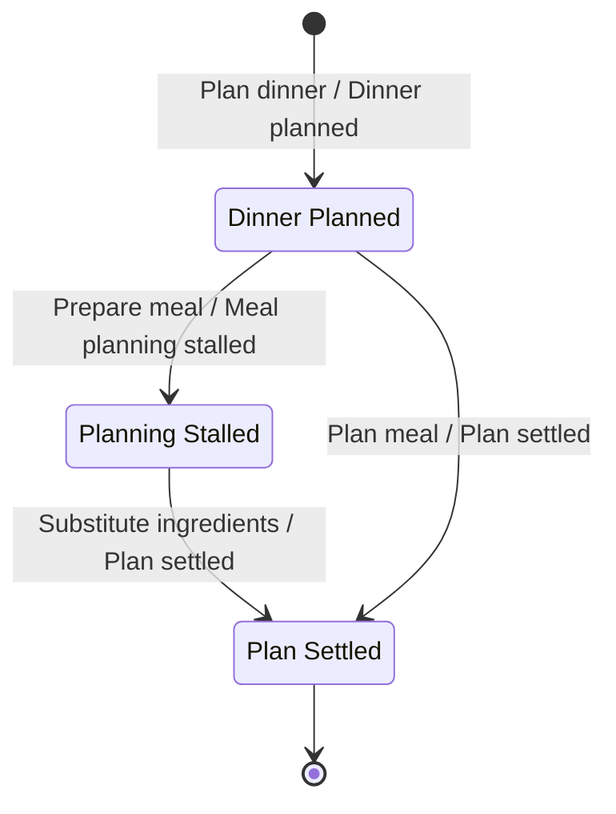
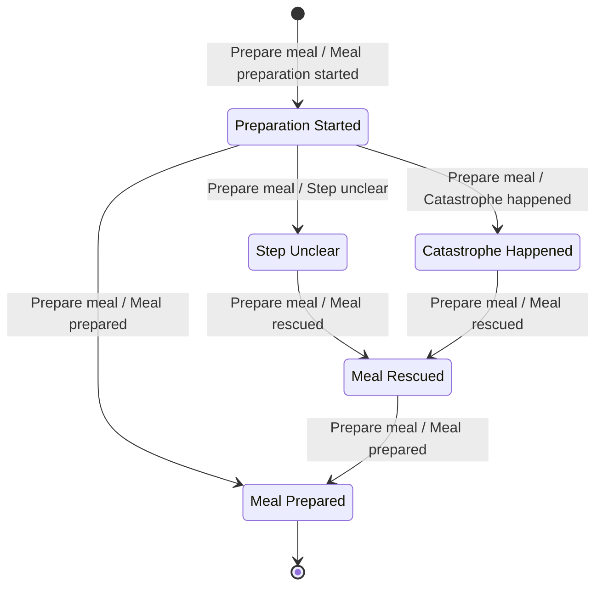
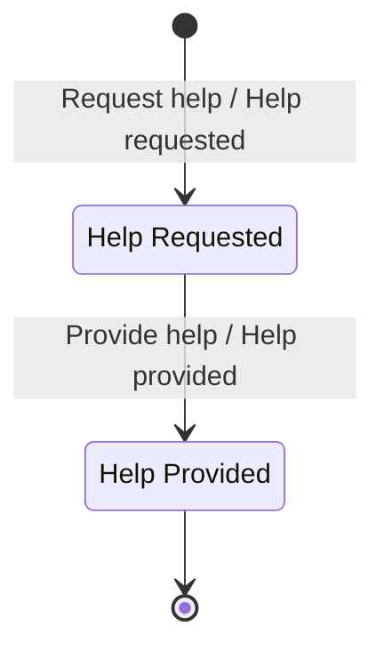

# Prompt 2023-08-23

Find the invariants based on the provided EventStorming board. Use the provided skill.


[Skill](../Skills/FindInvariantsSkill/SKILL.md)

[Invariant catalog](../Skills/FindInvariantsSkill/references/invariant-catalogue.md)

[Worked example](../Skills/FindInvariantsSkill/references/worked-example.md)

# Answer

## 1. Board as Read

The EventStorming board maps six functional domains across multiple context bubbles. The table below normalizes the stickies, actors, commands, and state annotations.

| # | Event | Command (Actor) | Bounded Context | Read Models Consulted | State Annotation |
| --- | --- | --- | --- | --- | --- |
| 1 | Cook registered

| Register cook (User)

| Cook Profile | User, Cook

| Registered

|
| 2 | Dinner planned

| Plan dinner (Cook)

| Meal Planning | Guests, Menu

| Planned

|
| 3 | Recipes searched

| Search recipes (Cook)

| Meal Planning | Recipe Catalog, Recipe

| Searched

|
| 4 | Recipe selected

| Search recipes (Cook)

| Meal Planning | Recipe

| Selected

|
| 5 | Meal planning stalled

| Prepare meal (Cook / System)

| Meal Planning | Ingredients missing, Guests, Menu

| Stalled

|
| 6 | Ingredients substituted

| Substitute ingredients (Cook)

| Meal Planning | Recipe, Help Response, Ingredients

| Substituted

|
| 7 | Plan settled

| Plan meal (Cook)

| Meal Planning | Menu, Help Response, Meal plan

| Settled

|
| 8 | Meal preparation started

| Prepare meal (Cook)

| Meal Preparation | Recipe

| Started

|
| 9 | Step unclear

| Prepare meal (Cook)

| Meal Preparation | Recipe

| Unclear

|
| 10 | Catastrophe happened

| Prepare meal (Cook)

| Meal Preparation | Catastrophe, Recipe

| Catastrophe

|
| 11 | Help requested

| Request help (Cook)

| Cooking Help / Assistance | Ingredients, Menu, Catastrophe, Recipe, Pictures

| Requested

|
| 12 | Help provided

| Provide help (Community Cook, Chef, Grandma Avatar)

| Cooking Help / Assistance | Help request, Help response

| Provided

|
| 13 | Step completed

| Prepare meal (Cook)

| Meal Preparation | Help response

| Step Done

|
| 14 | Meal rescued

| Prepare meal (Cook / System)

| Meal Preparation | Help response

| Rescued

|
| 15 | Meal prepared

| Prepare meal (Cook)

| Meal Preparation | Recipe

| Prepared (Terminal)

|
| 16 | Pictures taken

| Take pictures (Cook)

| Media | Pictures

| Captured

|
| 17 | Thanks given

| Provide thanks (Cook)

| Sharing | Help provider, Pictures, Thanks

| Expressed

|

---

## 2. Consistency Boundaries

| Context | Aggregate | Root Identity | Commands Accepted | States Owned | Data Held |
| --- | --- | --- | --- | --- | --- |
| Cook Profile | Cook Profile | `CookId` | Register cook

| Registered

| User identity, cook preferences

|
| Meal Planning | Meal Plan | `MealPlanId` | Plan dinner, Search recipes, Substitute ingredients, Plan meal

| Planned, Stalled, Settled

| Guest count, selected recipes, missing ingredients

|
| Meal Preparation | Meal Execution | `PreparationId` | Prepare meal

| Started, Unclear, Catastrophe, Rescued, Prepared

| Recipe step index, rescue status

|
| Cooking Assistance | Help Request | `RequestId` | Request help, Provide help

| Requested, Provided

| Escalation reason, attached media, response content

|
| Media | Media Collection | `MediaId` | Take pictures

| Captured

| Photo assets, step associations

|
| Sharing | Gratitude | `ThanksId` | Provide thanks

| Expressed

| Target helper ID, message, picture ref

|

---

## 3. Status Models

### Meal Plan

States: *Planned*, *Stalled*, *Settled*.



### Meal Execution

States: *Started*, *Unclear*, *Catastrophe*, *Rescued*, *Prepared*.



### Help Request

States: *Requested*, *Provided*.



---

## 4. Invariants by Bounded Context

### Cook Profile

```
INV-PROF-01 · Single Profile Registration
A User MUST NOT hold more than one registered Cook profile.
  Kind        uniqueness
  Aggregate   Cook Profile (root: CookId)
  Triggered   Register cook
  Rejection   "User is already registered as a cook."
  Evidence    User and Cook read models on Register cook sticky
  Confidence  implied

```

### Meal Planning

```
INV-PLAN-01 · Settled Plan Requires Valid Ingredients
A Meal Plan MUST NOT transition to Plan Settled while required ingredients are missing unless valid substitutions are recorded.
  Kind        precondition
  Aggregate   Meal Plan (root: MealPlanId)
  Triggered   Plan meal
  Rejection   "Cannot settle meal plan with unaddressed missing ingredients."
  Evidence    Ingredients missing sticky adjacent to Substitute ingredients
  Confidence  on the board

INV-PLAN-02 · Stalled Planning Guard
A Meal Plan MUST transition to Meal planning stalled when required ingredients are unavailable for execution.
  Kind        state
  Aggregate   Meal Plan (root: MealPlanId)
  Triggered   Prepare meal
  Rejection   "Meal planning is stalled; resolve missing ingredients first."
  Evidence    Meal planning stalled sticky and Ingredients missing read model
  Confidence  on the board

```

### Meal Preparation

```
INV-PREP-01 · Execution Sequence Guard
A Meal Execution MUST NOT be marked Meal Prepared while in an unresolved state (Step Unclear or Catastrophe Happened).
  Kind        state / guard
  Aggregate   Meal Execution (root: PreparationId)
  Triggered   Prepare meal
  Rejection   "Cannot complete meal preparation with unresolved step issues or catastrophes."
  Evidence    Step unclear and Catastrophe happened state stickies
  Confidence  on the board

INV-PREP-02 · Rescue Precondition
A Meal Execution in Catastrophe Happened or Step Unclear MUST receive a valid Help Response before transitioning to Meal Rescued.
  Kind        precondition
  Aggregate   Meal Execution (root: PreparationId)
  Triggered   Prepare meal
  Rejection   "Cannot rescue meal without an accepted help response."
  Evidence    Help response read model on Meal rescued command sticky
  Confidence  on the board

INV-PREP-03 · Absorbing Terminal Execution State
Once a Meal Execution enters Meal Prepared, no further preparation actions or state transitions are permitted.
  Kind        terminal state
  Aggregate   Meal Execution (root: PreparationId)
  Triggered   Prepare meal
  Rejection   "Meal preparation is already completed."
  Evidence    Meal prepared sticky at lifecycle boundary
  Confidence  implied

```

### Cooking Assistance / Cooking Help

```
INV-HELP-01 · Single Response Guard
Provide help MUST only be accepted for a Help Request currently in state Help Requested.
  Kind        state / guard
  Aggregate   Help Request (root: RequestId)
  Triggered   Provide help
  Rejection   "This help request has already been answered or closed."
  Evidence    Help request and Help response read models
  Confidence  on the board

INV-HELP-02 · Authorized Helper Constraint
Only authorized helper actors (Community Cook, Chef, or Grandma Avatar) MAY issue Provide help.
  Kind        authorization
  Aggregate   Help Request (root: RequestId)
  Triggered   Provide help
  Rejection   "Actor is not authorized to provide cooking assistance."
  Evidence    Community Cook, Chef, and Grandma Avatar actor stickies
  Confidence  on the board

```

### Sharing

```
INV-SHARE-01 · Verified Helper Target
Provide thanks MUST target a valid Help Provider reference associated with a resolved Help Request.
  Kind        precondition
  Aggregate   Gratitude (root: ThanksId)
  Triggered   Provide thanks
  Rejection   "Cannot send thanks without a valid help provider reference."
  Evidence    Help provider read model on Provide thanks sticky
  Confidence  on the board

```

---

## 5. Scenarios

```gherkin
@INV-PLAN-01
Scenario: Settling a meal plan with unaddressed missing ingredients is rejected
  Given a Meal Plan in state "Meal planning stalled" with missing ingredients
   When the Cook issues Plan meal without executing Substitute ingredients
   Then the command is rejected with "Cannot settle meal plan with unaddressed missing ingredients"
    And the Meal Plan remains in state "Meal planning stalled"

@INV-PREP-02
Scenario: Rescuing a catastrophe without an external help response is rejected
  Given a Meal Execution in state "Catastrophe Happened"
    And no Help Response has been published for the active request
   When the Cook issues Prepare meal to rescue the meal
   Then the command is rejected with "Cannot rescue meal without an accepted help response"
    And the Meal Execution remains in state "Catastrophe Happened"

@INV-HELP-01
Scenario: Providing help on an already answered request is rejected
  Given a Help Request in state "Help Provided"
   When a Community Cook issues Provide help for this request
   Then the command is rejected with "This help request has already been answered or closed"
    And the Help Request state remains unchanged

```

---

## 6. Not Invariants

```
X-01 · "Help request photo attachments must strictly match the current catastrophe."
  Stated by     Media and Cooking Assistance contexts (Pictures read model on Request help)[cite: 1]
  Fails         Test 3 (Context boundary) — Media Collection owns photo capture; Cooking Assistance owns request management.
  Policy        Whenever Pictures taken (Media), link picture IDs to the active Help Request (Cooking Assistance).
  Local data    Help Request stores a local image reference; Media Collection owns the source binary.
  Staleness     Eventually consistent (seconds).
  Compensation  Help request proceeds with plain text step description if image attachment lags.

X-02 · "Declaring a catastrophe automatically freezes meal preparation and dispatches help."
  Stated by     Meal Preparation and Cooking Assistance flow link[cite: 1]
  Fails         Test 2 (Single-owner) — Two distinct aggregates across context boundaries.
  Policy        Whenever Catastrophe happened (Meal Preparation), issue Request help (Cooking Assistance).
  Local data    Cooking Assistance reads a projection of the preparation context.
  Staleness     Asynchronous event dispatch lag.
  Compensation  Cook manually triggers Request help if automated policy event fails.

Dropped Candidates
- "Cook must search recipes before planning dinner." — Workflow sequence, not a rule. A cook may manually create a custom plan[cite: 1].
- "Pictures must meet specific resolution criteria." — Technical input validation; belongs in application schema.

```

---

## 7. Gaps, Hotspots, and Open Questions

* **Context Fragmentation**: `Cooking Assistance` and `Cooking Help` appear in separate context bubbles on the board, as do duplicated `Meal Preparation` and `Media` bubbles. These reflect provisional cuts that require unification into single bounded contexts.


* **Missing Aggregate States**:
* **Media Collection**: Captures images (`Pictures taken`), but has no lifecycle termination or archival states.


* **Cook Profile**: Only models registration (`Cook registered`); missing suspension or profile update states.


* **Unsupplied Business Numbers**:
* Maximum active help requests permitted per cook: `<n>`
* Inactivity timeout before a *Meal planning stalled* session auto-cancels: `<t>` minutes


* **Domain Expert Questions**:
1. *If a catastrophe occurs and no helper responds within `<t>` minutes, can a cook manually override the block to rescue or abort the meal execution?* (Settles `INV-PREP-02` override path).
2. *Is Grandma Avatar an automated system bot or an elevated community role?* (Settles authorization rules for `INV-HELP-02`).


3. *Can a settled meal plan be modified after meal preparation has already started?* (Determines boundary lock between Meal Planning and Meal Preparation contexts).