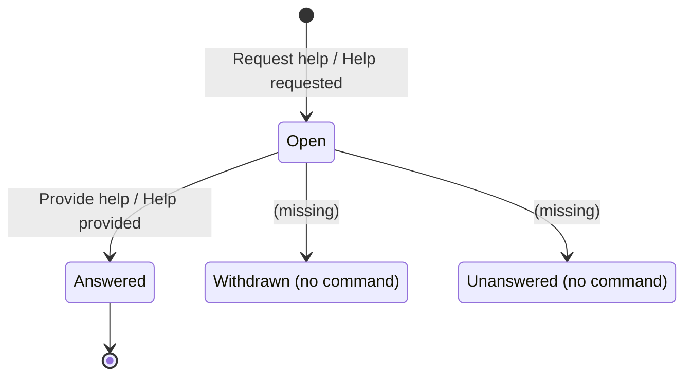
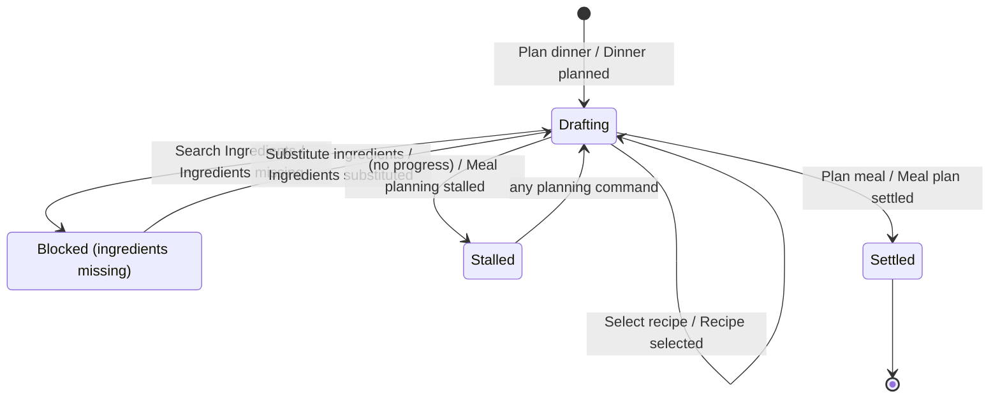
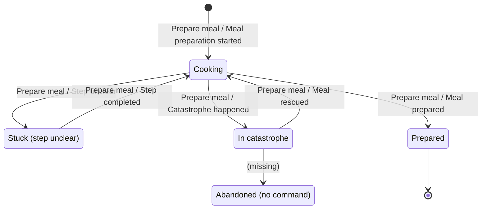

# Prompt 2026-08-23

/event-storming-invariant-finder
Find the invariants based on the provided EventStorming board.


# Answer

# Invariants — Community Cooking board

**Mode: contexts drawn.** The team has drawn twelve bubbles carrying **seven
distinct names** — Cook Profile, Meal Planning, Cooking Assistance, Cooking Help,
Meal Preparation, Media, Sharing. Every rule below is scoped to the team's own
cut, not to one I proposed.

**Two findings cap the confidence of everything that follows. State them first.**

1. **This board carries no state stickies.** Not one status word anywhere. On a
   board whose own events include *stalled*, *unclear*, *catastrophe* and
   *rescued* — every one of which presupposes something with a status — all four
   status models in §3 had to be *reconstructed* from event sequences. Roughly
   half the invariants a board normally yields come off the state stickies, so
   what follows is the derivable half plus reconstruction, not a reading.
2. **Repeating a bubble is this board's layout convention.** *Meal Planning*,
   *Meal Preparation*, *Media*, *Cooking Assistance* and *Cooking Help* each
   appear **twice**, because the timeline wraps across three rows. That matters
   for the help contexts: since drawing one context twice is normal here, the
   *only* evidence that Cooking Assistance and Cooking Help are two contexts is
   that the two pairs were given different **names**. Everything else about them
   is identical. See §7 — this is the single most consequential reading in the
   sheet, and it is a naming question, not a modelling one.

There are **no red hotspot stickies** anywhere on the board.

---

## 1. Board as read

Notation as read: orange = domain event · blue ⌘ = command · bright yellow 👤 =
actor · green 👁 = read model consulted · pale yellow 💼 = business object
produced · pink ⚙ = external system.

| # | Event | Command ⌘ | Actor 👤 | Reads 👁 | Produces 💼 | Bubble | Marks |
|---|-------|-----------|----------|----------|-------------|--------|-------|
| 1 | Cook registered | Register cook | User | User | **Cook** | Cook Profile | board edge |
| 2 | Dinner planned | Plan dinner | Cook | Guests | **Menu** | Meal Planning | |
| 3 | Recipes searched | Search recipes | Cook | Recipe Catalog | — | Meal Planning | ✨ · loop with 4 |
| 4 | Recipe selected | Search recipes *(sic)* | Cook | Recipe | — | Meal Planning | ✨ · loop with 3 |
| 5 | Ingredients missing | Search Ingredients | Cook | Recipe | — | Meal Planning | ✨ · branch |
| 6 | Meal planning stalled | Prepare meal *(sic)* | Cook | Guests, Menu | — | Meal Planning | 🤖 · no-progress |
| 7 | Help requested | Request help | Cook | Ingredients, Menu | **Help request** | Cooking Assistance | recurs at 15 |
| 8 | Help provided | Provide help | Community Cook, Chef, *Grandma Avatar* ⚙ | Help request | **Help response** | Cooking Assistance | recurs at 16 |
| 9 | Ingredients substituted | Substitute ingredients | Cook | Recipe, Help Response | **Ingredients** | Meal Planning | resolves 5 |
| 10 | Meal plan settled | Plan meal | Cook | Menu, Help Response | **Meal plan** | Meal Planning | |
| 11 | Meal preparation started | Prepare meal | Cook | Recipe | — | Meal Preparation | ✨ |
| 12 | Step unclear | Prepare meal | Cook | Recipe | — | Meal Preparation | ✨ · loop |
| 13 | Catastrophe happened | Prepare meal | Cook | Catastrophe, Recipe | — | Meal Preparation | ✨ · branch |
| 14 | Pictures taken | Take pictures | Cook | Catastrophe | **Pictures** | Media | recurs at 20 |
| 15 | Help requested | Request help | Cook | Recipe, Pictures | **Help request** | Cooking Help | repeat of 7 |
| 16 | Help provided | Request help *(sic)* | Community Cook, *Grandma Avatar* ⚙ | Help request | **Help response** | Cooking Help | repeat of 8 |
| 17 | Step completed *("competeted")* | Prepare meal | Cook | Help response | — | Meal Preparation | ✨ · loop |
| 18 | Meal rescued | Prepare meal | Cook | Help response | — | Meal Preparation | 🤖 · resolves 13 |
| 19 | Meal prepared | Prepare meal | Cook | Recipe | **nothing** | Meal Preparation | ✨ |
| 20 | Pictures taken | Take pictures | Cook | — | **Pictures** | Media | repeat of 14 |
| 21 | Thanks given | Provide thanks | Cook | Help provider, Pictures | **Thanks** | Sharing | board edge |

### Assumptions flagged — these decide the rules, so confirm them first

- **No state stickies anywhere.** §3 is reconstruction, and every state name in
  it is mine, not the team's. Correcting the *names* is as valuable as
  correcting the arrows: they are the ubiquitous language this board did not
  capture.
- **`Prepare meal` is written on seven different events** (6, 11, 12, 13, 17, 18,
  19). Either it is a placeholder for seven different commands, or the board is
  claiming everything in the kitchen is one undifferentiated interaction. Every
  INV-PREP guard below assumes the former. §7.
- **Three probable slips on the wall.** Event 4's command reads *Search recipes*
  (expected *Select recipe*); event 6's reads *Prepare meal* (expected
  *Continue planning* — or **no command at all**, if the system raises it);
  event 16's reads *Request help* (expected *Provide help*). Read as slips.
- **✨ and 🤖 are unconfirmed markers, and no rule below rests on either alone.**
  ✨ sits on events 3, 4, 5, 11, 12, 13, 17 and 19; 🤖 on 6 and 18 only. If ✨
  marks provenance ("this sticky was AI-proposed in the session") it says
  nothing about the domain. If 🤖 means "raised without anyone pressing
  anything", then 6 and 18 are the two events where software observes the cook
  rather than records their action — which is a real domain statement, and it is
  mildly corroborated by being exactly the two events where non-human agency is
  plausible from the text alone. INV-PLAN-09 and INV-PREP-08 each carry a second,
  structural reason so that neither depends on the marker.
- **Green stickies that nothing ever writes:** *Recipe* / *Recipe Catalog*
  (read by nine events), *Guests* (2, 6), *Catastrophe* (13, 14), *Help
  provider* (21). Recipe is a whole missing context; the other three are
  probably undrawn parts of aggregates the board does have. §7.
- ***Catastrophe* is read by the event that creates it.** Event 13 consults a
  green *Catastrophe* to produce *Catastrophe happened*. Read as the cook
  telling the system what went wrong, i.e. command payload drawn as a read
  model — but it is worth one sentence from the team, because the alternative
  (the system detecting the catastrophe) changes INV-PREP-06 and INV-PREP-08.
- **Boundary ambiguity at cluster 14/15.** The green *Catastrophe* sticky sits on
  the edge between the Media bubble and the right-hand Cooking Help bubble. Read
  as belonging to 14 (*Pictures taken*). If it belongs to 15 instead, INV-HELP-01
  gets stronger, not different.

---

## 2. Consistency boundaries

| Context | Aggregate | Root identity | Commands it accepts | States it owns | Data it holds |
|---|---|---|---|---|---|
| Cook Profile | **Cook** | cook id | Register cook | *(none drawn)* | identity, display name, provenance from User |
| Meal Planning | **Meal plan** (Menu, Ingredients inside) | plan id (Cook × occasion) | Plan dinner, Search recipes, Select recipe, Search Ingredients, Substitute ingredients, Plan meal | *(none drawn)* | occasion, guests, menu, chosen recipe refs, ingredient list |
| Cooking Assistance ≡ Cooking Help | **Help request** (Help response inside) | request id | Request help, Provide help | *(none drawn)* | situation snapshot, responses, provider refs |
| Meal Preparation | **— none on the board** | — | Prepare meal (×7) | *(none drawn)* | **nothing is written by any of its seven events** |
| Media | **Pictures** | picture set id | Take pictures | *(none drawn)* | image refs, what they are of |
| Sharing | **Thanks** | thanks id | Provide thanks | *(none drawn)* | recipient ref, message, picture refs |
| *(missing)* | Recipe / Recipe Catalog | — | *none* | — | read by nine events, written by none |

Four consequences fall straight out of this table, before a single rule is
written.

- **Meal Preparation — seven events, seven repetitions of one command, and not
  one business object.** Yet *Step unclear*, *Step completed*, *Catastrophe
  happened* and *Meal rescued* each presuppose something that knows which step
  the cook is on and what has gone wrong. Every INV-PREP rule below therefore
  names an aggregate **that does not yet exist**. They are written anyway,
  because collectively they are the argument for creating it.
- **Cooking Assistance and Cooking Help have identical structure** — same
  commands, same *Help request* / *Help response* objects, same responders down
  to the same Grandma Avatar. Rules are numbered `INV-HELP-*` once. §7 gives the
  single condition under which the split would be real.
- **Recipe is consulted by nine events across three contexts and owned by none.**
  No rule about recipes can be enforced anywhere on this board.
- **Menu vs Meal plan is an open modelling decision, not a reading.** *Menu* is
  minted at 2 and read at 6, 7 and 10; *Meal plan* is minted at 10 and read
  **nowhere**. Two readings are available: (a) *Menu* is the working state of the
  Meal plan aggregate and *Meal plan* is the settled form of the same thing —
  assumed throughout below; or (b) they are two aggregates, in which case
  INV-PLAN-02, -04 and -10 each split in two and the plan becomes an immutable
  artefact with its own lifecycle. Ask before building.

---

## 3. Status models — all reconstructed, none read

Nothing here is on the board. Each machine is the smallest one that makes the
events consistent. The value is in the arrows that are **not** drawn.

### 3.1 Help request — Cooking Assistance ≡ Cooking Help

The only aggregate whose events give two genuine states without argument.

| From | Command | Event | To | Guard |
|---|---|---|---|---|
| *(none)* | Request help | Help requested | **Open** | the situation snapshot is complete enough to answer |
| Open | Provide help | Help provided | **Answered** | the responder is not the requester |
| Open | *(no command on board)* | — | **Withdrawn** | — |
| Open | *(no command on board)* | — | **Unanswered** | timeout elapsed |
| Answered | Provide thanks *(Sharing)* | Thanks given | Answered | — |



Asserts INV-HELP-04 (guard), INV-HELP-06 (many responses, at most one
resolving), INV-HELP-09 (terminal). **Two of the four states have no command
that reaches them:** a cook who solves their own problem cannot say so, and a
request nobody answers has no ending. That is the largest gap in the context the
whole board is built around.

### 3.2 Meal plan — Meal Planning

| From | Command | Event | To | Guard |
|---|---|---|---|---|
| *(none)* | Plan dinner | Dinner planned | **Drafting** | at least one guest and an occasion |
| Drafting | Select recipe | Recipe selected | Drafting | the recipe exists in the Catalog |
| Drafting | Search Ingredients | Ingredients missing | **Blocked** | at least one recipe on the Menu |
| Blocked | Substitute ingredients | Ingredients substituted | Drafting | the substitution respects the guests' constraints |
| Drafting | *(no progress)* | Meal planning stalled | **Stalled** | not already stalled; not settled |
| Stalled | any planning command | — | Drafting | — |
| Drafting | Plan meal | Meal plan settled | **Settled** | Menu non-empty, no ingredient outstanding |
| Settled | *(no command on board)* | — | Drafting | — |



*Stalled* is the interesting one. It is the only state on the whole board
reached **without a human command**, and it is a state of the **cook's
attention**, not of the plan's content. Modelling it as a state of the Meal plan
is a decision, not a reading; the alternative is a separate *Planning session*
aggregate, which would make INV-PLAN-09 cheaper to enforce and would stop a
suppression rule from living on a business artefact.

### 3.3 Meal preparation — Meal Preparation

The board's richest lifecycle, belonging to an aggregate that **does not exist**.
Read this as the specification for the one it needs.

| From | Command | Event | To | Guard |
|---|---|---|---|---|
| *(none)* | Prepare meal | Meal preparation started | **Cooking** | a Recipe is referenced |
| Cooking | Prepare meal | Step unclear | **Stuck** | the step is not already completed |
| Stuck | Prepare meal | Step completed | Cooking | a help response resolved it, or the cook proceeded anyway |
| Cooking | Prepare meal | Catastrophe happened | **In catastrophe** | — |
| In catastrophe | Prepare meal | Meal rescued | Cooking | a Help response exists **and** the cook confirms |
| Cooking | Prepare meal | Meal prepared | **Prepared** | every mandatory step completed |
| In catastrophe | *(no command on board)* | — | **Abandoned** | — |
| Prepared | *(none)* | — | — | absorbing |



**There is no way out of a catastrophe except rescue.** No *Abandon*, no *Order
takeaway*, no *Serve it anyway*. Given that "catastrophe" is the domain's own
word, an unrescuable catastrophe is not a rare edge case — it is the outcome the
product exists to prevent, and it is the one outcome with no modelled ending.

### 3.4 Cook — Cook Profile

One event, one state. A Cook can be registered and nothing else: no suspension,
no deactivation, no leaving. Every authorization rule in every other context
(INV-HELP-03, INV-PREP-09, INV-SHARE-02) resolves against a Cook that can never
stop being valid. Cheap today; wrong the first time somebody has to be removed
from a community that routes strangers' kitchen photos to each other.

### 3.5 Pictures and Thanks

Single-state, and honestly so. Neither has a lifecycle on this board beyond
existing. That is fine for *Thanks*; it is a gap for *Pictures*, which are
attached to open help requests and therefore have at least a *shared* / *not
shared* distinction the board does not draw (INV-MEDIA-03, INV-MEDIA-04).

---

## 4. Invariants by bounded context

Confidence: `board` = a sticky says so · `implied` = the board makes no sense
otherwise · `inferred` = domain knowledge, needs confirming.

### Cook Profile

```
INV-PROF-01 · One cook per user
A User MUST NOT hold more than one Cook profile.
  Kind        uniqueness            Aggregate  Cook
  Triggered   Register cook
  Rejection   "you already cook with us — sign in instead"
  Evidence    User 👁 read by Register cook; the word User never appears again
  Confidence  implied

INV-PROF-02 · Registration is self-service
Only the User themself may register their Cook profile.
  Kind        authorization         Aggregate  Cook
  Triggered   Register cook
  Rejection   "you cannot create a profile for someone else"
  Evidence    User is the sole actor on event 1        Confidence  implied

INV-PROF-03 · A cook is identifiable to the community
A Cook MUST carry a display identity before any Help request or Help response
may be attributed to them.
  Kind        lifecycle             Aggregate  Cook
  Rejection   "add a name before you ask the community for help"
  Evidence    Help provider 👁 read by Provide thanks (21)
  Confidence  inferred — and the only rule that gives Cook Profile a purpose
              beyond a row in a table

INV-PROF-04 · Identity is assigned once
A Cook's identity is fixed at registration and MUST NOT change or be transferred.
  Kind        lifecycle             Aggregate  Cook
  Rejection   "help you have given cannot be moved to another account"
  Evidence    every Help request, Help response and Thanks references a Cook
  Confidence  implied — this is what makes the reciprocity loop (21) mean
              anything at all
```

```gherkin
@INV-PROF-01
Scenario: A user who already cooks cannot register twice
  Given a Cook profile already exists for User "u-812"
   When User "u-812" issues Register cook
   Then the command is rejected with "you already cook with us"
    And no second Cook profile is created
```

### Meal Planning

```
INV-PLAN-01 · A dinner has guests and an occasion
Plan dinner MUST specify at least one guest and a date.
  Kind        precondition          Aggregate  Meal plan
  Triggered   Plan dinner
  Rejection   "who is coming, and when?"
  Evidence    Guests 👁 read by Plan dinner            Confidence  implied

INV-PLAN-02 · Portions follow the guests
Every Recipe on the Menu MUST be scaled to the plan's guest count.
  Kind        intra-aggregate       Aggregate  Meal plan
  Rejection   "this recipe serves 4 and you are 9 — scale it or pick another"
  Evidence    Guests read at 2 and again at 6
  Confidence  inferred
  Note        this is the rule that justifies Menu living INSIDE Meal plan
              rather than beside it — see §2, reading (a).

INV-PLAN-03 · A plan cannot settle empty
Plan meal is accepted only when the Menu references at least one Recipe.
  Kind        precondition          Aggregate  Meal plan
  Triggered   Plan meal
  Rejection   "you have not chosen anything to cook yet"
  Evidence    Menu 👁 read by Plan meal                Confidence  implied

INV-PLAN-04 · A plan cannot settle short
Plan meal is accepted only when no ingredient is outstanding — every gap raised
by Ingredients missing MUST have been substituted or sourced.
  Kind        precondition (state)  Aggregate  Meal plan
  Triggered   Plan meal
  Rejection   "you are still short 2 ingredients — substitute them or shop"
  Evidence    the 5 → 9 → 10 sequence                  Confidence  implied
  Note        the strongest hidden rule on this board. It is the entire reason
              events 5–9 exist, and nothing on the wall states it.

INV-PLAN-05 · Substitutions respect the guests
An Ingredients substitution MUST NOT violate a dietary constraint recorded for
the plan's Guests.
  Kind        intra-aggregate       Aggregate  Meal plan
  Triggered   Substitute ingredients
  Rejection   "that swaps in walnuts, and Anna's allergy is on this plan"
  Evidence    Guests read at 2 and 6; substitution at 9
  Confidence  inferred — but the board reads Guests twice and never says why,
              and allergy is the only reason a home cook writes a guest list
              down at all. Ask about this first.

INV-PLAN-06 · Substitutions belong to a chosen recipe
A substituted Ingredient MUST belong to a Recipe currently on the Menu.
  Kind        lifecycle             Aggregate  Meal plan
  Triggered   Substitute ingredients
  Rejection   "that ingredient is not in anything you are cooking"
  Evidence    Recipe 👁 read by Substitute ingredients  Confidence  implied

INV-PLAN-07 · Nothing is missing until something is chosen
Search Ingredients is accepted only when the Menu carries at least one Recipe.
  Kind        ordering              Aggregate  Meal plan
  Triggered   Search Ingredients
  Rejection   "pick a recipe first — there is nothing to shop for yet"
  Evidence    event 5 reads Recipe and follows 4       Confidence  implied

INV-PLAN-08 · One plan per occasion
A Cook MUST NOT hold two unsettled Meal plans for the same occasion.
  Kind        uniqueness            Aggregate  Meal plan
  Rejection   "you are already planning Saturday — continue that plan?"
  Evidence    —                                        Confidence  inferred

INV-PLAN-09 · Only the planning cook plans
Only the Cook who owns a Meal plan may select recipes for it, substitute its
ingredients, or settle it.
  Kind        authorization         Aggregate  Meal plan
  Rejection   "this is someone else's dinner"
  Evidence    Cook is the sole actor on 2–6, 9, 10     Confidence  implied

INV-PLAN-10 · The assistant does not nag
Meal planning stalled MUST NOT be raised for a Settled plan, and MUST NOT be
raised twice without an intervening planning command.
  Kind        state guard           Aggregate  Meal plan
  Rejection   the assistant stays silent — the refusal is addressed to the
              system, and what the cook experiences is not being interrupted
  Evidence    event 6 reads Menu and Guests, i.e. it inspects progress
  Confidence  inferred
  Note        a suppression rule is still an invariant: it has a state guard, a
              single owner, and a consequence the business cares about. It does
              NOT rest on the 🤖 marker — an event that inspects progress and
              reports its absence needs this guard whoever raises it.

INV-PLAN-11 · Settling is once
Meal plan settled MUST NOT occur twice for one plan; changing a settled plan is
re-planning, and the board has no command for it.
  Kind        state / terminal      Aggregate  Meal plan
  Rejection   "this plan is settled — reopen it to change the menu"
  Evidence    event 10 has no successor inside Meal Planning
  Confidence  implied — the reopen command is missing, see §7

INV-PLAN-12 · A substitution is the cook's decision
Substitute ingredients MUST NOT require an existing Help response.
  Kind        precondition (NEGATIVE)   Aggregate  Meal plan
  Rejection   nothing is rejected — that is the point
  Evidence    event 9 reads ONLY Recipe and Help Response, i.e. as drawn a cook
              who knows perfectly well that yoghurt replaces crème fraîche
              cannot record it without first asking a stranger
  Confidence  inferred — CONTESTED, and recorded because the board asserts the
              opposite by omission. Confirm that self-service substitution
              exists; if it genuinely does not, that is a product decision
              somebody should make out loud rather than inherit from a layout.
```

```gherkin
@INV-PLAN-04
Scenario: A plan with an unresolved ingredient gap cannot be settled
  Given a Meal plan in state "Blocked" with 2 ingredients outstanding
   When the Cook issues Plan meal for that plan
   Then the command is rejected with "you are still short 2 ingredients"
    And the plan remains in state "Blocked"

@INV-PLAN-05
Scenario: A substitution that breaks a guest's diet is refused
  Given a Meal plan whose Guests record a nut allergy
   When the Cook issues Substitute ingredients with walnuts for pine nuts
   Then the command is rejected with "Anna's allergy is on this plan"
    And the Ingredients list is unchanged

@INV-PLAN-07
Scenario: Shopping cannot start before a recipe is chosen
  Given a Meal plan in state "Drafting" with an empty Menu
   When the Cook issues Search Ingredients
   Then the command is rejected with "pick a recipe first"
    And the plan remains in state "Drafting"

@INV-PLAN-10
Scenario: A settled plan is never reported as stalled
  Given a Meal plan in state "Settled"
   When no planning command is issued for <n> days
   Then Meal planning stalled is not raised
    And the Cook is not contacted
```

### Cooking Assistance ≡ Cooking Help

One rule set for both bubbles. Where a rule would differ between planning-time
and cooking-time help, that is noted — and it is the only evidence that these
might be two contexts (§7).

```
INV-HELP-01 · A request must be answerable
Request help is accepted only when the request carries the situation a stranger
needs: what is being cooked or planned, and what went wrong.
  Kind        precondition          Aggregate  Help request
  Triggered   Request help
  Rejection   "add the recipe or a photo so someone can actually help"
  Evidence    event 7 reads Ingredients + Menu; event 15 reads Recipe +
              Pictures                                 Confidence  board

INV-HELP-02 · One requester
A Help request MUST have exactly one requesting Cook, fixed at creation.
  Kind        cardinality           Aggregate  Help request
  Rejection   —                                        Confidence  implied

INV-HELP-03 · No self-help
The Cook who raised a Help request MUST NOT provide its Help response.
  Kind        authorization         Aggregate  Help request
  Triggered   Provide help
  Rejection   "you cannot answer your own question"
  Evidence    responders on 8 and 16 are Community Cook / Chef / Avatar, never
              the requesting Cook                      Confidence  implied

INV-HELP-04 · Answering an open request
Provide help is accepted only for a Help request in state Open.
  Kind        state guard           Aggregate  Help request
  Rejection   "this request has been withdrawn"
  Evidence    §3.1                                     Confidence  implied

INV-HELP-05 · A response belongs to one request
A Help response MUST reference exactly one Help request and MUST NOT exist
without it.
  Kind        cardinality + lifecycle   Aggregate  Help request
  Rejection   —                                        Confidence  board

INV-HELP-06 · Many answers, one resolution
A Help request MAY collect many Help responses, but AT MOST ONE may be marked
as the one that resolved it.
  Kind        cardinality           Aggregate  Help request
  Rejection   "you have already marked Maria's answer as the one that helped"
  Evidence    events 9, 17 and 18 each read a single Help response
  Confidence  inferred — CONTESTED, and unenforceable today: the board has no
              command that marks a response as the resolving one. §7.

INV-HELP-07 · The snapshot is frozen at request time
The situation a responder sees MUST be the one recorded when the request was
raised; later changes to the Menu, plan or preparation MUST NOT alter an open
request.
  Kind        intra-aggregate       Aggregate  Help request
  Rejection   "your menu has changed since you asked — raise a new request"
  Evidence    Help request 💼 is produced as an object rather than read live
  Confidence  implied
  Note        this is the interface-width decision in disguise. If responders
              instead reach back into Meal Planning and Meal Preparation for
              live detail, this context has a wide interface and the three
              contexts collapse into one. Decide it deliberately.

INV-HELP-08 · An avatar answer says so
A Help response produced by the Grandma Avatar MUST be labelled as
machine-generated wherever it is shown.
  Kind        intra-aggregate       Aggregate  Help request
  Rejection   the response is not published unlabelled
  Evidence    Grandma Avatar is pink ⚙ — an external system standing among the
              human responders in BOTH help clusters
  Confidence  inferred — but the notation is itself the evidence that the board
              already distinguishes it, and the distinction is worthless unless
              it survives to the cook

INV-HELP-09 · Urgency is carried, not guessed
A Help request MUST record whether the cook is at the stove or at the table.
  Kind        precondition          Aggregate  Help request
  Rejection   —  nothing is refused; instead nothing is routed correctly
  Evidence    events 7 and 15 arise in different phases with the same object
  Confidence  inferred — this is the rule that makes ONE help context viable
              instead of two. §7.

INV-HELP-10 · Answered is not reopened
A Help request in state Answered MUST NOT accept a new Help response for the
same question; a follow-up is a new request.
  Kind        state / terminal      Aggregate  Help request
  Rejection   "start a follow-up — this one is answered"
  Confidence  inferred — CONTESTED, since a conversation is the natural shape
              of cooking help and the board models a single exchange

INV-HELP-11 · A cook cannot flood the board
A Cook MUST NOT hold more than <n> Open Help requests at one time.
  Kind        cardinality           Aggregate  Help request
  Rejection   "answer or close your open questions first"
  Confidence  inferred — <n> not on the board, and this is the rule that
              protects the responders, who are the scarce resource here
```

```gherkin
@INV-HELP-03
Scenario: A cook cannot answer their own request
  Given a Help request in state "Open" raised by Cook "C-7"
   When Cook "C-7" issues Provide help for that request
   Then the command is rejected with "you cannot answer your own question"
    And the request remains in state "Open"

@INV-HELP-07
Scenario: A responder never answers a question that has moved
  Given a Help request in state "Open" carrying a snapshot of Menu "M-3"
   When the Cook changes Menu "M-3" in Meal Planning
   Then the open Help request is unchanged
    And the responder sees the menu as it was when the question was asked

@INV-HELP-08
Scenario: An avatar answer is never shown as a neighbour's answer
  Given a Help response produced by the Grandma Avatar
   When the response is shown to the requesting Cook
   Then it is presented as machine-generated
```

### Meal Preparation

**Every rule here names an aggregate the board does not have.** They are the
specification for the one it needs.

```
INV-PREP-01 · Cooking is cooking something
Meal preparation started requires a Recipe reference.
  Kind        precondition          Aggregate  Meal preparation *(missing)*
  Triggered   Prepare meal (start)
  Rejection   "what are you making?"
  Evidence    Recipe 👁 read by event 11                Confidence  board
  Note        the LOCAL form of "you can only cook what you planned", which is
              cross-context. See X-01.

INV-PREP-02 · The steps are the recipe's steps
A preparation's step record MUST correspond to the steps of the Recipe it was
started from, as copied at start.
  Kind        intra-aggregate       Aggregate  Meal preparation *(missing)*
  Rejection   the recipe changing under a cook mid-session does not silently
              rewrite what they have already done
  Evidence    events 11, 12, 19 each re-read Recipe from an unowned context
  Confidence  implied
  Note        this is the type-D rule that JUSTIFIES the missing aggregate
              existing at all, and it argues for a recipe snapshot at start —
              the same shape as INV-HELP-07.

INV-PREP-03 · A step is completed once
Step completed MUST NOT occur twice for the same step of one preparation.
  Kind        cardinality           Aggregate  Meal preparation *(missing)*
  Rejection   "you have already done that one"
  Evidence    event 17 is drawn as a loop              Confidence  implied

INV-PREP-04 · Unclear applies to an open step
Step unclear is accepted only for a step that is not yet completed.
  Kind        state guard           Aggregate  Meal preparation *(missing)*
  Rejection   "that step is behind you — did you mean the next one?"
  Confidence  implied

INV-PREP-05 · Done means done
Meal prepared is accepted only when every mandatory step of the Recipe has been
completed.
  Kind        precondition          Aggregate  Meal preparation *(missing)*
  Rejection   "3 steps are still open — finish or skip them"
  Evidence    Recipe 👁 read by event 19                Confidence  implied
  Note        "or skip them" is doing real work in that sentence, and the board
              has no skip command. Ask whether a cook may declare a meal done
              with steps outstanding — most can and do.

INV-PREP-06 · Steps follow the recipe's order
Steps MUST be completed in the Recipe's order.
  Kind        ordering              Aggregate  Meal preparation *(missing)*
  Rejection   "step 3 comes before step 4"
  Confidence  inferred — CONTESTED and probably wrong. Real cooks work several
              steps in parallel. Recorded because if the product enforces it,
              that should be a decision somebody made rather than one inherited
              from a checklist widget.

INV-PREP-07 · A catastrophe belongs somewhere
A Catastrophe MUST be attached to exactly one step of exactly one preparation.
  Kind        cardinality           Aggregate  Meal preparation *(missing)*
  Rejection   —                                        Confidence  implied

INV-PREP-08 · Nothing to rescue
Meal rescued is accepted only for a preparation in state In catastrophe.
  Kind        state guard           Aggregate  Meal preparation *(missing)*
  Rejection   "nothing has gone wrong here yet"
  Evidence    event 18 reads Help response and follows 13   Confidence  board

INV-PREP-09 · A rescue is not a rescue until the cook says so
Meal rescued MUST NOT be recorded on the strength of a Help response alone; the
cook MUST confirm the preparation is back on track.
  Kind        state guard           Aggregate  Meal preparation *(missing)*
  Rejection   the preparation stays In catastrophe and the help request stays
              open
  Evidence    event 18 reads ONLY Help response — i.e. as drawn, receiving
              advice IS the rescue
  Confidence  inferred — the evidence stands without the 🤖 marker. As the
              board reads today, the system would declare a meal rescued while
              it is still burning.

INV-PREP-10 · Only the cook cooks
Only the Cook who started a preparation may complete its steps, report its
catastrophe or declare it prepared.
  Kind        authorization         Aggregate  Meal preparation *(missing)*
  Rejection   "this is someone else's kitchen"
  Confidence  implied

INV-PREP-11 · Prepared is final
Meal prepared is absorbing: no further step, catastrophe or rescue may be
recorded against that preparation.
  Kind        state / terminal      Aggregate  Meal preparation *(missing)*
  Rejection   "this meal is finished — start a new preparation"
  Confidence  implied

INV-PREP-12 · One kitchen, one preparation
A Cook MUST NOT have more than one preparation in state Cooking at a time.
  Kind        cardinality           Aggregate  Meal preparation *(missing)*
  Rejection   "you are already cooking — finish or abandon that first"
  Confidence  inferred — CONTESTED and worth asking, because a dinner party is
              exactly the case where a cook runs three dishes at once. If the
              answer is "several", the aggregate is a preparation PER DISH and
              INV-PREP-05's "every mandatory step" needs a per-dish reading.
```

```gherkin
@INV-PREP-08
Scenario: A meal that is going fine cannot be rescued
  Given a Meal preparation in state "Cooking"
   When Meal rescued is raised for that preparation
   Then it is refused
    And the preparation remains in state "Cooking"

@INV-PREP-09
Scenario: Advice alone does not end a catastrophe
  Given a Meal preparation in state "In catastrophe"
    And a Help response has arrived for that catastrophe
   When no confirmation is given by the Cook
   Then the preparation remains in state "In catastrophe"
    And the Help request remains open

@INV-PREP-05
Scenario: A meal with open steps is not silently finished
  Given a Meal preparation in state "Cooking" with 3 mandatory steps open
   When the Cook issues Prepare meal to declare the meal prepared
   Then the command is rejected with "3 steps are still open"
    And the preparation remains in state "Cooking"

@INV-PREP-02
Scenario: A recipe edited mid-session does not rewrite the cook's progress
  Given a Meal preparation started from Recipe "R-9" with steps 1–3 completed
   When Recipe "R-9" is edited in the Recipe Catalogue
   Then the preparation's completed steps are unchanged
    And the preparation continues against the steps copied at start
```

### Media

```
INV-MEDIA-01 · A picture is of something
Pictures MUST reference what they are of — a catastrophe, a step, or a finished
meal.
  Kind        lifecycle             Aggregate  Pictures
  Triggered   Take pictures
  Rejection   "which meal is this?"
  Evidence    event 14 reads Catastrophe; event 20 reads NOTHING AT ALL
  Confidence  implied
  Note        event 20 reading nothing is the board saying a trophy shot floats
              free. See the Media split in §7.

INV-MEDIA-02 · Only the taker publishes
Only the Cook who owns Pictures may attach them to a Help request or to Thanks.
  Kind        authorization         Aggregate  Pictures
  Rejection   "these are not your pictures"
  Confidence  implied

INV-MEDIA-03 · Guests consent before they are shown
Pictures showing identifiable guests MUST NOT be shared beyond the Cook without
consent recorded on the plan.
  Kind        precondition          Aggregate  Pictures
  Rejection   "this photo has guests in it — share the food instead?"
  Evidence    Pictures cross into Cooking Help (15) and into Sharing (21)
  Confidence  inferred — but the board does send private kitchen photos to
              strangers, which is exactly where this rule earns its keep

INV-MEDIA-04 · Evidence cannot be withdrawn mid-question
Pictures attached to an Open Help request MUST NOT be deleted or unshared while
that request is open.
  Kind        lifecycle             Aggregate  Pictures
  Rejection   "someone is answering a question about this photo"
  Evidence    the 14 → 15 hand-off                     Confidence  inferred
```

### Sharing

```
INV-SHARE-01 · Thanks go to someone who helped
Provide thanks is accepted only for a Help provider recorded against a Help
request raised by this Cook.                                        [ADVISORY]
  Kind        precondition          Aggregate  Thanks
  Triggered   Provide thanks
  Rejection   "you have not had help from them"
  Evidence    Help provider 👁 read by event 21
  Confidence  implied
  Advisory    Help provider is a read model owned by the help context; Sharing
              checks a projection. Compensation: thanks sent to the wrong
              person are withdrawn and re-sent, not prevented.

INV-SHARE-02 · No self-thanks
A Cook MUST NOT thank themselves.
  Kind        authorization         Aggregate  Thanks
  Rejection   "pick the person who helped you"         Confidence  implied

INV-SHARE-03 · Thanks once
At most one Thanks MUST exist per Help response.
  Kind        uniqueness            Aggregate  Thanks
  Rejection   "you have already thanked Maria for this"
  Confidence  inferred

INV-SHARE-04 · Thanks carry the cook's own pictures
Pictures attached to Thanks MUST belong to the thanking Cook.
  Kind        precondition          Aggregate  Thanks
  Rejection   "you can only share your own photos"
  Evidence    Pictures 👁 read by event 21             Confidence  implied
```

```gherkin
@INV-SHARE-01
Scenario: Thanks to a stranger who never helped is refused
  Given Cook "C-7" has no Help request answered by Cook "C-9"
   When Cook "C-7" issues Provide thanks to "C-9"
   Then the command is rejected with "you have not had help from them"
    And no Thanks is created

@INV-SHARE-01
Scenario: Thanks sent on stale data are withdrawn, not prevented
  Given the Help provider projection still shows "C-9" as the responder
    And the resolving response has since been reattributed to "C-4"
   When Cook "C-7" issues Provide thanks to "C-9"
   Then the Thanks stands
    And the Cook is offered a correction
```

---

## 5. Scenarios

Folded into §4. On a full sheet, one violation scenario per invariant.

---

## 6. Not invariants

Every rule here is one the business would state as a rule. None can be enforced
inside one aggregate in one context, and saying so is the point.

```
X-01 · "You can only cook a meal you have planned."
  Stated by     the board's shape — Meal plan settled (10) sits before Meal
                preparation started (11)
  Fails         test 3 — Meal plan is owned by Meal Planning, the preparation
                by Meal Preparation
  Policy        whenever Meal plan settled (Meal Planning), then start a Meal
                preparation (Meal Preparation)
  Local data    Meal Preparation holds a Recipe reference — INV-PREP-01
  Staleness     hours to days; the board's own gap between settling and cooking
  Compensation  none needed if ad-hoc cooking is allowed, and it probably is
  Note          THE REAL QUESTION IS WHETHER THIS RULE EXISTS AT ALL. Nothing
                on the board reads Meal plan — event 11 goes straight to the
                Recipe. If a cook can start from a bare recipe, this is not a
                rule, it is a happy path.

X-02 · "A rescue must not break a guest's diet."
  Stated by     the parallel to INV-PLAN-05, one phase later
  Fails         test 3 — Guests live on the Meal plan in Meal Planning; the
                rescue happens in Meal Preparation, which holds no guest data
  Policy        the preparation carries a COPY of the plan's constraints taken
                at start; the Help request snapshot carries them to responders
  Local data    a constraints copy on the preparation — DOES NOT EXIST TODAY
  Staleness     one cooking session; constraints do not change inside it
  Compensation  a guest is told what is in it before they eat — which is what
                happens in a real kitchen, and it is not free
  Note          the most dangerous gap on this board: the context that takes
                advice from strangers is the one context with no access to who
                is eating.

X-03 · "Help is only requested about a recipe that exists."
  Stated by     events 15 and 4 both reading Recipe
  Fails         test 3 — Recipe is owned by NO context on this board
  Policy        conformist consumption of an off-board Recipe Catalogue
  Local data    a recipe reference plus whatever was copied at request time
  Staleness     unbounded — nothing on the board writes recipes
  Compensation  a request about a withdrawn recipe is answered from its snapshot

X-04 · "If nobody answers, the avatar answers."
  Stated by     the Grandma Avatar's presence in BOTH help clusters
  Fails         test 1 — there is by definition a window in which the request
                is open and unanswered
  Policy        whenever a Help request has been Open for <n> minutes, then
                Provide help (Grandma Avatar)
  Local data    the request's own age and urgency flag — INV-HELP-09
  Staleness     <n> minutes, and DIFFERENT for planning help and cooking help;
                that difference is the whole product. See §7.
  Compensation  a human answer arriving later supersedes the avatar's
  Note          NOT DRAWN ANYWHERE ON THE BOARD. It is the mechanism the
                community proposition rests on.

X-05 · "When a cook gets stuck, help is offered."
  Stated by     the existence of Ingredients missing, Meal planning stalled,
                Step unclear and Catastrophe happened next to Request help
  Fails         test 1 — the trouble and the request are separate moments
  Policy        four missing policies, one per trouble event
  Local data    the trouble event's own payload
  Staleness     seconds at the stove, hours at the table
  Compensation  the cook asks manually, which is what the board draws today
  Note          these four missing lilac stickies are where this product's
                behaviour actually lives. The board shows the trouble and it
                shows the request, with nothing in between.

X-06 · "The photo of the disaster goes with the question about it."
  Stated by     the 14 → 15 sequence: Pictures taken (Media), then Help
                requested (Cooking Help) reading Pictures
  Fails         test 3 — Pictures are owned by Media, the request by the help
                context
  Policy        whenever Pictures taken of a Catastrophe (Media), then offer
                them for attachment to the next Help request (Cooking Help)
  Local data    the help request holds picture references, not the images
  Staleness     seconds — the cook is standing over a burning pan
  Compensation  the cook attaches the photo by hand, which is the fallback
  Note          this is the one cross-context policy on the board with a hard
                latency requirement, and it is drawn as an ordinary arrow.

X-07 · "Only a registered cook may take part."
  Stated by     Cook appearing as the actor on every event from 2 onwards
  Fails         test 3 — Cook is owned by Cook Profile
  Policy        every context holds a Cook reference copied at first use
  Local data    a cook id and display name per context
  Staleness     seconds; registration is synchronous from the cook's view
  Compensation  none needed today — and that is the finding, because there is
                no Deactivate cook command, so no context has ever had to react
                to a cook ceasing to exist. §7.

Dropped candidates
- "A cook must search recipes before selecting one." — workflow. A cook who
  arrives knowing what to cook is not refused. Test 4.
- "Pictures must be under <n> MB / JPEG." — technical validation; schema.
- "Cooks should thank the people who help them." — a social norm with no
  refusal. Real, important, not an invariant — and it is exactly what X-04's
  economy depends on.
- "The system must not lose a cook's photos or help history." — quality
  attribute.
- "Recipes must be accurate." — not enforceable by anyone here; see X-03.
- "A meal plan must be settled before the guests arrive." — a target with no
  refusal; the board has no arrival event.
```

---

## 7. Gaps, hotspots and open questions

### The board has no state stickies

Stated first because it caps the confidence of everything above. Four aggregates
carry multi-step lifecycles the events clearly imply — Help request, Meal plan,
Meal preparation, and arguably Pictures — and not one status word is written on
the wall. **The highest-value hour available on this board is putting the states
of §3 onto it and arguing about them,** because that is where the remaining
invariants are, and they are the ones that decide what the software refuses.

### Meal Preparation has no aggregate

Seven events, seven repetitions of `Prepare meal`, and nothing written. Twelve of
this sheet's invariants (INV-PREP-01…12) name an aggregate that does not exist.
Whatever it is called — *Cooking session*, *Meal preparation* — it needs a
current step, a step-completion record, an incident, a recipe snapshot
(INV-PREP-02), and a copy of the plan's guest constraints (X-02). **This is the
single highest-value addition to the board.**

### `Prepare meal` is seven commands wearing one name

Events 6, 11, 12, 13, 17, 18 and 19 all hang off a blue sticky reading *Prepare
meal*. Until they are separated — *Start preparation*, *Ask about step*,
*Complete step*, *Report catastrophe*, *Confirm rescue*, *Finish meal*, and
whatever raises the stall — none of the INV-PREP guards has anything to attach
to, because a guard belongs to a command and there is only one. Splitting them
is mechanical and unblocks a third of this sheet.

### Cooking Assistance and Cooking Help are almost certainly one context

Same commands, same *Help request* and *Help response* objects, same responders
including the same Grandma Avatar, same shape, same everything. And — the
argument this board makes for itself — **five of its seven context names appear
on two bubbles each**, because the timeline wraps. Repeating a bubble is the
board's own layout convention. Under that convention, the second help cluster
being labelled *Cooking Help* rather than *Cooking Assistance* looks far more
like a naming drift at the wall than a deliberate split.

**The one condition that would make the split real:** if the response-time
requirement differs by an order of magnitude — a stalled plan can wait
overnight, an unclear step cannot wait five minutes — then routing, escalation
and avatar-fallback rules differ enough to justify two contexts. That is an
argument about **X-04's `<n>`, not about the model**, and INV-HELP-09 (carry the
urgency on the request) is the cheaper answer. Decide it before splitting; the
cost of getting it wrong is two services sharing one aggregate.

### Missing commands, by the state they orphan

| Missing command | State it would reach or leave | Consequence today |
|---|---|---|
| Withdraw help request | Open → Withdrawn | a solved problem stays open forever |
| *(timeout)* | Open → Unanswered | a request nobody answers has no ending |
| Mark resolving response | — | INV-HELP-06 unenforceable; Sharing cannot know who to thank |
| Reopen meal plan | Settled → Drafting | INV-PLAN-11 has no escape hatch |
| Abandon preparation | In catastrophe → Abandoned | **the outcome the product exists to prevent has no modelled ending** |
| Skip step | — | INV-PREP-05 cannot be satisfied by a real cook |
| Deactivate cook | — | nobody can leave the community; X-07 has never been tested |

### Unowned rules

- **Recipes.** Nine events read them, nothing writes them. A Recipe Catalogue
  context is missing; until it exists, X-03 has no owner and INV-PREP-02 has
  nothing to snapshot from.
- **Guests** are read twice (2, 6) and written never. If INV-PLAN-05 is real —
  and it is the rule most likely to matter to a real person — guests need a
  home, almost certainly inside Meal plan.
- **Catastrophe** is read at 13 and 14, written nowhere, and read by the very
  event that creates it. Probably part of the missing preparation aggregate.
- **Help provider** is read at 21 and written nowhere. It is a projection of
  whoever produced the resolving Help response — which the board has no command
  to identify (see the missing-command table). Sharing is checking a read model
  that nothing maintains.

### Boundary stress

- **X-02 argues for merging Meal Planning and Meal Preparation,** because the
  guest constraints and the rescue sit on opposite sides of a border. **Do not
  merge** — copy the constraints onto the preparation at start. Named here
  because it is the one rule on this board with a physical consequence for a
  person.
- **Sharing is one event, and all four of its rules are about somebody else's
  data.** INV-SHARE-01…04 reference *Help provider*, *Help response* and
  *Pictures*, all owned elsewhere. Sharing is probably not a context; *Thanks
  given* belongs inside the help context, which already owns the reciprocity
  loop and is the only place that knows who actually helped.
- **Media is one word for two concepts** — evidence attached to a catastrophe
  (14, reads *Catastrophe*) and a trophy shot (20, reads nothing at all).
  INV-MEDIA-01 and -03 apply cleanly to the first and awkwardly to the second.
  Splitting them would sharpen both.
- **Three snapshots, one shape.** INV-HELP-07 (freeze the situation on the
  request), INV-PREP-02 (copy the recipe at start) and X-02 (copy the guest
  constraints at start) are the same design decision asked three times. If the
  team answers "no, we look it up live" to any of them, that border is not real
  and the contexts either side of it will merge in implementation. Answer all
  three together.

### Numbers nobody supplied

| Placeholder | Rule | Question for the room |
|---|---|---|
| `<n>` minutes | X-04 | How long before the avatar answers — and is it different at the stove? |
| `<n>` days | INV-PLAN-10 | How long is "stalled"? |
| `<n>` responses | INV-HELP-06 | How many people may answer one request? |
| `<n>` open requests | INV-HELP-11 | May one cook have several questions open at once? |
| guest min/max | INV-PLAN-01 | Is there a size beyond which this stops being home cooking? |
| recipes per menu | INV-PLAN-03 | Is a menu one dish or five? (decides INV-PREP-12) |

### Hotspots

**None.** The board carries no red stickies at all, on a domain whose own
vocabulary includes *stalled*, *unclear* and *catastrophe*, and which routes a
panicking cook's kitchen photographs to strangers and to an AI persona. An empty
hotspot column here reads as *"disagreement was never captured"*, not as
*"nobody disagreed"* — and the disagreements are exactly where the remaining
invariants are.

### The questions that would settle an invariant

Each answerable by one expert in one sentence.

1. **Can a cook start cooking without a plan?** *(Decides whether X-01 is a rule
   at all. Nothing on the board reads Meal plan, so the honest guess is no.)*
2. **Does the system know who is eating, and does it check a substitution or a
   rescue against their allergies?** *(Decides INV-PLAN-05 and X-02 — the two
   rules on this board that can hurt somebody.)*
3. **Is a meal "rescued" when the advice arrives, or when the cook says it
   worked?** *(Decides INV-PREP-09 — and, incidentally, whether 🤖 means what it
   looks like.)*
4. **When several people answer, who decides which answer was used?** *(Decides
   INV-HELP-06 and unblocks the whole of Sharing, which today reads a projection
   nothing maintains.)*
5. **How long may a help request go unanswered at the stove, versus at the
   table?** *(Decides X-04's `<n>` and, with it, whether Cooking Assistance and
   Cooking Help are one context or two.)*
6. **Does a help request carry a snapshot, or do responders look things up
   live?** *(Decides INV-HELP-07, INV-PREP-02 and X-02 together — the three
   snapshots above, and the design decision most likely to collapse these
   boundaries in implementation.)*
7. **Can a cook substitute an ingredient without asking anyone?** *(Decides
   INV-PLAN-12, which the board currently answers "no" by omission.)*
8. **What happens to a catastrophe nobody can rescue?** *(Names the missing
   state and the missing command.)*
9. **Can somebody leave?** *(Decides X-07 and gives Cook a second state.)*
10. **Who owns the recipes?** *(Decides whether X-03 ever gets an owner.)*

---

## Reconciliation with the other analyses in this project

Same board, three methods. Where methods agree independently, the finding is
strong.

**Confirmed against both pivotal-event cuts** (which read the timeline for
borders, where this reads the wall for refusals):

- **Meal Preparation owns no aggregate**, and this is the highest-value change
  to the board. Those cuts reached it from "a stretch with no business object";
  this one from "twelve invariants with nowhere to live".
- **The two help bubbles are one context**, with the Grandma Avatar a responder
  inside it rather than a context of its own — and with the response-time
  difference as the single argument that could split them. This sheet adds a new
  piece of evidence for it: **repeating a bubble is this board's layout
  convention**, so two clusters is the norm here and two *names* is the anomaly.
- **Sharing / *Thanks given* belongs inside the help context.**
- **Media is one word for two concepts** — evidence and trophy.
- **Recipe Catalogue is missing** and read by everything.
- **The four missing policies** between the trouble events and the help request
  are where the product's behaviour actually lives (X-05).
- **No hotspots**, on a board about catastrophes, is a finding rather than a
  clean bill of health.

**Visible to an invariant method and not to a boundary method:**

- **X-02** — the rescue path has no access to the guest constraints. A boundary
  method sees a clean narrow interface at *Meal plan settled*; an invariant
  method sees that the thing which must cross it does not.
- **INV-PLAN-04** — a plan cannot settle with ingredients outstanding. This is
  the rule that makes events 5–9 exist, and no sticky states it.
- **INV-PREP-09** — as drawn, receiving advice *is* the rescue.
- **INV-PLAN-12** — as drawn, a cook cannot substitute an ingredient without
  first asking a stranger.
- **The three-snapshot finding** — INV-HELP-07, INV-PREP-02 and X-02 are one
  decision asked three times, and it is the decision most likely to collapse
  these boundaries in implementation.
- **The missing-command table**, which is the state-machine view of those cuts'
  "*Meal plan* is read by nobody" and its cousins.

**Differences in what this rendering shows**, worth a minute if the images are
supposed to be the same board:

- **Event 5** here reads *Recipe* only; the earlier sheet read *Recipe* +
  *Ingredients*. In this rendering the green *Ingredients* sticky sits inside the
  top-right **Cooking Assistance** bubble, feeding event 7.
- **Event 15** here reads *Recipe* + *Pictures*; the earlier sheet also read
  *Catastrophe*. Here that green *Catastrophe* sticky sits on the Media side of
  the boundary, attached to event 14. Flagged in §1; it makes INV-HELP-01
  stronger either way, not different.
- **Icons.** This rendering carries ✨ on eight events (3, 4, 5, 11, 12, 13, 17,
    19) and 🤖 on two (6, 18). One earlier run reported 🤖 only; another reported
        no icons at all. The hedge has been right every time — **no rule in this sheet
        rests on a marker alone** — but three renderings disagreeing about the icons
        is itself worth resolving, since a board whose provenance marks are not stable
        cannot be used to argue about who does what.