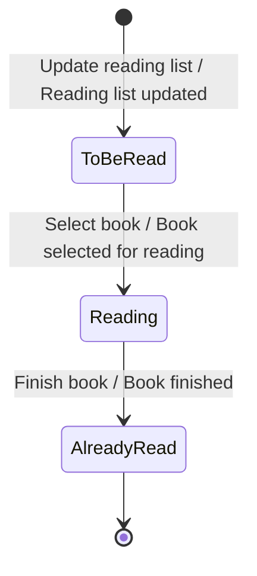

# The invariant catalogue

Contents:

1. Reading the stickies: what each colour can tell you about rules
2. The seven categories, one by one
3. The five tests in full
4. Gherkin conventions
5. The cross-context demotion recipe
6. Status models: reading state stickies off a board
7. Anti-signal catalogue — what is not an invariant

---

## 1. Reading the stickies: what each colour can tell you about rules

Colour conventions vary by board and by facilitator. Read the **role**, not the
hue, and say in §1 of the output how you mapped them. The table below uses the
common Brandolini palette.

| Sticky | Role | What it yields |
|---|---|---|
| Orange, past tense | Domain event | The success. Its rule is *what had to be true for this to be allowed*. Terminal events yield absorbing states. |
| Blue | Command | The richest seam. Every command has a failure list; that list is the guard set. |
| Large yellow | Aggregate | The consistency boundary. Every invariant must name one. |
| Small yellow + person | Actor | Authorization rules. Two actors on one command = a contested rule, not two rules. |
| Green | Read model | *What someone checks before deciding.* The check is the guard — usually an **advisory** one (test 5). |
| Lilac / pink | Policy, or external system | A policy is a rule that could not be an invariant. An external system marks a border: rules across it are always policies. |
| Small annotation with a status word | State | The status model. See §6 below — the highest-yield stickies on the board. |
| Red | Hotspot | An argument. People argue about rules; copy them through verbatim. |
| Purple/brown, "whenever…" | Policy | Same as lilac. Read the trigger and the reaction as the two halves of an eventual-consistency pair. |

Two boards in three carry a sticky type the legend does not explain. Ask rather
than guess: a state sticky misread as a read model deletes an entire status
model, and a provenance mark misread as an automation flag invents a policy.

---

## 2. The seven categories, one by one

Work these **in order** for each aggregate. The order matters: state rules
constrain precondition rules, and precondition rules make cardinality rules
obvious. Skipping to whatever the board makes loud produces three good rules and
misses nine.

### A. State invariants

**Ask:** which states can this thing be in, and which moves between them are
legal?

**Evidence:** state stickies; the creating event; the terminal event; commands
that only make sense in some states.

**Yields:** the legal-transition rule, one guard rule per command, the
terminal-state rule, the no-backward rule.

**Micro-example:** *A Reading list entry MUST move only To be read → Reading →
Already read.* Rejection: `Finish book` on an entry in *To be read* is refused
with "you have not started this book".

**Misfires when:** the "states" are really two different aggregates (a *Cart*
and an *Order* are not two states of one thing), or when the status word is a
processing note (*Synced*, *Automatic updated*, *Pending*) — see §6.

### B. Precondition invariants (guards)

**Ask:** for this command, what are three separate reasons the business would
say no?

**Evidence:** the read models attached to the command; the aggregate's own data;
the actor.

**Yields:** the classic hidden rules. *A copy MUST be available before it may be
lent.* *A Member MUST NOT be blocked.* *A Text position MUST lie within the
book.*

**Elicitation prompts that work in a room:** "when does this fail?" · "who has
had to override this?" · "what does the screen say when it refuses?" · "has
anyone ever done this twice by accident?"

**Alone:** the strongest category. If a command yields exactly one guard, you
worked it shallowly.

**Misfires when:** the "precondition" is a workflow step in disguise ("must have
searched first"). Test it: would the business refuse someone who skipped it?

### C. Cardinality and uniqueness invariants

**Ask:** how many? at most? at least? exactly one what per what?

**Evidence:** loops and repeated events (can it happen twice?); list-shaped
read models; the plural nouns in the ubiquitous language.

**Yields:** *At most one open Lending per copy.* *At most one Reading list entry
per Member per Catalog Entry.* *A Note MUST have exactly one Text position.*
*A Member MUST NOT hold more than `<n>` concurrent loans.*

**Note the two directions.** Uniqueness ("at most one active X") is usually a
real invariant; a *limit* ("at most n") is usually real but with the number
missing — write `<n>` and add it to the §7 list. Never invent the number.

**Misfires when:** the count is a business *target* rather than a *rule*
("members should read 12 books a year").

### D. Intra-aggregate consistency invariants

**Ask:** which two pieces of data inside this aggregate must agree?

**Evidence:** totals, counts, sums, coverage, derived fields, denormalised
copies.

**Yields:** *Copies on loan + copies on shelf MUST equal copies owned.* *An
entry's state MUST be Already read if and only if its finished date is set.*

**Why it matters:** this is the category that justifies the aggregate's
existence. An aggregate with no invariant of type D is usually two aggregates
that were merged for convenience, or one that should be a plain entity — say so
in §7.

### E. Ordering / temporal invariants

**Ask:** must A have happened before B, and would the business actually refuse B
otherwise?

**Evidence:** the timeline; dependencies between aggregates within one context;
dates and deadlines.

**Yields:** *A Note MUST NOT be created for a Text position that does not
exist.* *A loan's due date MUST be after its start date.*

**The trap:** most apparent ordering rules are **cross-context** and become
policies. Ordering rules survive only when both events belong to the same
context — and often only when both belong to the same aggregate.

### F. Authorization invariants

**Ask:** who may issue this command, and is that a business rule or an IT
policy?

**Evidence:** the actor stickies; a command that appears twice with different
actors; the external-system stickies.

**Yields:** *Only the Member who owns a Reading list may tag it.* *Only a Reader
may mark text in a book they are reading.*

**Keep only the business half.** "Must be logged in" is infrastructure. "Only
the owner" is domain — it constrains what the model must know about ownership,
which is why it belongs here.

**Misfires when:** the rule is really about *roles in an org chart* that the
system has never modelled. Then it is a §7 gap.

### G. Lifecycle invariants

**Ask:** how does this come into existence, and how does it end?

**Evidence:** the creating command; the absence of a deleting command;
terminal events; the aggregate's identity.

**Yields:** *A Reading list entry MUST NOT exist without a Catalog Entry
reference.* *A finished entry MUST NOT be deleted; it becomes history.* *Identity
is assigned at creation and MUST NOT change.*

**The high-value question here is deletion.** Boards almost never show it, and
"what happens when someone leaves / cancels / is removed" reliably uncovers
either an invariant or a missing context.

---

## 3. The five tests in full

### Test 1 — The always test

**Ask:** is there any moment, however brief, in which this may be false and then
repaired?

**Evidence of failure:** a policy sticky doing the repairing; a status word like
*Automatic updated*; a nightly job; an external system in the loop; the phrase
"it syncs" anywhere in the discussion.

**Misfires when:** you confuse *the transaction being brief* with *the rule being
temporarily false*. A rule enforced inside one transaction is an invariant even
if the transaction takes 200ms.

### Test 2 — The single-owner test

**Ask:** name the one aggregate that holds every piece of data needed to decide.

**Evidence of failure:** the rule's sentence contains two aggregate names, and
neither one can read the other's internals without a query.

**What to do:** three options, and you must say which you recommend — (a) the
aggregates are wrongly drawn, merge them; (b) the rule belongs to the other one,
move it; (c) accept a lag, demote to §6. Option (a) is right more often than
teams expect on boards where aggregates were drawn per-noun.

### Test 3 — The context test

**Ask:** is every noun in this rule owned by this context, in this context's
meaning?

**Evidence of failure:** a term that another context's bubble also contains; a
rule whose enforcement would need a synchronous call across a border.

**Subtlety:** a context may hold a **local copy** of a foreign concept — Lending
holds enough of a Catalog Entry to lend it. A rule over the local copy is a
legitimate local invariant *about the copy*, with a staleness caveat about the
original. State it that way rather than pretending the border is not there.

### Test 4 — The rejection test

**Ask:** what does the business say, to whom, and what do they do instead?

**Evidence of failure:** you can only phrase the rejection as "it would be
inconsistent" or "the data would be wrong". That is a data-integrity concern,
not a business rule; if it matters it will belong to category D and have a
business consequence you can name.

**Why this test is load-bearing:** it is the only one a domain expert can answer
without knowing any of this vocabulary. Ask them the rejection, not the rule.

### Test 5 — The decision-data test

**Ask:** at the instant of the decision, is the data inside the transaction, or
is it a projection?

**Evidence of failure:** a green read-model sticky is the only thing the command
consults.

**What to do:** keep the rule, mark it **advisory**, and name either (a) the real
enforcement point downstream, or (b) the compensating action when two requests
race. A library that occasionally double-lends and phones the second member is
running an advisory rule with a compensation, and that is a legitimate design —
but it must be written down as one.

---

## 4. Gherkin conventions

- **One aggregate per `Given` line.** If a `Given` needs two aggregates, test 2
  probably failed and you are writing a policy scenario, not an invariant one.
- **The `When` is always a command**, named exactly as the blue sticky, issued
  by an actor: `When Member "M-42" issues Borrow book for …`. Never a UI action
  ("clicks the button"), never a passive event.
- **The `Then` has two halves:** the refusal in the business's words, and the
  state that did **not** change. The second half is what makes the scenario a
  test rather than an assertion about an error message.
- **Vocabulary is context-local.** Only terms from this context's own language;
  if the same word means something else next door, that is fine and needs no
  note here.
- **Name the scenario after the rule, not the mechanics.** *"A copy on loan
  cannot be borrowed again"*, not *"Test borrow validation"*.
- **Advisory rules say so in the name** — *"…is rejected on a best-effort
  basis"* — and come in pairs: the guard scenario and the compensation scenario.
- **State-machine rules get a violation scenario per forbidden move you care
  about**, not one per absent arrow. Pick the moves someone would actually
  attempt.
- **Tag optionally** with the invariant id: `@INV-LEND-02`.

Example pair for an advisory rule:

```gherkin
@INV-LEND-01
Scenario: Availability is checked against the lending list on a best-effort basis
  Given the Catalog Entry "Domain-Driven Design" shows 1 copy available
   When Member "M-42" issues Borrow book for "Domain-Driven Design"
   Then the loan is created

@INV-LEND-01
Scenario: A race on the last copy is compensated, not prevented
  Given two Members issue Borrow book for the last copy of "Domain-Driven Design"
   When both commands pass the availability check
   Then exactly one loan stands
    And the other Member is offered a reservation
```

---

## 5. The cross-context demotion recipe

A rule that fails test 1, 2 or 3 goes to §6 in this shape. Keep all six fields —
teams look for their rule by its original wording, and dropping the compensation
is what makes a demotion feel like a dismissal.

```
X-01 · "A member can only read a book they have borrowed."
  Stated by     the board's Reading context, implied by Book selected for reading
  Fails         test 3 — "borrowed" is owned by Lending, "Reading list entry" by Reading
  Policy        whenever Book borrowed (Lending), then Update reading list (Reading)
  Local data    Reading holds a Reading list entry referencing a Catalog Entry;
                it does not hold the loan
  Staleness     the board says "Automatic updated" — seconds to minutes, unbounded
                if the Reading Service is down
  Compensation  an entry whose loan has ended is marked returned, not deleted;
                notes survive. Confirm with the domain expert.
```

Three things to get right:

- **Verbatim first.** Write the rule the way the business said it, before your
  analysis of it. Otherwise the demotion reads as a rewrite.
- **Name the failing test, once, in one line.** Not a paragraph of theory.
- **If nobody can name the compensation, that is the finding.** Write "no
  compensating action known" and put it in §7 as a question. A rule the business
  has never had to repair is usually a rule that has never actually been
  violated — which means either it is enforced somewhere nobody mentioned, or it
  matters less than claimed. Both are worth knowing.

---

## 6. Status models: reading state stickies off a board

The single highest-yield move in this method, and the easiest to get wrong.

**Step 1 — Find them.** State stickies are small, sit near an event, and carry a
*status word or short phrase* rather than a noun or a verb: *To be read*,
*Reading*, *Already read*, *Approved*, *Overdue*. They are frequently drawn in a
colour the legend does not name.

**Step 2 — Attribute each one.** An event touches several things; the state
belongs to exactly one of them. Ask: *which thing is now in this state?* On a
library board, *To be read* attached to *Reading list updated* belongs to the
**Reading list entry**, not the Reading list and not the Book — because it is the
entry that will later be *Reading* and then *Already read*. Getting this wrong
produces a state machine for the wrong aggregate, and the error is invisible
afterwards.

Diagnostic: **the states of one aggregate form a chain.** If your attributions
give one aggregate three unrelated states and another none, re-attribute.

**Step 3 — Add the states nobody wrote.** Boards record states that were reached
by an event on the board. Add:

- the **initial** state the creating event produces
- any state implied by a rejection ("blocked", "overdue") that a command
  mentions but no event produced
- the **terminal** state, and whether it is truly absorbing

Mark every added state as *implied* or *inferred*; never present it as read.

**Step 4 — Distinguish business states from processing notes.** *Automatic
updated*, *Synced*, *In progress*, *Pending* describe the machinery, not the
business. When an aggregate's only "state" is a processing note, do not build a
state machine for it — record in §7 that its real states were never elicited, and
suggest the question: *"What can a lending be, from the librarian's point of
view, between borrowed and returned?"*

**Step 5 — Draw it, then write the refusals.** The Mermaid diagram is the
summary; the invariants are the arrows you did **not** draw. A state machine
published without its forbidden moves has communicated nothing enforceable.



Mermaid notes that avoid rendering failures: state ids must be single tokens
(`ToBeRead`), so put the domain spelling in a `state "To be read" as ToBeRead`
line when the exact wording matters; label transitions `Command / Event`; use
`[*]` for both initial and terminal; avoid `:` inside labels.

---

## 7. Anti-signal catalogue — what is not an invariant

| Looks like a rule | Actually | What to do |
|---|---|---|
| "An entry has a state" | Data model | Drop; it cannot be violated |
| "The member searches, then borrows" | Workflow | Test 4: would they refuse a member who skipped it? Usually no → drop |
| "ISBN must be 13 digits" | Format validation | Schema, not §4 — unless a wrong ISBN has a named business consequence |
| "Members should read 12 books a year" | Target / KPI | Drop; note in §7 if it drives a feature |
| "The reading list is always up to date" | Eventual consistency | §6 policy with staleness |
| "A book must be borrowed before it is read" | Cross-context ordering | §6 policy |
| "Only logged-in users can borrow" | Infrastructure | Drop; keep "only the owning member" |
| "The system must not lose notes" | Quality attribute | Drop; it is a requirement, not an invariant |
| "Overdue books incur a fee" | Business *process* | Not an invariant — it is a policy plus, possibly, a state (*Overdue*). Split it |
| "Two members cannot borrow the same copy" | Usually **advisory** in practice | Keep, mark advisory (test 5), name the compensation |