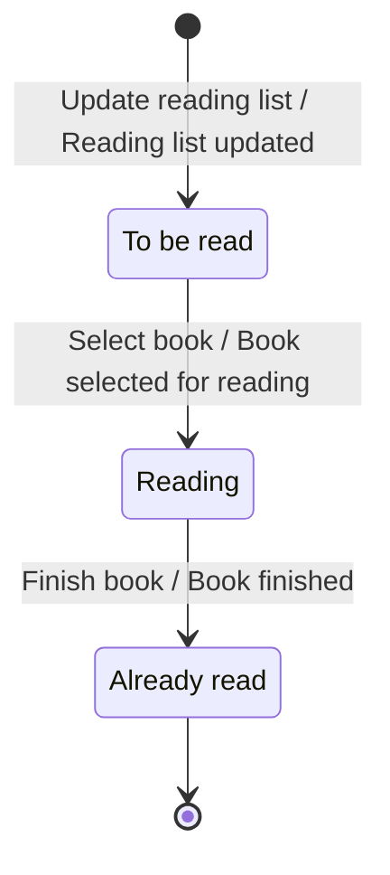
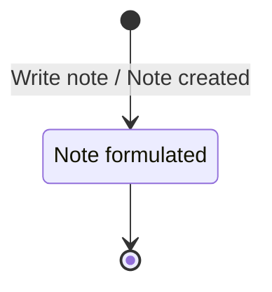

# Worked example — a three-context library board

An eight-event board with three context bubbles drawn by the team: **Catalog
management**, **Lending**, **Reading**. Read this end to end when unsure how
deep to go, how to attribute state stickies, or how firmly to demote a rule.

Abridged: §4 shows every invariant but only some scenarios, and §5 is folded
into §4. A real sheet carries a scenario for each.

---

## 1. Board as read

| # | Event | Command (actor) | Aggregate touched | Read models consulted | State left behind |
|---|---|---|---|---|---|
| 1 | Book searched | Search book (Member) | — (query only) | Catalog, Catalog Entry | *Searches on catalog* |
| 2 | Book borrowed | Borrow book (Member) | Lending list | Catalog Entry, Member | *Automatic updated* |
| 3 | Reading list updated | Update reading list (**Reading Service**, external) | Reading list entry | Reading list | *To be read* |
| 4 | Reading list tagged | Tag list (Member) | Reading list | — | — |
| 5 | Book selected for reading | Select book (Reader) | Reading list entry | Book | *Reading* |
| 6 | Text marked | Mark text (Reader) | Text position | Book | *Note created* (?) |
| 7 | Note created | Write note (Reader) | Note | Text position | *Note formulated* |
| 8 | Book finished | Finish book (Reader) | Reading list entry | — | *Already read* |

Assumptions flagged before deriving anything:

- **Events 6 and 7 loop.** A reader marks and notes repeatedly before finishing.
  The board's return arrow supports this; confirm.
- **The state on event 6 reads *Note created*, which is the name of event 7.**
  Most likely a mislabel — the Text position's own state after marking is
  something like *Marked*, and *Note created* is what event 7 leaves. Both
  readings are carried below; this needs one sentence from the team.
- ***Searches on catalog*** **is not a business state.** Nothing later in the
  board depends on it and no command is refused because of it. Treated as an
  activity note, not a status (catalogue §6, step 4).
- ***Automatic updated*** **is a processing note**, not a business state — see
  §7. This is why no Lending state machine appears in §3.
- **Actor split.** *Member* issues the Catalog and Lending commands; *Reader*
  issues the Reading commands. Read as one person in two roles, not two people;
  confirm, because it decides INV-READ-09.

---

## 2. Consistency boundaries

| Context | Aggregate | Root identity | Commands | States owned | Data held |
|---|---|---|---|---|---|
| Catalog management | Catalog Entry | ISBN / shelf mark | *(none on board)* | — | bibliographic data |
| Lending | Lending | loan id (Member × copy) | Borrow book | *(none elicited)* | loan period, copy ref, member ref |
| Lending | Reading list | Member | Update reading list, Tag list | — | entries, tags |
| Reading | Reading list entry | entry id | Select book, Finish book | To be read, Reading, Already read | book ref, progress |
| Reading | Note | note id | Write note | Note formulated | text, one Text position |
| Reading | Text position | — (value object in Note) | Mark text | *Marked* (?) | book ref, offset/extent |

Three things this table already reveals:

- **Catalog management has an aggregate with no commands.** A context named
  *management* that only serves a query is a read side. Either the cataloguing
  commands were out of scope, or they were never elicited (§7).
- **The Reading list entry is created in Lending (event 3) and lived in Reading
  (events 5 and 8).** It straddles the border. This is the board's most
  important finding and is worked in §7.
- **Text position has a command but is modelled as part of a Note.** Either it
  is an aggregate in its own right, or *Mark text* is really a step of *Write
  note*. Decided provisionally as a value object owned by Note; see INV-READ-07.

---

## 3. Status models

### 3.1 Reading list entry — the one status model the board actually gives

States: *To be read* (from event 3), *Reading* (5), *Already read* (8). Initial
state is *To be read*, produced on creation. No state for an entry whose loan
ended — see §7.

| From | Command | Event | To | Guard |
|---|---|---|---|---|
| *(none)* | Update reading list | Reading list updated | To be read | no open entry for this Member × Catalog Entry |
| To be read | Select book | Book selected for reading | Reading | the entry belongs to this Reader |
| Reading | Finish book | Book finished | Already read | — |
| Already read | *(none on board)* | — | — | absorbing |



**The invariants this machine asserts** — the value is in the arrows that are
not drawn:

- **INV-READ-01 (legal transitions)** — an entry MUST move only *To be read* →
  *Reading* → *Already read*.
- **INV-READ-02 (guard)** — *Select book* is accepted only in *To be read*.
- **INV-READ-03 (guard)** — *Finish book* is accepted only in *Reading*. A
  reader cannot finish a book they never started.
- **INV-READ-04 (terminal)** — *Already read* is absorbing: neither *Select
  book* nor *Finish book* is accepted there. **What the business does instead is
  unknown** — re-reading is a real thing and the board has no command for it
  (§7).
- **INV-READ-05 (no backward)** — there is no move back to *To be read*.
  Abandoning a book is therefore unmodelled: today the entry stays in *Reading*
  forever. Confirm whether that is intended.

### 3.2 Note

States: *Note formulated* (event 7). One state is not a state machine, but it is
enough to assert a lifecycle rule.



- **INV-READ-06** — a Note comes into existence already formulated; there is no
  draft state. If the product wants drafts, that is a new state, not a flag.

### 3.3 Lending — deliberately absent

The Lending aggregate carries one annotation, *Automatic updated*, which
describes the machinery that refreshes the reading list, not a state a librarian
would recognise. **No state machine is derived.** The real states (*On loan*,
*Overdue*, *Returned*, *Lost*) were never elicited — see §7 and the question
listed there.

---

## 4. Invariants by bounded context

### Catalog management

```
INV-CAT-01 · Entry identity
A Catalog Entry MUST be uniquely identified within the Catalog.
  Kind        uniqueness            Aggregate  Catalog Entry
  Triggered   (cataloguing commands, not on board)
  Rejection   "this title is already catalogued under <shelf mark>"
  Evidence    Catalog / Catalog Entry read models   Confidence  implied

INV-CAT-02 · Non-empty search
A search MUST carry at least one criterion.
  Kind        precondition          Aggregate  — (query)
  Triggered   Search book
  Rejection   "enter a title, author or shelf mark"
  Evidence    Search criteria sticky                Confidence  inferred

INV-CAT-03 · Result integrity
Every entry in a Result list MUST exist in the Catalog at the time of the search.
  Kind        intra-aggregate       Aggregate  Catalog
  Rejection   a stale result opens to "this title is no longer catalogued"
  Evidence    Result list sticky                    Confidence  implied
```

**Availability is deliberately absent here.** *Is a copy on the shelf* is a
Lending fact; the Catalog does not know about loans on this board. That is the
context test doing its job — see X-04 in §6.

### Lending

```
INV-LEND-01 · Availability before lending
A Catalog Entry MUST have at least one copy not currently on loan before
Borrow book may succeed.                                          [ADVISORY]
  Kind        precondition          Aggregate  Lending
  Triggered   Borrow book
  Rejection   "no copy available; the next is due back on <date>"
  Evidence    Catalog Entry read model consulted by Borrow book
  Confidence  implied
  Advisory    the check reads a projection; two members can pass it in the same
              second. Real enforcement is the copy-level lock in INV-LEND-04;
              compensation is a reservation offer.

INV-LEND-02 · Borrowing limit
A Member MUST NOT hold more than <n> concurrent loans.
  Kind        cardinality           Aggregate  Lending list (root: Member)
  Triggered   Borrow book
  Rejection   "you have reached your borrowing limit; return a book first"
  Evidence    Member + Lending list consulted by Borrow book
  Confidence  inferred — <n> not on the board

INV-LEND-03 · Member standing
Only a Member in good standing may borrow.
  Kind        precondition          Aggregate  Lending
  Rejection   "your membership has expired" / "settle your fees first"
  Evidence    Member read model on Borrow book   Confidence  inferred

INV-LEND-04 · One open loan per copy
At most one open Lending MUST exist for a copy at any time.
  Kind        uniqueness            Aggregate  Lending
  Rejection   "that copy is already on loan"
  Evidence    Lending list                       Confidence  implied
  Note        this is the rule that actually holds the line for INV-LEND-01.

INV-LEND-05 · Copy accounting
copies on loan + copies on shelf MUST equal copies owned.
  Kind        intra-aggregate       Aggregate  Lending (per Catalog Entry)
  Rejection   the count refuses to balance; a stock check is raised
  Confidence  implied — and the rule that justifies Lending owning copies at all

INV-LEND-06 · Reading list ownership
A Reading list MUST belong to exactly one Member, and only that Member may tag it.
  Kind        authorization         Aggregate  Reading list
  Triggered   Tag list
  Rejection   "you can only tag your own reading list"
  Evidence    Member actor on Tag list           Confidence  implied

INV-LEND-07 · One entry per book per member
At most one open Reading list entry MUST exist per Member per Catalog Entry.
  Kind        uniqueness            Aggregate  Reading list
  Triggered   Update reading list
  Rejection   the entry is refreshed, not duplicated
  Evidence    Reading list read model on Update reading list
  Confidence  inferred — and contested: re-reading may legitimately want a
              second entry. See INV-READ-04.

INV-LEND-08 · Entries reference a real title
A Reading list entry MUST reference a Catalog Entry that exists.
  Kind        lifecycle             Aggregate  Reading list
  Rejection   the update is rejected and the discrepancy logged for the librarian
  Confidence  implied
  Note        Lending holds a local copy of the title; the rule is over that
              copy, so a title withdrawn from the Catalog does not retroactively
              break it.
```

```gherkin
@INV-LEND-01 @INV-LEND-04
Scenario: The last copy cannot be lent twice
  Given the Catalog Entry "Domain-Driven Design" has 1 copy
    And that copy is on loan to Member "M-17"
   When Member "M-42" issues Borrow book for "Domain-Driven Design"
   Then the command is rejected with "no copy available"
    And the Lending list is unchanged

@INV-LEND-02
Scenario: A member at the borrowing limit is refused
  Given Member "M-42" holds <n> open loans
   When Member "M-42" issues Borrow book for any available copy
   Then the command is rejected with "borrowing limit reached"
    And no loan is created
```

### Reading

```
INV-READ-01..06 · see §3 (status-model invariants)

INV-READ-07 · Notes need a place
A Note MUST have exactly one Text position, and MUST NOT exist without it.
  Kind        cardinality + lifecycle   Aggregate  Note
  Triggered   Write note
  Rejection   "mark a passage before writing a note"
  Evidence    Text position read model consulted by Write note
  Confidence  on the board

INV-READ-08 · Positions lie inside the book
A Text position MUST fall within the extent of the Book it refers to.
  Kind        precondition          Aggregate  Note (Text position)
  Triggered   Mark text
  Rejection   "that passage is not in this book"
  Evidence    Book read model on Mark text       Confidence  implied

INV-READ-09 · Only the reader annotates
Only the Reader who owns the Reading list entry may mark text or write notes
against it.
  Kind        authorization         Aggregate  Reading list entry
  Rejection   "these are someone else's notes"
  Evidence    Reader actor on events 5–8         Confidence  implied

INV-READ-10 · Annotating requires an active reading
Mark text and Write note are accepted only while the entry is in Reading.
  Kind        precondition (state)  Aggregate  Reading list entry
  Rejection   "open the book first" / "you have finished this book"
  Evidence    events 6–7 sit between 5 and 8     Confidence  implied
  Contested   many readers annotate after finishing. Ask before enforcing.

INV-READ-11 · Notes outlive the reading
Finishing a book MUST NOT delete its notes.
  Kind        lifecycle             Aggregate  Note
  Rejection   —  (a rule about what the system must not do to itself; kept
              because a named business consequence exists: the reader's
              annotations are the product)
  Confidence  inferred
```

```gherkin
@INV-READ-03
Scenario: A book that was never started cannot be finished
  Given a Reading list entry for "Domain-Driven Design" in state "To be read"
   When the Reader issues Finish book for that entry
   Then the command is rejected with "you have not started this book"
    And the entry remains in state "To be read"

@INV-READ-04
Scenario: A finished book cannot be re-opened on the same entry
  Given a Reading list entry for "Domain-Driven Design" in state "Already read"
   When the Reader issues Select book for that entry
   Then the command is rejected with "you have already read this book"
    And the entry remains in state "Already read"

@INV-READ-07
Scenario: A note needs a marked passage
  Given a Reading list entry in state "Reading" with no marked text
   When the Reader issues Write note
   Then the command is rejected with "mark a passage before writing a note"
    And no Note is created
```

---

## 5. Scenarios

Folded into §4 above. On a full board, one violation scenario per invariant.

---

## 6. Not invariants

```
X-01 · "You can only read a book you have borrowed."
  Stated by     implied by the board's arrow from Lending into Reading
  Fails         test 3 — "borrowed" is owned by Lending, the entry by Reading
  Policy        whenever Book borrowed (Lending), then Update reading list
  Local data    Reading sees a Reading list entry; it never sees the loan
  Staleness     the board says "Automatic updated" via the Reading Service —
                seconds normally, unbounded while that service is down
  Compensation  none known. The board has no path for an entry whose loan ended
                → §7 question.

X-02 · "Every borrowed book is on the member's reading list."
  Fails         test 1 — an external service updates the list after the fact
  Policy        as X-01
  Staleness     as X-01
  Compensation  a reconciliation run; not on the board. Ask whether one exists.

X-03 · "A returned book can no longer be read."
  Fails         test 3, and test 2 — no aggregate holds both the loan and the
                entry
  Policy        whenever Book returned (Lending) — a command missing from the
                board — then close the entry (Reading)
  Compensation  the reader keeps their notes; the entry stops accepting Mark
                text. Needs a state Reading does not currently have (§7).

X-04 · "Search results show only available books."
  Fails         test 3 — availability is a Lending fact, the Catalog does not
                hold it; and test 5 if the Catalog subscribes to a projection
  Policy        Lending publishes availability; Catalog decorates results with a
                replica
  Staleness     minutes is acceptable — the member walks to the shelf anyway
  Compensation  the member is offered a reservation at the desk

Dropped candidates
- "A member must search before borrowing." — workflow, not a rule. Test 4: a
  member arriving with a shelf mark is not refused.
- "ISBN must be 13 digits." — format validation; belongs in the schema.
- "Members should read 12 books a year." — a target, not a rule.
- "The system must not lose notes." — a quality attribute. INV-READ-11 carries
  the domain half of it.
```

---

## 7. Gaps, hotspots and open questions

**The straddling aggregate — the board's biggest finding.** The Reading list
entry is created in **Lending** (event 3, state *To be read*) and lives its
remaining life in **Reading** (events 5 and 8). Its state machine crosses a
context border, which means no single context can enforce INV-READ-01. Three
resolutions, in order of preference:

1. **Move creation into Reading.** Lending publishes *Book borrowed*; Reading
   owns the entry and every one of its states. Cleanest, and makes INV-READ-01
   enforceable. Lending keeps the Reading list only if it needs it, which it
   probably does not.
2. **Split the model in two.** Lending owns a *reading intention*, Reading owns
   a *reading*, and *To be read* stops being a state of the same object. More
   honest if both sides really do have behaviour.
3. **Merge the contexts.** Only if the two keep needing each other's internals —
   the board does not currently show that.

**Missing states.** Lending has none (see §3.3). *Automatic updated* is a
processing note. The question to ask: *"From the librarian's point of view, what
can a loan be between borrowed and returned?"* — expect *On loan*, *Overdue*,
*Renewed*, *Returned*, *Lost*, each with its own rules and at least one fee.

**Missing commands.**

- **No *Return book*.** The Lending lifecycle has no ending, which is why X-03
  has no policy trigger and why INV-LEND-05 cannot currently be maintained.
  This is the single largest hole in the board.
- **No re-read.** *Already read* is absorbing and nothing reopens it
  (INV-READ-04). Either a *Re-read* command or a second entry — which collides
  with INV-LEND-07, so the two must be decided together.
- **No abandon.** An entry in *Reading* can never leave except by finishing
  (INV-READ-05).
- **No cataloguing commands** in a context named *Catalog management*. Either
  scope or omission; ask.

**Probable mislabel.** The state on event 6 reads *Note created*, which is the
name of event 7. Confirm the Text position's own post-state.

**Numbers nobody supplied.** The whole agenda for the next workshop:

| Placeholder | Rule | Question |
|---|---|---|
| `<n>` loans | INV-LEND-02 | How many books at once? Does it vary by membership type? |
| loan period | (missing) | How long, and does renewing extend or restart it? |
| `<n>` notes | INV-READ-07 | May one passage carry several notes? |
| entries per list | INV-LEND-07 | Is a reading list bounded at all? |

**Questions that would settle an invariant, one sentence each.**

- *If a member finishes a book they never borrowed, is that an error or just
  unusual?* — decides whether X-01 has any enforcement at all.
- *When a loan ends while the entry is in Reading, what happens to the entry and
  to the notes?* — decides X-03 and the missing Reading state.
- *Can two members hold the last copy for a moment and one be phoned back?* —
  decides whether INV-LEND-01 stays advisory.
- *Is the Reader always the Member?* — decides INV-READ-09.
- *When someone rereads a book, is that the same entry or a new one?* — decides
  INV-READ-04 and INV-LEND-07 together.

**Hotspots.** None drawn on this board. Their absence in a board with a missing
*Return book* command and a straddling aggregate suggests the session ran short
rather than that the domain is uncontested — worth saying out loud.