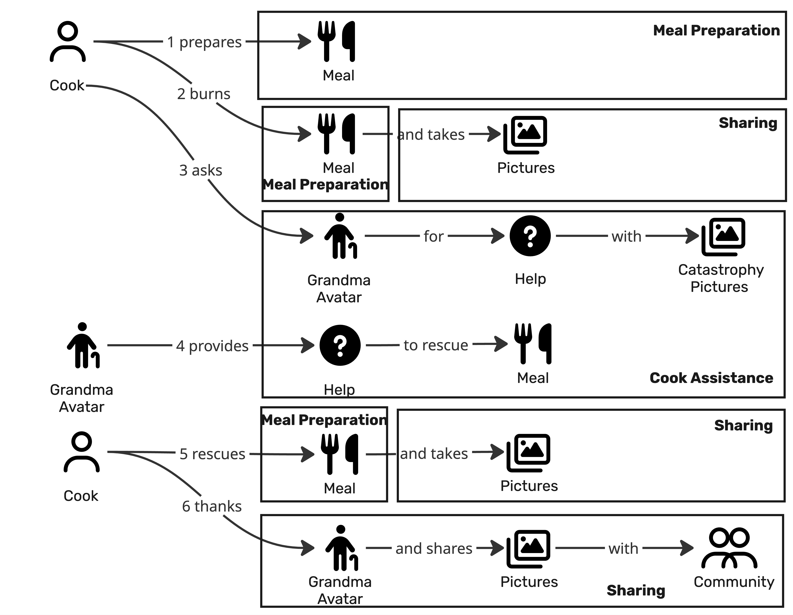
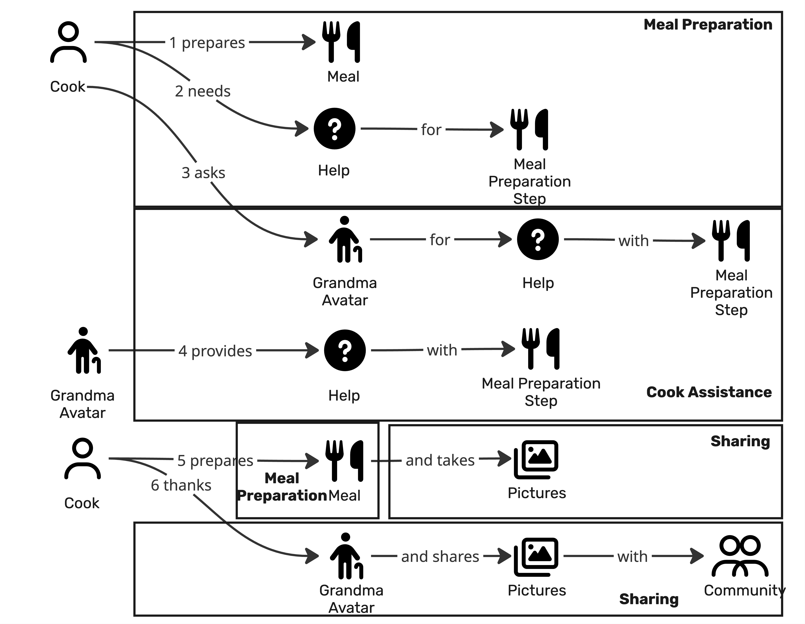
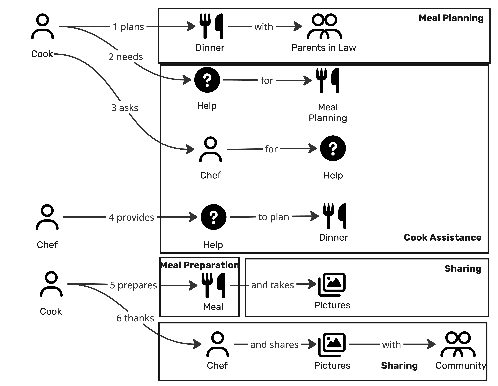
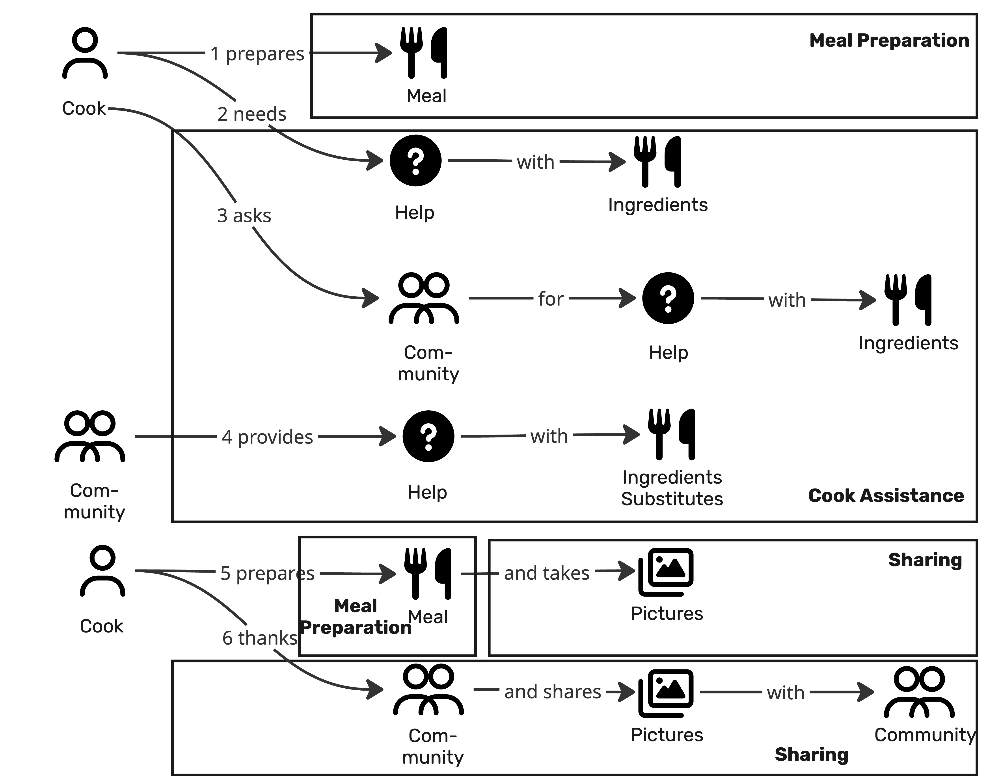
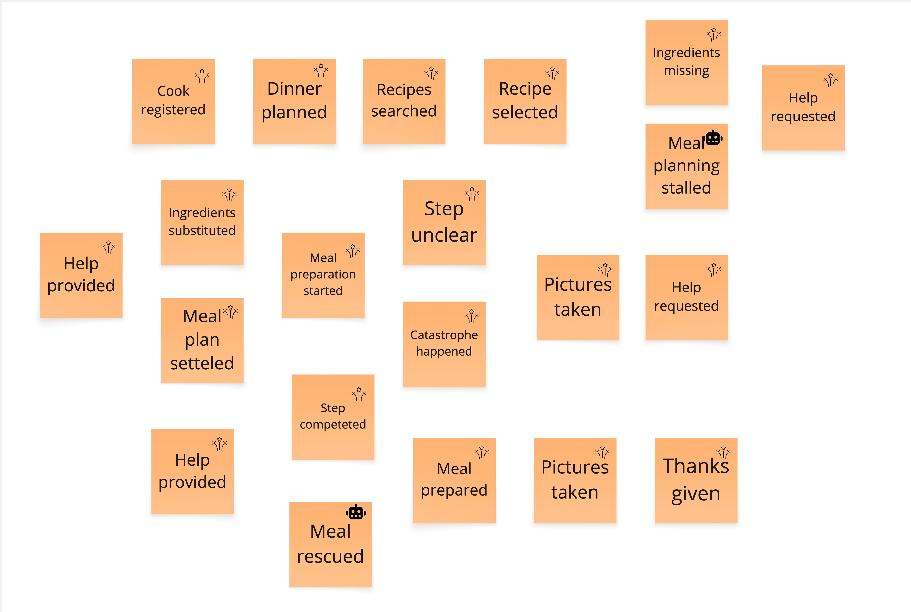
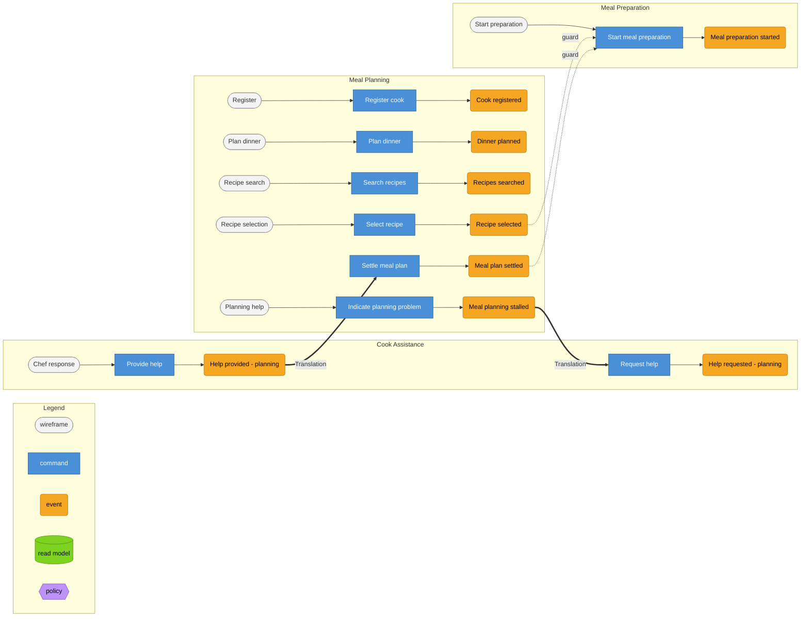
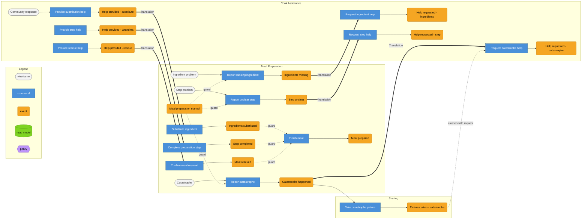
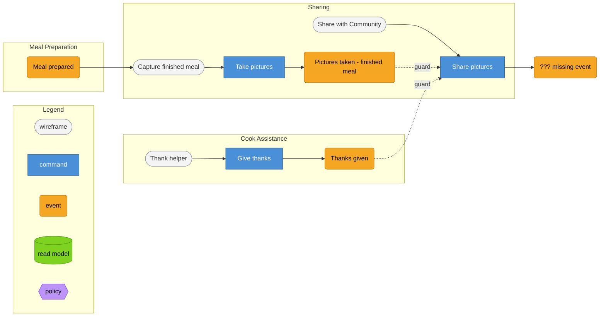

# Prompt 2026-009-01

Create an Event Model based on the provided Domain Stories and the provided events. Use the provided skill.











[Skill](../Skills/CreateEventModelSkill/SKILL.md)

[Event Modeling Reference](../Skills/CreateEventModelSkill/references/event-modeling-method.md)

[Mermaid grid](../Skills/CreateEventModelSkill/references/mermaid-grid.md)

[Worked example](../Skills/CreateEventModelSkill/references/worked-example.md)

# Answer

# Event Model — Assisted Home Cooking

I treated the four Domain Stories as **variants of one end-to-end cooking process**, not as four separate processes: meal planning can lead into meal preparation; during either phase the cook may ask a Chef, the Community, or the Grandma Avatar for assistance; successful preparation then flows into sharing. This follows the supplied skill's requirement for one chronologically ordered event spine across all bounded-context swimlanes.

I kept the supplied Bounded Context names unchanged: **Meal Planning**, **Cook Assistance**, **Meal Preparation**, and **Sharing**. I also reused the supplied candidate events rather than silently replacing them; where the same event name occurs for different purposes, I qualify the occurrence in parentheses, following the approach demonstrated in the worked example.

## 0. Inputs

### Domain Story A — Ask Chef

1. Cook plans Dinner with Parents in Law.
2. Cook needs Help for Meal Planning.
3. Cook asks Chef for Help.
4. Chef provides Help to plan Dinner.
5. Cook prepares Meal and takes Pictures.
6. Cook thanks Chef and shares Pictures with Community.

### Domain Story B — Ask Community

1. Cook prepares Meal.
2. Cook needs Help with Ingredients.
3. Cook asks Community for Help with Ingredients.
4. Community provides Help with Ingredient Substitutes.
5. Cook prepares Meal and takes Pictures.
6. Cook thanks Community and shares Pictures with Community.

### Domain Story C — Ask Grandma Avatar for a preparation step

1. Cook prepares Meal.
2. Cook needs Help for a Meal Preparation Step.
3. Cook asks Grandma Avatar for Help with the Meal Preparation Step.
4. Grandma Avatar provides Help with the Meal Preparation Step.
5. Cook prepares Meal and takes Pictures.
6. Cook thanks Grandma Avatar and shares Pictures with Community.

### Domain Story D — Ask Grandma Avatar after a catastrophe

1. Cook prepares Meal.
2. Cook burns Meal and takes Pictures.
3. Cook asks Grandma Avatar for Help with Catastrophe Pictures.
4. Grandma Avatar provides Help to rescue Meal.
5. Cook rescues Meal and takes Pictures.
6. Cook thanks Grandma Avatar and shares Pictures with Community.

### Supplied candidate events

The supplied consolidated event board contains:

`Cook registered` · `Dinner planned` · `Recipes searched` · `Recipe selected` · `Ingredients missing` · `Meal planning stalled` · `Help requested` ×2 · `Help provided` ×2 · `Meal plan settled` · `Meal preparation started` · `Step unclear` · `Catastrophe happened` · `Step completed` · `Meal rescued` · `Meal prepared` · `Pictures taken` ×2 · `Thanks given`

Two important observations before modeling:

* `Cook registered`, `Recipes searched`, and `Recipe selected` are supplied events, but no Domain Story sentence explicitly describes them.
* Every Domain Story ends with the cook **sharing Pictures with Community**, but there is **no supplied `Pictures shared` event**. Per the skill, that is a gap to surface rather than silently repair.

---

# 1. Big Picture

The merged timeline is:

1. **Cook registered** *(supplied, not traceable to a story sentence)*
2. **Dinner planned** *(A1)*
3. **Recipes searched** *(supplied; not explicit in A1)*
4. **Recipe selected** *(supplied; not explicit in A1)*
5. **Meal planning stalled** *(A2)*
6. **Help requested — planning** *(A3)*
7. **Help provided — planning** *(A4)*
8. **Meal plan settled** *(A4)*
9. **Meal preparation started** *(B1, C1, D1; also A5)*

Then the preparation process has three alternative assistance paths:

**Ingredient problem**
10a. **Ingredients missing** *(B2)*
11a. **Help requested — preparation** *(B3)*
12a. **Help provided — preparation** *(B4)*
13a. **Ingredients substituted** *(B4)*

**Unclear step**
10b. **Step unclear** *(C2)*
11b. **Help requested — preparation** *(C3)*
12b. **Help provided — preparation** *(C4)*
13b. **Step completed** *(C4/C5)*

**Catastrophe**
10c. **Catastrophe happened** *(D2)*
11c. **Pictures taken — catastrophe evidence** *(D2)*
12c. **Help requested — preparation** *(D3)*
13c. **Help provided — preparation** *(D4)*
14c. **Meal rescued** *(D5)*

The variants converge again:

15. **Meal prepared** *(B5/C5; compatible with D5 after rescue)*
16. **Pictures taken — finished meal** *(A5/B5/C5/D5)*
17. **Thanks given** *(A6/B6/C6/D6)*
18. **[GAP] Pictures shared** *(all story sentence 6 variants; no supplied event)*

This is deliberately a single spine with branches rather than four independent timelines. The method requires one shared chronology so that later commands can be checked against what the system knew earlier.

---

# 2. Swimlane strip

| #   | Event                                        | Bounded Context  | Source         |
| --- | -------------------------------------------- | ---------------- | -------------- |
| 1   | Cook registered                              | Meal Planning*   | supplied only  |
| 2   | Dinner planned                               | Meal Planning    | A1             |
| 3   | Recipes searched                             | Meal Planning    | supplied only  |
| 4   | Recipe selected                              | Meal Planning    | supplied only  |
| 5   | Meal planning stalled                        | Meal Planning    | A2             |
| 6   | Help requested *(planning)*                  | Cook Assistance  | A3             |
| 7   | Help provided *(planning)*                   | Cook Assistance  | A4             |
| 8   | Meal plan settled                            | Meal Planning    | A4             |
| 9   | Meal preparation started                     | Meal Preparation | A5, B1, C1, D1 |
| 10a | Ingredients missing                          | Meal Preparation | B2             |
| 11a | Help requested *(ingredients)*               | Cook Assistance  | B3             |
| 12a | Help provided *(substitution)*               | Cook Assistance  | B4             |
| 13a | Ingredients substituted                      | Meal Preparation | B4             |
| 10b | Step unclear                                 | Meal Preparation | C2             |
| 11b | Help requested *(step)*                      | Cook Assistance  | C3             |
| 12b | Help provided *(step)*                       | Cook Assistance  | C4             |
| 13b | Step completed                               | Meal Preparation | C4/C5          |
| 10c | Catastrophe happened                         | Meal Preparation | D2             |
| 11c | Pictures taken *(catastrophe evidence)*      | Sharing**        | D2             |
| 12c | Help requested *(catastrophe)*               | Cook Assistance  | D3             |
| 13c | Help provided *(rescue advice)*              | Cook Assistance  | D4             |
| 14c | Meal rescued                                 | Meal Preparation | D5             |
| 15  | Meal prepared                                | Meal Preparation | B5/C5          |
| 16  | Pictures taken *(finished meal)*             | Sharing          | A5/B5/C5/D5    |
| 17  | Thanks given                                 | Cook Assistance  | A6/B6/C6/D6    |
| 18  | **Pictures shared — missing supplied event** | Sharing          | A6/B6/C6/D6    |

* `Cook registered` does not clearly belong to any given context. Meal Planning is only a provisional placement because it occurs before the planning interaction.

** The catastrophe picture is tentatively placed in Sharing because the existing context cut gives us no image/evidence context. Its use is primarily assistance-related, so **Cook Assistance is an equally plausible owner**.

---

# 3. Workflow slices

The supplied method defines four slice shapes—State Change, State View, Automation, and Translation—and requires each slice to be specified accordingly.

## SLICE-01 — [State Change] Meal Planning — Register cook

**Traceability:** event supplied, but absent from every Domain Story.

**Wireframe**

* Registration
* action: Register

```gherkin
@SLICE-01 [State Change] Meal Planning
Scenario: A cook is registered
  Given no earlier event in the supplied model
   When Register cook
   Then Cook registered
```

**Finding:** the actual registration fields are not present in the source material, so they are intentionally unspecified.

---

## SLICE-02 — [State Change] Meal Planning — Plan dinner

**Wireframe**

* Dinner
* Guests: Parents in Law
* action: Plan dinner

```gherkin
@SLICE-02 [State Change] Meal Planning
Scenario: The cook plans dinner for the parents in law
  Given Cook registered
   When Plan dinner (occasion: Parents in Law)
   Then Dinner planned (occasion: Parents in Law)
```

The `occasion` value comes directly from Story A; its representation as a field is a modeling assumption.

---

## SLICE-03 — [State Change] Meal Planning — Search recipes

`Recipes searched` is supplied but not explicitly described by a story arrow.

**Wireframe**

* Recipe search
* action: Search

```gherkin
@SLICE-03 [State Change] Meal Planning
Scenario: The cook searches for recipes
  Given Dinner planned
   When Search recipes
   Then Recipes searched
```

This slice is **candidate/speculative**, because only the event board, not the Domain Stories, establishes it.

---

## SLICE-04 — [State Change] Meal Planning — Select recipe

```gherkin
@SLICE-04 [State Change] Meal Planning
Scenario: The cook chooses a recipe
  Given Recipes searched
   When Select recipe
   Then Recipe selected
```

Again, this is supported by the supplied event list but not by an explicit story sentence.

---

## SLICE-05 — [State Change] Meal Planning — Planning becomes stuck

Story A says the cook “needs Help for Meal Planning.” The supplied event gives that situation the name `Meal planning stalled`.

**Wireframe**

* current dinner/recipe
* Help action

```gherkin
@SLICE-05 [State Change] Meal Planning
Scenario: The cook cannot finish planning without assistance
  Given Dinner planned
   When Indicate planning problem
   Then Meal planning stalled
```

`Indicate planning problem` is **not present in the source material**; it is the minimum command needed to explain how the event enters the model. Whether the stall is instead detected automatically is an open question.

---

## SLICE-06 — [Translation] Meal Planning → Cook Assistance — Ask Chef

**Crosses:** the fact that meal planning is stalled and whatever planning subject the Chef must understand.

```gherkin
@SLICE-06 [Translation] Meal Planning → Cook Assistance
Scenario: A planning problem becomes a help request
  Given Meal planning stalled
   When Request help (topic: meal planning)
   Then Help requested (topic: meal planning)
```

This is a Translation because the Meal Planning fact is consumed as a Cook Assistance request; the method defines such a border crossing as Event-in-A → Command-in-B.

---

## SLICE-07 — [State Change] Cook Assistance — Chef provides planning help

**Responder wireframe**

* open help request
* planning advice
* action: Provide help

```gherkin
@SLICE-07 [State Change] Cook Assistance
Scenario: The Chef answers the planning request
  Given Help requested (topic: meal planning)
   When Provide help (responder: Chef)
   Then Help provided (responder: Chef)
```

---

## SLICE-08 — [Translation] Cook Assistance → Meal Planning — Settle plan

```gherkin
@SLICE-08 [Translation] Cook Assistance → Meal Planning
Scenario: Planning help lets the cook settle the meal plan
  Given Help provided (responder: Chef)
   When Settle meal plan
   Then Meal plan settled
```

The story says the Chef provides Help “to plan Dinner”; `Meal plan settled` is supplied as the resulting fact. Whether the cook explicitly confirms it or the system derives it is not established.

---

## SLICE-09 — [State Change] Meal Preparation — Start preparation

**Wireframe**

* selected meal/recipe
* action: Start preparation

```gherkin
@SLICE-09 [State Change] Meal Preparation
Scenario: The cook starts preparing the meal
  Given Recipe selected
   When Start meal preparation
   Then Meal preparation started
```

This exposes an important cross-context issue: `Recipe selected` belongs to Meal Planning, while starting preparation belongs to Meal Preparation. A formal Translation may be missing here; see §6.

---

# Ingredient-assistance branch

## SLICE-10A — [State Change] Meal Preparation — Ingredient missing

```gherkin
@SLICE-10A [State Change] Meal Preparation
Scenario: An ingredient needed during preparation is unavailable
  Given Meal preparation started
   When Report missing ingredient
   Then Ingredients missing
```

The command is inferred; Story B only states that the cook needs help with Ingredients.

---

## SLICE-11A — [Translation] Meal Preparation → Cook Assistance — Request substitution help

```gherkin
@SLICE-11A [Translation] Meal Preparation → Cook Assistance
Scenario: A missing ingredient becomes a help request
  Given Ingredients missing
   When Request help (topic: ingredients)
   Then Help requested (topic: ingredients)
```

---

## SLICE-12A — [State Change] Cook Assistance — Community provides substitute

```gherkin
@SLICE-12A [State Change] Cook Assistance
Scenario: The Community suggests an ingredient substitute
  Given Help requested (topic: ingredients)
   When Provide help (responder: Community, kind: ingredient substitute)
   Then Help provided (responder: Community)
```

---

## SLICE-13A — [Translation] Cook Assistance → Meal Preparation — Apply substitute

```gherkin
@SLICE-13A [Translation] Cook Assistance → Meal Preparation
Scenario: Suggested assistance resolves the ingredient problem
  Given Help provided (responder: Community)
   When Substitute ingredient
   Then Ingredients substituted
```

The source does not state whether substitution is automatic or explicitly confirmed by the cook. I modeled it as an explicit command rather than guessing that help alone changes preparation state.

---

# Unclear-step branch

## SLICE-10B — [State Change] Meal Preparation — Step unclear

```gherkin
@SLICE-10B [State Change] Meal Preparation
Scenario: The cook cannot understand a preparation step
  Given Meal preparation started
   When Report unclear step
   Then Step unclear
```

---

## SLICE-11B — [Translation] Meal Preparation → Cook Assistance — Ask Grandma Avatar

```gherkin
@SLICE-11B [Translation] Meal Preparation → Cook Assistance
Scenario: An unclear preparation step becomes a help request
  Given Step unclear
   When Request help (topic: meal preparation step)
   Then Help requested (topic: meal preparation step)
```

---

## SLICE-12B — [State Change / Automation candidate] Cook Assistance — Grandma Avatar responds

```gherkin
@SLICE-12B [State Change] Cook Assistance
Scenario: The Grandma Avatar provides help for the unclear step
  Given Help requested (topic: meal preparation step)
   When Provide help (responder: Grandma Avatar)
   Then Help provided (responder: Grandma Avatar)
```

I have **not** classified this as Automation because the supplied sources give no policy, timeout, or triggering rule. An Automation needs an explicit trigger/condition rather than “the system eventually answers.”

---

## SLICE-13B — [Translation] Cook Assistance → Meal Preparation — Complete step

```gherkin
@SLICE-13B [Translation] Cook Assistance → Meal Preparation
Scenario: The cook completes the previously unclear step
  Given Help provided (responder: Grandma Avatar)
   When Complete preparation step
   Then Step completed
```

---

# Catastrophe branch

## SLICE-10C — [State Change] Meal Preparation — Catastrophe happens

Story D says the cook burns the Meal.

```gherkin
@SLICE-10C [State Change] Meal Preparation
Scenario: The meal is burned during preparation
  Given Meal preparation started
   When Report catastrophe
   Then Catastrophe happened
```

There is a contested modeling call here: burning may be a real-world fact that happens independently rather than the result of a command. The system still needs some mechanism by which it learns that fact.

---

## SLICE-11C — [State Change] Sharing / Assistance seam — Capture catastrophe picture

```gherkin
@SLICE-11C [State Change] Sharing
Scenario: The cook photographs the catastrophe
  Given Catastrophe happened
   When Take pictures (purpose: catastrophe)
   Then Pictures taken (purpose: catastrophe)
```

---

## SLICE-12C — [Translation] Meal Preparation + picture → Cook Assistance

```gherkin
@SLICE-12C [Translation] Meal Preparation → Cook Assistance
Scenario: The catastrophe becomes a Grandma Avatar help request
  Given Catastrophe happened
        Pictures taken (purpose: catastrophe)
   When Request help (topic: catastrophe)
   Then Help requested (topic: catastrophe)
```

The picture crosses the boundary as supporting evidence.

---

## SLICE-13C — [State Change / Automation candidate] Cook Assistance — Grandma provides rescue help

```gherkin
@SLICE-13C [State Change] Cook Assistance
Scenario: Grandma Avatar provides rescue advice
  Given Help requested (topic: catastrophe)
   When Provide help (responder: Grandma Avatar)
   Then Help provided (responder: Grandma Avatar)
```

---

## SLICE-14C — [State Change] Meal Preparation — Confirm rescue

```gherkin
@SLICE-14C [State Change] Meal Preparation
Scenario: The cook rescues the meal
  Given Catastrophe happened
        Help provided (responder: Grandma Avatar)
   When Confirm meal rescued
   Then Meal rescued
```

This deliberately separates “advice arrived” from “the meal was actually rescued.”

---

# Common completion and sharing

## SLICE-15 — [State Change] Meal Preparation — Finish meal

```gherkin
@SLICE-15 [State Change] Meal Preparation
Scenario: Preparation is completed
  Given Meal preparation started
   When Finish meal
   Then Meal prepared
```

For the catastrophe variant, `Meal rescued` would additionally be part of the Given.

---

## SLICE-16 — [State Change] Sharing — Photograph finished meal

```gherkin
@SLICE-16 [State Change] Sharing
Scenario: The cook photographs the completed meal
  Given Meal prepared
   When Take pictures (purpose: finished meal)
   Then Pictures taken (purpose: finished meal)
```

---

## SLICE-17 — [State Change] Cook Assistance — Thank helper

```gherkin
@SLICE-17 [State Change] Cook Assistance
Scenario: The cook thanks whoever provided help
  Given Help provided
   When Give thanks
   Then Thanks given
```

The specific responder—Chef, Community, or Grandma Avatar—comes from the relevant `Help provided` occurrence.

---

## SLICE-18 — [State Change] Sharing — Share pictures

All four stories require this slice, but the supplied event list does not contain its result.

**Wireframe**

* finished meal pictures
* audience: Community
* action: Share

```gherkin
@SLICE-18 [State Change] Sharing
Scenario: The cook shares the result with the Community
  Given Pictures taken (purpose: finished meal)
        Thanks given
   When Share pictures (audience: Community)
   Then ??? 
```

**Finding:** the most natural event would be `Pictures shared`, but I have deliberately **not added it to the supplied event model as an accepted event**. It is a candidate missing event to confirm.

---

# 4. The grid — redraw specification

Because this model has more than ~15 slices, a single Mermaid diagram would become hard to read. The supplied Mermaid reference explicitly recommends splitting diagrams beyond that size.

The color conventions below are the prescribed ones: blue commands, orange events, green read models and lilac policies.

## Grid table

| Slice | Pattern                    | Meal Planning             | Cook Assistance                  | Meal Preparation             | Sharing                           |
| ----- | -------------------------- | ------------------------- | -------------------------------- | ---------------------------- | --------------------------------- |
| 01    | State Change               | **Cook registered**       |                                  |                              |                                   |
| 02    | State Change               | **Dinner planned**        |                                  |                              |                                   |
| 03    | State Change               | **Recipes searched**      |                                  |                              |                                   |
| 04    | State Change               | **Recipe selected**       |                                  |                              |                                   |
| 05    | State Change               | **Meal planning stalled** |                                  |                              |                                   |
| 06    | Translation                | source                    | **Help requested (planning)**    |                              |                                   |
| 07    | State Change               |                           | **Help provided (planning)**     |                              |                                   |
| 08    | Translation                | **Meal plan settled**     | source                           |                              |                                   |
| 09    | State Change               |                           |                                  | **Meal preparation started** |                                   |
| 10A   | State Change               |                           |                                  | **Ingredients missing**      |                                   |
| 11A   | Translation                |                           | **Help requested (ingredients)** | source                       |                                   |
| 12A   | State Change               |                           | **Help provided (substitute)**   |                              |                                   |
| 13A   | Translation                |                           | source                           | **Ingredients substituted**  |                                   |
| 10B   | State Change               |                           |                                  | **Step unclear**             |                                   |
| 11B   | Translation                |                           | **Help requested (step)**        | source                       |                                   |
| 12B   | State Change / Automation? |                           | **Help provided (step)**         |                              |                                   |
| 13B   | Translation                |                           | source                           | **Step completed**           |                                   |
| 10C   | State Change               |                           |                                  | **Catastrophe happened**     |                                   |
| 11C   | State Change               |                           |                                  |                              | **Pictures taken (evidence)**     |
| 12C   | Translation                |                           | **Help requested (catastrophe)** | source                       | source                            |
| 13C   | State Change / Automation? |                           | **Help provided (rescue)**       |                              |                                   |
| 14C   | State Change               | source                    | source                           | **Meal rescued**             |                                   |
| 15    | State Change               |                           |                                  | **Meal prepared**            |                                   |
| 16    | State Change               |                           |                                  |                              | **Pictures taken (finished)**     |
| 17    | State Change               |                           | **Thanks given**                 |                              |                                   |
| 18    | State Change               |                           |                                  |                              | **missing Pictures-shared event** |

## Mermaid A — Planning and preparation start



## Mermaid B — Preparation assistance variants



## Mermaid C — Completion and sharing



The diagrams follow the supplied requirement that Translation arrows cross subgraph boundaries and that dotted edges be explicitly labelled with their meaning.

---

# 5. Information-completeness check

The supplied method's key rule is to walk every Command or Read-Model field backwards to the event that supplied it; an untraceable field indicates a missing event, missing Translation, or explicit assumption.

| Information needed                    | Slice | Source                             | Result                                   |
| ------------------------------------- | ----- | ---------------------------------- | ---------------------------------------- |
| Parents-in-law occasion               | 02    | Story A1 / cook input              | ✅                                        |
| recipe-search criteria                | 03    | none supplied                      | ⚠️ unspecified                           |
| selected recipe                       | 04/09 | `Recipe selected`                  | ✅ event exists, but details absent       |
| planning problem                      | 06    | `Meal planning stalled`            | ✅                                        |
| planning help                         | 08    | `Help provided (planning)`         | ✅                                        |
| recipe transferred to preparation     | 09    | `Recipe selected` in Meal Planning | ⚠️ **border crossing missing**           |
| missing ingredient                    | 11A   | `Ingredients missing`              | ✅                                        |
| substitute recommendation             | 13A   | `Help provided`                    | ⚠️ event does not state which substitute |
| unclear preparation step              | 11B   | `Step unclear`                     | ✅                                        |
| instructions needed by Grandma Avatar | 12B   | only `Step unclear`                | ⚠️ recipe/step content not represented   |
| catastrophe context                   | 12C   | `Catastrophe happened`             | ✅ at coarse level                        |
| catastrophe picture                   | 12C   | `Pictures taken (catastrophe)`     | ✅                                        |
| rescue advice                         | 14C   | `Help provided`                    | ⚠️ actual advice payload unspecified     |
| finished-meal picture                 | 18    | `Pictures taken (finished meal)`   | ✅                                        |
| helper identity for thanks            | 17    | `Help provided`                    | ⚠️ only if responder identity is carried |
| destination Community                 | 18    | story sentence                     | ⚠️ not supplied by an earlier event      |
| successful share                      | 18    | none                               | ❌ missing downstream event               |

### Main completeness findings

1. **Meal Planning → Meal Preparation is underspecified.**
   `Start meal preparation` presumably needs the selected recipe, but the model currently shows no Translation carrying that information across the boundary.

2. **The assistance payload is too coarse.**
   `Help requested` and `Help provided` tell us that assistance happened, but not enough about its content to implement several variants reliably: ingredient identity, substitute, preparation step, advice text, etc.

3. **Grandma Avatar cannot yet be implemented as an Automation.**
   There is no policy, timeout, or other trigger condition in the supplied material.

4. **Sharing cannot complete.**
   The Domain Stories say pictures are shared, but there is no supplied event recording that fact.

---

# 6. Gaps & open questions

1. **What produces `Meal planning stalled`, `Ingredients missing`, `Step unclear`, and `Catastrophe happened`?**
   Are these explicitly reported by the cook, detected automatically, or inferred when Help is requested?

2. **Where does `Cook registered` belong?**
   It is supplied but absent from all four stories, and none of the given contexts is obviously an identity/account context.

3. **Are `Recipes searched` and `Recipe selected` really part of Story A?**
   They occur on the supplied event board but not in the drawn Domain Story.

4. **What exactly crosses from Meal Planning into Meal Preparation?**
   At minimum, `Recipe selected` appears necessary to start preparation.

5. **What does a `Help requested` event contain?**
   A single generic event name currently covers meal planning, ingredients, preparation steps, and catastrophes.

6. **What does `Help provided` contain?**
   Responder identity and help content appear necessary for later preparation and thanking, but those fields are not shown in the source.

7. **How does Grandma Avatar decide to answer?**
   No automation policy or elapsed-time condition is supplied.

8. **Who owns catastrophe pictures?**
   Sharing, Meal Preparation, and Cook Assistance are all plausible. The existing bounded-context cut does not settle the question.

9. **Does `Meal rescued` imply `Meal prepared`, or can preparation continue afterward?**

10. **What event records sharing?**
    All four stories say the cook shares Pictures with Community, so the supplied event set appears to be missing the terminal fact.

---

# 7. Contested calls & alternatives

**Grandma Avatar response — State Change vs. Automation.**
I modeled it as a State Change-shaped interaction because the source only establishes that the avatar provides Help. If Grandma Avatar automatically reacts to `Help requested`, this should become an Automation with a named policy and explicit trigger. The method specifically distinguishes automation by the presence of a non-human trigger and policy.

**`Meal planning stalled` / `Step unclear` / `Ingredients missing` as events.**
They may be genuine system facts, but they could also be conditions that exist only in the cook's head until `Request help` is issued. If the latter is the domain reality, these may belong inside the help-request command rather than as separately persisted events.

**Picture ownership.**
The same action—taking a picture—serves two very different purposes: evidence for getting help and a result to share with the Community. Keeping the supplied name `Pictures taken` twice is technically possible, but distinguishing the semantic occurrences would reduce ambiguity. The worked example identifies this exact risk with duplicated picture events.

**`Meal plan settled` after Help.**
It could be an explicit cook confirmation (State Change), or an automatic consequence of choosing the Chef's recommendation. The Domain Story does not settle that behavior.

**Missing terminal sharing event.**
I would nominate **`Pictures shared`** as the candidate event because it directly mirrors the story language, but it should be confirmed rather than silently added; the skill explicitly requires synthesis rather than invention. 
