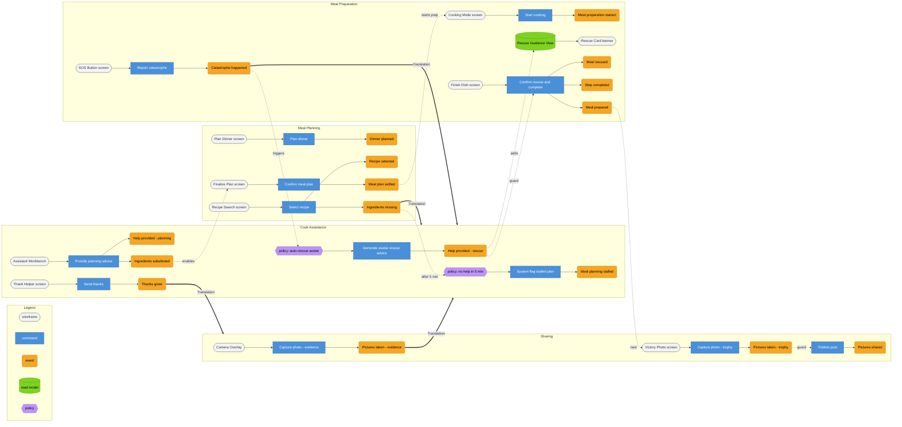

# Prompt 2026-009-01

Create an Event Model based on the provided Domain Stories and the provided events. Use the provided skill.


[Skill](../Skills/CreateEventModelSkill/SKILL.md)

[Event Modeling Reference](../Skills/CreateEventModelSkill/references/event-modeling-method.md)

[Mermaid grid](../Skills/CreateEventModelSkill/references/mermaid-grid.md)

[Worked example](../Skills/CreateEventModelSkill/references/worked-example.md)

# Answer

# Event Model — Home Cooking Assistance & Meal Sharing

## 0. Inputs

* **Domain Stories Used**:
* **Story A** (`AskChefWithBcs.jpg`): Cook plans dinner, needs planning help, asks Chef, Chef provides help, Cook prepares meal and shares pictures.
* **Story B** (`AskCommunityWithBcs.jpg`): Cook prepares meal, needs ingredient substitutes, asks Community, Community provides help, Cook completes meal and shares pictures.
* **Story C** (`AskGrandmaIIWithBcs.jpg`): Cook prepares meal, step is unclear, asks Grandma Avatar, Avatar provides guidance, Cook completes meal and shares pictures.
* **Story D** (`AskGrandmaWithBcs.jpg`): Cook burns meal, takes catastrophe pictures, asks Grandma Avatar for help, Avatar provides rescue plan, Cook rescues meal and shares pictures.


* **Bounded Contexts (Given)**: `Meal Planning`, `Cook Assistance`, `Meal Preparation`, `Sharing`.
* **Found Events (from `EventsConsolidated.jpg`)**: `Cook registered`, `Dinner planned`, `Recipes searched`, `Recipe selected`, `Ingredients missing`, `Meal planning stalled`, `Help requested`, `Help provided`, `Ingredients substituted`, `Meal plan settled`, `Meal preparation started`, `Step unclear`, `Catastrophe happened`, `Step completed`, `Meal prepared`, `Meal rescued`, `Pictures taken`, `Thanks given`, `Pictures shared`.

---

## 1. Big Picture

Ordered chronological sequence merging planning, preparation assistance, catastrophe rescue, and social sharing:

1. Cook registered
2. Dinner planned
3. Recipes searched
4. Recipe selected
5. Ingredients missing
6. Meal planning stalled
7. Help requested *(planning)*
8. Help provided *(planning)*
9. Meal plan settled
10. Meal preparation started
11. Step unclear
12. Catastrophe happened
13. Pictures taken *(evidence)*
14. Help requested *(rescue)*
15. Help provided *(rescue guidance)*
16. Meal rescued
17. Step completed
18. Meal prepared
19. Pictures taken *(trophy)*
20. Thanks given
21. Pictures shared

---

## 2. Swimlane strip

| # | Event | Bounded Context | Source Story / Artifact |
| --- | --- | --- | --- |
| 1 | Cook registered | Meal Planning | `EventsConsolidated.jpg` |
| 2 | Dinner planned | Meal Planning | Story A (1) |
| 3 | Recipes searched | Meal Planning | `EventsConsolidated.jpg` |
| 4 | Recipe selected | Meal Planning | `EventsConsolidated.jpg` |
| 5 | Ingredients missing | Meal Planning | `EventsConsolidated.jpg` |
| 6 | Meal planning stalled | Cook Assistance | `EventsConsolidated.jpg` (Bot icon) |
| 7 | Help requested *(planning)* | Cook Assistance | Story A (2–3) |
| 8 | Help provided *(planning)* | Cook Assistance | Story A (4) |
| 9 | Meal plan settled | Meal Planning | `EventsConsolidated.jpg` |
| 10 | Meal preparation started | Meal Preparation | Story B (1), C (1), D (1) |
| 11 | Step unclear | Meal Preparation | Story C (2) |
| 12 | Catastrophe happened | Meal Preparation | Story D (2a) |
| 13 | Pictures taken *(evidence)* | Sharing | Story D (2b) |
| 14 | Help requested *(rescue)* | Cook Assistance | Story D (3) |
| 15 | Help provided *(rescue)* | Cook Assistance | Story D (4) |
| 16 | Meal rescued | Meal Preparation | Story D (5a) / Bot icon |
| 17 | Step completed | Meal Preparation | `EventsConsolidated.jpg` |
| 18 | Meal prepared | Meal Preparation | Story B (5a), C (5a) |
| 19 | Pictures taken *(trophy)* | Sharing | Story A (5b), B (5b), C (5b), D (5b) |
| 20 | Thanks given | Cook Assistance | Story A (6a), B (6a), C (6a), D (6a) |
| 21 | Pictures shared | Sharing | Story A (6b), B (6b), C (6b), D (6b) |

---

## 3. Workflow slices

```
@SLICE-01 [State Change] Meal Planning — Plan dinner
Wireframe  "Plan Dinner": guest count, occasion input, Plan button
Scenario: Cook creates a new dinner plan
  Given Cook registered (cook_id: "c-101")
   When Plan dinner (cook_id: "c-101", guests: "Parents in Law")
   Then Dinner planned (plan_id: "p-501", cook_id: "c-101", guests: "Parents in Law")

```

```
@SLICE-02 [State Change] Meal Planning — Select recipe & identify missing ingredients
Wireframe  "Recipe Search": search bar, recipe list, Select button
Scenario: Cook picks a recipe but lacks key ingredients
  Given Dinner planned (plan_id: "p-501", guests: "Parents in Law")
   When Select recipe (plan_id: "p-501", recipe_id: "r-88", missing: ["arborio rice"])
   Then Recipe selected (plan_id: "p-501", recipe_id: "r-88")
    And Ingredients missing (plan_id: "p-501", items: ["arborio rice"])

```

```
@SLICE-03 [Translation] Meal Planning → Cook Assistance — Request planning help
Crosses  plan ID, missing ingredients list, target helper role
Scenario: Missing ingredients trigger a request for planning help
  Given Ingredients missing (plan_id: "p-501", items: ["arborio rice"])
   When Request planning assistance (plan_id: "p-501", topic: "ingredients", items: ["arborio rice"], requested_helper: "Chef")
   Then Help requested (request_id: "req-01", context: "planning", plan_id: "p-501", topic: "ingredients")

```

```
@SLICE-04 [Automation] Cook Assistance — Stalled plan escalation
Policy     "Stalled planning detection": if a planning help request has no response in 5 minutes, flag as stalled
Scenario: Help request sits unanswered
  Given Help requested (request_id: "req-01", context: "planning", plan_id: "p-501")
        5 minutes elapse, no Help provided
   When System flag stalled plan (plan_id: "p-501")
   Then Meal planning stalled (plan_id: "p-501", stalled_at: 17:35)

```

```
@SLICE-05 [State Change] Cook Assistance — Chef provides substitute guidance
Wireframe  "Assistant Workbench": active request details, substitute input form, Send button
Scenario: Chef suggests ingredient substitution
  Given Help requested (request_id: "req-01", context: "planning", items: ["arborio rice"])
   When Provide planning advice (request_id: "req-01", advice: "use carnaroli or sushi rice")
   Then Help provided (request_id: "req-01", helper: "Chef", advice: "use carnaroli or sushi rice")
    And Ingredients substituted (plan_id: "p-501", original: "arborio rice", substitute: "carnaroli rice")

```

```
@SLICE-06 [State Change] Meal Planning — Settle meal plan
Wireframe  "Finalize Plan": summary view, Confirm button
Scenario: Cook accepts substitution and settles plan
  Given Ingredients substituted (plan_id: "p-501", substitute: "carnaroli rice")
   When Confirm meal plan (plan_id: "p-501")
   Then Meal plan settled (plan_id: "p-501", settled_at: 17:40)

```

```
@SLICE-07 [State Change] Meal Preparation — Start preparation
Wireframe  "Cooking Mode": recipe step checklist, Start Cooking button
Scenario: Cook begins cooking the settled meal
  Given Meal plan settled (plan_id: "p-501")
   When Start cooking (plan_id: "p-501")
   Then Meal preparation started (prep_id: "prep-90", plan_id: "p-501", started_at: 18:00)

```

```
@SLICE-08 [State Change] Meal Preparation — Report mid-cooking catastrophe
Wireframe  "SOS Button": step indicator, fault type selector, Report button
Scenario: Cook burns the meal at step 4
  Given Meal preparation started (prep_id: "prep-90", plan_id: "p-501")
   When Report catastrophe (prep_id: "prep-90", step: 4, issue: "rice scorched")
   Then Catastrophe happened (prep_id: "prep-90", step: 4, issue: "rice scorched", reported_at: 18:15)

```

```
@SLICE-09 [State Change] Sharing — Capture evidence photo
Wireframe  "Camera Overlay": photo capture button, preview window
Scenario: Cook photographs the scorched pan
  Given Catastrophe happened (prep_id: "prep-90", issue: "rice scorched")
   When Capture photo (prep_id: "prep-90", type: "evidence")
   Then Pictures taken (photo_id: "pic-11", prep_id: "prep-90", type: "evidence")

```

```
@SLICE-10 [Translation] Meal Preparation / Sharing → Cook Assistance — Request catastrophe rescue
Crosses  preparation ID, step, description, photo ID
Scenario: Catastrophe report and evidence photo become a rescue request
  Given Catastrophe happened (prep_id: "prep-90", step: 4, issue: "rice scorched")
        Pictures taken (photo_id: "pic-11", prep_id: "prep-90", type: "evidence")
   When Request rescue (prep_id: "prep-90", step: 4, description: "rice scorched", photo_id: "pic-11")
   Then Help requested (request_id: "req-02", context: "rescue", prep_id: "prep-90", photo_id: "pic-11")

```

```
@SLICE-11 [Automation] Cook Assistance — Grandma Avatar auto-rescue advice
Policy     "Auto-rescue policy": if request targets Grandma Avatar, generate instant rescue steps
Scenario: Grandma Avatar responds with rescue instructions
  Given Help requested (request_id: "req-02", context: "rescue", photo_id: "pic-11")
   When Generate avatar rescue advice (request_id: "req-02")
   Then Help provided (request_id: "req-02", helper: "Grandma Avatar", text: "deglaze with warm broth, do not scrape bottom")

```

```
@SLICE-12 [State View] Meal Preparation — Rescue guidance view
Wireframe  "Rescue Card": steps list, avatar badge, Confirm Rescue button
Given  Help provided (request_id: "req-02", helper: "Grandma Avatar", text: "deglaze with warm broth...")
Shows  "deglaze with warm broth, do not scrape bottom" — Helper: Grandma Avatar

```

```
@SLICE-13 [State Change] Meal Preparation — Confirm meal rescue & completion
Wireframe  "Finish Dish": step resolution button, Mark Rescued button
Scenario: Cook applies advice and completes preparation
  Given Help provided (request_id: "req-02", helper: "Grandma Avatar")
   When Confirm rescue and complete (prep_id: "prep-90")
   Then Meal rescued (prep_id: "prep-90", rescued_at: 18:25)
    And Step completed (prep_id: "prep-90", step: 4)
    And Meal prepared (prep_id: "prep-90", finished_at: 18:30)

```

```
@SLICE-14 [State Change] Sharing — Capture trophy photo
Wireframe  "Victory Photo": photo button, filter toggles
Scenario: Cook takes photo of the completed dish
  Given Meal prepared (prep_id: "prep-90")
   When Capture photo (prep_id: "prep-90", type: "trophy")
   Then Pictures taken (photo_id: "pic-99", prep_id: "prep-90", type: "trophy")

```

```
@SLICE-15 [State Change] Cook Assistance — Thank helper
Wireframe  "Thank Helper": rating stars, thank message form, Send Thanks button
Scenario: Cook sends gratitude to Grandma Avatar
  Given Help provided (request_id: "req-02", helper: "Grandma Avatar")
   When Send thanks (request_id: "req-02", recipient: "Grandma Avatar", note: "Saved dinner!")
   Then Thanks given (request_id: "req-02", recipient: "Grandma Avatar", timestamp: 18:32)

```

```
@SLICE-16 [Translation] Cook Assistance → Sharing — Share post with community
Crosses  trophy photo ID, credited helper name, rescue note
Scenario: Cook posts final result to community feed
  Given Pictures taken (photo_id: "pic-99", type: "trophy")
        Thanks given (request_id: "req-02", recipient: "Grandma Avatar")
   When Publish post (photo_id: "pic-99", helper_credit: "Grandma Avatar")
   Then Pictures shared (post_id: "post-777", photo_id: "pic-99", helper_credit: "Grandma Avatar", shared_at: 18:35)

```

---

## 4. The grid — redraw spec

| Slice | Pattern | Meal Planning | Cook Assistance | Meal Preparation | Sharing |
| --- | --- | --- | --- | --- | --- |
| 01 | State Change | **Dinner planned** |  |  |  |
| 02 | State Change | **Recipe selected**, **Ingredients missing** |  |  |  |
| 03 | Translation |  | **Help requested (planning)** |  |  |
| 04 | Automation |  | **Meal planning stalled** |  |  |
| 05 | State Change |  | **Help provided**, **Ingredients substituted** |  |  |
| 06 | State Change | **Meal plan settled** |  |  |  |
| 07 | State Change |  |  | **Meal preparation started** |  |
| 08 | State Change |  |  | **Catastrophe happened** |  |
| 09 | State Change |  |  |  | **Pictures taken (evidence)** |
| 10 | Translation |  | **Help requested (rescue)** |  |  |
| 11 | Automation |  | **Help provided (rescue)** |  |  |
| 12 | State View |  |  | *(reads 11)* |  |
| 13 | State Change |  |  | **Meal rescued**, **Step completed**, **Meal prepared** |  |
| 14 | State Change |  |  |  | **Pictures taken (trophy)** |
| 15 | State Change |  | **Thanks given** |  |  |
| 16 | Translation |  |  |  | **Pictures shared** |



---

## 5. Information-completeness check

| Field / Object | Command / Read Model | Source Event | Traces? |
| --- | --- | --- | --- |
| `guests` | `Plan dinner` (SLICE-01) | User input | Yes (Entry point) |
| `missing items` | `Request planning assistance` (SLICE-03) | `Ingredients missing` | Yes |
| `stalled_at` | `Meal planning stalled` (SLICE-04) | System clock on timeout | Yes |
| `substitute` | `Confirm meal plan` (SLICE-06) | `Ingredients substituted` | Yes |
| `plan_id` | `Start cooking` (SLICE-07) | `Meal plan settled` | Yes |
| `photo_id` (evidence) | `Request rescue` (SLICE-10) | `Pictures taken (evidence)` | Yes |
| `text` (rescue steps) | `Rescue Guidance View` (SLICE-12) | `Help provided (rescue)` | Yes |
| `helper_credit` | `Publish post` (SLICE-16) | `Thanks given` | Yes |
| `photo_id` (trophy) | `Publish post` (SLICE-16) | `Pictures taken (trophy)` | Yes |

---

## 6. Gaps & open questions

* **Identity & Registration Scope**: Sticky `Cook registered` is present in `EventsConsolidated.jpg` but omitted from the initial domain story bounds. Should an Identity context precede `Meal Planning`?
* **Disambiguation of `Pictures taken**`: The sticky name `Pictures taken` represents two distinct domain concepts: evidence photos of catastrophes and trophy photos of completed meals. They are split here as `Pictures taken (evidence)` and `Pictures taken (trophy)` to avoid shared entity confusion.
* **Human Assistance Fallback**: The avatar auto-rescue (SLICE-11) is modeled as an immediate policy, whereas human community assistance requires an asynchronous response. Should a timeout policy transition unresolved avatar requests to the broader community?

---

## 7. Contested calls & alternatives

* **Ownership of Evidence Photo**: In `AskGrandmaWithBcs.jpg`, taking catastrophe pictures is drawn in `Sharing`. Alternatively, evidence capturing could belong to `Meal Preparation` or `Cook Assistance`. It is assigned to `Sharing` to align with the provided Bounded Context diagram boundaries.
* **Splitting Assistance by Phase**: `Cook Assistance` handles both planning assistance and mid-cooking catastrophe rescue. An alternative architecture would split this into `Planning Assistance` and `Cooking Rescue` bounded contexts if separate teams or domains manage AI guidance vs. human community support.