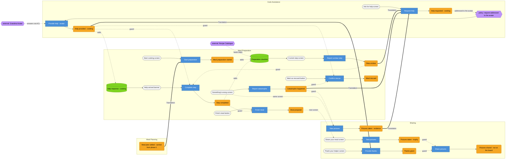

# Prompt 2026-009-01

/event-model-author

Create an Event Model based on the provided Domain Stories and the provided events.


# Answer

# Event Model — Community Cooking, from dinner planned to pictures shared

Built from **four Domain Stories** (each with bounded contexts already drawn on
it) and the **consolidated event board** supplied alongside them. Contexts are
taken **as given by the stories' own boxes** and are not re-cut here; where the
four stories place the same kind of sentence in different boxes, that is
reported in §7 rather than silently resolved.

---

## 0. Inputs

### Domain stories, as transcribed

Numbers sit at the arrow origin; unnumbered continuations (`with`, `for`,
`to plan`, `to rescue`, `and takes`, `and shares`) extend the same sentence.
Box labels are the team's own bounded-context annotations, recorded per clause.

**Story A — *Ask Chef*** (planning-time help)

| # | Sentence | Box drawn around it |
|---|----------|---------------------|
| A1 | Cook **plans** Dinner **with** Parents in Law | Meal Planning |
| A2 | Cook **needs** Help **for** Meal Planning | Cook Assistance |
| A3 | Cook **asks** Chef **for** Help | Cook Assistance |
| A4 | Chef **provides** Help **to plan** Dinner | Cook Assistance |
| A5a | Cook **prepares** Meal | Meal Preparation |
| A5b | … **and takes** Pictures | Sharing |
| A6a | Cook **thanks** Chef | Sharing |
| A6b | … **and shares** Pictures **with** Community | Sharing |

**Story B — *Ask Community*** (a missing ingredient)

| # | Sentence | Box |
|---|----------|-----|
| B1 | Cook **prepares** Meal | Meal Preparation |
| B2 | Cook **needs** Help **with** Ingredients | Cook Assistance |
| B3 | Cook **asks** Community **for** Help **with** Ingredients | Cook Assistance |
| B4 | Community **provides** Help **with** Ingredients Substitutes | Cook Assistance |
| B5a | Cook **prepares** Meal | Meal Preparation |
| B5b | … **and takes** Pictures | Sharing |
| B6a | Cook **thanks** Community | Sharing |
| B6b | … **and shares** Pictures **with** Community | Sharing |

**Story C — *Ask Grandma II*** (an unclear step)

| # | Sentence | Box |
|---|----------|-----|
| C1 | Cook **prepares** Meal | Meal Preparation |
| C2 | Cook **needs** Help **for** Meal Preparation Step | **Meal Preparation** |
| C3 | Cook **asks** Grandma Avatar **for** Help **with** Meal Preparation Step | Cook Assistance |
| C4 | Grandma Avatar **provides** Help **with** Meal Preparation Step | Cook Assistance |
| C5a | Cook **prepares** Meal | Meal Preparation |
| C5b | … **and takes** Pictures | Sharing |
| C6a | Cook **thanks** Grandma Avatar | Sharing |
| C6b | … **and shares** Pictures **with** Community | Sharing |

**Story D — *Ask Grandma*** (the burnt meal)

| # | Sentence | Box |
|---|----------|-----|
| D1 | Cook **prepares** Meal | Meal Preparation |
| D2a | Cook **burns** Meal | Meal Preparation |
| D2b | … **and takes** Pictures | **Sharing** |
| D3 | Cook **asks** Grandma Avatar **for** Help **with** Catastrophy Pictures | Cook Assistance |
| D4 | Grandma Avatar **provides** Help **to rescue** Meal | Cook Assistance |
| D5a | Cook **rescues** Meal | Meal Preparation |
| D5b | … **and takes** Pictures | Sharing |
| D6a | Cook **thanks** Grandma Avatar | Sharing |
| D6b | … **and shares** Pictures **with** Community | Sharing |

Two transcription points to confirm before anyone builds on this:

- **A2 and B2 sit inside Cook Assistance; C2 sits inside Meal Preparation** —
  the same "the cook needs help" clause, boxed in two different contexts. §7
  resolves it one way and says why; it is a one-sentence question for the room.
- **D2b's Pictures sit inside Sharing**, so on the team's own cut the
  catastrophe photo belongs to the same context as the trophy photo. Taken as
  given here; §7 records what it costs.
- *Catastrophy* is the diagram's spelling. Used verbatim above only; the model
  below writes *Catastrophe*, matching the event board.

### Bounded contexts — as given, verbatim

**Meal Planning · Cook Assistance · Meal Preparation · Sharing.**

Four lanes, from the boxes drawn on the four stories. Not re-derived, not
renamed. Note that the EventStorming board elsewhere in this project carries
seven bubbles; where those disagree with these four (*Cook Profile*, *Media*,
and the *Cooking Assistance* / *Cooking Help* split) the stories win here, and
the difference is reported in §6 and the reconciliation.

### Found events — supplied, not derived

21 stickies from the consolidated board, reused as the backbone of §1 rather
than re-derived from the stories. Two carry a 🤖 marker (*Meal planning
stalled*, *Meal rescued*); all carry a ✨ mark, read as provenance, not
semantics — **no slice below rests on either icon.** Two carry spelling slips
on the wall (*Meal plan setteled*, *Step competeted*), corrected silently.

---

## 1. Big Picture

### How the four stories were merged

They are **four variants of one process**, not four processes and not four
segments. Each is the same skeleton — *cook works · cook gets stuck · cook asks
somebody · somebody answers · cook finishes · cook photographs and shares* —
differing only in **when** the cook gets stuck and **who** answers:

| Story | Stuck at | Responder |
|---|---|---|
| A | planning the dinner | Chef |
| B | a missing ingredient | Community |
| C | an unclear preparation step | Grandma Avatar |
| D | a burnt meal | Grandma Avatar |

So the merged spine carries the **help episode twice, not four times**: once in
the planning phase (A and B) and once in the cooking phase (C and D). That is
exactly what the event board already shows — two `Help requested` / `Help
provided` pairs — and it is why **Cook Assistance is one swimlane touched
twice, not two lanes.** A and B share one Request-help slice with two trigger
events; C and D share the other, with two trigger events of their own.

### The merged, ordered spine

| # | Event | From | Story source |
|---|-------|------|--------------|
| 1 | Cook registered | board | *(no story sentence)* |
| 2 | Dinner planned | board | A1 |
| 3 | Recipes searched | board | *(no story sentence — and see §7: a query, not a fact)* |
| 4 | Recipe selected | board | *(no story sentence)* |
| 5 | Ingredients missing | board | B2 |
| 6 | Meal planning stalled 🤖 | board | A2 |
| 7 | Help requested *(planning)* | board | A3 · B3 |
| 8 | Help provided *(planning)* | board | A4 *(Chef)* · B4 *(Community)* |
| 9 | Ingredients substituted | board | B4's outcome — *no sentence shows the cook applying it* |
| 10 | Meal plan settled | board | A4 "to plan Dinner" |
| 11 | Meal preparation started | board | A5a · B1 · C1 · D1 |
| 12 | Step unclear | board | C2 |
| 13 | Catastrophe happened | board | D2a |
| 14 | Pictures taken *(evidence)* | board | D2b |
| 15 | Help requested *(cooking)* | board | C3 · D3 |
| 16 | Help provided *(cooking)* | board | C4 · D4 *(both Grandma Avatar)* |
| 17 | Step completed | board | C5a |
| 18 | Meal rescued 🤖 | board | D5a |
| 19 | Meal prepared | board | A5a · B5a · C5a · D5a |
| 20 | Pictures taken *(trophy)* | board | A5b · B5b · C5b · D5b |
| 21 | Thanks given | board | A6a · B6a · C6a · D6a |
| 22 | **Pictures shared** | **added here** | A6b · B6b · C6b · D6b |

**Assumptions flagged before going further.**

- **`Pictures shared` is not on the board.** All four stories end with the cook
  sharing pictures *with the Community* — a fact the event list never records.
  Added to the spine as event 22 and reported in §6; it is the only event here
  not supplied.
- **`Pictures taken` names two different facts** — evidence at 14, trophy at
  20 — as the board itself shows by drawing the sticky twice. Carried through
  parenthesised; recommend renaming both before this reaches a real board.
- **Events 1, 3 and 4 trace to no story sentence.** Kept, because the board
  supplied them, but nothing in these four scenarios exercises them.
- **"Prepares" is continuous in every story** and appears twice per story
  (before and after the help detour). Read as opening and closing one
  preparation lifecycle: sentence 1 → `Meal preparation started`, sentence 5a →
  `Step completed` / `Meal rescued` / `Meal prepared`.
- **The 🤖 markers are not load-bearing.** Slice 05 is modelled as an Automation
  and slice 21 as a cook-confirmed State Change; each has a structural reason
  given in §3 that stands without the marker.

---

## 2. Swimlane strip

| # | Event | Bounded Context | Source sentence(s) |
|---|-------|-----------------|--------------------|
| 1 | Cook registered | **— none given** *(§6)* | — |
| 2 | Dinner planned | Meal Planning | A1 |
| 3 | Recipes searched | Meal Planning | — |
| 4 | Recipe selected | Meal Planning | — |
| 5 | Ingredients missing | Meal Planning | B2 *(contested — §7)* |
| 6 | Meal planning stalled | Meal Planning | A2 *(contested — §7)* |
| 7 | Help requested *(planning)* | Cook Assistance | A3 · B3 |
| 8 | Help provided *(planning)* | Cook Assistance | A4 · B4 |
| 9 | Ingredients substituted | Meal Planning | — |
| 10 | Meal plan settled | Meal Planning | A4 |
| 11 | Meal preparation started | Meal Preparation | A5a · B1 · C1 · D1 |
| 12 | Step unclear | Meal Preparation | C2 |
| 13 | Catastrophe happened | Meal Preparation | D2a |
| 14 | Pictures taken *(evidence)* | **Sharing** | D2b *(as boxed — §7)* |
| 15 | Help requested *(cooking)* | Cook Assistance | C3 · D3 |
| 16 | Help provided *(cooking)* | Cook Assistance | C4 · D4 |
| 17 | Step completed | Meal Preparation | C5a |
| 18 | Meal rescued | Meal Preparation | D5a |
| 19 | Meal prepared | Meal Preparation | A5a · B5a · C5a · D5a |
| 20 | Pictures taken *(trophy)* | Sharing | A5b · B5b · C5b · D5b |
| 21 | Thanks given | **Sharing** | A6a · B6a · C6a · D6a *(as boxed — §7)* |
| 22 | Pictures shared | Sharing | A6b · B6b · C6b · D6b |

Three placements are the team's own drawing rather than mine, and all three are
worth a second look before building — events 14 and 21 in **Sharing** (both
argued the other way by the earlier analyses in this project), and events 5 and
6, where stories A/B and story C box the same clause differently. Each is taken
as given here and argued in §7.

**Cook Assistance is touched at 7–8 and again at 15–16.** One lane, two
touches, exactly as the four stories collectively show. Nothing below treats
them as two contexts.

---

## 3. Workflow slices

Timeline order. Field names in `Given`/`When`/`Then` are the ones the
completeness check in §5 traces.

### Phase 1 — planning

```
@SLICE-00 [State Change] (no context given) — Register a cook
Wireframe  Sign-up screen: display name, kitchen/skill profile, dietary
           defaults; Register button
Scenario: A user becomes a cook
  Given  (nothing — first event on the board)
   When  Register cook (display_name: "Jana", skill: "confident beginner")
   Then  Cook registered (cook_id: c-17, display_name: "Jana",
         registered_at: 2026-03-02)

None of the four stories contains this sentence, and no story box claims it.
Kept because every later slice needs cook_id and display_name. See §6.
```

```
@SLICE-01 [State Change] Meal Planning — Plan a dinner
Wireframe  New dinner screen: occasion, date, guest list, per-guest dietary
           notes; Plan it button
Scenario: A cook plans dinner for the parents in law
  Given  Cook registered (cook_id: c-17, display_name: "Jana")
   When  Plan dinner (occasion: "Sunday dinner", date: 2026-03-08,
         guests: [Parents in Law x2], constraints: [no nuts])
   Then  Dinner planned (plan_id: p-4, occasion: "Sunday dinner",
         date: 2026-03-08, guests: 2, constraints: [no nuts])

Scenario: A dinner with nobody coming and no date is refused
  Given  Cook registered (cook_id: c-17)
   When  Plan dinner (occasion: "", guests: [], date: none)
   Then  the command is rejected with "who is coming, and when?"
```

```
@SLICE-02 [State View] Meal Planning — Find something to cook
Wireframe  Recipe search screen: search box, result list (title, portions,
           time, ingredient count)
Given  Dinner planned (plan_id: p-4, guests: 2, constraints: [no nuts])
       (recipes themselves arrive from outside this model — see §5)
Shows  recipes matching the search, scaled to 2 portions, with nut-bearing
       recipes marked

The board's Recipes searched sticky is this view, not a fact. See §7.
```

```
@SLICE-03 [State Change] Meal Planning — Choose a recipe
Wireframe  same search screen, Choose this one button on a result
Scenario: The cook picks a recipe for the plan
  Given  Dinner planned (plan_id: p-4, guests: 2)
   When  Select recipe (plan: p-4, recipe: r-88 "Rinderrouladen")
   Then  Recipe selected (plan: p-4, recipe: r-88, portions: 2)

Scenario: A settled plan does not accept a new recipe
  Given  Meal plan settled (plan: p-4)
   When  Select recipe (plan: p-4, recipe: r-91)
   Then  the command is rejected with "this plan is settled — reopen it first"
```

```
@SLICE-04 [State Change] Meal Planning — Find an ingredient missing
Wireframe  Ingredient checklist: one row per ingredient, have-it / missing
           toggle
Scenario: The cook has no crème fraîche
  Given  Recipe selected (plan: p-4, recipe: r-88, portions: 2)
   When  Report missing ingredients (plan: p-4, missing: ["crème fraîche"])
   Then  Ingredients missing (plan: p-4, missing: ["crème fraîche"],
         reported_at: 2026-03-07 10:12)

If the product ever knows the cook's pantry, this becomes an Automation
instead. Nothing in the four stories says it does. See §7.
```

```
@SLICE-05 [Automation] Meal Planning — Notice the plan has stalled
Policy     "Stalled plan": a plan that is not settled and has received no
           planning command for <n> days
Scenario: The plan goes quiet and nothing has been settled
  Given  Dinner planned (plan_id: p-4, date: 2026-03-08)
         Recipe selected (plan: p-4, recipe: r-88)
         <n> days elapse with no planning command, plan not settled
   When  Flag stalled plan (plan: p-4)
   Then  Meal planning stalled (plan: p-4, last_activity: 2026-03-03,
         flagged_at: 2026-03-06)

Scenario: A settled plan is never flagged as stalled
  Given  Meal plan settled (plan: p-4)
         <n> days elapse with no planning command
   Then  Meal planning stalled is not raised

<n> is unknown — the board supplies no number. §6.
```

```
@SLICE-06 [Translation] Meal Planning → Cook Assistance — Ask for planning help
Crosses    what the cook is trying to cook (menu/recipe reference), the guest
           count and dietary constraints, what is missing or stuck, and how
           urgent it is
Stays behind  the search history, the rejected recipes, the guests' identities,
           the reasoning behind the menu
Scenario: A missing ingredient becomes a question for a chef
  Given  Ingredients missing (plan: p-4, missing: ["crème fraîche"])
         Dinner planned (plan: p-4, guests: 2, constraints: [no nuts])
   When  Request help (about: plan p-4, recipe: r-88,
         situation: "no crème fraîche for the rouladen sauce",
         constraints: [no nuts], urgency: "at the table",
         addressed_to: "Chef")
   Then  Help requested (request: h-31, cook: c-17,
         situation: "no crème fraîche for the rouladen sauce",
         constraints: [no nuts], urgency: "at the table",
         addressed_to: "Chef", opened_at: 2026-03-07 10:14)

Scenario: A stalled plan becomes the same kind of request
  Given  Meal planning stalled (plan: p-4, last_activity: 2026-03-03)
   When  Request help (about: plan p-4, situation: "stuck on what to cook",
         urgency: "at the table", addressed_to: "Chef")
   Then  Help requested (request: h-30, …, opened_at: 2026-03-06 19:40)

One slice, two triggers: this is where stories A and B converge.
```

```
@SLICE-07 [State View] Cook Assistance — What a responder sees
Wireframe  Responder inbox: situation, what is being cooked, constraints,
           urgency, how long it has been open; Answer button
Given  Help requested (request: h-31, situation: "no crème fraîche …",
       constraints: [no nuts], urgency: "at the table", opened_at: 10:14)
Shows  the situation, the recipe being cooked, the guests' constraints, the
       urgency flag, and the waiting time

No story shows this screen — every story jumps from "asks" to "provides".
Inferred, and named as a gap in §6 rather than left out.
```

```
@SLICE-08 [State Change] Cook Assistance — A person answers
Wireframe  Answer screen: free text, optional substitute suggestion, Send
Scenario: The chef answers the request
  Given  Help requested (request: h-31, situation: "no crème fraîche …",
         constraints: [no nuts], addressed_to: "Chef")
   When  Provide help (request: h-31, responder: "Chef Marco",
         text: "sour cream, and take the pan off the heat first",
         suggests_substitute: {for: "crème fraîche", use: "sour cream"})
   Then  Help provided (request: h-31, responder: "Chef Marco",
         responder_kind: human, machine_generated: false,
         text: "sour cream, and take the pan off the heat first",
         suggests_substitute: {for: "crème fraîche", use: "sour cream"},
         answered_at: 10:31)

Scenario: A cook cannot answer their own request
  Given  Help requested (request: h-31, cook: c-17)
   When  Provide help (request: h-31, responder: c-17, text: "…")
   Then  the command is rejected with "you cannot answer your own question"

Story A's responder is a Chef, story B's is the Community. One slice; the
responder is data, not structure.
```

```
@SLICE-09 [State View] Meal Planning — Read the answer
Wireframe  Help arrived banner: response text, responder name, a
           machine-generated label when the responder is the avatar
Given  Help requested (request: h-31, about: plan p-4)
       Help provided (request: h-31, responder: "Chef Marco",
       text: "sour cream, and take the pan off the heat first",
       machine_generated: false)
Shows  the response text and "Chef Marco" — no machine-generated label here,
       because the responder is human
```

```
@SLICE-10 [State Change] Meal Planning — Substitute the ingredient
Wireframe  same Help arrived banner: Apply this substitution button, or the
           ingredient checklist with a swap control
Scenario: The cook swaps in sour cream
  Given  Ingredients missing (plan: p-4, missing: ["crème fraîche"])
         Help provided (request: h-31,
         suggests_substitute: {for: "crème fraîche", use: "sour cream"})
         Dinner planned (plan: p-4, constraints: [no nuts])
   When  Substitute ingredients (plan: p-4, for: "crème fraîche",
         use: "sour cream")
   Then  Ingredients substituted (plan: p-4, for: "crème fraîche",
         use: "sour cream", outstanding: 0, substituted_at: 10:40)

Scenario: A substitution that breaks a guest's diet is refused
  Given  Dinner planned (plan: p-4, constraints: [no nuts])
         Help provided (request: h-31,
         suggests_substitute: {for: "pine nuts", use: "walnuts"})
   When  Substitute ingredients (plan: p-4, for: "pine nuts", use: "walnuts")
   Then  the command is rejected with "a guest on this plan cannot eat nuts"

No story sentence covers this slice — story B ends the help episode at "the
community provides help". The rejection scenario is why it is here anyway.
```

```
@SLICE-11 [State Change] Meal Planning — Settle the plan
Wireframe  Settle plan screen: menu, portions, ingredient list after
           substitution, intended time; Settle button
Scenario: The plan is settled once nothing is outstanding
  Given  Recipe selected (plan: p-4, recipe: r-88, portions: 2)
         Ingredients substituted (plan: p-4, outstanding: 0)
   When  Settle meal plan (plan: p-4, intended_time: 2026-03-08 18:00)
   Then  Meal plan settled (plan: p-4, recipe: r-88, portions: 2,
         ingredients: [… sour cream …], constraints: [no nuts],
         occasion: "Sunday dinner", intended_time: 2026-03-08 18:00,
         settled_at: 10:41)

Scenario: A plan with an ingredient still outstanding cannot settle
  Given  Ingredients missing (plan: p-4, missing: ["crème fraîche"])
         (no Ingredients substituted)
   When  Settle meal plan (plan: p-4)
   Then  the command is rejected with "you are still short 1 ingredient"
```

### Phase 2 — cooking, help, sharing

```
@SLICE-12 [Translation] Meal Planning → Meal Preparation — Start cooking
Crosses    recipe reference, portions, the ingredient list after substitution,
           the guests' dietary constraints, the intended time
Stays behind  the search history, the rejected recipes, the whole planning
           help thread, the fact that the plan ever stalled
Scenario: The settled plan becomes a preparation
  Given  Meal plan settled (plan: p-4, recipe: r-88, portions: 2,
         ingredients: [… sour cream …], constraints: [no nuts],
         intended_time: 2026-03-08 18:00)
   When  Start preparation (from_plan: p-4, recipe: r-88, portions: 2,
         constraints: [no nuts])
   Then  Meal preparation started (prep: k-9, recipe: r-88, portions: 2,
         constraints: [no nuts], started_at: 2026-03-08 16:30)

This is the slice the event board is missing: on the board, Meal plan settled
mints an artefact nothing ever reads. Carrying constraints across the border
here is deliberate — see §5.
```

```
@SLICE-13 [State View] Meal Preparation — The step I am on
Wireframe  Current step screen: step number and text, remaining steps, timer,
           I am stuck button, Something's wrong button
Given  Meal preparation started (prep: k-9, recipe: r-88, portions: 2)
       Step completed (prep: k-9, step: 1..4)
Shows  step 5 of 9 with its text, scaled to 2 portions, and what is left

Inferred — no story shows the cook looking at anything. Story C's "needs Help
for Meal Preparation Step" presupposes this screen exists.
```

```
@SLICE-14 [State Change] Meal Preparation — Flag an unclear step
Wireframe  I am stuck button on the current step screen; free-text field
Scenario: The cook does not understand step 5
  Given  Meal preparation started (prep: k-9, recipe: r-88)
         Step completed (prep: k-9, step: 4)
   When  Report unclear step (prep: k-9, step: 5,
         description: "what does reduce by half mean here")
   Then  Step unclear (prep: k-9, step: 5,
         description: "what does reduce by half mean here",
         reported_at: 17:04)

Scenario: A completed step cannot be flagged unclear
  Given  Step completed (prep: k-9, step: 4)
   When  Report unclear step (prep: k-9, step: 4, description: "…")
   Then  the command is rejected with "that step is behind you"
```

```
@SLICE-15 [State Change] Meal Preparation — Report a catastrophe
Wireframe  Something's wrong button, visible throughout cooking; free-text
           field and a camera button
Scenario: The cook burns the meal
  Given  Meal preparation started (prep: k-9, recipe: r-88)
         Step completed (prep: k-9, step: 1..5)
   When  Report catastrophe (prep: k-9, step: 6,
         description: "the rouladen are burnt on one side")
   Then  Catastrophe happened (prep: k-9, step: 6,
         description: "the rouladen are burnt on one side",
         reported_at: 17:41)

Scenario: A finished meal cannot have a catastrophe
  Given  Meal prepared (prep: k-9, finished_at: 18:05)
   When  Report catastrophe (prep: k-9, step: 6, description: "too late")
   Then  the command is rejected with "this meal is already finished"
```

```
@SLICE-16 [State Change] Sharing — Photograph what went wrong
Wireframe  the same Something's wrong screen, camera button
Scenario: The cook photographs the burnt rouladen
  Given  Catastrophe happened (prep: k-9, step: 6,
         description: "the rouladen are burnt on one side")
   When  Take pictures (of: catastrophe, prep: k-9, ref: pic-991)
   Then  Pictures taken (of: catastrophe, prep: k-9, ref: pic-991,
         owner: c-17, taken_at: 17:42)

The wireframe sits in Meal Preparation's screen; the event is owned by Sharing
because story D boxes it there. One screen, two contexts' commands — normal,
but see §7, because this is the placement most likely to be argued about.
```

```
@SLICE-17 [Translation] Meal Preparation (+ Sharing) → Cook Assistance —
           Ask for cooking help
Crosses    from Meal Preparation: recipe reference, current step, what went
           wrong, the guests' constraints, urgency "at the stove"
           from Sharing: the catastrophe photo reference
Stays behind  the full step sequence, the timings, everything else about the
           preparation
Scenario: A catastrophe becomes a question for the avatar
  Given  Catastrophe happened (prep: k-9, step: 6,
         description: "the rouladen are burnt on one side")
         Pictures taken (of: catastrophe, ref: pic-991)
         Meal preparation started (prep: k-9, recipe: r-88,
         constraints: [no nuts])
   When  Request help (about: prep k-9, recipe: r-88, step: 6,
         situation: "the rouladen are burnt on one side", photo: pic-991,
         constraints: [no nuts], urgency: "at the stove",
         addressed_to: "Grandma Avatar")
   Then  Help requested (request: h-44, cook: c-17, situation: "…",
         photo: pic-991, urgency: "at the stove",
         addressed_to: "Grandma Avatar", opened_at: 17:43)

Scenario: An unclear step becomes the same kind of request, without a photo
  Given  Step unclear (prep: k-9, step: 5,
         description: "what does reduce by half mean here")
   When  Request help (about: prep k-9, recipe: r-88, step: 5,
         situation: "what does reduce by half mean here",
         urgency: "at the stove", addressed_to: "Grandma Avatar")
   Then  Help requested (request: h-43, …, opened_at: 17:05)

One slice, two triggers: this is where stories C and D converge. It is also
the only slice on the model whose payload is assembled from two lanes.
```

```
@SLICE-18 [Automation] Cook Assistance — The avatar answers
Policy     "Avatar responds": a Help request addressed to the Grandma Avatar
           is answered by it, without waiting for a human
External   Grandma Avatar — an external system, wrapped behind an
           anticorruption layer; its answers are labelled machine-generated
           wherever a cook sees them
Scenario: The avatar answers the burnt-rouladen request
  Given  Help requested (request: h-44, situation: "the rouladen are burnt on
         one side", photo: pic-991, recipe: r-88, step: 6,
         constraints: [no nuts], addressed_to: "Grandma Avatar")
   When  Provide help (avatar) (request: h-44)
   Then  Help provided (request: h-44, responder: "Grandma Avatar",
         responder_kind: system, machine_generated: true,
         text: "cut the burnt side away, deglaze the pan and start the sauce
         again", answered_at: 17:44)

In stories C and D the cook addresses the avatar directly, so the trigger is
the request itself, not an elapsed timeout. No story anywhere shows the
"nobody answered, so the avatar did" escalation the EventStorming board's
community proposition implies — see §6.
```

```
@SLICE-19 [State View] Meal Preparation — Read the advice
Wireframe  Help arrived banner: response text, responder name, machine-
           generated label, Mark as rescued / Step done buttons
Given  Help requested (request: h-44, about: prep k-9, step: 6)
       Help provided (request: h-44, responder: "Grandma Avatar",
       machine_generated: true, text: "cut the burnt side away, …")
Shows  the advice text, "Grandma Avatar", and a machine-generated label
```

```
@SLICE-20 [State Change] Meal Preparation — Complete the step
Wireframe  Step done button on the current step screen
Scenario: The advice unblocks step 5 and the cook moves on
  Given  Step unclear (prep: k-9, step: 5)
         Help provided (request: h-43, text: "boil it until half is left")
   When  Complete step (prep: k-9, step: 5)
   Then  Step completed (prep: k-9, step: 5, completed_at: 17:12)

Scenario: A step cannot be completed twice
  Given  Step completed (prep: k-9, step: 5)
   When  Complete step (prep: k-9, step: 5)
   Then  the command is rejected with "you have already done that one"
```

```
@SLICE-21 [State Change] Meal Preparation — Confirm the rescue
Wireframe  Mark as rescued button on the Help arrived banner, disabled until a
           response has arrived
Scenario: The cook confirms the meal is saved
  Given  Catastrophe happened (prep: k-9, step: 6)
         Help provided (request: h-44, text: "cut the burnt side away, …")
   When  Confirm rescue (prep: k-9, step: 6)
   Then  Meal rescued (prep: k-9, step: 6, confirmed_at: 17:55)

Scenario: A rescue cannot be confirmed before help has arrived
  Given  Catastrophe happened (prep: k-9, step: 6)
         (no Help provided)
   When  Confirm rescue (prep: k-9, step: 6)
   Then  the command is rejected with "no answer has arrived yet"

The rejection is the point: receiving advice is not the same as the meal being
saved. Story D draws 4 (advice) immediately before 5 (rescues), and the board
puts a 🤖 on Meal rescued — between them, that is the reading in which the
system declares a meal rescued while it is still burning. §7.
```

```
@SLICE-22 [State Change] Meal Preparation — Finish the meal
Wireframe  Finish meal button, on the last step
Scenario: The meal is done
  Given  Meal preparation started (prep: k-9, recipe: r-88)
         Step completed (prep: k-9, steps 1..9)
   When  Finish meal (prep: k-9)
   Then  Meal prepared (prep: k-9, recipe: r-88, finished_at: 18:05)

Scenario: A meal with mandatory steps open is not silently finished
  Given  Step completed (prep: k-9, steps 1..7)
   When  Finish meal (prep: k-9)
   Then  the command is rejected with "2 steps are still open"
```

```
@SLICE-23 [State Change] Sharing — Photograph the finished meal
Wireframe  Share your meal screen, shown once the meal is marked prepared;
           camera button
Scenario: The cook photographs the rouladen that survived
  Given  Meal prepared (prep: k-9, recipe: r-88, finished_at: 18:05)
   When  Take pictures (of: finished meal, prep: k-9, ref: pic-994)
   Then  Pictures taken (of: finished meal, prep: k-9, ref: pic-994,
         owner: c-17, taken_at: 18:06)
```

```
@SLICE-24 [State Change] Sharing — Thank the helper
Wireframe  Thank your helper screen, responder name pre-filled from the help
           response; message field; Send thanks
Scenario: The cook thanks the avatar that saved dinner
  Given  Help provided (request: h-44, responder: "Grandma Avatar",
         machine_generated: true)
   When  Provide thanks (to: "Grandma Avatar", for: request h-44,
         message: "you saved Sunday")
   Then  Thanks given (to: "Grandma Avatar", for: request h-44,
         from: c-17, message: "you saved Sunday", thanked_at: 18:10)

Scenario: Thanks to somebody who never helped is refused
  Given  (no Help provided for cook c-17 by "Chef Marco")
   When  Provide thanks (to: "Chef Marco", for: request h-44)
   Then  the command is rejected with "they have not helped you"

Sharing owns this because all four stories box sentence 6a inside Sharing —
but the fact it checks (who answered) belongs to Cook Assistance. That is a
border crossing nobody drew; see §5 and §7.
```

```
@SLICE-25 [State Change] Sharing — Share with the community
Wireframe  Share your meal screen: the trophy picture, a caption, the helper
           credited, audience; Share button
Scenario: The rescued meal reaches the community
  Given  Pictures taken (of: finished meal, ref: pic-994, owner: c-17)
         Thanks given (to: "Grandma Avatar", for: request h-44)
   When  Share pictures (photo: pic-994, with: Community,
         credited_helper: "Grandma Avatar", caption: "rescued rouladen")
   Then  Pictures shared (photo: pic-994, audience: Community,
         credited_helper: "Grandma Avatar", shared_at: 18:11)

Scenario: A cook can only share their own pictures
  Given  Pictures taken (ref: pic-994, owner: c-42)
   When  Share pictures (photo: pic-994, with: Community) issued by c-17
   Then  the command is rejected with "these are not your pictures"

Pictures shared is the one event on this model that the board did not supply.
```

---

## 4. The grid — redraw spec

Slices in timeline order; the cell shows the event each lane produces.

| Slice | Pattern | Trigger / screen | Meal Planning | Cook Assistance | Meal Preparation | Sharing |
|---|---|---|---|---|---|---|
| 00 | State Change | Sign-up screen | | | | |
| 01 | State Change | New dinner screen | **Dinner planned** | | | |
| 02 | State View | Recipe search screen | *(recipe results)* | | | |
| 03 | State Change | search result, Choose | **Recipe selected** | | | |
| 04 | State Change | Ingredient checklist | **Ingredients missing** | | | |
| 05 | Automation | policy, `<n>` days quiet | **Meal planning stalled** | | | |
| 06 | Translation | border: Planning → Assistance | | **Help requested** | | |
| 07 | State View | Responder inbox | | *(open requests)* | | |
| 08 | State Change | Answer screen | | **Help provided** | | |
| 09 | State View | Help arrived banner | *(reads 08)* | | | |
| 10 | State Change | Apply substitution | **Ingredients substituted** | | | |
| 11 | State Change | Settle plan screen | **Meal plan settled** | | | |
| 12 | Translation | border: Planning → Preparation | | | **Meal preparation started** | |
| 13 | State View | Current step screen | | | *(checklist)* | |
| 14 | State Change | I am stuck button | | | **Step unclear** | |
| 15 | State Change | Something's wrong screen | | | **Catastrophe happened** | |
| 16 | State Change | same screen, camera | | | | **Pictures taken (evidence)** |
| 17 | Translation | border: Preparation **+ Sharing** → Assistance | | **Help requested** | | |
| 18 | Automation | policy: addressed to the avatar | | **Help provided** | | |
| 19 | State View | Help arrived banner | | | *(reads 18)* | |
| 20 | State Change | Step done button | | | **Step completed** | |
| 21 | State Change | Mark as rescued button | | | **Meal rescued** | |
| 22 | State Change | Finish meal button | | | **Meal prepared** | |
| 23 | State Change | Share your meal screen | | | | **Pictures taken (trophy)** |
| 24 | State Change | Thank your helper screen | | | | **Thanks given** |
| 25 | State Change | Share your meal screen | | | | **Pictures shared** |

Slice 00 produces `Cook registered`, which belongs to none of the four given
lanes — the blank row is the finding, not an omission. **Meal Planning's lane
goes blank from slice 12 onward and Meal Preparation's is blank before it**;
those blanks are honest and they are where the phase boundary actually is.

Twenty-five slices is past the size a single flowchart stays readable at, so
the grid is drawn as two diagrams that meet at slice 12.

### Phase 1 — planning (slices 00–11)

```mermaid
flowchart LR
  classDef wireframe fill:#f4f4f4,stroke:#999,color:#333
  classDef command fill:#4A90D9,stroke:#2C5F8A,color:#fff
  classDef event fill:#F5A623,stroke:#B9770E,color:#000
  classDef readmodel fill:#7ED321,stroke:#4F8F0F,color:#000
  classDef policy fill:#BD93F9,stroke:#7C4DBD,color:#000

  subgraph LEGEND[Legend]
    direction LR
    LG_W(["wireframe"]):::wireframe
    LG_C["command"]:::command
    LG_E("event"):::event
    LG_R[("read model")]:::readmodel
    LG_P{{"policy or external system"}}:::policy
  end

  X1{{"external: Recipe Catalogue"}}:::policy

  subgraph UN[No context given - see section 6]
    direction LR
    W0(["Sign-up screen"]):::wireframe --> C0["Register cook"]:::command --> E0("Cook registered"):::event
  end

  subgraph MPL[Meal Planning]
    direction LR
    W1(["New dinner screen"]):::wireframe --> C1["Plan dinner"]:::command --> E1("Dinner planned"):::event
    R1[("Recipe search results")]:::readmodel --> W2(["Recipe search screen"]):::wireframe --> C2["Select recipe"]:::command --> E2("Recipe selected"):::event
    W3(["Ingredient checklist"]):::wireframe --> C3["Report missing ingredients"]:::command --> E3("Ingredients missing"):::event
    P1{{"policy: unsettled and quiet for n days"}}:::policy --> C4["Flag stalled plan"]:::command --> E4("Meal planning stalled"):::event
    R4[("Help response - planning")]:::readmodel --> W6(["Help arrived banner"]):::wireframe --> C7["Substitute ingredients"]:::command --> E7("Ingredients substituted"):::event
    W7(["Settle plan screen"]):::wireframe --> C8["Settle meal plan"]:::command --> E8("Meal plan settled"):::event
  end

  subgraph CAS[Cook Assistance]
    direction LR
    W4(["Ask for help screen"]):::wireframe --> C5["Request help"]:::command --> E5("Help requested - planning"):::event
    R2[("Open help requests")]:::readmodel --> W5(["Responder inbox"]):::wireframe --> C6["Provide help"]:::command --> E6("Help provided - planning"):::event
  end

  X1 -. feeds .-> R1
  E0 -. guard .-> C1
  E1 -. guard .-> C2
  E2 -. guard .-> C3
  E1 -. no progress for n days .-> P1
  E3 == Translation ==> C5
  E4 == Translation ==> C5
  E5 -. adds .-> R2
  E6 -. adds .-> R4
  E3 -. guard .-> C7
  E6 -. guard .-> C7
  E2 -. guard .-> C8
  E7 -. guard .-> C8
```



### Phase 2 — cooking, help and sharing (slices 12–25)

Same colour key as above: blue commands, orange events, green read models,
lilac policies and external systems, grey wireframes.



**Three things the picture says that the table cannot.**

1. **Three Translation arrows land on one command** (`Request help`, C13), and
   one of them comes out of **Sharing**. A photo crossing from the sharing
   context into the assistance context to make a question answerable is a
   strange sentence to say out loud — which is exactly the value of drawing it.
   See §7.
2. **`Provide thanks` is fed by a Translation from Cook Assistance**, because
   Sharing owns the thanks but Assistance owns the fact of who answered. Two
   crossings between the same two lanes, in opposite directions, is the
   chattiness signal the method warns about.
3. **`R1` and `R5` are fed by an external box, not by any event on the model.**
   Recipes are read everywhere and written nowhere here; that is a whole
   context missing rather than a drawing error, and it is stated as such in §6.

---

## 5. Information-completeness check

Every field named in a `When` or a `Shows`, traced back to the event that
produced it.

| Field | Slice | Source | Traces? |
|---|---|---|---|
| `display_name`, `skill` | 00 `Register cook` | user's own input | Yes — human-supplied |
| `cook_id` | 01 and everything after | Cook registered (slice 00) | Yes — but from an unassigned lane |
| `occasion`, `date`, `guests`, `constraints` | 01 `Plan dinner` | cook's own input | Yes — human-supplied |
| recipe list, portions scaling | 02 `Shows` | **nothing on the model** | **No** — external Recipe Catalogue |
| `recipe` | 03 `Select recipe` | the search view, i.e. the catalogue | **No** — same gap |
| `missing` | 04 `Report missing ingredients` | cook's own input, against the recipe's ingredient list | Partly — the ingredient list is the catalogue's |
| `last_activity`, `not settled` | 05 policy | Dinner planned, Recipe selected, Meal plan settled | Yes |
| `<n>` days | 05 policy | **nobody supplied a number** | **No** — §6 |
| `situation`, `recipe`, `constraints`, `urgency` | 06 `Request help` | Ingredients missing / Meal planning stalled / Dinner planned | Yes |
| `addressed_to` | 06 and 17 `Request help` | cook's own choice at command time | Yes — human-supplied |
| open-request fields | 07 `Shows` | Help requested | Yes |
| `text`, `suggests_substitute` | 08 `Provide help` | responder's own answer | Yes — not expected to trace |
| `machine_generated` | 09, 19 `Shows` | Help provided (`responder_kind`) | Yes |
| `for`, `use` | 10 `Substitute ingredients` | Help provided (`suggests_substitute`) | Yes |
| guard: no nut for a nut-free plan | 10 rejection | Dinner planned (`constraints`) | Yes |
| `outstanding: 0` | 11 `Settle meal plan` | Ingredients missing, Ingredients substituted | Yes |
| `recipe`, `portions`, `ingredients`, `constraints` | 12 `Start preparation` | Meal plan settled | Yes — **because slice 12 was drawn** |
| the step list, step text | 13 `Shows` | **nothing on the model** | **No** — external Recipe Catalogue |
| `step`, `description` | 14, 15 | cook's own input | Yes — human-supplied |
| `of: catastrophe`, `prep` | 16 `Take pictures` | Catastrophe happened | Yes |
| `photo: pic-991` | 17 `Request help` | Pictures taken (evidence) — **in Sharing** | Yes, **across a border nobody drew** |
| `constraints` on a cooking request | 17 `Request help` | Meal preparation started, via slice 12 | Yes — **only because slice 12 carries them** |
| advice text | 18 `Provide help (avatar)` | the avatar's own generation | Yes — not expected to trace |
| guard: a response exists | 20, 21 | Help provided | Yes |
| all mandatory steps completed | 22 `Finish meal` | Step completed ×n, against the recipe's step list | Partly — the step list is the catalogue's |
| `to:` the responder | 24 `Provide thanks` | Help provided — **in Cook Assistance** | Yes, **across a border nobody drew** |
| `owner` on a picture | 25 rejection | Pictures taken | Yes |
| `credited_helper` | 25 `Share pictures` | Thanks given / Help provided | Yes |

**Findings.**

- **Recipes never trace.** The recipe, its ingredient list, its steps and its
  portion scaling are read by slices 02, 03, 04, 13 and 22, and no event on
  this model ever produces them. Either a **Recipe Catalogue** context is
  missing from the given cut, or recipes are an external supplier the model
  should show explicitly at its edge. This is the largest completeness gap
  here, and it is the same finding the invariants sheet in this project
  reached from the other direction.
- **The guests' dietary constraints reach the kitchen only because slice 12
  carries them.** Nothing in any of the four stories crosses that border —
  story A collects the Parents in Law at sentence 1 and never mentions them
  again. Without slice 12's payload, the context that takes cooking advice
  from strangers would be the one context with no idea who is eating. **Confirm
  that constraints really do cross, or accept that a rescue can break a
  guest's allergy.**
- **Two fields cross borders no story draws.** The catastrophe photo goes
  Sharing → Cook Assistance (slice 17); the responder's identity goes Cook
  Assistance → Sharing (slice 24). Both are consequences of where the team
  boxed those two clauses. They are cheap to implement and expensive to leave
  undrawn — see §7.
- **`cook_id` traces to an unassigned lane.** Every command on the model
  carries it; the event that mints it belongs to no given context.
- **The stall window `<n>` is unknown** and is left as a placeholder rather
  than invented.

---

## 6. Gaps & open questions

**`Cook registered` belongs to no lane.** The four stories start with a cook
who already exists. The EventStorming board has a *Cook Profile* bubble; this
cut does not. Either add the context or say explicitly that identity is out of
scope for this model. *Where does a cook come from?*

**No `Pictures shared` event.** Every story's last clause is "shares Pictures
with Community" and the board's last picture-related fact is `Pictures taken`.
The community — the audience the whole product is named for — receives nothing
that any event records. *Is sharing a fact worth recording, or does the board
simply stop one clause early?*

**No context owns recipes.** Read by five slices, written by none. *Who owns
the recipes, and is the catalogue ours or somebody else's?*

**Nobody ever looks at anything.** Not one of the four stories contains a
sentence where an actor reads or sees something, so **every State View on this
model (slices 02, 07, 09, 13, 19) is inferred.** Slice 07 is the most
consequential: a responder inbox is the screen the entire community
proposition runs through, and no story draws it. *What does a responder
actually see, and how do they learn a request exists at all?* — the
notification mechanism is unmodelled everywhere in this project.

**Nothing shows help going unanswered.** In all four stories the person asked
answers, immediately. There is no timeout, no second responder, no "nobody
came". Slice 18 is therefore modelled as the avatar answering because it was
addressed, not as an escalation. *If nobody answers, what happens — and does
the avatar step in?* That policy is the mechanism the community proposition
rests on, and no artifact in this project draws it.

**No failure ending anywhere.** A catastrophe is always rescued, a plan is
always settled, a step is always completed. There is no `Meal abandoned`, no
`Plan dropped`, no `Request withdrawn`, no takeaway. *What happens to a
catastrophe nobody can rescue?*

**Applying the advice is unmodelled in the stories.** Story B ends its help
episode at "the community provides help with ingredients substitutes"; nothing
shows the cook putting the substitute on the plan. `Ingredients substituted` is
on the board, so slice 10 exists — but on the stories alone, advice arriving
would be the end of it. Same shape as the rescue question in §7.

**The same clause is boxed in two different contexts.** A2 and B2 ("needs
Help") sit in Cook Assistance; C2 sits in Meal Preparation. *Is "I am stuck"
a fact about my cooking, or the opening of a help request?* One-sentence
question, and it decides slices 04, 05, 14 and 15.

**Numbers nobody supplied.** The stall window (`<n>` days, slice 05); the
response time a cook at the stove can tolerate versus one at the table; how
many responders may answer one request. The urgency flag on slices 06 and 17
is the model's placeholder for the second of these.

**Parents in Law appear once and are never read again.** They are the reason
the dinner exists, and after story A sentence 1 nothing in any story mentions
who is eating. Slice 12 carries their constraints forward on the strength of
that single sentence.

---

## 7. Contested calls & alternatives

**Slice 16 — the catastrophe photo is owned by Sharing, per story D's own
box.** Taken as given. It has a real cost: the picture taken to show a stranger
what went wrong and the picture taken to show the community a triumph end up
in one model, with one lifetime, one audience question and one set of privacy
rules. It also produces the odd Translation arrow in the phase-2 diagram, where
Sharing supplies the evidence that makes a help request answerable. The earlier
context cut in this project put that photo in the help context instead. *What
would settle it: does a cook ever photograph a disaster without asking anybody
about it — and may the community see the disaster shot?* If the answer to the
second is no, these are two models and one of them is in the wrong lane.

**Slice 24 — `Thanks given` is owned by Sharing, per all four stories' boxes.**
Also taken as given, also contested: thanks close the reciprocity loop that
makes strangers answer next time, and the fact they check ("did this person
actually help me?") lives in Cook Assistance. Both the pivotal-event cut and
the invariants sheet in this project put thanks inside the help context.
*What would settle it: is the thank-you private to the helper, or is it the
caption on the public post?* If it is the caption, Sharing is right and the
crossing in slice 24 is simply the price.

**Slice 18 — Automation or State Change?** Modelled as an Automation because
the Grandma Avatar is a system and the stories give it no deliberation. But in
stories C and D the cook *chooses* it, which is what a State Change looks like
from the cook's side. And in stories A and B the responder is a human, which is
unambiguously the State Change of slice 08. The honest reading: **one
request-and-answer capability with two responder kinds**, one of which happens
to be a machine. If the avatar later answers requests nobody addressed to it,
slice 18 grows a timeout trigger and becomes the escalation the board implies.

**Slice 21 — who declares a meal rescued?** Story D draws sentence 4 (the
avatar provides help) immediately before sentence 5 (the cook rescues the
meal), and the board puts a 🤖 on `Meal rescued`. Read together, the system
declares the meal saved the moment advice arrives. Modelled here as a cook
confirmation with an explicit rejection, because the alternative ships a
product that announces dinner is fine while it is still burning. *If the team
wants the automatic reading, say so deliberately* — it is a one-line change to
slice 21 and a very different product.

**Slices 04, 05, 14, 15 — where the trouble events live.** Placed in Meal
Planning and Meal Preparation, following story C's box rather than stories A
and B's. The reasoning: *Ingredients missing*, *Meal planning stalled*, *Step
unclear* and *Catastrophe happened* are facts about the plan and the
preparation — they are true whether or not anyone is asked for help — while the
request is Cook Assistance's. The alternative placement makes Cook Assistance
own the trouble too, which would make it the largest context on the model and
would make slices 06 and 17 internal rather than Translations.

**`Recipes searched` is not a fact.** Modelled as the State View in slice 02.
A search is a query: it changes nothing, it can be repeated forever, and
nothing downstream is true because of it. If the team wants search history as a
fact — for personalisation, or to learn what cooks look for and don't find —
that is a different event with a different name and a real consumer.

**Slice 04 — a State Change today, an Automation tomorrow.** The cook reports
what is missing because nothing in these stories says the product knows their
kitchen. The moment a pantry or a shopping list exists, `Ingredients missing`
is raised by the system comparing the recipe against stock, and slice 04 moves
patterns.

**Coarser alternative — merge slices 24 and 25** into one "thank and share"
command, since every story draws sentence 6 as a single gesture. Rejected here
because it removes the ability to thank privately without publishing, which the
two-slice version preserves for free — but it is the closest thing to a
free simplification on this page.

**Finer alternative — split Cook Assistance in two.** Planning-time help (a
stalled plan can wait overnight) and cooking-time help (an unclear step cannot
wait five minutes) differ by an order of magnitude in response time, and that
is the one argument for two contexts. Everything else — same commands, same
objects, same responders, the same request shape in slices 06 and 17 — says
one. The `urgency` field carried on both Request-help slices is the cheaper
answer; adopt it before splitting.

---

## Reconciliation with the other analyses in this project

Four methods on the same domain now. Where they agree independently, the
finding is strong.

**Confirmed here, by construction rather than by argument:**

- **The missing preparation aggregate.** All three earlier analyses said the
  cooking stretch owns no business object. This model had to invent one — every
  slice from 13 to 22 needs a `prep` identity with a current step, a
  step-completion record and an incident. Building the Given/When/Thens made
  that unavoidable rather than optional.
- **`Meal plan settled` is read by nobody.** The board's orphan is fixed here
  by slice 12, which is the Translation the board never drew. That slice is
  also what makes the guests' constraints reach the kitchen — the invariants
  sheet's X-02, resolved by drawing the border payload.
- **`Pictures taken` is one name for two facts** — evidence and trophy, drawn
  twice on the board and split into slices 16 and 23 here.
- **Cook Assistance is one context touched twice**, not two. The four stories
  settle this positively: the same request shape, the same command, four
  different responders, twice on the timeline.
- **No hotspots, no state stickies, no policies drawn.** The four missing
  policies between trouble and request are visible here as the three
  Translation slices that no story sentence produces.

**Where this model differs from the earlier analyses, and why:**

- **The catastrophe photo and the thanks are in Sharing here**, because the
  stories' own boxes put them there. The pivotal-event cut and the invariants
  sheet both argued the opposite. The disagreement is real and it is between
  the team's drawing and the earlier reasoning — not between two readings of
  the same picture. §7 gives the question that settles each.
- **The avatar answers because it was asked**, not because a timeout expired.
  All four stories have the cook choose a responder. The escalation policy the
  board implies (`if nobody answers, the avatar answers`) appears in no story
  and is left as an open question rather than modelled.
- **This cut has four contexts, not seven.** Cook Profile and Media have no
  box on any story; the events that would belong to them (`Cook registered`,
  the two `Pictures taken`) are handled in §6 and by Sharing respectively.