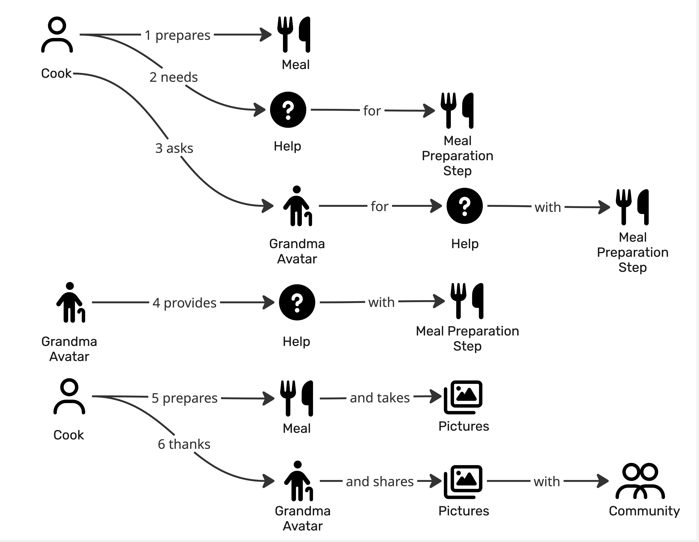

# Prompt 2026-08-31

Create Bounded Contexts based on the provided Domain Story. Use the provided skill.

[Skill](../../Chapter06/Skills/ProposeBoundedContextsForADomainStory/SKILL.md)

[Reference Context Map and Classification](../../Chapter06/Skills/ProposeBoundedContextsForADomainStory/references/context-map-and-classification.md)

[Reference Cut Signals](../../Chapter06/Skills/ProposeBoundedContextsForADomainStory/references/cut-signals.md)

[Reference Naming and Granuraliry](../../Chapter06/Skills/ProposeBoundedContextsForADomainStory/references/naming-and-granularity.md)

[Reference Worked Example](../../Chapter06/Skills/ProposeBoundedContextsForADomainStory/references/worked-example.md)

# Answer

# Context Cut — Ask Grandma

I’m in **propose mode** because the Domain Story has no bounded-context/group lanes drawn. The skill treats a bounded context as a **language/model boundary rather than a chronological phase**, so the cut below is based mainly on purpose, noun meaning, ownership, and handoffs—not on step order.

## 1. Story transcription

I read the diagram as:

1. **Cook prepares Meal**
2. **Cook needs Help for Meal Preparation Step**
3. **Cook asks Grandma Avatar for Help with Meal Preparation Step**
4. **Grandma Avatar provides Help with Meal Preparation Step**
5. **Cook prepares Meal and takes Pictures**
6. **Cook thanks Grandma Avatar and shares Pictures with Community**

The notable modeling detail is that steps **5 and 6 each contain two activities joined by “and.”** That becomes relevant when locating the boundaries.

## 2. Signal table

| # | Actor          | Activity         | Work objects                                | What it is for                                              | Important noun sense                                                                       |
| - | -------------- | ---------------- | ------------------------------------------- | ----------------------------------------------------------- | ------------------------------------------------------------------------------------------ |
| 1 | Cook           | prepares         | Meal                                        | Produce the meal                                            | **Meal** = thing being cooked                                                              |
| 2 | Cook           | needs            | Help, Meal Preparation Step                 | Recognize that cooking guidance is required                 | **Help** = required assistance; **Meal Preparation Step** = point where guidance is needed |
| 3 | Cook           | asks             | Grandma Avatar, Help, Meal Preparation Step | Obtain cooking guidance from an expert/avatar               | **Help** = requested guidance                                                              |
| 4 | Grandma Avatar | provides         | Help, Meal Preparation Step                 | Guide the cook through the difficult step                   | **Help** = supplied guidance                                                               |
| 5 | Cook           | prepares / takes | Meal, Pictures                              | Complete cooking; capture the result                        | **Meal** = cooked outcome; **Pictures** = record of the outcome                            |
| 6 | Cook           | thanks / shares  | Grandma Avatar, Pictures, Community         | Acknowledge assistance; publish the cooking result socially | **Pictures** = shareable community content                                                 |

The strongest clustering is **2–4**: same work objects, same language around *Help* and *Meal Preparation Step*, and one coherent purpose. The skill recommends keeping sentences together when they share multiple signals, and normally drawing a boundary only when several signals support it.

---

# 3. Proposed bounded contexts

## A. Meal Preparation

**Responsibility:** Manage the cook’s actual preparation of a meal.

**Sentences:** **1, 5**

**Actors:** Cook

**Owns:**

* **Meal** as the food being prepared / completed
* the cooking process as far as this story exposes it

**Borrows:**

* **Meal Preparation Step** is referenced by Cooking Assistance, but its detailed lifecycle is not actually shown in this story.

**Why it is separate**

The business purpose is fundamentally **doing the cooking**, rather than obtaining advice or publishing content. Step 1 and the first part of step 5 return to this same concern, so this is not simply a chronological “first phase.” Recurring lanes are specifically expected in a good context cut.

---

## B. Cooking Assistance

**Responsibility:** Connect a cook who is stuck on a preparation step with guidance supplied by a Grandma Avatar.

**Sentences:** **2, 3, 4**

**Actors:** Cook, Grandma Avatar

**Owns:**

* **Help** as a request/provision of cooking guidance
* the interaction between Cook and Grandma Avatar
* potentially the help request lifecycle: needed → requested → provided

**Borrows with shifted meaning:**

* **Meal Preparation Step** — Meal Preparation sees it as something to perform; Cooking Assistance sees it as the **subject of a help request**.

**Primary signals:**

* **Purpose cohesion:** all three steps exist so the cook can obtain help.
* **Work-object cohesion:** *Help* and *Meal Preparation Step* recur across 2–4.
* **Actor/expertise change:** Grandma Avatar becomes the provider/expert.
* **Ownership/lifecycle:** step 3 initiates/request help; step 4 fulfills it.

This is the clearest bounded context in the story. The language-shift test is especially useful here: the same *Meal Preparation Step* can belong to the cooking model while being merely the **problem being discussed** in the assistance model. Language/model shifts are the strongest boundary signal in the supplied method.

I would name it **Cooking Assistance**, rather than *Help* or *Grandma Avatar*. The naming guidance recommends a domain responsibility expressed as a noun phrase and warns against naming contexts after individual entities or technical constructs.

---

## C. Community Sharing

**Responsibility:** Publish outcomes of cooking to the community.

**Sentence:** **6**, plus the **“takes Pictures”** portion of step 5.

**Actors:** Cook, Community

**Owns:**

* **Pictures** as shareable content
* the act/publication of sharing with **Community**

**Borrows:**

* the completed Meal is implicitly what the pictures depict, but the Meal itself remains a Meal Preparation concept.

**Primary signals:**

* **Purpose change:** preparing food ≠ communicating the result to others.
* **Work-object change:** *Pictures* and *Community* form a vocabulary absent from the assistance interaction.
* **Handoff:** the Cook produces pictures and later sends them to Community.
* **Ownership/lifecycle:** taking the picture creates the artifact that sharing consumes.

The *Pictures* object is especially useful evidence: it is created in step 5 and consumed in step 6, which gives us a concrete flow across the boundary. Ownership/lifecycle is explicitly a useful signal for determining the upstream context and later consumers.

---

# 4. Lane assignment

For a redraw, I would use these three lanes:

| # | Sentence                                                      | Lane                   |
| - | ------------------------------------------------------------- | ---------------------- |
| 1 | Cook prepares Meal                                            | **Meal Preparation**   |
| 2 | Cook needs Help for Meal Preparation Step                     | **Cooking Assistance** |
| 3 | Cook asks Grandma Avatar for Help with Meal Preparation Step  | **Cooking Assistance** |
| 4 | Grandma Avatar provides Help with Meal Preparation Step       | **Cooking Assistance** |
| 5 | Cook prepares Meal and takes Pictures                         | **Meal Preparation***  |
| 6 | Cook thanks Grandma Avatar and shares Pictures with Community | **Community Sharing*** |

* Steps **5 and 6 are contested because each numbered sentence combines activities belonging to different concerns.**

For a cleaner Domain Story, I would redraw those compound activities as separate numbered statements:

* Cook prepares Meal.
* Cook takes Pictures.
* Cook thanks Grandma Avatar.
* Cook shares Pictures with Community.

That would let **takes Pictures → Community Sharing**, while **thanks Grandma Avatar** could be evaluated independently instead of forcing two purposes into one numbered sentence.

The lane assignment is important because it is effectively the specification from which the grouped Domain Story can be redrawn.

---

# 5. Context map

| Upstream               | Downstream             | What flows                                   | Likely relationship | Why                                                                  |
| ---------------------- | ---------------------- | -------------------------------------------- | ------------------- | -------------------------------------------------------------------- |
| **Meal Preparation**   | **Cooking Assistance** | Meal Preparation Step / problem needing help | Customer–Supplier   | Assistance needs enough cooking context to provide relevant guidance |
| **Cooking Assistance** | **Meal Preparation**   | Help / guidance                              | Customer–Supplier   | Meal Preparation consumes guidance to continue cooking               |
| **Meal Preparation**   | **Community Sharing**  | Pictures / cooking outcome                   | Customer–Supplier   | Sharing publishes an artifact created while cooking                  |

The context-map guidance says to make crossings explicit as **what flows, in which direction, and under which relationship pattern**.

Conceptually:

**Cooking Assistance**
Help/guidance ↓
**Meal Preparation** → Pictures → **Community Sharing**

There is also a request going the opposite way from Meal Preparation toward Cooking Assistance. I would treat that as part of the assistance interaction/API rather than conclude that the two bounded contexts must be merged.

---

# 6. Recommended cut

My proposed solution-space boundary is therefore:

### **Meal Preparation**

The actual cooking and completion of the meal.

### **Cooking Assistance**

Requesting and receiving contextual cooking guidance from a Grandma Avatar.

### **Community Sharing**

Capturing/publishing the result for the wider community.

This fits the naming guidance's preferred pattern of **responsibility-oriented domain names** rather than names such as `Meal`, `Help`, `GrandmaAvatarService`, or `Pictures`.

## 7. Contested calls and alternatives

**Step 5 is the strongest contested call.** “Prepares Meal” clearly belongs to Meal Preparation, while “takes Pictures” looks like the creation step of the Community Sharing content lifecycle. I kept the numbered sentence in Meal Preparation only because that is how the source story currently groups it. Architecturally, I would split the sentence.

**Step 6 has the same issue.** “Shares Pictures with Community” clearly supports Community Sharing. “Thanks Grandma Avatar” points back toward Cooking Assistance. There is not enough evidence in this story to invent a separate *Reputation*, *Feedback*, or *Gratitude* context. The method specifically warns against inventing missing domain steps just to support an architectural cut.

A **coarser cut** would merge Community Sharing into Meal Preparation, producing only **Meal Preparation + Cooking Assistance**. That is reasonable if pictures are merely a lightweight feature attached to cooking and have no independent lifecycle, moderation, reactions, feed, visibility rules, etc.

A **finer cut** might eventually separate *Assistance Request* from *Grandma Knowledge/Guidance*, but the six-step story does not justify that yet. A five- or six-sentence story can legitimately yield only a small number of contexts; splitting into one context per activity would be a known over-segmentation trap.

The most useful domain-expert questions to settle the remaining boundaries are: **Can pictures exist, be managed, removed, commented on, or shared independently of the meal?** If yes, Community Sharing is strongly independent. And **is “Help” merely a conversational message, or does a help request have its own states, matching/routing, history, or resolution?** If it has that lifecycle, Cooking Assistance is unquestionably its own bounded context.

**Final proposed bounded contexts: `Meal Preparation` ↔ `Cooking Assistance`, with `Community Sharing` as a third context fed by the completed cooking experience.**
