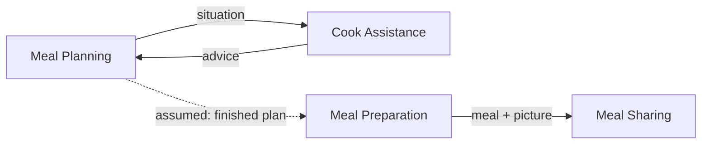

# Context Cut — Cook, Parents-in-Law dinner, and the Chef

**Mode: propose.** No lanes, groups or annotations are drawn on this story, so
this proposes a cut rather than reviewing one.

**Scope note.** Six sentences, no branch, no loop, no catastrophe. It covers
only the run from deciding to host to sharing the result — registration, the
recipe search, and any cooking-time trouble (all present on the Community
Cooking board already in this project) are outside this story's frame.

---

## 1. Story transcription

Read left-to-right, top-to-bottom. Numbers sit at the arrow origin next to the
actor; unnumbered arrows (`with`, `for`, `to plan`, `and takes`, `and shares`)
continue the same sentence.

```
1. Cook plans Dinner with Parents in Law
2. Cook needs Help for Meal Planning
3. Cook asks Chef for Help
4. Chef provides Help to plan Dinner
5. Cook prepares Meal and takes Pictures
6. Cook thanks Chef and shares Pictures with Community
```

Two things worth fixing before anything else:

- **Sentences 5 and 6 are compound**, exactly as on the other story in this
  project: a main clause plus a continuation that does something different
  (`prepares Meal` **and** `takes Pictures`). Split below into `5a/5b`, `6a/6b`
  for the lane assignment, same convention as the rescue story.
- **One pictogram, three labels.** The fork-and-knife icon is drawn three
  times, reading three different words off it: *Dinner* (1), *Meal Planning*
  (2), *Dinner* again (4), *Meal* (5a). Two readings are possible: (a) *Meal
  Planning* and the two *Dinner*s all point at the same plan, and *Meal* at 5a
  is a genuinely different thing — the plan turning into a cooked dish; or (b)
  the sticky at 2 is simply a mislabelled repeat of *Dinner*, the way *Search
  recipes* stands in for *Select recipe* on the board elsewhere in this
  project. Both readings lead to the same cut below; reading (a) is used
  because it is the more informative one and it matches the plan-vs-preparation
  split this project has already established independently three times.

Assumed correct as read; confirm before building on it.

---

## 2. Signal table

| # | Actor | Activity | Work objects | What it is *for* | Sense of the shared nouns here |
|---|-------|----------|--------------|-------------------|-------------------------------|
| 1 | Cook | plans | Dinner, Parents in Law | So the occasion has a shape: who is coming, what will be served | *Dinner* = an intended social event, minted here with a guest list attached |
| 2 | Cook | needs | Help, Meal Planning | So the cook admits the plan alone will not get there | *Help* = an unmet need, not yet a request; *Meal Planning* = most likely the same plan as *Dinner*, described as an activity rather than an event (see transcription note) |
| 3 | Cook | asks … for | Chef, Help | So an expert is brought in to unblock the plan | *Chef* = a domain expert, introduced here for the first time; *Help* = now a directed request |
| 4 | Chef | provides … to plan | Help, Dinner | So the cook is unstuck and the plan can be finished | *Help* = a response, advice; *Dinner* = the same plan from 1, now the target of someone else's contribution |
| 5a | Cook | prepares | Meal | So the planned dinner actually gets cooked | *Meal* = the preparation in progress — a different sense from *Dinner*/*Meal Planning*: steps and doneness, not guests and occasion |
| 5b | Cook | takes | Pictures | So there is a record of the result | *Pictures* = a personal record, created here |
| 6a | Cook | thanks | Chef | So the helper is repaid, closing the loop | *Chef* = now a party owed reciprocity, not just a source of expertise |
| 6b | Cook | shares … with | Pictures, Community | So the wider community sees the outcome | *Pictures* = the same object as 5b, now a post; *Community* = an audience, not an actor |

The right-hand column has already done most of the cutting: *Dinner*/*Meal
Planning* is one sense (the plan), *Meal* is a second sense (the physical
preparation), and *Chef* shifts from expert-in-3 to helper-owed-thanks-in-6a
without ever changing pictogram.

---

## 3. What the signals say

**1 — Language shift (strongest evidence here).**
*Dinner* / *Meal Planning* (1, 2, 4) is a plan: an occasion, a guest list, a
thing that can be discussed with someone who was not in the kitchen. *Meal*
(5a) is the same underlying dish, but now a preparation in progress — steps,
timing, a pan on a hob. A domain expert asked "can Grandpa's diet be worked
into Dinner?" would reach for the guest list; asked "is the Meal ready?" would
reach for a timer. That is a real sense shift, not a status change, and it is
the same boundary this project's other artifacts have already drawn between a
*Meal plan* and a *Meal preparation* — reached here again, independently, from
a six-sentence story with no catastrophe in it.

*Pictures* is the near-miss. It is created once (5b) and shared once (6b) with
no second sense attached — unlike the rescue story, where *Pictures* had two
names (*Catastrophy Pictures* vs plain *Pictures*) for two different purposes.
Here there is only one purpose: a record taken to be shown later. Weaker
evidence for a boundary than in the rescue story, and flagged as such in §8.

**2 — Purpose change.** Three purpose sentences cover the six numbers with no
overlap:

- "so the dinner has an occasion and a plan" → 1, 2
- "so a stuck cook gets expert input, and the expert is repaid for it" → 3, 4,
  6a
- "so the dinner gets cooked, and the result is shown" → 5a, 5b, 6b

**3 — Actor change.** *Chef* enters at 3 as the object of "asks … for", becomes
the actor at 4, and is the object again at 6a. A different kind of person —
someone with cooking expertise the Cook does not — is a real reason to look for
a boundary here, and it lines up exactly with the purpose clustering above.

**4 — Handoff / pivotal moment.** Two candidates. **3 → 4**: the cook stops
trying to solve the planning problem alone and hands it to the Chef; the story
could plausibly pause there while the Chef answers. **4 → 5a**: the plan is
apparently good enough to cook from — a softer handoff, since nothing on this
story marks the plan as finished the way *Meal plan settled* does on the bigger
board, but the change of activity (planning verbs stop, `prepares` starts) is
the same kind of seam.

**5 — Work-object cohesion.** {Dinner, Parents in Law, Meal Planning} cluster
at 1–2. {Chef, Help} cluster at 3, 4, 6a. {Meal} sits alone at 5a. {Pictures,
Community} cluster at 5b–6b. Four clusters for eight clauses — consistent with
a short story landing at the low end of the expected range (§ granularity).

**6 — Ownership and lifecycle.** *Dinner* is created at 1 and read again at 4;
*Help* is created as a need at 2, made concrete as a request at 3, and
fulfilled at 4; *Meal* is created at 5a; *Pictures* is created at 5b and
published at 6b. *Chef* is never created by this story — a pre-existing
person, referenced rather than owned by anyone here.

**7 — Rate of change (assumption).** Planning a dinner with the in-laws can sit
for days; asking a chef for help is probably minutes-to-hours; cooking is
real-time; thanking and sharing can happen whenever. Four different clocks —
ask the team to confirm rather than take this as read.

**8 — Consistency need.** Nothing here needs to be atomic across a boundary.
Every crossing below tolerates a lag the domain would not notice.

**9 — Organisational seam.** *Chef* is the interesting one: this is the same
name already used on the bigger Community Cooking board (alongside *Community
Cook* and the *Grandma Avatar*) as one of three responder types to a help
request. That is not a new organisational seam — it is corroborating evidence
for one already recorded in this project. See §9.

---

## 4. Proposed contexts

Three lanes for six sentences, proposed as **subdomains**; §7 says which I
would build as separate bounded contexts.

### Meal Planning
*Turns the intention to host into a plan for the occasion.*

- **Sentences:** 1, 2.
- **Actors:** Cook.
- **Owns:** *Dinner* — occasion, guest list (*Parents in Law*), and whatever
  *Meal Planning* at 2 turns out to be (most likely the same plan, described
  as an activity — see the transcription note).
- **Borrows with a shifted meaning:** nothing yet; it is the upstream party in
  every crossing below.
- **Justified by:** purpose, ownership (it mints *Dinner*), and the language
  distinction from *Meal* at 5a.

### Cook Assistance
*Gets a stuck cook unstuck by bringing in someone who knows, and closes the
loop with them afterward.*

- **Sentences:** 3, 4, 6a — non-contiguous, wrapping around the cooking phase.
- **Actors:** Cook (as requester), Chef (as responder).
- **Owns:** the *Help* request/response pair, and the reciprocity that closes
  it (*Chef* as a party owed thanks).
- **Borrows with a shifted meaning:** *Dinner* — read and advised on, never
  owned; Meal Planning's plan crosses in as the situation the Chef needs to
  answer, and crosses back out as advice.
- **Justified by:** actor change, purpose, handoff at 3→4, and the fact that
  *Chef* is a name this project has already met as a responder type on the
  larger board (§9) — this story is very likely a slice of that same context,
  not a new one.

### Meal Preparation
*Carries the cook through actually cooking the planned dinner.*

- **Sentences:** 5a only.
- **Actors:** Cook.
- **Owns:** *Meal* — the preparation in progress. **The story names it with
  only one clause**; the aggregate this project's other boards keep arguing
  for (current step, progress, incidents) is not visible here either, because
  this story never shows the preparation going wrong.
- **Justified by:** language shift (*Meal* vs *Dinner*/*Meal Planning*),
  purpose change, and precedent — every other artifact in this project
  independently lands on this same context, which is stronger evidence for
  keeping it than the single sentence here would justify on its own (the
  too-small test's own carve-out: "a lone step is a real subdomain the story
  simply only touches once").

### Meal Sharing
*Turns the cooked dinner into something shown to the community.*

- **Sentences:** 5b, 6b.
- **Actors:** Cook, Community (as audience).
- **Owns:** *Pictures* as a post, and the fact of showing it to *Community*.
- **Borrows with a shifted meaning:** *Pictures* itself — created in Meal
  Preparation's clause (5a/5b sit in the same sentence) as a personal record,
  used here as a public one. That reuse, not a second name for the object, is
  the whole of this lane's evidence — weaker than the rescue story's version of
  the same lane, which had two distinct names to point to. See §7.
- **Justified by:** purpose (an audience, not a kitchen), work-object cohesion
  with *Community*, and the precedent set by the rescue story's *Meal Sharing*.

### A note on names

`Meal Planning` and `Meal Preparation` are the terms this project has already
converged on and are kept unchanged. `Cook Assistance` is the name adopted in
the pivotal-event-cut rerun and the invariants sheet for the same context; the
rescue story used `Community Help` for it and said either name is fine if the
team already uses one. This story's own vocabulary would suggest something
narrower — *Chef Consultation*, or literally *Ask a Chef* — but doing so would
mint a fourth name for a context this project has already named twice. Reusing
`Cook Assistance` is the recommendation; see §9 for why the evidence supports
it being the *same* context rather than a related one.

---

## 5. Lane assignment — the redraw spec

| # | Sentence | Lane |
|---|----------|------|
| 1 | Cook **plans** Dinner **with** Parents in Law | Meal Planning |
| 2 | Cook **needs** Help **for** Meal Planning | Meal Planning |
| 3 | Cook **asks** Chef **for** Help | Cook Assistance |
| 4 | Chef **provides** Help **to plan** Dinner | Cook Assistance |
| 5a | Cook **prepares** Meal | Meal Preparation |
| 5b | … **and takes** Pictures | Meal Sharing |
| 6a | Cook **thanks** Chef | Cook Assistance |
| 6b | … **and shares** Pictures **with** Community | Meal Sharing |

Lane runs: Planning `1, 2` · Assistance `3, 4 … 6a` · Preparation `5a` ·
Sharing `5b, 6b`. Assistance recurs across the sequence rather than sitting in
one block, which is what a real cut looks like on a story this short; the
other three lanes are contiguous here only because the story itself never
returns to them — a six-sentence, catastrophe-free story is thin evidence for
recurrence in Planning or Preparation, not proof there isn't any (see the
bigger board in this project, where both do recur).

On the redraw, splitting 5 into `5 prepares` / `5′ takes Pictures` and 6 into
`6 thanks` / `6′ shares Pictures` keeps the lanes drawable without an arrow
crossing a lane border mid-sentence.

---

## 6. Context map

| From | To | What flows | Pattern | Note |
|------|-----|-----------|---------|------|
| Meal Planning | Cook Assistance | The situation: the plan so far, what is missing | Customer/supplier | Planning supplies the snapshot the Chef needs to answer |
| Cook Assistance | Meal Planning | Advice on how to plan the dinner | Customer/supplier | Planning decides whether to take it; the plan's schema stays Planning's own |
| Meal Planning | Meal Preparation | The (implied) finished plan: who is coming, what to cook | Customer/supplier | **Not shown on the story** — nothing marks the plan as done before 5a starts. Assumption, not a reading; see §7 |
| Meal Preparation | Meal Sharing | The cooked meal and the picture taken of it | Customer/supplier | Sharing needs the picture; it does not need anything else about the cooking |
| *Chef* (person) | Cook Assistance | Expert advice | — | Not external-system-wrapped here the way the *Grandma Avatar* is elsewhere in this project; a human expert, handled directly |



No edge is drawn from Meal Sharing or Cook Assistance to *Community* beyond the
one shown, and no edge credits the Chef on the shared post — that is an open
question, not an omission (§7).

---

## 7. Subdomain classification (hypothesis — confirm against strategy)

Offered briefly, since this project already carries Core Domain Chart work
elsewhere. A six-sentence story is thin evidence for coreness.

| Context | Type | Reasoning |
|---|---|---|
| **Cook Assistance** | **Core** | Same conclusion as the rescue story, reached from an entirely different scenario: getting a stuck cook a useful answer, fast, from the right kind of responder, is what this product wins or loses on. |
| **Meal Planning** | Supporting | Necessary and specific to the product, but planning a dinner is not itself the differentiator. |
| **Meal Preparation** | Supporting | Bookkeeping around the actual cooking; becomes core only if step-by-step guidance becomes the product. |
| **Meal Sharing** | Supporting, tending generic | Photo-posting to an audience is solved elsewhere; what is not generic is tying the post back to who helped. |

---

## 8. Contested calls & alternative cuts

### Contested: is *Meal Sharing* a context here, or two clauses of Preparation?

This story gives it **weaker** evidence than the rescue story did. There, the
same object had two names (*Catastrophy Pictures* vs *Pictures*) for two
purposes; here there is one *Pictures*, taken once, shown once. The case for
keeping it separate rests entirely on purpose (an audience is not a kitchen)
and on precedent, not on a language shift internal to this story.
**What would settle it:** does sharing ever need anything Meal Preparation
does not already have — a caption, a consent flag, a "who helped" credit? If
it only ever needs the finished picture, folding 5b/6b into Meal Preparation
as its closing step is defensible and simpler.

### Contested: does the shared post credit the Chef?

Sentence 6 is one gesture — *thanks Chef* **and** *shares Pictures* — exactly
the shape flagged as contested in the rescue story's own §7, and unresolved
there too. If the community sees "thanks to Chef Maria" on the post, 6a and 6b
are one act and belong in one lane (most naturally Meal Sharing, since the
post is the visible artifact). If the thanks is private to the Chef and the
post is anonymous as to who helped, they are two acts in two lanes, as drawn
above. **What would settle it:** is the thank-you a private message to the
Chef, or a caption on the public share?

### Contested: is *Meal Planning* at sentence 2 a new object or a repeat of *Dinner*?

Flagged already in §1. If it is a repeat, nothing about the cut changes — it
is still Meal Planning's own object, just relabelled. If it is genuinely
distinct — a "planning session" wrapper around the *Dinner* plan — that would
be a second, thinner object inside the same context, not a new boundary.
**What would settle it:** ask whether the product tracks "a planning attempt"
separately from "the plan," the way the bigger board's *Meal planning stalled*
event implied a state of the cook's attention rather than of the plan's
content.

### Coarser cut — two lanes

Merge Meal Planning and Cook Assistance into one ("Getting to a plan"), and
Meal Preparation and Meal Sharing into another ("Cooking and showing it off").
Defensible on this story alone — it is short enough that either merge loses
little **within this scenario**. What is lost: the Chef stops being visibly a
different kind of contributor from the Cook, and the language distinction
between *Dinner* (occasion) and *Meal* (preparation) — which this project has
independently found four times now — gets buried again.

### Finer cut — split Cook Assistance at the thanks

Separate "Ask a Chef" (3, 4) from a thin "Reciprocity" lane holding only 6a.
Rejected: 6a shares every signal with 3–4 — same actor, same object (*Chef*),
same purpose (sustaining the relationship that makes the Chef answer again) —
and a one-sentence lane with no vocabulary of its own is exactly the too-small
trap.

---

## 9. Reconciliation with the existing analyses in this project

This story is a slice — planning-time help only, one responder, no
catastrophe — of the same domain the Community Cooking board, its two
pivotal-event cuts, and the invariants sheet already cover.

**Corroborates, independently:**

- **The plan/preparation language split.** *Dinner*/*Meal Planning* vs *Meal*
  reproduces, from a different scenario, the exact boundary both pivotal-event
  cuts and the invariants sheet drew between *Meal plan* and *Meal
  preparation* — the fourth independent arrival at the same line.
- **Cook Assistance/Community Help as one context with several responder
  kinds.** The Community Cooking board names three responders to a help
  request: *Community Cook*, *Chef*, and the *Grandma Avatar*. **This story's
  Chef is the same named role**, shown here in isolation, asking for help with
  *planning* rather than a cooking catastrophe. That is exactly the kind of
  evidence the earlier documents asked for and did not have: a help
  interaction that recurs across a *different* trigger (planning, not a
  kitchen emergency) with a *different* responder (a named professional, not
  the avatar or a peer), and it still fits the same context without strain.
  This argues for **reusing the name `Cook Assistance`** rather than minting
  `Chef Consultation`, `Ask a Chef`, or similar.
- **Help output crossing back into the plan.** *Chef provides Help to plan
  Dinner* is direct textual support for a rule the invariants sheet could only
  infer: that a Help response is meant to be consumed by Meal Planning, not
  filed away. Nothing here contradicts INV-PLAN-04/05's picture of Meal
  Planning as the consumer of advice.
- **Meal Preparation as a real context even when thin.** All four prior
  documents argue Meal Preparation is real despite owning no aggregate on the
  board; this story shows it can be reduced to a single clause and still
  survive the too-small test on language grounds alone.

**Adds, or narrows:**

- **A new axis for splitting Cook Assistance, distinct from urgency.** The
  invariants sheet's open question 5 asked whether Cook Assistance should
  split by *how fast* a request must be answered (stove vs table). This story
  raises a second, independent axis: *what kind* of responder answers — a
  named professional Chef, versus a Community Cook peer, versus the Grandma
  Avatar. If a Chef consultation is a paid or scheduled feature with its own
  economics, that could be the real argument for a split that urgency alone
  did not supply. Worth putting in front of the room alongside question 5.
- **No catastrophe, no Grandma Avatar, no Community Cook.** This story is
  narrower than the board it sits beside — it says nothing about the two
  findings that mattered most there (the missing rescue-confirmation step, the
  missing Cooking Session aggregate). Its silence on them is scope, not
  disagreement.
- **Pictures with only one sense.** Unlike the rescue story, this scenario
  gives *Meal Sharing* no internal language-shift evidence of its own — it
  rides entirely on precedent and on the purpose signal. That is the honest
  reason §8's first contested call is weaker here than its counterpart in the
  rescue story.

**Not covered by this story at all:** Cook Profile/registration, Recipe
Catalogue, ingredient substitution, any cooking-time trouble. Their absence is
scope, matching the rescue story's own disclosure of what it left out.