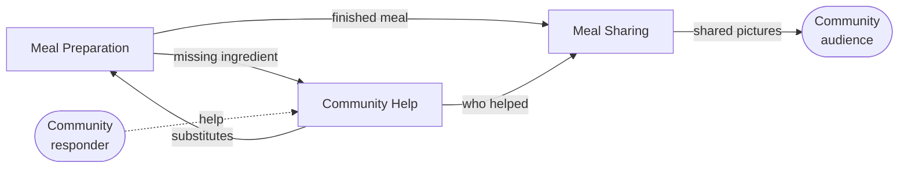

# Context Cut — Ask Community

**Mode: propose.** No lanes, groups or annotations are drawn on this story, so
this proposes a cut rather than reviewing one.

**Scope note.** Eight sentences, one uninterrupted happy path: a cook hits an
ingredient gap, asks the community, gets a substitute, finishes cooking, and
shares the result. There is no catastrophe, no branch, and no named responder
(no Grandma Avatar, no Community Cook, no Chef) — just "Community" as one
actor. This is the plainest telling of this domain in the project so far;
where it touches the richer artifacts already here, that is flagged rather
than assumed.

---

## 1. Story transcription

Numbers sit at the arrow's origin, next to the actor. Unnumbered arrows
(`with`, `for`, `and takes`, `and shares`) continue the same sentence.

```
1. Cook prepares Meal
2. Cook needs Help with Ingredients
3. Cook asks Community for Help with Ingredients
4. Community provides Help with Ingredients Substitutes
5. Cook prepares Meal and takes Pictures
6. Cook thanks Community and shares Pictures with Community
```

Two things to fix before cutting anything:

- **Sentences 5 and 6 are compound**, each with a continuation that does a
  different job (`prepares Meal` **and** `takes Pictures`). Split as `5a/5b`
  and `6a/6b` below — that split is where two of the three boundaries actually
  fall.
- **No object is drawn for the thanks itself.** Sentence 6a runs straight from
  Cook to Community with no pictogram in between, unlike the richer variant of
  this domain elsewhere in this project, which mints a pale-yellow *Thanks*.
  Read as a simplification of the same act, not a different one.

Assumed correct as read; confirm before building on it.

---

## 2. Signal table

| # | Actor | Activity | Work objects | What it is *for* | Sense of the shared nouns here |
|---|-------|----------|--------------|-------------------|--------------------------------|
| 1 | Cook | prepares | Meal | Dinner gets made | *Meal* = a preparation getting underway |
| 2 | Cook | needs | Help, Ingredients | The cook names what's stopping them, before anyone else is involved | *Help* = a felt gap, not yet addressed to anyone; *Ingredients* = what the recipe calls for that the cook does not have |
| 3 | Cook | asks … for … with | Community, Help, Ingredients | So somebody who knows can suggest what to do | *Community* = a responder; *Help* = now a **request**, addressed and answerable; *Ingredients* = the same gap, now described to a stranger |
| 4 | Community | provides … with | Help, Ingredients Substitutes | So the cook can keep going | *Help* = a **response**; *Ingredients Substitutes* = a resolved recommendation — a different question ("does this work as a replacement?") from the gap in 2–3 |
| 5a | Cook | prepares | Meal | Dinner gets made, now unblocked | *Meal* = the same preparation, continuing |
| 5b | Cook | takes | Pictures | So there is something to show | *Pictures* = a record of the finished meal |
| 6a | Cook | thanks | Community | The helper is repaid | *Community* = a party owed gratitude — the same group as 3–4, or possibly a wider one; see §7 |
| 6b | Cook | shares … with | Pictures, Community | The community sees what was made | *Community* = an **audience**; *Pictures* = a post with a viewer, not a diagnostic aid |

The right-hand column has already done most of the cutting: *Help* moves from
a felt gap, to a request, to a response; *Ingredients* resolves into
*Ingredients Substitutes*, a different noun with a different question; and
*Community* moves from responder to audience.

---

## 3. Proposed contexts

### Meal Preparation
*Carries the cook through making the meal, including noticing when something
is missing.*

- **Sentences:** 1, 2, 5a — non-contiguous, wrapping around the help detour.
- **Actors:** Cook.
- **Owns:** *Meal* — recipe reference, steps, what's on hand.
- **Borrows with a shifted meaning:** *Help*, only as a recognized gap — a
  state of the preparation, not yet a request; *Ingredients Substitutes*,
  consumed to keep cooking, without owning how they were derived.
- **Justified by:** purpose (dinner gets made), ownership (*Meal* is created
  and finished only here), and a handoff at both ends — 2→3 hands the
  problem out, 4→5a takes the answer back in.

### Community Help
*Gets a stuck cook unstuck by putting the problem in front of the community
and bringing an answer back.*

- **Sentences:** 3, 4 — plus 6a, contested (§7).
- **Actors:** Cook (as requester), Community (as responder).
- **Owns:** *Help* (request, then response), *Ingredients Substitutes*.
- **Borrows with a shifted meaning:** *Ingredients*, referenced only as the
  gap it must answer, without owning the meal around it.
- **Justified by:** language shift (*Help*: felt need → request → response;
  *Ingredients* → *Ingredients Substitutes*), actor change (Community becomes
  the actor at 4), and the handoff at 3→4.

### Meal Sharing
*Turns a finished meal into something the community sees.*

- **Sentences:** 5b, 6b — plus 6a, contested (§7).
- **Actors:** Cook, Community (as audience).
- **Owns:** *Pictures*, as a post.
- **Borrows with a shifted meaning:** *Community*, here an audience rather
  than a responder.
- **Justified by:** language shift (*Community*: responder → audience —
  the sharpest shift in the story), purpose (be seen, not get unstuck), and
  ownership (*Pictures* created here).

**Names kept deliberately.** Both names are already established elsewhere in
this project for the same domain (the pivotal-event cut and the six-sentence
rescue story both reach *Community Help* and *Meal Sharing* independently) —
reused rather than reinvented; see the reconciliation at the end.

---

## 4. Lane assignment

| # | Sentence | Lane |
|---|----------|------|
| 1 | Cook **prepares** Meal | Meal Preparation |
| 2 | Cook **needs** Help with Ingredients | Meal Preparation |
| 3 | Cook **asks** Community for Help with Ingredients | Community Help |
| 4 | Community **provides** Help with Ingredients Substitutes | Community Help |
| 5a | Cook **prepares** Meal | Meal Preparation |
| 5b | … **and takes** Pictures | Meal Sharing |
| 6a | Cook **thanks** Community | Community Help |
| 6b | … **and shares** Pictures **with** Community | Meal Sharing |

Lane runs: Preparation `1, 2 … 5a` · Help `3, 4 … 6a` · Sharing `5b … 6b`. Two
of the three lanes recur across the sequence rather than running as one
contiguous block — the mark of a real cut rather than a phase diagram.

---

## 5. Context map

| From | To | What flows | Pattern | Note |
|------|-----|-----------|---------|------|
| Meal Preparation | Community Help | the missing-ingredient situation | Customer/supplier | Preparation supplies the gap; Help turns it into an answerable request |
| Community Help | Meal Preparation | Ingredients Substitutes | Customer/supplier | Preparation decides whether to use them and keeps cooking; Help never learns if they worked |
| Meal Preparation | Meal Sharing | the finished meal | Customer/supplier | Triggered once dinner is actually done |
| Community Help | Meal Sharing | who helped | Customer/supplier, thin | This story never names individual responders, so the crossing is trivial today — see §7 |
| Meal Sharing | *Community* (external, audience) | the shared Pictures | Published language | The community is a passive audience here, not a participant |
| *Community* (external, responder) | Community Help | Help, via Ingredients Substitutes | Conformist | Community is not a context in this story — it is an external party the context consults, see §7 |



---

## 6. Contested calls & alternative cuts

**Contested sentence 2 — "needs Help with Ingredients."**
*For Meal Preparation (chosen):* Help has not been addressed to anyone yet —
it names a gap in the meal, not a request. *For Community Help:* it is the
same *Help* object that recurs at 3 and 4, and arguably starts its lifecycle
here rather than at the ask. **What would settle it:** does the product ever
let a cook record "I need help" without that becoming a community-visible ask
— a private note, a draft? If the two are always the same moment, sentence 2
collapses into 3 and the cut simplifies.

**Contested sentence 6a — "thanks Community."**
*For Community Help (chosen):* thanks closes the reciprocity loop the help
context already owns, and closing it needs nothing this story doesn't already
have. *For Meal Sharing:* sentence 6 is one gesture — thanks and share happen
in the same breath, and no separate *Thanks* object is drawn here to argue
otherwise. **Placed in Community Help**, matching the same call made three
times independently elsewhere in this project. **What would settle it:** is
the thank-you private to the responder, or is it the caption on the public
post? If the latter, 6a and 6b are one act and Meal Sharing owns both.

**Coarser cut — two lanes.** Merge Community Help into Meal Sharing: `Meal
Preparation` (1, 2, 5a) and `Community` (3, 4, 5b, 6a, 6b). Defensible on this
six-sentence story alone, since Community is the recurring actor through both.
**What is lost:** the purpose split this diagram itself draws — asking a
stranger for advice is not the same act as showing a finished dish to a crowd,
and they plausibly run on different clocks (an ingredient gap wants an answer
before the pan goes cold; a shared photo does not).

**Finer cut — split sentence 2 into its own lane.** Rejected outright by the
too-small test: one sentence, same actor and vocabulary as its neighbour.

**Open question — is "Community" one population or two?** The diagram draws
one pictogram for the responder in 3–4 and the audience in 6b. Every richer
telling of this domain elsewhere in this project splits these into distinct
actors (named responders vs. a general audience). If they are the same
population here, this is simply the no-drama path through the same product;
if not, the diagram has collapsed two actors into one — a pattern this project
has flagged before.

**Absent from this story.** No *Recipe* anywhere — the community suggests a
substitute without any stated reference to what is being cooked, the same gap
already noted in the richer rescue story in this project. No state stickies,
no failure branch: this is the "it just works" path, not the catastrophe one.

---

## Reconciliation with the existing analyses in this project

Same domain, a shorter and plainer scenario: no catastrophe, no Grandma
Avatar, just a generic "Community" answering an ingredient gap.

**Confirms, independently:**
- The same three-way cut — **Meal Preparation / Community Help / Meal
  Sharing** — falls out of a story with none of the richer story's drama.
- **Thanks belongs inside the help context**, not a lane of its own — the
  same call, made the same way, for the fourth time across this project's
  artifacts on this domain.
- **Meal Sharing is the thinnest, most contested lane every time this domain
  is cut**, and survives here only on the same evidence as before: *Community*
  meaning something different as responder versus audience.

**Adds:**
- A clean look at *Help* **before** it is addressed to anyone — sentence 2 has
  no analogue in the richer diagrams, which jump straight from "Ingredients
  missing" to "Help requested." It sharpens, rather than answers, the open
  question of whether *needing* help and *asking* for it are one moment in
  this product or two.
- A fourth independent confirmation that **no artifact for this domain ever
  names a Recipe**, despite substitution advice depending on one.