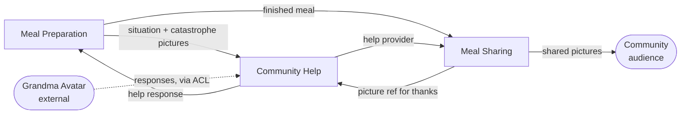

# Context Cut — Cook, Grandma Avatar and the burnt meal

**Mode: propose.** No lanes, groups or annotations are drawn on this story, so
this proposes a cut rather than reviewing one.

**Scope note.** This is a *six-sentence* story covering only the kitchen and its
aftermath. It starts with a meal already being prepared and ends with pictures
reaching the community. Everything the Community Cooking EventStorming board in
this project shows *before* the stove — registration, dinner planning, recipe
search, ingredient substitution — is outside this story. Where that matters, it
is flagged rather than invented (§7).

---

## 1. Story transcription

Read left-to-right, top-to-bottom. Numbers sit at the arrow origin next to the
actor; unnumbered arrows (`and takes`, `for`, `with`, `to rescue`, `and shares`)
continue the same sentence.

```
1. Cook prepares Meal
2. Cook burns Meal and takes Pictures
3. Cook asks Grandma Avatar for Help with Catastrophy Pictures
4. Grandma Avatar provides Help to rescue Meal
5. Cook rescues Meal and takes Pictures
6. Cook thanks Grandma Avatar and shares Pictures with Community
```

Two things worth fixing on the wall before anything else:

- **"Catastrophy"** is the diagram's spelling. Left verbatim above; if this word
  is entering the ubiquitous language, spell it *Catastrophe*, and note that the
  board in this project already uses *Catastrophe* — the two artifacts disagree
  today.
- **Sentences 2, 5 and 6 are compound.** Each has a main clause and a
  continuation that does something different (`burns Meal` **and** `takes
  Pictures`). That compounding is not cosmetic — it is where two of the three
  boundaries below actually fall, so those sentences are split into `2a/2b`,
  `5a/5b`, `6a/6b` in the lane assignment. On a redraw they are arguably three
  pairs of sentences rather than three sentences.

Assumed correct as read; confirm before building on it.

---

## 2. Signal table

| # | Actor | Activity | Work objects | What it is *for* | Sense of the shared nouns here |
|---|-------|----------|--------------|------------------|-------------------------------|
| 1 | Cook | prepares | Meal | The cook gets dinner made | *Meal* = a preparation in progress — steps, timings, a pan on a hob |
| 2a | Cook | burns | Meal | (nothing — this is the trouble, not a purpose) | *Meal* = the same preparation, now in a failed state |
| 2b | Cook | takes | Pictures | So a stranger can see what went wrong | *Pictures* = **diagnostic evidence**; short-lived, unflattering, private-ish |
| 3 | Cook | asks … for … with | Grandma Avatar, Help, Catastrophy Pictures | So somebody who knows tells me what to do | *Help* = a **request**; *Catastrophy Pictures* = the request's attachment; *Grandma Avatar* = a responder |
| 4 | Grandma Avatar | provides … to rescue | Help, Meal | So the cook is unstuck | *Help* = a **response**, advice; *Meal* = a **described situation**, not a physical thing — the avatar never touches the pan |
| 5a | Cook | rescues | Meal | The cook gets dinner made after all | *Meal* = the preparation, back on track and then finished |
| 5b | Cook | takes | Pictures | So there is something to show | *Pictures* = **a result worth showing**; long-lived, flattering, public |
| 6a | Cook | thanks | Grandma Avatar | So the helper is repaid and helps again | *Grandma Avatar* = a **help provider with standing**, not an answering service |
| 6b | Cook | shares … with | Pictures, Community | So the community sees what happened | *Pictures* = a **post with an audience**; *Community* = an audience |

The right-hand column has already done most of the cutting. *Pictures* carries
two clearly different models. *Meal* carries a physical one and a described one.
*Help* is a request in 3 and a response in 4. *Grandma Avatar* is a capability
in 3–4 and a person owed something in 6a.

---

## 3. What the signals say

**1 — Language shift (strongest evidence here).**
*Pictures* is the headline. The story itself supplies the qualifier: the ones
taken at 2b are called **Catastrophy Pictures** when they are used at 3, and the
ones taken at 5b are plain **Pictures** when they are shared at 6b. Same
pictogram, two models:

| | Catastrophy Pictures (2b → 3) | Pictures (5b → 6b) |
|---|---|---|
| Purpose | evidence for a diagnosis | a result shown to people |
| Lifetime | as long as the request | indefinitely |
| Audience | one responder | the whole community |
| Attributes that matter | is the damage legible? | is it flattering? who is in it? |
| What is asked of them | "can you tell what happened?" | "may this be public?" |

Two different sets of questions, two different lifecycles, and — crucially —
**the story has already given them two different names.** That is as clean a
language shift as a six-sentence story can produce.

*Meal* is the near-miss. Burnt (2a) and rescued (5a) are **states of one
preparation**, not senses — the trap in signal 1. But the *Meal* in sentence 4 is
different: the avatar rescues a meal it cannot see, smell or touch. What crosses
into the help conversation is a description plus photographs; the pan stays in
the cook's kitchen. That *is* a sense shift, and it is why 4 sits in a different
lane from 5a even though both say "rescue".

**2 — Purpose change.** Three purpose sentences cover the whole story with no
overlap and no leftovers:

- "so dinner gets made, including when it goes wrong" → 1, 2a, 5a
- "so a stuck cook gets unstuck by someone who knows, and that someone is repaid"
  → 2b, 3, 4, 6a
- "so a finished meal is seen by the community" → 5b, 6b

Note that none of the three is a contiguous run of numbers.

**3 — Actor change.** Only sentence 4 has a different actor (*Grandma Avatar*),
and it is precisely the sentence where the language shifts too. Moderate
evidence, but it points at the same seam the language does. The inverse warning
applies with force here: the Cook does five of six sentences, and that proves
nothing about the number of contexts.

**4 — Handoff / pivotal moment.** One unmistakable handoff at 3: the cook stops
solving the problem and hands it out. The story could plausibly pause there —
the cook waits. A second, softer one at 5a→5b: the meal is finished, and a
finished meal cannot be un-finished. Both are exactly where a boundary wants to
sit.

**5 — Work-object cohesion.** {Meal} recurs at 1, 2a, 4, 5a. {Help, Grandma
Avatar, Catastrophy Pictures} co-occur at 3, 4, 6a. {Pictures, Community} at 5b,
6b. Mechanically consistent with the purpose clustering — and note the warning:
*Meal* appears almost everywhere, which makes it the **shared concept each
context models differently**, not a lane name.

**6 — Ownership and lifecycle.** *takes*, *asks*, *provides*, *thanks*, *shares*
are all creating verbs. Preparation creates the trouble; the help lane creates
the request, the response and the thanks; the sharing lane creates the post.
Nothing here reads something it did not create except the *Meal* (referenced by
the avatar) and the *Pictures* (referenced by the post) — which is exactly the
list of border crossings in §5.

**7 — Rate of change (assumption, not diagram content).** Cooking is real-time:
a burning pan is a matter of minutes. Help is minutes-to-hours. Sharing is
unhurried and can happen the next day. Three different clocks across three
lanes. Ask the team to confirm; it is the cheapest sanity check available.

**8 — Consistency need.** Nothing here must be atomic across a lane boundary.
Advice arriving a minute after it was asked for is normal; thanks lagging the
meal by a day is normal. Every boundary below is affordable.

**9 — Organisational seam.** Not visible in a story about one home cook. Noted
as absent rather than guessed at.

Each boundary below is supported by four or more signals; each lane's sentences
share at least two.

---

## 4. Proposed contexts

Three lanes for six sentences. Proposed as **subdomains** in the first instance;
§4d says which I would implement as separate bounded contexts.

### Meal Preparation
*Carries the cook through making the meal in real time, including when it goes
wrong and comes back.*

- **Sentences:** 1, 2a, 5a — non-contiguous, wrapping around the help detour.
- **Actors:** Cook.
- **Owns:** *Meal* as a **preparation** — current step, status (cooking → burnt /
  in catastrophe → rescued → prepared), what went wrong, timings. **The story
  names no object for this**; the lane needs one. Call it a *Cooking session* or
  *Meal preparation*.
- **Borrows with a shifted meaning:** *Help* — arrives as advice to act on, and
  the lane decides whether it worked. Receiving advice is not the rescue;
  the cook confirming the pan is recoverable is.
- **Justified by:** purpose, handoff at 3, language (the physical meal vs the
  described one), clock (real-time), and the non-contiguity of 1/2a…5a.

### Community Help
*Gets a stuck cook unstuck by someone who knows, and closes the loop back to
whoever helped.*

- **Sentences:** 2b, 3, 4, 6a — also non-contiguous, wrapping around 5.
- **Actors:** Cook (as requester), Grandma Avatar (as responder).
- **Owns:** *Help request*, *Help response*, *Help provider*, *Thanks*, and
  *Catastrophy Pictures* as the request's attachment.
- **Borrows with a shifted meaning:** *Meal* — as a described situation in a
  request, never as a pan; *Grandma Avatar* — as a responder in 3–4 and as a
  party with standing in 6a.
- **Justified by:** actor change, handoff, purpose, language (*Help* as request
  vs response; *Meal* as description), ownership (it creates everything it
  touches).
- **Note:** taking the evidence photo (2b) sits here rather than in Meal
  Preparation because the photo exists only to make the request answerable — it
  is created one clause before the request and dies with it. This is a contested
  call; see §7.

### Meal Sharing
*Turns a finished meal into something the community sees.*

- **Sentences:** 5b, 6b.
- **Actors:** Cook, Community (as audience).
- **Owns:** *Pictures* as **a post** — the meal shown, its caption, who may see
  it, who is in it; *Community* as the audience.
- **Borrows with a shifted meaning:** *Pictures* — the same word Community Help
  uses for evidence, modelled completely differently; *Help provider* — read, so
  the post can name who helped.
- **Justified by:** language shift (the sharpest in the story, and the story
  named it for us), purpose, audience change, ownership, clock.
- **Note:** the thinnest lane, and it is contiguous. Its case rests on the
  *Pictures* language shift rather than on recurrence; see the contested call in
  §7.

### 4c. A note on the names

`Meal Preparation` is the team's own word from the EventStorming board in this
project, kept deliberately. `Community Help` is **not**: the board carries two
bubbles, *Cooking Assistance* and *Cooking Help*, which the prior analyses argued
are one context drawn twice. One name is needed for one lane, and *Community
Help* is proposed because it says who answers as well as what is answered — which
is the thing open question 2 below puts in doubt. **If the team prefers *Cooking
Help*, take it**; a name they already say beats a better one they do not.
`Meal Sharing` is new, and deliberately narrower than the board's *Sharing*.

### 4d. Subdomains or bounded contexts?

All three are subdomains. I would implement **Meal Preparation** and **Community
Help** as separate bounded contexts without hesitation: different clocks,
different models of *Meal*, and Community Help demonstrably serves more than one
moment in the process (and, on the EventStorming board in this project, serves
the planning phase too).

**Meal Sharing** is the judgement call. On the evidence of *this story* alone it
could be a module inside Community Help rather than its own context — sentence 6
binds the thanks and the share into one gesture. The argument for separating it
is the *Pictures* model, not the workflow. See §7.

---

## 5. Lane assignment — the redraw spec

| # | Sentence | Lane |
|---|----------|------|
| 1 | Cook **prepares** Meal | Meal Preparation |
| 2a | Cook **burns** Meal | Meal Preparation |
| 2b | … **and takes** Pictures *(of the catastrophe)* | Community Help |
| 3 | Cook **asks** Grandma Avatar **for** Help **with** Catastrophy Pictures | Community Help |
| 4 | Grandma Avatar **provides** Help **to rescue** Meal | Community Help |
| 5a | Cook **rescues** Meal | Meal Preparation |
| 5b | … **and takes** Pictures *(of the rescued meal)* | Meal Sharing |
| 6a | Cook **thanks** Grandma Avatar | Community Help |
| 6b | … **and shares** Pictures **with** Community | Meal Sharing |

Lane runs: Preparation `1, 2a … 5a` · Help `2b, 3, 4 … 6a` · Sharing `5b, 6b`.
Two of three lanes recur across the sequence, and the two compound sentences that
straddle lanes (2 and 6) are the two boundary crossings — which is what a real
cut looks like, and what a phase diagram never does.

**On the redraw**, splitting 2 into `2 burns` / `2′ takes Catastrophy Pictures`
and 6 into `6 thanks` / `6′ shares Pictures` makes the lanes drawable without
arrows crossing lane borders mid-sentence.

---

## 6. Context map

| From | To | What flows | Pattern | Note |
|------|-----|-----------|---------|------|
| Meal Preparation | Community Help | The situation: what is being made, what went wrong, the catastrophe pictures | Customer/supplier | Preparation supplies the snapshot; help owns the request built from it |
| Community Help | Meal Preparation | A help response — advice to act on | Customer/supplier | **Preparation decides whether it worked.** The response is an input to the rescue, not the rescue |
| Meal Preparation | Meal Sharing | The finished meal: identity, what it was, when | Customer/supplier | Triggered by the meal being done — the second handoff |
| Community Help | Meal Sharing | *Help provider* reference — who helped | Customer/supplier | Sharing needs it to name the helper in the post |
| Meal Sharing | Community Help | Picture reference attached to the thanks | Customer/supplier | The reverse leg; this two-way traffic is the argument for merging the two (§7) |
| *Grandma Avatar* (external) | Community Help | Machine-generated help responses | **Anticorruption layer** | An AI persona standing among human responders. Wrap it, and label its answers as machine-generated where the cook sees them |
| Meal Sharing | *Community* (external) | The shared pictures | Published language | The community is an audience here, not a participant — see §7 |



---

## 7. Contested calls & alternative cuts

### Contested sentence 2b — "and takes Pictures" (of the burnt meal)

*For **Community Help** (chosen):* the photo exists only so a stranger can
diagnose the problem. Its lifetime is the request's, its audience is one
responder, and sentence 3 immediately consumes it. Nothing else ever reads it.

*For **Meal Preparation**:* the cook photographs their own catastrophe; it is a
record of what happened to *this* preparation, and would still be worth keeping
if nobody were asked for help.

**Placed in Community Help** because the story gives the photo no other consumer
— it is created and used one clause apart. **What would settle it:** *does a cook
ever photograph a disaster without asking anyone about it?* If yes, the photo
belongs to the preparation and Community Help merely attaches a reference to it.

### Contested sentence 6a — "thanks Grandma Avatar"

*For **Community Help** (chosen):* thanks closes the reciprocity loop that makes
people answer next time. The help context already owns *Help provider*; nothing
else can validate that this person actually helped.

*For **Meal Sharing**:* sentence 6 is one gesture in the story — the cook thanks
and shares in a single breath, and in a community product the public thank-you
*is* the currency.

**Placed in Community Help**, matching the pivotal-event cut already in this
project, which reached the same conclusion by a different route. **What would
settle it:** *is the thank-you private to the helper, or is it the caption on the
public post?* If it is the caption, 6a and 6b are one act and Meal Sharing owns
both.

### Contested: is Meal Sharing a context at all?

It holds two clauses, it is contiguous, and both of its clauses share sentence 6
with Community Help. By the too-small test it is borderline. It survives on one
piece of evidence — the *Pictures* language shift — and on one strategic bet:
that showing finished meals to the community is a distinct thing this product
does, not a garnish on the help thread. **If the product is fundamentally a help
network, fold it into Community Help and keep a two-lane cut.** If it is a
community that cooks together, it is a real context and this story simply only
touches it twice.

### Coarser cut — two lanes

Merge Meal Sharing into Community Help: `Meal Preparation` (1, 2a, 5a) and
`Community Help` (2b, 3, 4, 6a, 6b, 5b). Defensible on this story alone, and it
removes the two-way picture traffic in §6. **What is lost:** one word, *Pictures*,
then means both "evidence of failure" and "proof of success" inside a single
model — and that is exactly the collision the language test told us to avoid.
The prior analysis in this project independently flagged this as "one word, two
concepts; splitting them would sharpen both."

### Finer cut — four or five lanes

Two candidates, both rejected here:

- **Split *Catastrophe recording* out of Meal Preparation** (2a, 2b) — what went
  wrong, photographed and filed. Rejected: nothing in this story keeps a
  catastrophe record for its own sake. Revisit if the product ever shows a cook
  their past disasters, or learns from them.
- **Split *Assistance* (the AI) out of Community Help** — the Grandma Avatar as
  its own context. Rejected: in this story it is a **responder inside** the help
  context, and the right treatment is the anticorruption layer in §6. It becomes
  a context of its own only if the avatar starts acting unprompted — watching the
  cook and intervening — which this story never shows.

### What the story never says (open questions, not invented steps)

1. **There is no Recipe anywhere in this story.** The avatar rescues a meal
   without any stated knowledge of what was being cooked. Either a recipe
   reference crosses into the help request and the story omits it, or the avatar
   is working from photographs alone. This changes what the Meal Preparation →
   Community Help border must carry, and it is the first thing to ask.
2. **The Community answers nothing.** On the EventStorming board in this project,
   help comes from a *Community Cook*, a *Chef* **and** the Grandma Avatar. In
   this story, the only responder is the avatar, and the community appears once,
   at the very end, as an audience. If that is deliberate, this is the
   *AI-assisted* variant of the scenario and the reciprocity loop is asymmetric —
   the cook thanks a machine and shares with people who did nothing. If it is
   accidental, a human responder is missing from sentence 4. **This is the most
   consequential question on the page**, because the whole community proposition
   sits on it.
3. **The rescue always works.** There is no branch where the meal cannot be
   saved — no takeaway, no serving it burnt, no abandoning. The Meal Preparation
   lane therefore has one exit and no failure ending, which matches the gap the
   invariants sheet in this project already recorded.
4. **Who confirms the rescue?** As drawn, 4 (advice arrives) is followed by 5a
   (rescued). If the arrival of advice *is* the rescue, the system will declare a
   meal saved while it is still burning. Placing 5a in Meal Preparation is the
   modelling answer; confirm it is the domain's answer too.
5. **May the community see the catastrophe pictures?** The two picture senses
   have different audiences in this story. If a cook ever shares the disaster
   shot, the two models start to converge and the Meal Sharing boundary needs
   re-arguing.

---

## 8. Subdomain classification (hypothesis — confirm against strategy)

Offered briefly because this project already carries Core Domain Chart work. A
six-sentence story is thin evidence for coreness; treat these as questions.

| Context | Type | Reasoning |
|---|---|---|
| **Community Help** | **Core** | Getting a panicking cook a useful answer fast, from the right responder, is what this product either wins or loses on. It is also the hardest thing here to do well. |
| **Meal Preparation** | Supporting | Necessary, specific to the product, and mostly bookkeeping — where am I, what went wrong. It becomes core only if step-by-step guidance turns into the differentiator. |
| **Meal Sharing** | Supporting, tending generic | Photo posting to an audience is a solved problem. What is *not* generic is the tie between a shared meal and the person who rescued it — keep that, buy the rest. |

The Grandma Avatar itself is a bought or built capability *inside* Community
Help, not a subdomain. Whether it is a differentiator or a commodity LLM behind a
persona is a strategy question, and it is the one worth taking to a Core Domain
Chart.

---

## 9. Reconciliation with the existing analyses in this project

Same domain, three methods. This story is a *slice* of the Community Cooking
board — roughly its events 11–21 — so agreement is meaningful and the
disagreements are informative.

**Agrees independently with the pivotal-event cut and the invariants sheet:**

- **Meal Preparation owns no object the story names.** All three analyses reach
  this from different directions: a stretch with no business object, ten
  invariants with nowhere to live, and here a lane whose *Meal* is clearly
  stateful and clearly unnamed. Naming that aggregate remains the single
  highest-value change.
- ***Pictures* is one word for two concepts** — evidence and trophy. This story
  makes it sharper than the board did, because the diagram itself writes
  **Catastrophy Pictures** in one place and **Pictures** in the other.
- **Thanks belongs in the help context**, not in a lane of its own.
- **A `Sharing`-only context is thin** and needs an argument beyond the workflow.
- **The Grandma Avatar is a responder inside the help context**, wrapped, with
  its answers labelled.

**This story adds, or sees differently:**

- The board's `Media` context and separate `Sharing` context are here resolved by
  **splitting the two picture senses into the lanes whose purpose each serves** —
  which is what the invariants sheet recommended but stopped short of doing.
- The board had **three kinds of responder**; this story has **one, and it is the
  machine**. That divergence is a finding about the product, not about the
  notation.
- The board's `Cooking Assistance` and `Cooking Help` bubbles — argued to be one
  context drawn twice — appear here as **one lane, recurring**, which is the
  positive evidence that argument was missing.

**Not covered by this story at all:** Cook Profile, Meal Planning, Recipe
Catalogue. Their absence is scope, not disagreement — but note that the Recipe
Catalogue's absence bites in open question 1 above.