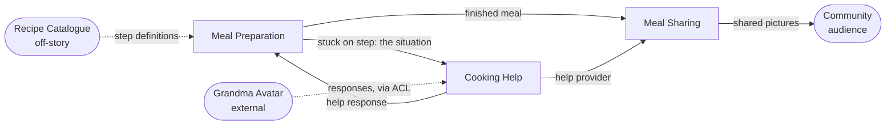

# Context Cut — Cook, Grandma Avatar and the unclear step (AskGrandma II)

**Mode: propose.** No lanes, groups or annotations are drawn on this story, so
this proposes a cut rather than reviewing one.

**Scope note.** Six sentences covering the kitchen and its aftermath only. It
starts with a meal already being prepared and ends with pictures reaching the
community. Registration, dinner planning, recipe search and ingredient
substitution — everything the Community Cooking EventStorming board in this
project shows *before* the stove — are outside it.

**This is not the same scenario as the story already in this project.** That one
was the *catastrophe* variant: the cook burns the meal, photographs the damage,
and the avatar rescues it. This is the *stuck-on-a-step* variant: nothing goes
wrong, the cook simply cannot do a step. The two stories have **identical
shape** and that is the most useful thing about having both — see §9.

---

## 1. Story transcription

Read left-to-right, top-to-bottom. Numbers sit at the arrow origin next to the
actor; unnumbered arrows (`for`, `with`, `and takes`, `and shares`) continue the
same sentence.

```
1. Cook prepares Meal
2. Cook needs Help for Meal Preparation Step
3. Cook asks Grandma Avatar for Help with Meal Preparation Step
4. Grandma Avatar provides Help with Meal Preparation Step
5. Cook prepares Meal and takes Pictures
6. Cook thanks Grandma Avatar and shares Pictures with Community
```

Four things to fix on the wall before building on this — none of them changes
the cut, but two of them change what the cut *means*:

- **Sentence 2's verb is not an activity.** *Needs* is a condition, not something
  an actor does. Domain Storytelling wants verbs an actor performs; a state
  drawn as a sentence is the one grammatical break in this story. It is kept
  below because what it records is real and important (§7, contested call 1),
  but on a redraw it is either a state annotation on the preparation or an
  activity with a proper verb — *reports*, *flags*, *gets stuck on*.
- **Sentences 5 and 6 are compound**, and both continuations do something
  different from their main clause (`prepares Meal` **and** `takes Pictures`).
  Split as `5a/5b` and `6a/6b` below; both splits are boundary crossings.
- **Sentence 5 repeats sentence 1 verbatim** — same actor, same verb, same work
  object. The story therefore never says that anything changed between 1 and 5.
  In the catastrophe story the parallel sentence reads *rescues Meal*, which at
  least marks the state change. Here nothing does. **As drawn, this story cannot
  tell you whether the help worked** (§7, open question 3).
- ***Help* is one pictogram doing three jobs** — a need (2), a request (3), a
  response (4). The board in this project already has the sharper vocabulary,
  *Help request* and *Help response*; a redraw should use it.

The story is otherwise clean, and notably free of CRUD verbs and collapsed
actors. If you want the grammar picked over properly before this becomes an
architecture, `domain-story-critic` is the skill for it.

Assumed correct as read; confirm before building on it.

---

## 2. Signal table

| # | Actor | Activity | Work objects | What it is *for* | Sense of the shared nouns here |
|---|-------|----------|--------------|------------------|-------------------------------|
| 1 | Cook | prepares | Meal | The cook gets dinner made | *Meal* = a preparation in progress — steps, timings, a pan on a hob |
| 2 | Cook | needs | Help, Meal Preparation Step | (nothing yet — this is the trouble, not a purpose) | *Help* = an **unmet need**, a gap; *Meal Preparation Step* = **the unit of work the cook is executing and cannot complete** |
| 3 | Cook | asks … for … with | Grandma Avatar, Help, Meal Preparation Step | So somebody who knows tells me how to do this bit | *Help* = a **request**; *Meal Preparation Step* = **a described situation** carried to a stranger; *Grandma Avatar* = a responder |
| 4 | Grandma Avatar | provides … with | Help, Meal Preparation Step | So the cook is unstuck | *Help* = a **response**, advice; *Meal Preparation Step* = the subject the advice is about — the avatar never touches the pan |
| 5a | Cook | prepares | Meal | The cook gets dinner made after all | *Meal* = the same preparation, resumed and then finished |
| 5b | Cook | takes | Pictures | So there is something to show | *Pictures* = **a result worth showing** — flattering, long-lived, public |
| 6a | Cook | thanks | Grandma Avatar | So the helper is repaid and helps again | *Grandma Avatar* = a **help provider with standing**, not an answering service |
| 6b | Cook | shares … with | Pictures, Community | So the community sees what happened | *Pictures* = **a post with an audience**; *Community* = an audience |

The right-hand column has already done most of the cutting. ***Help* carries
three senses in six sentences** — that is the sharpest language evidence on the
page. *Meal Preparation Step* carries two: a thing being executed, and a thing
being described. *Grandma Avatar* carries two: a capability in 3–4 and a party
owed something in 6a.

***Meal* is the near-miss.** In progress (1) and finished (5a) are **states of
one preparation, not senses** — the classic trap. They stay in one lane.

---

## 3. What the signals say

**1 — Language shift (strongest evidence here).**
*Help* is the headline, and unusually the story draws all three senses
separately:

| | Help @2 | Help @3 | Help @4 |
|---|---|---|---|
| What it is | an unmet need | a request | a response |
| Who holds it | the cook, alone | the help context | the help context |
| Lifetime | as long as the cook is stuck | until answered | indefinitely, reusable |
| The question asked of it | "am I stuck?" | "is this answerable?" | "did it work?" |
| Exists if nobody is asked | **yes** | no | no |

That last row is the cut. The need at 2 survives the absence of the help
context; the request and the response do not. **2 belongs to preparation; 3 and
4 belong to help.**

*Meal Preparation Step* is the second shift, and it is the more consequential
one. At 2 it is something the cook is *doing* — it has an order, a duration, an
instruction, a completion. At 3 and 4 it is something the cook is *describing* —
what matters is whether a stranger can understand it well enough to answer.
The avatar advises on a step it cannot see. That is the same physical-versus-
described split the catastrophe story found on *Meal*, relocated one level down.

**2 — Purpose change.** Three purpose sentences cover the whole story with no
overlap and no leftovers:

- "so dinner gets made, including when the cook cannot do a step" → 1, 2, 5a
- "so a stuck cook is unstuck by someone who knows, and that someone is repaid"
  → 3, 4, 6a
- "so a finished meal is seen by the community" → 5b, 6b

None of the three is a contiguous run of numbers.

**3 — Actor change.** Only sentence 4 has a different actor (*Grandma Avatar*),
and it is precisely the sentence where the language shifts too. Moderate
evidence pointing at the same seam. The inverse warning applies with force: the
Cook does five of six sentences and that proves nothing.

**4 — Handoff / pivotal moment.** One unmistakable handoff at **3**: the cook
stops solving the problem and hands it out; the story could plausibly pause
there while the cook waits. A second, softer one at **5a→5b**: the meal is
finished, and a finished meal cannot be un-finished.

**5 — Work-object cohesion.** {Meal, Meal Preparation Step} at 1, 2 ·
{Help, Grandma Avatar, Meal Preparation Step} at 2, 3, 4, 6a ·
{Pictures, Community} at 5b, 6b. Mechanically consistent with the purpose
clustering. Note *Meal Preparation Step* appears in both of the first two
clusters — which is the sign that it is a **shared concept each context models
differently**, not a lane name.

**6 — Ownership and lifecycle.** *asks*, *provides*, *thanks*, *takes*, *shares*
are creating verbs; *prepares* and *needs* are not. **Nothing in this story
creates a *Meal Preparation Step*.** It is referenced three times and originated
nowhere — almost certainly off-story, from a Recipe that this story never
mentions. Recorded as an open question rather than assigned to whichever lane
touches it first (§7, question 1). Everything else is created by the lane that
uses it.

**7 — Rate of change (assumption, not diagram content).** Cooking is real-time —
a cook stuck mid-step is a matter of minutes. Help is minutes. Sharing is
unhurried and can happen the next day. Three clocks. Cheapest sanity check
available; ask the team.

**8 — Consistency need.** Nothing here must be atomic across a lane boundary.
Advice arriving a minute after it was asked for is normal; thanks lagging the
meal by a day is normal. Every boundary below is affordable.

**9 — Organisational seam.** Not visible in a story about one home cook, beyond
the Grandma Avatar being a system rather than a person. Noted as absent rather
than guessed at.

Each boundary below is supported by four or more signals; each lane's clauses
share at least two.

---

## 4. Proposed contexts

Three lanes for six sentences. Proposed as **subdomains** in the first instance;
§4d says which I would implement as separate bounded contexts.

### Meal Preparation
*Carries the cook through making the meal in real time, including knowing when
they are stuck.*

- **Clauses:** 1, 2, 5a — non-contiguous, wrapping around the help detour.
- **Actors:** Cook.
- **Owns:** *Meal* as a **preparation** — current step, status (cooking → stuck →
  prepared), progress, timings. **And, for the first time in this project's
  artifacts, a named unit inside it: *Meal Preparation Step*** — as an executable
  step with an order and a completion. The container is still unnamed; call it a
  *Cooking session* or *Meal preparation*.
- **Borrows with a shifted meaning:** *Help* — arrives as advice to act on, and
  the lane decides whether it worked. Receiving advice is not the resumption;
  the cook getting the pan moving again is.
- **Justified by:** language (*Help* as need vs request; the step executed vs
  described), purpose, the handoff at 3, clock (real-time), and the
  non-contiguity of 1/2 … 5a.

### Cooking Help
*Gets a stuck cook unstuck by someone who knows, and closes the loop back to
whoever helped.*

- **Clauses:** 3, 4, 6a — also non-contiguous, wrapping around 5.
- **Actors:** Cook (as requester), Grandma Avatar (as responder).
- **Owns:** *Help request*, *Help response*, *Help provider*, *Thanks* — the
  board's four objects, of which this story draws two under one *Help*
  pictogram.
- **Borrows with a shifted meaning:** *Meal Preparation Step* — as a described
  situation in a request, never as a pan on a hob; *Grandma Avatar* — as a
  responder in 3–4 and as a party with standing in 6a.
- **Justified by:** actor change, handoff, purpose, language (the three senses of
  *Help*), ownership (it creates everything it touches).

### Meal Sharing
*Turns a finished meal into something the community sees.*

- **Clauses:** 5b, 6b.
- **Actors:** Cook, Community (as audience).
- **Owns:** *Pictures* as **a post** — the meal shown, its caption, who may see
  it, who is in it; *Community* as the audience.
- **Borrows with a shifted meaning:** *Help provider* — read, so the post can
  name who helped. (Implied by sentence 6's pairing; the story draws no arrow
  for it.)
- **Justified by:** purpose, audience change, ownership, clock.
- **Weaker here than in the catastrophe story.** There, the diagram itself wrote
  *Catastrophy Pictures* in one place and *Pictures* in the other — a language
  shift the team had already made. **This story has only one sense of
  *Pictures*.** The lane survives on purpose, audience and clock, not on
  language, and that is a materially thinner case. See §7.

### 4c. A note on the names

**`Cooking Help` is the board's own word** — one of the two help bubbles the
team drew — and it is used here deliberately in preference to *Community Help*,
which the earlier story analysis in this project proposed. That proposal was
made "because it says who answers as well as what is answered." **This story
says who answers, and it is a machine.** No community member helps anywhere in
it; the Community appears once, at the very end, as an audience. On this
evidence the word *Community* in the lane name is not just unearned, it is
misleading. If the merged help context turns out to serve the planning phase too
(as the board says it does), the board's other name — *Cooking Assistance* —
is the better umbrella; pick one of the team's two, not a third.

`Meal Preparation` is the board's term, kept. `Meal Sharing` is carried over
from the earlier story analysis, and remains deliberately narrower than the
board's *Sharing*.

### 4d. Subdomains or bounded contexts?

All three are subdomains. I would implement **Meal Preparation** and **Cooking
Help** as separate bounded contexts without hesitation: different clocks,
different models of the *Step*, and the help context demonstrably serves more
than one moment in the process — two severities in these two stories, and the
planning phase as well on the EventStorming board.

**Meal Sharing** is the judgement call, and this story weakens it (§7).

---

## 5. Lane assignment — the redraw spec

| # | Sentence | Lane |
|---|----------|------|
| 1 | Cook **prepares** Meal | Meal Preparation |
| 2 | Cook **needs** Help **for** Meal Preparation Step | Meal Preparation |
| 3 | Cook **asks** Grandma Avatar **for** Help **with** Meal Preparation Step | Cooking Help |
| 4 | Grandma Avatar **provides** Help **with** Meal Preparation Step | Cooking Help |
| 5a | Cook **prepares** Meal | Meal Preparation |
| 5b | … **and takes** Pictures | Meal Sharing |
| 6a | Cook **thanks** Grandma Avatar | Cooking Help |
| 6b | … **and shares** Pictures **with** Community | Meal Sharing |

Lane runs: Preparation `1, 2 … 5a` · Help `3, 4 … 6a` · Sharing `5b, 6b`.
Two of three lanes recur across the sequence, and the two compound sentences
that straddle lanes (5 and 6) are the two boundary crossings — which is what a
real cut looks like, and what a phase diagram never does.

**On the redraw**, split 5 into `5 prepares Meal` / `5′ takes Pictures` and 6
into `6 thanks Grandma Avatar` / `6′ shares Pictures with Community`, so no
arrow crosses a lane border mid-sentence. Also split the *Help* pictogram into
*Help request* (3) and *Help response* (4), matching the board.

---

## 6. Context map

| From | To | What flows | Pattern | Note |
|------|-----|-----------|---------|------|
| Meal Preparation | Cooking Help | The situation: which step, what the cook cannot do, what is being made | Customer/supplier | Preparation supplies the snapshot; help owns the request built from it |
| Cooking Help | Meal Preparation | A help response — advice on the step | Customer/supplier | **Preparation decides whether it worked.** The response is an input to resuming, not the resumption |
| Meal Preparation | Meal Sharing | The finished meal: identity, what it was, when | Customer/supplier | Triggered at 5a→5b, the second handoff |
| Cooking Help | Meal Sharing | *Help provider* reference — who helped | Customer/supplier | Inferred from sentence 6's pairing; **the story draws no arrow for it** |
| *Recipe Catalogue* (off-story) | Meal Preparation | *Meal Preparation Step* definitions | Conformist, probably | **Nothing in this story creates a step.** See §7 question 1 — this row is the most consequential guess on the page |
| *Grandma Avatar* (external) | Cooking Help | Machine-generated help responses | **Anticorruption layer** | An AI persona standing where human responders stand on the board. Wrap it, and label its answers as machine-generated where the cook sees them |
| Meal Sharing | *Community* (external) | The shared pictures | Published language | The community is an audience here, not a participant |

Note what is **absent** compared with the catastrophe story: there is no reverse
leg from Meal Sharing back to Cooking Help. In that story the thanks appeared to
carry a picture; here sentence 6's two clauses are independent — the thanks goes
to the avatar, the pictures go to the community, and nothing connects them. That
removes the two-way traffic which was the strongest argument for merging those
two lanes.



---

## 7. Contested calls & alternative cuts

### Contested sentence 2 — "needs Help for Meal Preparation Step"

*For **Meal Preparation** (chosen):* being stuck is a state of the preparation.
It is true before anyone is asked, it is true if nobody is ever asked, and it is
the preparation that knows which step it is stuck on. Nothing exists in the help
context until sentence 3.

*For **Cooking Help**:* the work object is literally *Help*, which is help's own
word, and sentence 2 reads like the first half of raising a request.

**Placed in Meal Preparation** on the language test: the *Help* at 2 is an unmet
need, not a request, and the two have different lifetimes and different owners.
**And the placement matters more than it looks.** Putting 2 and 3 in different
lanes makes visible the gap the invariants sheet in this project called the four
missing policies — *the board shows the trouble and it shows the request, with
nothing between them.* This story is the first artifact here that draws both
moments as separate sentences. Whatever sits between them is where this
product's behaviour lives.

**What would settle it:** *does anything notice the cook is stuck, or does the
cook always have to ask?* If something notices, sentence 2 is an event the
preparation publishes and Cooking Help subscribes to. If the cook always asks, 2
and 3 are one gesture and the sentence should be redrawn as one.

### Contested sentence 6a — "thanks Grandma Avatar"

*For **Cooking Help** (chosen):* thanks closes the reciprocity loop that makes
people answer next time. The help context already owns *Help provider*; nothing
else can validate that this responder actually helped.

*For **Meal Sharing**:* sentence 6 is one gesture — the cook thanks and shares
in a single breath, and in a community product the public thank-you *is* the
currency.

**Placed in Cooking Help**, matching both the pivotal-event cut and the earlier
story analysis in this project, which reached the same conclusion by different
routes. **What would settle it:** *is the thank-you private to the helper, or is
it the caption on the public post?*

### Contested: is Meal Sharing a context at all?

Two clauses, contiguous, and both share a sentence with another lane. By the
too-small test it is borderline — and **this story removes the single piece of
evidence the earlier analysis leaned on**, because there is only one sense of
*Pictures* here. What is left is purpose, audience and clock: three real signals,
none of them the strong one.

It survives in this cut on **cross-story** evidence rather than on this story
alone: the catastrophe variant does show two picture senses, and it names them.
**If you only had this story, folding Meal Sharing into Cooking Help would be
the honest call.** With both stories, keeping it separate is right — but say out
loud that it is being kept on the other story's evidence.

### Coarser cut — two lanes

`Meal Preparation` (1, 2, 5a) and `Cooking Help` (3, 4, 5b, 6a, 6b). Defensible
on this story alone. **What is lost:** the moment *Pictures* means both "advice
worked, look" and, in the other story, "here is what went wrong", they collide
inside one model — which is exactly the collision the language test exists to
prevent. Also: it makes the community-facing surface a feature of a help desk,
which is a strategic statement, not a modelling one.

### Finer cut — four or five lanes

Two candidates, both rejected here:

- **Split *Step guidance* out of Meal Preparation** (2, and the receiving half of
    4) — knowing which steps exist, which are done, and which the cook cannot do.
       Rejected on this story: it would be one clause, and the step model is
       inseparable from the preparation that runs it. **Revisit immediately if
       step-level guidance becomes the product** rather than the trouble path — see
       §8, where that is the whole strategic fork.
- **Split *Assistance* (the AI) out of Cooking Help** — the Grandma Avatar as its
  own context. Rejected: here it is a **responder inside** the help context, and
  the right treatment is the anticorruption layer in §6. It becomes a context of
  its own only if the avatar starts acting unprompted — watching the cook and
  intervening — which this story never shows.

### What the story never says (open questions, not invented steps)

1. **Where does a *Meal Preparation Step* come from?** Nothing creates one. This
   is the highest-value question on the page, because the two answers give two
   different products:
    - **From the Recipe** (off-story, and there is no Recipe anywhere in this
      story) → a step is a shared, identifiable thing, and *help about step 4 of
      this recipe* is answerable once and reusable by every cook who gets stuck
      there. That makes the help corpus an asset that compounds.
    - **From this preparation** → every request is a one-off, and the help context
      is a message board with an AI on standby.
      Ask this first.
2. **Does anything notice the cook is stuck?** The gap between sentences 2 and 3.
   (See the contested call above.)
3. **How does anyone know the help worked?** Sentence 5 is identical to sentence
    1. As drawn, advice arrives and then the cook is simply preparing again — the
       story records no confirmation, no completion of the step, no failure. If the
       arrival of advice *is* treated as the resolution, the system will report a
       cook unstuck while they are still standing there. Placing 5a in Meal
       Preparation is the modelling answer; confirm it is the domain's answer.
4. **The Community answers nothing — again.** On the EventStorming board, help
   comes from a *Community Cook*, a *Chef* **and** the avatar. In both stories in
   this project the only responder is the avatar, and the community appears once,
   at the end, as an audience. Two stories agreeing is no longer an oversight; it
   is either the deliberate AI-assisted scenario or a real gap in what the team
   has told itself. **The whole community proposition sits on this.**
5. **Is being stuck on a step the same kind of trouble as burning the meal?**
   Same shape, same responder, same close — but a burnt pan is minutes and an
   unclear step may be tolerable for longer. If the response-time requirement
   differs by an order of magnitude, that is the one argument for two help
   contexts; if not, it is one, and urgency is an attribute of the request.
6. **May a step ever be skipped, or a meal declared done with steps outstanding?**
   The story shows no failure ending at all.
7. **Is the thank-you private, or the caption on the post?** (Settles 6a.)

---

## 8. Subdomain classification (hypothesis — confirm against strategy)

Offered briefly because this project already carries Core Domain Chart work. A
six-sentence story is thin evidence for coreness; treat these as questions.

| Context | Type | Reasoning |
|---|---|---|
| **Cooking Help** | **Core** | Getting a stuck cook a useful answer fast, from the right responder, is what this product wins or loses on — and it is the hardest thing here to do well |
| **Meal Preparation** | Supporting — **but watch it** | Mostly bookkeeping today: where am I, which step. It becomes core the moment step-by-step guidance is the differentiator rather than the trouble path |
| **Meal Sharing** | Supporting, tending generic | Photo posting to an audience is solved. What is *not* generic is the tie between a shared meal and the person who unstuck it — keep that, buy the rest |

**The fork this story opens that the catastrophe story did not.** Because the
help here is attached to a *Meal Preparation Step* rather than to a disaster, it
is the first artifact in this project where guidance-through-a-recipe and
answer-a-cry-for-help are visibly different products:

- If a *Step* belongs to a Recipe, then answers accumulate against steps, and
  **Meal Preparation** becomes the place the value collects — a guided-cooking
  product with a help channel.
- If a *Step* belongs to a preparation, answers are disposable, and **Cooking
  Help** is the whole product — a help network with a cooking context around it.

Open question 1 decides which. It is worth taking to a Core Domain Chart, and it
is a strategy question before it is a modelling one.

---

## 9. Reconciliation with the existing analyses in this project

Same domain, four artifacts now: the pivotal-event cut, the invariants sheet,
the catastrophe story cut, and this one. This story is a **second slice of the
same stretch** — roughly board events 11–21 — with a milder trouble branch.

**Agrees independently:**

- **Thanks belongs in the help context**, not in a lane of its own. Reached here
  a fourth time, by a fourth route.
- **The Grandma Avatar is a responder inside the help context**, wrapped behind
  an ACL, with its answers labelled — not a context of its own.
- **One help context, not two.** The board's *Cooking Assistance* and *Cooking
  Help* bubbles were argued to be one context drawn twice; here it is one lane,
  recurring, and the recurrence is visible in a single story.
- **A `Sharing`-only lane is thin** and needs an argument beyond the workflow.
  This story makes it *thinner* — see below.
- **The cook, not the helper, decides whether the meal is back on track.**
  Matches INV-PREP-08 from the invariants sheet.

**What this story changes:**

- **The missing aggregate is half-named.** All three prior analyses reached the
  same finding from different directions — a stretch of the board with no
  business object, ten INV-PREP rules with nowhere to live, a lane whose *Meal*
  is clearly stateful and clearly unnamed. **This story names *Meal Preparation
  Step*.** That is the first work object the preparation lane has ever had in
  this project. It is not the whole answer — a step is not a session, and
  nothing here holds "which step am I on, what is outstanding" — but it means
  the next session is naming a container for something concrete rather than
  inventing from scratch.
- ***Pictures* has only one sense here.** The catastrophe story's cleanest
  finding — evidence versus trophy, and the diagram itself writing *Catastrophy
  Pictures* — has no counterpart in this story, because there is no catastrophe
  to photograph. The split is still right; it just rests entirely on the other
  story. Worth knowing, because it means **Meal Sharing's independence is
  supported by one artifact out of four.**
- **The trouble and the request are drawn as two sentences.** The invariants
  sheet's X-05 said the board "shows the trouble and the request with nothing
  between them", and called the four missing policies the place the product's
  behaviour actually lives. This story draws the gap explicitly (2 → 3) and so
  makes it askable.
- **The help shape is invariant across severity.** Burnt meal and unclear step
  produce the identical sequence: trouble → ask the avatar → avatar provides →
  cook resolves → thanks + share. Two independent stories with the same shape is
  much stronger evidence for one help context than either story alone, and it is
  the positive evidence the "one context drawn twice" argument had been missing.
- ***Community Help* is the wrong name.** Proposed in the earlier story analysis
  "because it says who answers." Two stories in, nobody from the community has
  answered anything. Use one of the team's own two names.