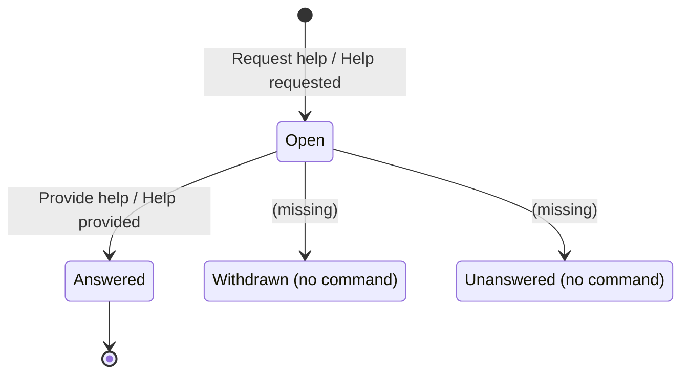
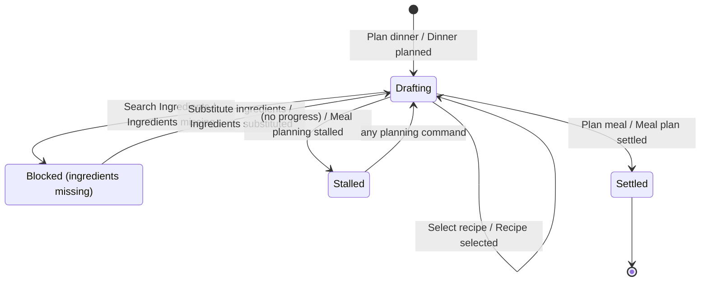
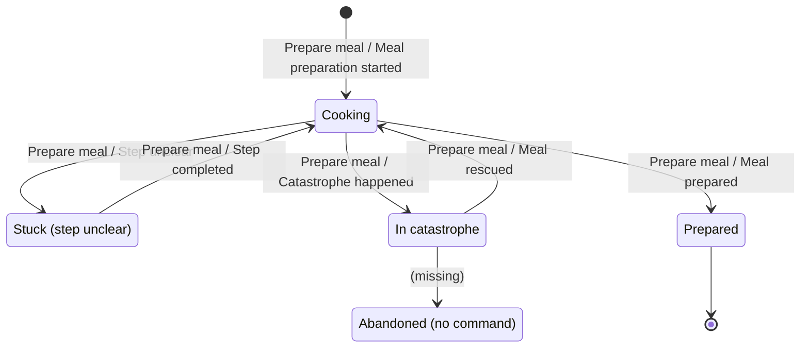

# Invariants — Community Cooking board

**Mode: contexts drawn.** The team has drawn seven named bubbles, so every rule
below is scoped to the team's own cut rather than to one I proposed. Two of
those names — *Cooking Assistance* and *Cooking Help* — turn out to describe the
same context, which is worked in §7.

**The finding that shapes everything below: this board carries no state
stickies.** Not one. On a board whose own events include *stalled*, *unclear*,
*catastrophe* and *rescued* — all of which presuppose something with a status —
every status model in §3 had to be reconstructed from event sequences and is
marked `inferred`. Roughly half the invariants a board normally yields come off
the state stickies, so what follows is the *derivable* half plus reconstruction,
not a reading.

Event numbering follows the pivotal-event cut already in this project, so the
two analyses can be laid side by side. Reconciliation with it is at the end.

---

## 1. Board as read

Colour and icon convention as read: orange = domain event · blue ⌘ = command ·
bright yellow 👤 = actor · green 👁 = read model consulted · pale yellow 💼 =
business object produced · pink ⚙ = external system.

| # | Event | Command | Actor(s) | Reads 👁 | Produces 💼 | Context bubble | Marks |
|---|-------|---------|----------|----------|-------------|----------------|-------|
| 1 | Cook registered | Register cook | User | User | **Cook** | Cook Profile | board edge |
| 2 | Dinner planned | Plan dinner | Cook | Guests | **Menu** | Meal Planning | |
| 3 | Recipes searched | Search recipes | Cook | Recipe Catalog | — | Meal Planning | loop with 4 |
| 4 | Recipe selected | Search recipes *(sic)* | Cook | Recipe | — | Meal Planning | loop with 3 |
| 5 | Ingredients missing | Search Ingredients | Cook | Recipe, Ingredients | — | Meal Planning | branch |
| 6 | Meal planning stalled | Prepare meal *(sic)* | Cook | Guests, Menu | — | Meal Planning | 🤖 |
| 7 | Help requested | Request help | Cook | Ingredients, Menu | **Help request** | Cooking Assistance | recurs at 15 |
| 8 | Help provided | Provide help | Community Cook, Chef, *Grandma Avatar* ⚙ | Help request | **Help response** | Cooking Assistance | recurs at 16 |
| 9 | Ingredients substituted | Substitute ingredients | Cook | Recipe, Help Response | **Ingredients** | Meal Planning | resolves 5 |
| 10 | Meal plan settled | Plan meal | Cook | Menu, Help Response | **Meal plan** | Meal Planning | |
| 11 | Meal preparation started | Prepare meal | Cook | Recipe | — | Meal Preparation | |
| 12 | Step unclear | Prepare meal | Cook | Recipe | — | Meal Preparation | loop |
| 13 | Catastrophe happened | Prepare meal | Cook | Catastrophe, Recipe | — | Meal Preparation | branch |
| 14 | Pictures taken | Take pictures | Cook | Catastrophe | **Pictures** | Media | recurs at 20 |
| 15 | Help requested | Request help | Cook | Catastrophe, Recipe, Pictures | **Help request** | Cooking Help | repeat of 7 |
| 16 | Help provided | Request help *(sic)* | Community Cook, *Grandma Avatar* ⚙ | Help request | **Help response** | Cooking Help | repeat of 8 |
| 17 | Step completed | Prepare meal | Cook | Help response | — | Meal Preparation | loop |
| 18 | Meal rescued | Prepare meal | Cook | Help response | — | Meal Preparation | 🤖, resolves 13 |
| 19 | Meal prepared | Prepare meal | Cook | Recipe | **nothing** | Meal Preparation | |
| 20 | Pictures taken | Take pictures | Cook | — | **Pictures** | Media | repeat of 14 |
| 21 | Thanks given | Provide thanks | Cook | Help provider, Pictures | **Thanks** | Sharing | board edge |

**Assumptions flagged — these decide the rules, so confirm them first.**

- **No state stickies anywhere on the board.** §3 is reconstruction.
- **`Prepare meal` is written on six different events** (6, 11, 12, 13, 17, 18,
  19). Either it is a placeholder for six different commands, or the board is
  saying that everything in the kitchen is one undifferentiated interaction.
  Every INV-PREP guard below assumes the former. §7.
- **Three probable slips on the wall**: event 4's command reads *Search
  recipes* (expected *Select recipe*), event 6's reads *Prepare meal* (expected
  something like *Continue planning*, or no command at all if the AI raises it),
  event 16's reads *Request help* (expected *Provide help*). Read as slips.
- **The 🤖 marker on events 6 and 18 is unconfirmed.** It may mean "raised by
  the assistant" or it may be provenance ("this sticky was AI-proposed"). The
  two events it sits on are exactly the two where non-human agency is plausible
  from the text alone, which is mild corroboration — but **no rule below rests
  on the marker by itself**; INV-PLAN-09 and INV-PREP-08 each have a second,
  structural reason. Confirm before building either.
- **Guests, Recipe, Recipe Catalog and Catastrophe are read but never written**
  by any event. Guests and Catastrophe are probably undrawn parts of aggregates
  the board does have; Recipe is a whole missing context. §7.

---

## 2. Consistency boundaries

| Context | Aggregate | Root identity | Commands | States it owns | Data it holds |
|---|---|---|---|---|---|
| Cook Profile | **Cook** | cook id | Register cook | *(none drawn)* | identity, provenance from User |
| Meal Planning | **Meal plan** (Menu inside it) | plan id (Cook × occasion) | Plan dinner, Search recipes, Select recipe, Search Ingredients, Substitute ingredients, Plan meal | *(none drawn)* | occasion, guests, menu, chosen recipes, ingredient list |
| Cooking Assistance ≡ Cooking Help | **Help request** (Help response inside it) | request id | Request help, Provide help | *(none drawn)* | situation snapshot, responses, provider refs |
| Meal Preparation | **— none on the board** | — | Prepare meal (×6) | *(none drawn)* | *nothing is written by any of its seven events* |
| Media | **Pictures** | picture set id | Take pictures | *(none drawn)* | image refs, what they are of |
| Sharing | **Thanks** | thanks id | Provide thanks | *(none drawn)* | recipient ref, message, pictures |
| *(missing)* | Recipe / Recipe Catalog | — | *none* | — | read by 7 events, written by none |

Three consequences fall straight out of this table, before a single rule is
written:

- **Meal Preparation — seven events, four command repetitions, and not one
  business object.** Yet *Step unclear*, *Step completed*, *Catastrophe
  happened* and *Meal rescued* each presuppose something that knows which step
  the cook is on and what has gone wrong. Every INV-PREP rule below therefore
  names an aggregate **that does not yet exist on the board**. They are written
  anyway, because they are the argument for creating it.
- **Cooking Assistance and Cooking Help have identical structure** — same
  commands, same *Help request* / *Help response* objects, same responders,
  including the same Grandma Avatar. One context, drawn twice. Rules are
  numbered `INV-HELP-*` once. §7 gives the single condition under which the
  split would be real.
- **Recipe is consulted by seven events across three contexts and owned by
  none.** Rules about recipes cannot be enforced anywhere on this board.

---

## 3. Status models — all reconstructed, none read

Nothing here is on the board. Each machine is the smallest one that makes the
events consistent; the value is in the arrows that are *not* drawn.

### 3.1 Help request — Cooking Assistance ≡ Cooking Help

The only aggregate whose board events give two genuine states.

| From | Command | Event | To | Guard |
|---|---|---|---|---|
| *(none)* | Request help | Help requested | Open | the situation snapshot is complete enough to answer |
| Open | Provide help | Help provided | Answered | the responder is not the requester |
| Open | *(no command on board)* | — | Withdrawn | — |
| Open | *(no command on board)* | — | Unanswered | timeout elapsed |
| Answered | Provide thanks *(Sharing)* | Thanks given | Answered | — |



Asserted invariants: INV-HELP-04 (guard), INV-HELP-06 (many responses, at most
one resolving), INV-HELP-09 (terminal). **Two of the four states have no command
that reaches them** — a cook who solves their own problem cannot say so, and a
request nobody answers has no ending. That is the largest gap in the context
that this board is otherwise built around.

### 3.2 Meal plan — Meal Planning

| From | Command | Event | To | Guard |
|---|---|---|---|---|
| *(none)* | Plan dinner | Dinner planned | Drafting | guests ≥ 1 and an occasion |
| Drafting | Select recipe | Recipe selected | Drafting | recipe exists |
| Drafting | Search Ingredients | Ingredients missing | Blocked | at least one recipe on the menu |
| Blocked | Substitute ingredients | Ingredients substituted | Drafting | substitution respects guest constraints |
| Drafting | *(no progress)* | Meal planning stalled | Stalled | not already stalled; not settled |
| Stalled | any planning command | — | Drafting | — |
| Drafting | Plan meal | Meal plan settled | Settled | menu non-empty, no ingredients outstanding |
| Settled | *(no command on board)* | — | Drafting | — |



*Stalled* is the interesting one: it is the only state on this board reached
without a human command, and it is a state of the **cook's attention**, not of
the plan's content. Modelling it as a state of the Meal plan is a decision, not
a reading — the alternative is a separate *Planning session* aggregate, which
would make INV-PLAN-09 cheaper to enforce.

### 3.3 Meal preparation — Meal Preparation

The board's richest lifecycle, and it belongs to an aggregate that **does not
exist**. Read as the argument for creating it.

| From | Command | Event | To | Guard |
|---|---|---|---|---|
| *(none)* | Prepare meal | Meal preparation started | Cooking | a recipe is referenced |
| Cooking | Prepare meal | Step unclear | Stuck | the step is not already completed |
| Stuck | Prepare meal | Step completed | Cooking | a help response resolved it, or the cook proceeded |
| Cooking | Prepare meal | Catastrophe happened | In catastrophe | — |
| In catastrophe | Prepare meal | Meal rescued | Cooking | a help response exists for this catastrophe |
| Cooking | Prepare meal | Meal prepared | Prepared | every mandatory step completed |
| In catastrophe | *(no command on board)* | — | Abandoned | — |
| Prepared | *(none)* | — | — | absorbing |



**There is no way out of a catastrophe except rescue.** The board has no
*Abandon*, no *Order takeaway*, no *Serve it anyway*. Given that "catastrophe"
is the domain's own word, an unrescuable catastrophe is not a rare edge case —
it is the outcome the product exists to prevent, and it has no modelled ending.

### 3.4 Cook — Cook Profile

One event, one state. A Cook can be registered and nothing else: no suspension,
no deactivation, no leaving. Every authorization rule in every other context
(INV-HELP-03, INV-PREP-09, INV-SHARE-02) resolves against a Cook that can never
stop being valid. Cheap today, wrong the first time someone must be removed
from the community.

---

## 4. Invariants by bounded context

Confidence: `board` = a sticky says so · `implied` = the board does not make
sense otherwise · `inferred` = domain knowledge, needs confirming.

### Cook Profile

```
INV-PROF-01 · One cook per user
A User MUST NOT hold more than one Cook profile.
  Kind        uniqueness            Aggregate  Cook
  Triggered   Register cook
  Rejection   "you already cook with us — sign in instead"
  Evidence    User 👁 read by Register cook; User never appears again
  Confidence  implied

INV-PROF-02 · Registration is self-service
Only the User themself may register their Cook profile.
  Kind        authorization         Aggregate  Cook
  Rejection   "you cannot create a profile for someone else"
  Evidence    User is the actor on event 1     Confidence  implied

INV-PROF-03 · A cook is identifiable to the community
A Cook MUST carry a display identity before any Help request or Help response
may be attributed to them.
  Kind        lifecycle             Aggregate  Cook
  Rejection   "add a name before you ask the community for help"
  Evidence    Help provider 👁 read by Provide thanks (event 21)
  Confidence  inferred — and the only rule that gives Cook Profile a purpose
              beyond a row in a table
```

### Meal Planning

```
INV-PLAN-01 · A dinner has guests and an occasion
Plan dinner MUST specify at least one guest and a date.
  Kind        precondition          Aggregate  Meal plan
  Rejection   "who is coming, and when?"
  Evidence    Guests 👁 read by Plan dinner    Confidence  implied

INV-PLAN-02 · Portions follow the guests
Every Recipe on the Menu MUST be scaled to the plan's guest count.
  Kind        intra-aggregate       Aggregate  Meal plan
  Rejection   "this recipe serves 4 and you are 9 — scale it or pick another"
  Evidence    Guests read at 2 and again at 6  Confidence  inferred
  Note        this is the rule that justifies Menu living inside Meal plan
              rather than beside it.

INV-PLAN-03 · A plan cannot settle empty
Plan meal is accepted only when the Menu references at least one Recipe.
  Kind        precondition          Aggregate  Meal plan
  Rejection   "you have not chosen anything to cook yet"
  Evidence    Menu 👁 read by Plan meal        Confidence  implied

INV-PLAN-04 · A plan cannot settle short
Plan meal is accepted only when no ingredient is outstanding — every gap raised
by Ingredients missing MUST have been substituted or sourced.
  Kind        precondition (state)  Aggregate  Meal plan
  Rejection   "you are still short 2 ingredients — substitute them or shop"
  Evidence    the 5 → 9 → 10 sequence          Confidence  implied
  Note        the strongest hidden rule on this board. It is the entire reason
              events 5–9 exist, and nothing on the wall states it.

INV-PLAN-05 · Substitutions respect the guests
An Ingredients substitution MUST NOT violate a dietary constraint recorded for
the plan's Guests.
  Kind        intra-aggregate       Aggregate  Meal plan
  Triggered   Substitute ingredients
  Rejection   "that swaps in walnuts, and Anna's allergy is on this plan"
  Evidence    Guests read at 2 and 6; substitution at 9
  Confidence  inferred — but the board reads Guests twice and never says why,
              and allergy is the only reason a home cook records a guest list.
              Ask about this first.

INV-PLAN-06 · Substitutions belong to a chosen recipe
A substituted Ingredient MUST belong to a Recipe currently on the Menu.
  Kind        lifecycle             Aggregate  Meal plan
  Rejection   "that ingredient is not in anything you are cooking"
  Evidence    Recipe 👁 read by Substitute ingredients   Confidence  implied

INV-PLAN-07 · One plan per occasion
A Cook MUST NOT hold two unsettled Meal plans for the same occasion.
  Kind        uniqueness            Aggregate  Meal plan
  Rejection   "you are already planning Saturday — continue that plan?"
  Evidence    —                                Confidence  inferred

INV-PLAN-08 · Only the planning cook plans
Only the Cook who owns a Meal plan may select recipes for it, substitute its
ingredients, or settle it.
  Kind        authorization         Aggregate  Meal plan
  Rejection   "this is someone else's dinner"
  Evidence    Cook is the sole actor on 2–6, 9, 10    Confidence  implied

INV-PLAN-09 · The assistant does not nag
Meal planning stalled MUST NOT be raised for a Settled plan, and MUST NOT be
raised twice without an intervening planning command.
  Kind        state guard           Aggregate  Meal plan
  Rejection   the assistant stays silent — the refusal is addressed to the
              system, and the cook's experience of it is not being interrupted
  Evidence    event 6 reads Menu and Guests, i.e. it inspects progress
  Confidence  inferred
  Note        a suppression rule is still an invariant: it has a state guard, a
              single owner, and a consequence the business cares about.

INV-PLAN-10 · Settling is once
Meal plan settled MUST NOT occur twice for one plan; changing a settled plan is
re-planning, and the board has no command for it.
  Kind        state / terminal      Aggregate  Meal plan
  Rejection   "this plan is settled — reopen it to change the menu"
  Evidence    event 10 has no successor in Meal Planning
  Confidence  implied — see §7, the reopen command is missing
```

```gherkin
@INV-PLAN-04
Scenario: A plan with an unresolved ingredient gap cannot be settled
  Given a Meal plan in state "Blocked" with 2 ingredients outstanding
   When the Cook issues Plan meal for that plan
   Then the command is rejected with "you are still short 2 ingredients"
    And the plan remains in state "Blocked"

@INV-PLAN-05
Scenario: A substitution that breaks a guest's diet is refused
  Given a Meal plan whose Guests record a nut allergy
    And a Help response suggesting walnuts in place of pine nuts
   When the Cook issues Substitute ingredients with walnuts
   Then the command is rejected with "Anna's allergy is on this plan"
    And the Ingredients list is unchanged

@INV-PLAN-09
Scenario: A settled plan is never reported as stalled
  Given a Meal plan in state "Settled"
   When no planning command is issued for <n> days
   Then Meal planning stalled is not raised
    And the Cook is not contacted
```

### Cooking Assistance ≡ Cooking Help

One rule set for both bubbles. Where a rule would differ between planning-time
and cooking-time help, that is noted — and it is the only evidence that these
might be two contexts (§7).

```
INV-HELP-01 · A request must be answerable
Request help is accepted only when the request carries the situation a stranger
needs: the Menu or Recipe it is about, and what went wrong.
  Kind        precondition          Aggregate  Help request
  Rejection   "add the recipe or a photo so someone can actually help"
  Evidence    event 7 reads Menu + Ingredients; event 15 reads Recipe,
              Catastrophe and Pictures                Confidence  board

INV-HELP-02 · One requester
A Help request MUST have exactly one requesting Cook.
  Kind        cardinality           Aggregate  Help request
  Rejection   —                                        Confidence  implied

INV-HELP-03 · No self-help
The Cook who raised a Help request MUST NOT provide its Help response.
  Kind        authorization         Aggregate  Help request
  Triggered   Provide help
  Rejection   "you cannot answer your own question"
  Evidence    responders on 8 and 16 are Community Cook / Chef / Avatar, never
              the requesting Cook                      Confidence  implied

INV-HELP-04 · Answering an open request
Provide help is accepted only for a Help request in state Open.
  Kind        state guard           Aggregate  Help request
  Rejection   "this request has been withdrawn"
  Evidence    §3.1                                     Confidence  implied

INV-HELP-05 · A response belongs to one request
A Help response MUST reference exactly one Help request and MUST NOT exist
without it.
  Kind        cardinality + lifecycle   Aggregate  Help request
  Rejection   —                                        Confidence  implied

INV-HELP-06 · Many answers, one resolution
A Help request MAY collect many Help responses, but AT MOST ONE may be marked
as the one that resolved it.
  Kind        cardinality           Aggregate  Help request
  Rejection   "you have already marked Maria's answer as the one that helped"
  Evidence    events 9, 17, 18 each read a single Help response
  Confidence  inferred — CONTESTED, and unenforceable today: the board has no
              command that marks a response as the resolving one. §7.

INV-HELP-07 · An avatar answer says so
A Help response produced by the Grandma Avatar MUST be labelled as
machine-generated wherever it is shown.
  Kind        intra-aggregate       Aggregate  Help request
  Rejection   the response is not published unlabelled
  Evidence    Grandma Avatar is pink ⚙ — an external system standing among
              human responders on both help clusters
  Confidence  inferred — but the notation itself is the evidence that the board
              already distinguishes it, and the distinction is worthless unless
              it survives to the cook.

INV-HELP-08 · Urgency is carried, not guessed
A Help request MUST record whether the cook is at the stove or at the table.
  Kind        precondition          Aggregate  Help request
  Rejection   —  (nothing is refused; instead nothing is routed correctly)
  Evidence    events 7 and 15 arise in different phases with the same object
  Confidence  inferred — this is the rule that makes one Help context viable
              instead of two. §7.

INV-HELP-09 · Answered is not reopened
A Help request in state Answered MUST NOT accept a new Help response for the
same question; a follow-up is a new request.
  Kind        state / terminal      Aggregate  Help request
  Rejection   "start a follow-up — this one is answered"
  Confidence  inferred — CONTESTED, since a conversation is the natural shape
              of cooking help and the board models a single exchange.
```

```gherkin
@INV-HELP-03
Scenario: A cook cannot answer their own request
  Given a Help request in state "Open" raised by Cook "C-7"
   When Cook "C-7" issues Provide help for that request
   Then the command is rejected with "you cannot answer your own question"
    And the request remains in state "Open"

@INV-HELP-07
Scenario: An avatar answer is never shown as a neighbour's answer
  Given a Help response produced by the Grandma Avatar
   When the response is shown to the requesting Cook
   Then it is presented as machine-generated
```

### Meal Preparation

**Every rule here names an aggregate the board does not have.** They are the
specification for the one it needs.

```
INV-PREP-01 · Cooking is cooking something
Meal preparation started requires a Recipe reference.
  Kind        precondition          Aggregate  Meal preparation *(missing)*
  Rejection   "what are you making?"
  Evidence    Recipe 👁 read by event 11        Confidence  board
  Note        the LOCAL form of "you can only cook what you planned", which is
              cross-context. See X-01.

INV-PREP-02 · A step is completed once
Step completed MUST NOT occur twice for the same step of one preparation.
  Kind        cardinality           Aggregate  Meal preparation *(missing)*
  Rejection   "you have already done that one"
  Evidence    event 17 is drawn as a loop       Confidence  implied

INV-PREP-03 · Unclear applies to an open step
Step unclear is accepted only for a step that is not yet completed.
  Kind        state guard           Aggregate  Meal preparation *(missing)*
  Rejection   "that step is behind you — did you mean the next one?"
  Confidence  implied

INV-PREP-04 · Done means done
Meal prepared is accepted only when every mandatory step of the Recipe has been
completed.
  Kind        precondition          Aggregate  Meal preparation *(missing)*
  Rejection   "3 steps are still open — finish or skip them"
  Evidence    Recipe 👁 read by event 19        Confidence  implied
  Note        "or skip them" is doing real work in that sentence, and the board
              has no skip command. Ask whether a cook may declare a meal done
              with steps outstanding — most can and do.

INV-PREP-05 · Steps follow the recipe's order
Steps MUST be completed in the Recipe's order.
  Kind        ordering              Aggregate  Meal preparation *(missing)*
  Rejection   "step 3 comes before step 4"
  Confidence  inferred — CONTESTED and probably wrong. Real cooks work several
              steps in parallel. Recorded because if the product enforces it,
              that is a decision someone should make deliberately rather than
              inherit from a checklist widget.

INV-PREP-06 · A catastrophe belongs somewhere
A Catastrophe MUST be attached to exactly one step of exactly one preparation.
  Kind        cardinality           Aggregate  Meal preparation *(missing)*
  Rejection   —                                 Confidence  implied

INV-PREP-07 · Nothing to rescue
Meal rescued is accepted only for a preparation in state In catastrophe, and
only when a Help response exists for that catastrophe.
  Kind        state guard           Aggregate  Meal preparation *(missing)*
  Rejection   "nothing has gone wrong here yet"
  Evidence    event 18 reads Help response and follows 13   Confidence  board

INV-PREP-08 · A rescue is not a rescue until the cook says so
Meal rescued MUST NOT be recorded on the strength of a Help response alone; the
cook MUST confirm the preparation is back on track.
  Kind        state guard           Aggregate  Meal preparation *(missing)*
  Rejection   the preparation stays In catastrophe and help remains open
  Evidence    event 18 carries 🤖 (unconfirmed) AND reads only Help response —
              i.e. as drawn, receiving advice IS the rescue
  Confidence  inferred — the second reason stands without the marker. As the
              board reads today, the system would declare a meal rescued while
              it is still burning.

INV-PREP-09 · Only the cook cooks
Only the Cook who started a preparation may complete its steps, report its
catastrophe or declare it prepared.
  Kind        authorization         Aggregate  Meal preparation *(missing)*
  Rejection   "this is someone else's kitchen"
  Confidence  implied

INV-PREP-10 · Prepared is final
Meal prepared is absorbing: no further step, catastrophe or rescue may be
recorded against that preparation.
  Kind        state / terminal      Aggregate  Meal preparation *(missing)*
  Rejection   "this meal is finished — start a new preparation"
  Confidence  implied
```

```gherkin
@INV-PREP-07
Scenario: A meal that is going fine cannot be rescued
  Given a Meal preparation in state "Cooking"
   When Meal rescued is raised for that preparation
   Then it is refused
    And the preparation remains in state "Cooking"

@INV-PREP-08
Scenario: Advice alone does not end a catastrophe
  Given a Meal preparation in state "In catastrophe"
    And a Help response has arrived for that catastrophe
   When no confirmation is given by the Cook
   Then the preparation remains in state "In catastrophe"
    And the Help request remains open

@INV-PREP-04
Scenario: A meal with open steps is not silently finished
  Given a Meal preparation in state "Cooking" with 3 mandatory steps open
   When the Cook issues Prepare meal to declare the meal prepared
   Then the command is rejected with "3 steps are still open"
    And the preparation remains in state "Cooking"
```

### Media

```
INV-MEDIA-01 · A picture is of something
Pictures MUST reference what they are of — a catastrophe, a step, or a finished
meal.
  Kind        lifecycle             Aggregate  Pictures
  Rejection   "which meal is this?"
  Evidence    event 14 reads Catastrophe; event 20 reads nothing at all
  Confidence  implied
  Note        event 20 reading nothing is the board saying that a trophy shot
              floats free. See the Media split in §7.

INV-MEDIA-02 · Only the taker publishes
Only the Cook who owns Pictures may attach them to a Help request or to Thanks.
  Kind        authorization         Aggregate  Pictures
  Rejection   "these are not your pictures"
  Confidence  implied

INV-MEDIA-03 · Guests consent before they are shown
Pictures showing identifiable guests MUST NOT be shared beyond the Cook without
consent recorded on the plan.
  Kind        precondition          Aggregate  Pictures
  Rejection   "this photo has guests in it — share the food instead?"
  Evidence    Pictures cross into Cooking Help (15) and Sharing (21)
  Confidence  inferred — but the board does send private kitchen photos to
              strangers, which is exactly where this rule earns its keep.
```

### Sharing

```
INV-SHARE-01 · Thanks go to someone who helped
Provide thanks is accepted only for a Help provider recorded against a Help
request raised by this Cook.                                        [ADVISORY]
  Kind        precondition          Aggregate  Thanks
  Rejection   "you have not had help from them"
  Evidence    Help provider 👁 read by event 21
  Confidence  implied
  Advisory    Help provider is a read model owned by the help context; Sharing
              checks a projection. Compensation: thanks sent to the wrong
              person are withdrawn, not prevented.

INV-SHARE-02 · No self-thanks
A Cook MUST NOT thank themselves.
  Kind        authorization         Aggregate  Thanks
  Rejection   "pick the person who helped you"       Confidence  implied

INV-SHARE-03 · Thanks once
At most one Thanks MUST exist per Help response.
  Kind        uniqueness            Aggregate  Thanks
  Rejection   "you have already thanked Maria for this"
  Confidence  inferred

INV-SHARE-04 · Thanks carry the cook's own pictures
Pictures attached to Thanks MUST belong to the thanking Cook.
  Kind        precondition          Aggregate  Thanks
  Rejection   "you can only share your own photos"
  Confidence  implied
```

```gherkin
@INV-SHARE-01
Scenario: Thanks to a stranger who never helped is refused
  Given Cook "C-7" has no Help request answered by Cook "C-9"
   When Cook "C-7" issues Provide thanks to "C-9"
   Then the command is rejected with "you have not had help from them"
    And no Thanks is created

@INV-SHARE-01
Scenario: Thanks sent on stale data are withdrawn, not prevented
  Given the Help provider projection still shows "C-9" as the responder
    And the resolving response has since been reattributed to "C-4"
   When Cook "C-7" issues Provide thanks to "C-9"
   Then the Thanks stands
    And the Cook is offered a correction
```

---

## 5. Scenarios

Folded into §4. On a full sheet, one violation scenario per invariant.

---

## 6. Not invariants

Every rule here is one the business would state as a rule. None can be enforced
inside one aggregate in one context, and saying so is the point.

```
X-01 · "You can only cook a meal you have planned."
  Stated by     the board's shape — Meal plan settled (10) sits before Meal
                preparation started (11)
  Fails         test 3 — Meal plan is owned by Meal Planning, the preparation
                by Meal Preparation
  Policy        whenever Meal plan settled (Meal Planning), then start a Meal
                preparation (Meal Preparation)
  Local data    Meal Preparation holds a Recipe reference — INV-PREP-01
  Staleness     hours to days; the board's own gap between settling and cooking
  Compensation  none needed if ad-hoc cooking is allowed, and it probably is.
                THE REAL QUESTION IS WHETHER THIS RULE EXISTS AT ALL: nothing
                on the board reads Meal plan. If a cook can start from a bare
                recipe, this is not a rule, it is a happy path.

X-02 · "A rescue must not break a guest's diet."
  Stated by     the parallel to INV-PLAN-05, one phase later
  Fails         test 3 — Guests live on the Meal plan, in Meal Planning; the
                rescue happens in Meal Preparation, which holds no guest data
  Policy        the preparation carries a copy of the plan's constraints, taken
                at start; the Help request snapshot carries them to responders
  Local data    a constraints copy on the preparation — DOES NOT EXIST TODAY
  Staleness     the length of one cooking session; constraints do not change
  Compensation  a guest is told what is in it before they eat. That is what
                happens in a real kitchen, and it is not free.
  Note          this is the most dangerous gap on the board: the context that
                takes advice from strangers is the one context with no access
                to who is eating.

X-03 · "Help is only requested about a recipe that exists."
  Fails         test 3 — Recipe is owned by no context on this board
  Policy        conformist consumption of an off-board Recipe Catalogue
  Compensation  a request about a deleted recipe is answered from its snapshot

X-04 · "If nobody answers, the avatar answers."
  Stated by     the Grandma Avatar's presence in both help clusters
  Fails         test 1 — there is by definition a window in which the request
                is open and unanswered
  Policy        whenever a Help request has been Open for <n> minutes, then
                Provide help (Grandma Avatar)
  Staleness     <n> minutes — different for planning help and cooking help, and
                that difference is the whole product. See §7.
  Compensation  a human answer arriving later supersedes the avatar's
  Note          NOT DRAWN ANYWHERE ON THE BOARD. It is the mechanism the
                community proposition rests on.

X-05 · "When a cook gets stuck, help is offered."
  Stated by     the existence of Ingredients missing, Meal planning stalled,
                Step unclear and Catastrophe happened next to Request help
  Fails         test 1 — the trouble and the request are separate moments
  Policy        four missing policies, one per trouble event
  Compensation  the cook asks manually, which is what the board draws today
  Note          these four are where this product's behaviour actually lives,
                and the board shows the trouble and the request with nothing
                between them.

Dropped candidates
- "A cook must search recipes before selecting one." — workflow. A cook who
  arrives knowing what to cook is not refused.
- "Pictures must be under <n> MB / JPEG." — technical validation.
- "Cooks should thank the people who help them." — a social norm with no
  refusal. Real, important, and not an invariant; it is what X-04's economy
  depends on.
- "The system must not lose a cook's notes or photos." — quality attribute.
- "Recipes must be accurate." — not enforceable by anyone here; see X-03.
```

---

## 7. Gaps, hotspots and open questions

### The board has no state stickies

Stated first because it caps the confidence of everything above. Four aggregates
carry multi-step lifecycles the events clearly imply — Help request, Meal plan,
Meal preparation, and arguably Pictures — and not one status word is written on
the wall. **The highest-value hour available on this board is putting the states
of §3 onto it and arguing about them**, because that is where the remaining
invariants are, and they are the ones that decide what the software refuses.

### Meal Preparation has no aggregate

Seven events, four repetitions of `Prepare meal`, and nothing written. Ten of
this sheet's invariants (INV-PREP-01…10) name an aggregate that does not exist.
Whatever it is called — *Cooking session*, *Meal preparation* — it needs a
current step, a step-completion record, an incident, and a copy of the plan's
guest constraints (X-02). **This is the single highest-value addition to the
board**, and it agrees exactly with the pivotal-event cut's independent finding.

### `Prepare meal` is six commands wearing one name

Events 6, 11, 12, 13, 17, 18 and 19 all hang off a blue sticky reading *Prepare
meal*. Until they are separated — *Start preparation*, *Complete step*, *Ask
about step*, *Report catastrophe*, *Confirm rescue*, *Finish meal* — none of the
INV-PREP guards has anything to attach to, because a guard belongs to a command
and there is only one. Splitting them is mechanical and unblocks a third of this
sheet.

### Cooking Assistance and Cooking Help are one context, drawn twice

Same commands, same *Help request* and *Help response* objects, same responders
including the same Grandma Avatar, same shape. Rules are numbered `INV-HELP-*`
once above.

**The one condition that would make the split real:** if the response-time
requirement differs by an order of magnitude — a stalled plan can wait
overnight, an unclear step cannot wait five minutes — then routing, escalation
and avatar-fallback rules differ enough to justify two contexts. That is an
argument about **X-04's `<n>`, not about the model**, and INV-HELP-08 (carry the
urgency on the request) is the cheaper answer. Decide it before splitting.

### Missing commands, by the state they orphan

| Missing command | State it would reach or leave | Consequence today |
|---|---|---|
| Withdraw help request | Open → Withdrawn | a solved problem stays open forever |
| *(timeout)* | Open → Unanswered | a request nobody answers has no ending |
| Mark resolving response | — | INV-HELP-06 unenforceable; Sharing cannot know who to thank |
| Reopen meal plan | Settled → Drafting | INV-PLAN-10 has no escape hatch |
| Abandon preparation | In catastrophe → Abandoned | the outcome the product exists to prevent has no modelled ending |
| Skip step | — | INV-PREP-04 cannot be satisfied by a real cook |
| Deactivate cook | — | nobody can leave the community |

### Unowned rules

- Everything about **Recipes**. Seven events read them, nothing writes them. A
  Recipe Catalogue context is missing; until it exists, X-03 has no owner.
- **Guests** are read twice and written never. If INV-PLAN-05 is real — and it
  is the rule most likely to matter to a real person — guests need a home,
  almost certainly inside Meal plan.
- **Catastrophe** is read at 13 and 15 and written nowhere. It is probably part
  of the missing preparation aggregate.

### Boundary stress

- **X-02 argues for merging Meal Planning and Meal Preparation**, because the
  guest constraints and the rescue live on opposite sides of the border. Do not
  merge: copy the constraints onto the preparation at start. Named here because
  it is the one rule on this board with a physical consequence.
- **Sharing is one event.** INV-SHARE-01…04 are all about *Help provider*, which
  the help context owns. Sharing is probably not a context; *Thanks given*
  belongs inside the help context, which already owns the reciprocity loop. The
  pivotal-event cut reached the same conclusion by a different route.
- **Media is one event drawn twice, for two different things** — evidence
  attached to a catastrophe (14) and a trophy shot (20). INV-MEDIA-01 and
  INV-MEDIA-03 apply cleanly to the first and awkwardly to the second. One word,
  two concepts; splitting them would sharpen both.

### Numbers nobody supplied

| Placeholder | Rule | Question for the room |
|---|---|---|
| `<n>` minutes | X-04 | How long before the avatar answers — and is it different at the stove? |
| `<n>` days | INV-PLAN-09 | How long is "stalled"? |
| `<n>` responses | INV-HELP-06 | How many people may answer one request? |
| guest min/max | INV-PLAN-01 | Is there a size beyond which this is not home cooking? |
| open requests | — | May one cook have several requests open at once? |

### Hotspots

**None.** The board carries no red stickies at all, on a domain whose own
vocabulary includes *stalled*, *unclear* and *catastrophe*, and which routes a
panicking cook's kitchen photos to strangers and an AI persona. An empty hotspot
column here reads as "disagreement was never captured", not as "nobody
disagreed" — and the disagreements are exactly where the remaining invariants
are. The same observation was made independently by the pivotal-event cut.

### The questions that would settle an invariant

1. **Can a cook start cooking without a plan?** *(Decides whether X-01 is a rule
   at all — and nothing on the board reads Meal plan, so the honest guess is
   no.)*
2. **Does the system know who is eating, and does it check a substitution or a
   rescue against their allergies?** *(Decides INV-PLAN-05 and X-02 — the two
   rules on this board that can hurt somebody.)*
3. **Is a meal "rescued" when the advice arrives, or when the cook says it
   worked?** *(Decides INV-PREP-08, and whether the 🤖 marker means what it
   looks like.)*
4. **When several people answer, who decides which answer was used?** *(Decides
   INV-HELP-06 and unblocks the whole of Sharing.)*
5. **How long may a help request go unanswered at the stove, versus at the
   table?** *(Decides X-04's `<n>` and, with it, whether Cooking Assistance and
   Cooking Help are one context or two.)*
6. **Must an answer from the Grandma Avatar be labelled as machine-generated?**
   *(Decides INV-HELP-07, and it is a trust question before it is a modelling
   one.)*
7. **What happens to a catastrophe nobody can rescue?** *(Names the missing
   state and the missing command.)*
8. **Who owns the recipes?** *(Decides whether X-03 ever gets an owner.)*

---

## Reconciliation with the pivotal-event cut in this project

Same board, different method — that cut read the timeline for borders, this one
reads the wall for refusals. Where two methods agree, the finding is strong.

**Agreed independently:**

- **Meal Preparation owns no aggregate**, and this is the highest-value change
  to the board. That cut reached it from "a stretch with no business object";
  this one from "ten invariants with nowhere to live".
- **Cooking Assistance and Cooking Help are one context**, with the Grandma
  Avatar a responder inside it rather than a context of its own — and with the
  response-time difference as the single argument that could split them.
- **Sharing / *Thanks given* belongs inside the help context**, which already
  owns the reciprocity loop.
- **Media is one word for two concepts** — evidence and trophy.
- **Recipe Catalogue is missing** and read by everything.
- **The four missing policies** between the trouble events and the help request
  are where the product's behaviour actually lives.
- **No hotspots**, on a board about catastrophes, is a finding rather than a
  clean bill of health.

**Added here, not visible to a timeline cut:**

- **X-02** — the rescue path has no access to the guest constraints. A boundary
  method sees a clean narrow interface at *Meal plan settled*; an invariant
  method sees that the thing which must cross it does not.
- **INV-PLAN-04** — a plan cannot settle with ingredients outstanding. This is
  the rule that makes events 5–9 exist, and no sticky states it.
- **INV-PREP-08** — as drawn, receiving advice *is* the rescue.
- **The missing-command table**, which is the state-machine view of that cut's
  "*Meal plan* is read by nobody" and its cousins.

**Different on the board itself:** that cut recorded no icons on its rendering
and hedged about 🤖 markers seen in an earlier one. This rendering **does** carry
the icon legend (👁 read model, 💼 business object, ⌘ command, 👤 actor, ⚙
external system) and carries 🤖 on events 6 and 18. The hedge was right — no
rule here rests on the marker alone — but the marker is corroborated by the two
events it sits on, and question 3 above is how to settle it.

**Also different:** that cut ran in *propose* mode, reporting no context bubbles
drawn. This rendering has seven bubbles. They largely match its proposal, with
one substantive difference: the team drew **Cooking Assistance and Cooking Help
as two contexts**, which the cut argued — and this sheet independently confirms
— is one context drawn twice.