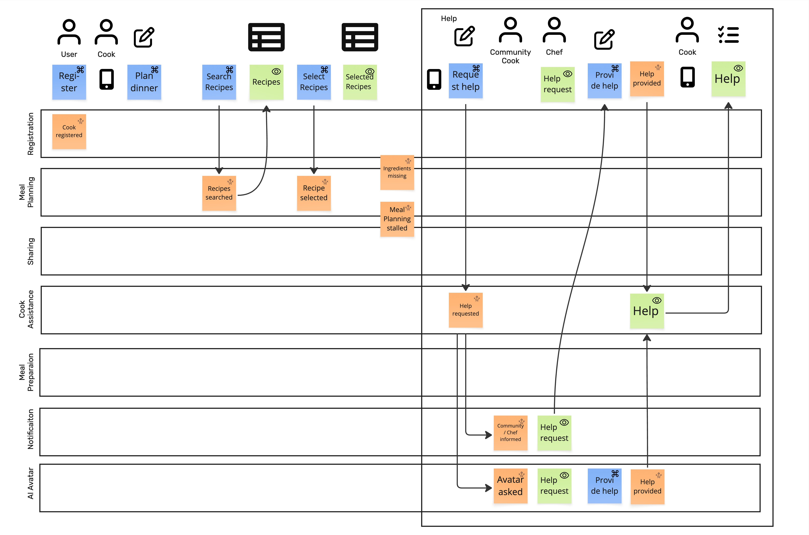
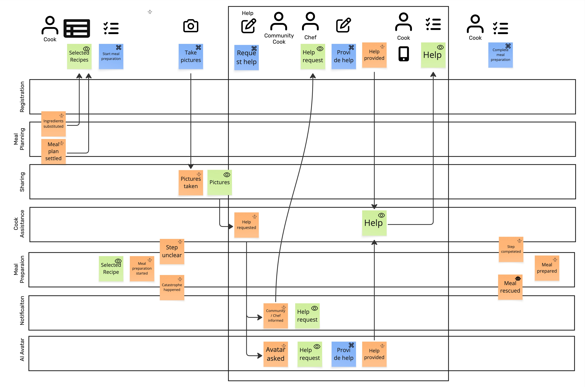
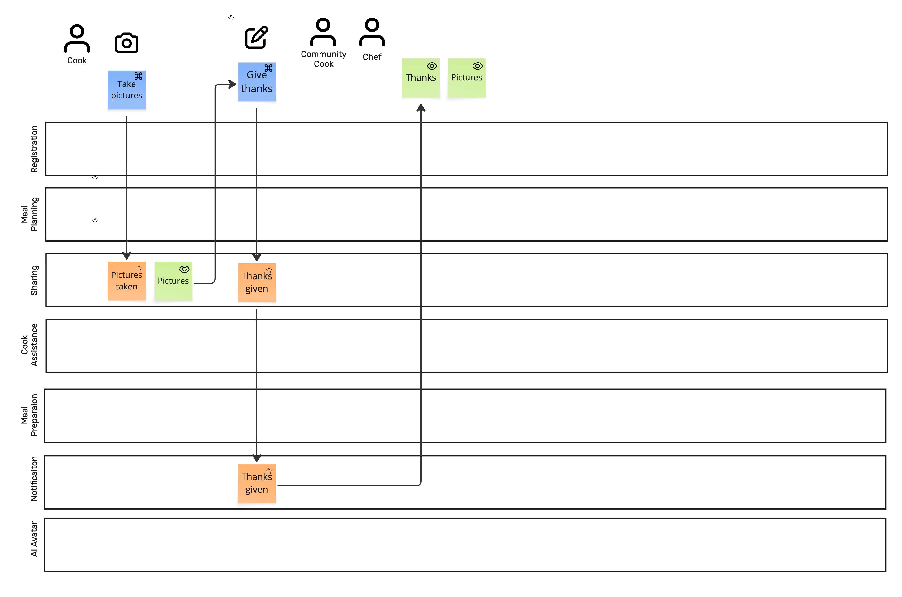

# Prompt 2026-09-01

Find the invariants in a given Event Model (in three images). Use the provided skill.

[Skill](../Skills/FindInvariantsSkill/SKILL.md)

# Answer

I’m using the uploaded **Event Model Invariant Finder** skill. It requires the three images to be stitched into one chronological model before deriving invariants, because the shared timeline and image seams determine the state machines and guards.

### 1. Model as read — proposed stitch

I read the images in filename order:

**I → II → III**

The swimlanes are consistent across all three:

**Registration → Meal Planning → Sharing → Cook Assistance → Meal Preparation → Notification → AI Avatar**

My normalized timeline is:

| #  | Image | Slice / transition as visible                                                            |
| -- | ----- | ---------------------------------------------------------------------------------------- |
| 1  | I     | `Register` → **Cook registered**                                                         |
| 2  | I     | `Plan dinner`                                                                            |
| 3  | I     | `Search Recipes` → **Recipe searched** → `Recipes` view                                  |
| 4  | I     | `Select Recipes` → **Recipe selected** → `Selected Recipes` view                         |
| 5  | I     | **Ingredients missing**                                                                  |
| 6  | I     | **Meal Planning stalled**                                                                |
| 7  | I     | `Request help` → **Help requested** → **Community / Chef informed** and **Avatar asked** |
| 8  | I     | `Provide help` → **Help provided** → `Help` view                                         |
| 9  | II    | **Ingredients substituted**                                                              |
| 10 | II    | **Meal plan settled** → `Selected Recipes` view                                          |
| 11 | II    | `Start meal preparation` → **Meal preparation started**                                  |
| 12 | II    | `Take pictures` → **Pictures taken** → `Pictures` view                                   |
| 13 | II    | **Step unclear**                                                                         |
| 14 | II    | **Catastrophe happened**                                                                 |
| 15 | II    | `Request help` → **Help requested** → **Community / Chef informed** and **Avatar asked** |
| 16 | II    | `Provide help` → **Help provided** → `Help` view                                         |
| 17 | II    | **Step completed**                                                                       |
| 18 | II    | **Meal rescued**                                                                         |
| 19 | II    | `Complete meal preparation` → **Meal prepared**                                          |
| 20 | III   | `Take pictures` → **Pictures taken** → `Pictures` view                                   |
| 21 | III   | `Give thanks` → **Thanks given** → `Thanks` view                                         |

There are two important recurring patterns rather than obvious duplicates:

* **Request help → Help requested → response → Help provided** occurs in both meal planning and meal preparation. I currently interpret these as separate executions of the same reusable help process.
* **Take pictures → Pictures taken → Pictures** occurs during preparation and again after the meal is prepared. I currently interpret that as a recurring slice, not accidental photographic overlap. The skill explicitly says recurring slices should become loops/cardinality questions rather than being flattened into duplicate events.

### Seam classification

**Image I → Image II: provisional abutment.** Image I finishes the planning-help episode; image II appears to continue with **Ingredients substituted / Meal plan settled**, then starts meal preparation. I do not see a clearly duplicated seam column.

**Image II → Image III: provisional abutment.** Although `Take pictures` appears in both, its position is different: in II it occurs during meal preparation, while III follows the completed-meal portion and continues into `Give thanks`. I therefore treat it as another execution of a recurring slice rather than overlap.

There are also a few pieces that are not sufficiently specified in the pictures to turn into rules yet: `Plan dinner` has no clearly visible resulting event; **Ingredients missing**, **Meal Planning stalled**, **Step unclear**, and **Catastrophe happened** have no visible originating command in these captures; and some connector semantics around **Help provided** are visually ambiguous. Per the supplied method, those should stay unresolved rather than being guessed.

**Please confirm that this stitch and the two seam classifications are correct.** Once confirmed, I’ll derive the actual invariant sheet: state machines, invariants/rejections by swimlane, Given/When/Then violation scenarios, policies that are *not* invariants, and the unresolved gaps. The method specifically requires this confirmation before moving to invariant derivation. 

