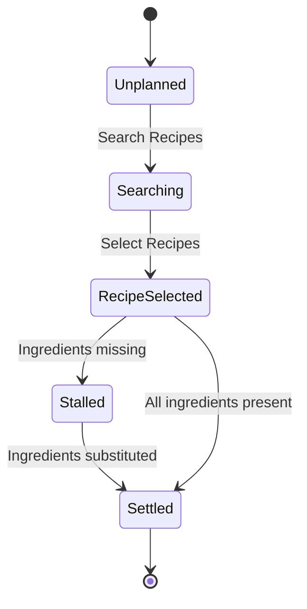
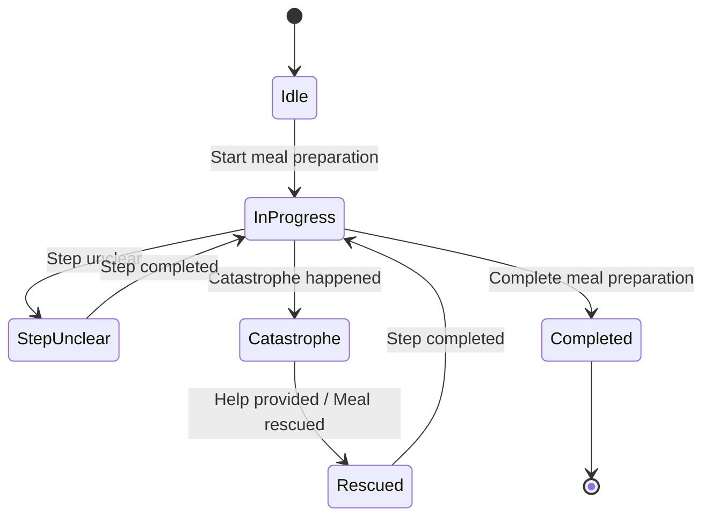

# Prompt 2026-09-01

Find the invariants in a given Event Model (in three images). Use the provided skill.


[Skill](../Skills/FindInvariantsSkill/SKILL.md)

# Answer

An analysis of the **Larder Event Model** across the three provided canvas captures, following the Event Model Invariant Finder methodology:

---

## 1. Model as Read

**Timeline Alignment & Image Ordering**

* **Part I (`LarderEventModel_I.jpg`)**: Start of timeline (Registration, initial Meal Planning, initial Help workflow).
* **Part II (`EventModelLarder_II.jpg`)**: Mid-timeline execution (Meal Plan settling, Meal Preparation, catastrophe handling & rescue).
* **Part III (`EventModelLArder_III.jpg`)**: Post-preparation lifecycle (Photo documentation & feedback/thanks).

**Seam Classification**

* **Seam (Part I $\rightarrow$ Part II)**: **Overlap**. Both images capture the `Help` boundary box (`Request help` $\rightarrow$ `Help requested` $\rightarrow$ `Provide help` $\rightarrow$ `Help provided`). Deduplicated to prevent double-counting.
* **Seam (Part II $\rightarrow$ Part III)**: **Overlap**. Both show the `Take pictures` command and `Pictures taken` event in the `Sharing` swimlane.

---

## 2. Consistency Boundaries

| Swimlane | Aggregate Boundary | Commands Owned | Produced Events |
| --- | --- | --- | --- |
| **Registration** | Cook Identity | `Register` | `Cook registered` |
| **Meal Planning** | Meal Plan | `Plan dinner`, `Search Recipes`, `Select Recipes` | `Recipes searched`, `Recipe selected`, `Ingredients missing`, `Meal Planning stalled`, `Ingredients substituted`, `Meal plan settled` |
| **Meal Preparation** | Recipe Execution | `Start meal preparation`, `Complete meal preparation` | `Meal preparation started`, `Step unclear`, `Catastrophe happened`, `Step completed`, `Meal rescued`, `Meal prepared` |
| **Cook Assistance** | Assistance Request | `Request help` | `Help requested`, `Help provided` |
| **AI Avatar** | AI Assistant Session | `Provide help` | `Avatar asked`, `Help provided` |
| **Sharing** | Social Artifact | `Take pictures`, `Give thanks` | `Pictures taken`, `Thanks given` |
| **Notification** | *(Read Projection Only)* | None | `Community / Chef informed`, `Thanks given` |

---

## 3. Status Models





---

## 4. Invariants by Swimlane and Aggregate

### Meal Planning Aggregate

#### `INV-PLAN-01` · Selection Requires Prior Search

* **Statement**: A recipe can only be selected if a valid search query has been executed for the session.
* **Kind**: State Guard / Precondition
* **Triggering Command**: `Select Recipes`
* **Rejection**: *"Cannot select a recipe without active search results."*
* **Evidence**: Model shows `Recipes searched` preceding `Recipe selected`.
* **Confidence**: `on the model`

#### `INV-PLAN-02` · Unresolved Missing Ingredients Stall Settling

* **Statement**: A meal plan containing missing ingredients cannot be settled unless valid substitutions are confirmed.
* **Kind**: State Guard
* **Triggering Command**: Internal transition to `Meal plan settled`
* **Rejection**: *"Meal plan is stalled due to missing ingredients."*
* **Evidence**: Model explicitly transitions to `Meal Planning stalled` upon `Ingredients missing`, requiring `Ingredients substituted` before `Meal plan settled`.
* **Confidence**: `on the model`

---

### Meal Preparation Aggregate

#### `INV-PREP-01` · Execution Requires Settled Plan

* **Statement**: Preparation cannot begin without a settled meal plan and selected recipe.
* **Kind**: Cross-Boundary Precondition (via Read View)
* **Triggering Command**: `Start meal preparation`
* **Rejection**: *"Meal plan must be settled before starting preparation."*
* **Evidence**: `Start meal preparation` reads from `Selected Recipes` read model.
* **Confidence**: `implied`

#### `INV-PREP-02` · Completion Gated by Active Blockers

* **Statement**: A meal cannot be completed while in an active state of `Catastrophe happened` or `Step unclear`.
* **Kind**: State Guard
* **Triggering Command**: `Complete meal preparation`
* **Rejection**: *"Cannot complete meal while unresolved errors exist."*
* **Evidence**: Timeline shows `Meal rescued` and `Step completed` must occur prior to `Meal prepared`.
* **Confidence**: `on the model`

#### `INV-PREP-03` · Rescue Preconditioned on Assistance Response

* **Statement**: A catastrophe state can only transition to `Meal rescued` after a corresponding `Help provided` event is produced by an assistant (AI Avatar, Community Cook, or Chef).
* **Kind**: Inter-Aggregate Guard
* **Triggering Command**: System auto-transition / `Rescue meal`
* **Rejection**: *"No resolution available to rescue meal."*
* **Evidence**: Direct fan-in arrow from `Help provided` to `Meal rescued`.
* **Confidence**: `on the model`

---

## 5. Gherkin Scenarios

```gherkin
@SLICE-02 @INV-PLAN-01
Scenario: Reject recipe selection without searching
  Given a cook has initiated meal planning
  And no recipe search has been executed
  When the cook issues command "Select Recipes"
  Then the command is rejected with "Cannot select a recipe without active search results"
  And state remains "Unplanned"

@SLICE-04 @INV-PLAN-02
Scenario: Block meal plan settling when ingredients are missing
  Given a recipe has been selected
  And event "Ingredients missing" has been raised
  And no "Ingredients substituted" event has occurred
  When the system attempts to settle the meal plan
  Then the state transitions to "Meal Planning stalled"
  And event "Meal plan settled" is not published

@SLICE-06 @INV-PREP-02
Scenario: Reject meal completion during an active catastrophe
  Given meal preparation is in state "InProgress"
  And event "Catastrophe happened" occurred
  And event "Meal rescued" has not occurred
  When the cook issues command "Complete meal preparation"
  Then the command is rejected with "Cannot complete meal while unresolved errors exist"
  And state remains "Catastrophe"

```

---

## 6. Not Invariants

### Automation Policies

#### `POL-HELP-01` · Help Request Dispatch

* **Rule**: Whenever `Help requested` is published in *Cook Assistance*, trigger dispatch commands to *AI Avatar* (`Ask Avatar`) and *Notification* (`Inform Community/Chef`).
* **Staleness Window**: Real-time ($\le 2$ seconds).
* **Compensating Action**: If AI Avatar does not respond within $\tau_{\text{help}}$, escalate notification priority to Chef view.

---

### Translation Border Contracts

#### `TRANS-PLAN-PREP-01` · Recipe Selection Context Mapping

* **Crosses**: `Meal Planning` $\rightarrow$ `Meal Preparation`
* **Stays Upstream**: Full ingredient replacement logs, search history queries.
* **Relationship**: Customer / Supplier (`Meal Preparation` consumes `Selected Recipe` projection).
* **Consistency Window**: Eventual consistency tolerated until `Start meal preparation` is issued.

---

## 7. Gaps & Open Questions

* **Missing Lifecycle Endings**: The `Cook Assistance` aggregate defines no `Cancel help request` or `Help request timed out` command. If a cook resolves the issue independently, the request remains open indefinitely.
* **Unsupplied Timeouts ($\tau$)**: No explicit timeout $\tau$ is defined for AI Avatar response before defaulting to human Community Cooks/Chefs.
* **Unbounded Photo Captures**: `Take pictures` in the `Sharing` swimlane can be executed zero to many times without cardinality limits specified.