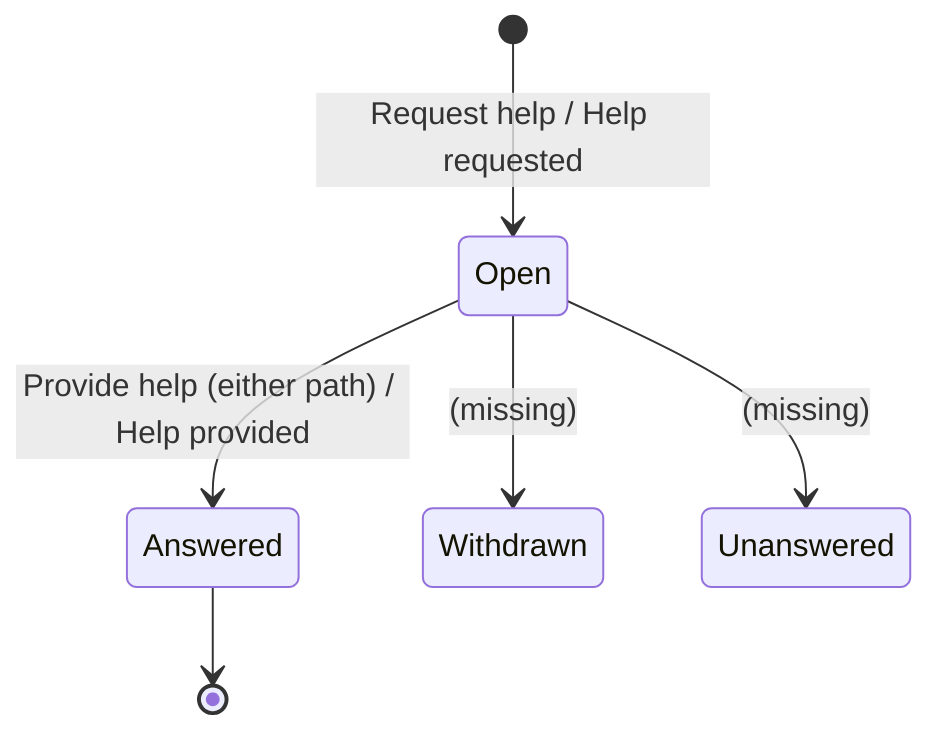
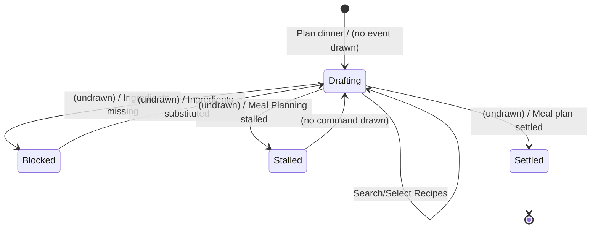
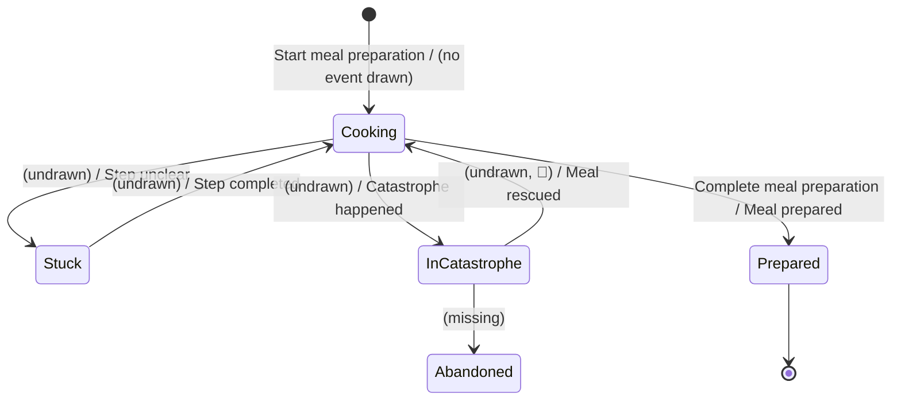

# Prompt 2026-09-01


/event-model-invariant-finder

Find invariants in the given Event Model (in three images).


# Answer

# Invariants & Gherkin — Larder Event Model (Community Cooking)

**Mode: finished Event Model, three images, stitched.** Swimlanes and slices
are taken as drawn, not re-cut. Where the model's own wiring stops short of a
full Given/When/Then — which is often, see §1 — that is reported as a gap
rather than quietly completed.

---

## 1. Model as read

**Image order.** Filenames carry roman numerals (`_I`, `_II`, `_III`) and the
content confirms them: `LarderEventModel_I.jpg`'s Meal Planning lane ends on
*Ingredients missing* / *Meal Planning stalled*, and `EventModelLarder_II.jpg`'s
Meal Planning lane opens on *Ingredients substituted* / *Meal plan settled* —
the natural next events. `EventModelLarder_II.jpg`'s Meal Preparation lane ends
on *Meal prepared* / *Meal rescued*, and `EventModelLArder_III.jpg` opens on a
second *Take pictures* / *Give thanks* — the natural next phase. Read order:
**I → II → III**.

**Swimlanes**, identical top-to-bottom across all three images (kept verbatim,
including the model's own spelling): Registration · Meal Planning · Sharing ·
Cook Assistance · Meal Preparaion *(sic)* · Notificaiton *(sic)* · AI Avatar.

**Colour/icon convention as read:** blue ⌘ = command · orange ✨ = domain event
· green 👁 = read model / State View · 🤖 = a machine-provenance marker, seen
exactly **once**, on *Meal rescued* (image II). No pale-yellow "business
object" colour is used anywhere in this rendering — commands, events and views
are the only three types drawn, which matters for §2: aggregates below are
inferred from swimlane + event cluster, not read off a fourth sticky colour.

**Seams.**

- **I → II: abutment, with one drawn continuity and one undrawn gap.** The
  green *Selected Recipes* view recurs by name and function across the seam
  (fed by *Recipe selected* in I, consumed by *Start meal preparation* in II)
  — treated as **one continuous read model**, not two. But nothing draws how
  *Ingredients missing* / *Meal Planning stalled* (end of I) actually resolves
  into *Ingredients substituted* / *Meal plan settled* (start of II); no line
  crosses the image boundary. Per the skill's own warning, this is flagged as
  **unresolved**, not inferred as continuing — see §7.
- **II → III: abutment, with a deliberate non-continuity.** *Meal prepared*
  (end of II) has no drawn line into *Take pictures* (start of III) — a second
  undrawn gap, flagged in §7. The green *Pictures* view reappears in III, but
  as a **second, separate instance** (a fresh *Take pictures* → *Pictures
  taken* → *Pictures* triple, not a continuation of image II's) — matching a
  finding independently reached by every other analysis in this project:
  *Pictures* is one word for two concepts, and this model draws that as two
  unconnected slices rather than one continuous read model. **Not deduped.**

**Assumptions flagged before deriving anything — these cap confidence
everywhere below:**

- **No rejection is drawn anywhere, on any of the three images.** Every slice
  shown is a happy path. Nothing here can claim `on the model` confidence from
  a drawn refusal the way the worked library example can.
- **A majority of the drawn stickies carry no connecting arrow at all** —
  they sit in their lane/column by position only: `Register`, `Plan dinner`,
  `Start meal preparation`, `Complete meal preparation`, every one of *Meal
  Planning*'s branch/settle events (*Ingredients missing*, *Meal Planning
  stalled*, *Ingredients substituted*, *Meal plan settled*), and **the entire
  internal sequence of Meal Preparation** (*Meal preparation started*, *Step
  unclear*, *Catastrophe happened*, *Step completed*, *Meal rescued*, *Meal
  prepared*). Only the Recipe search/select pair, both Help cycles (with their
  Notification/AI Avatar fan-out and convergence), both Take-pictures/Pictures
  pairs, and *Give thanks* have drawn Given→When→Then or View→Command wiring.
  This is treated as the central fact about this model, not a minor caveat —
  see §7.
- **"Help response" is never named** in this rendering. The earlier
  EventStorming-based work in this project used *Help response* as the noun
  produced by *Provide help*; this Event Model uses only *Help provided*
  (event) and *Help* (the converged view). Read as the same concept under a
  new name, not a new concept.
- **The 🤖 marker is narrower here than in the earlier board.** The prior
  EventStorming rendering carried it on two stickies (*Meal planning stalled*
  and *Meal rescued*); this Event Model carries it on **one** — *Meal
  rescued* only. *Meal Planning stalled* here carries the ordinary ✨ marker.
  Treat this as weaker, not stronger, corroboration for "the assistant raises
  planning stalls automatically."
- **Order inside Meal Preparation is read from left-to-right pixel position,
  not from a drawn arrow.** *Selected Recipe* / *Meal preparation started* sit
  leftmost; *Step unclear* and *Catastrophe happened* sit at roughly the same
  x-position as each other (read as parallel/alternative, not sequential);
  *Step completed*, *Meal rescued* and *Meal prepared* sit rightmost, also at
  roughly the same x-position as each other. This positional reading is
  `inferred`, never `on the model`.

**Stitched slice table.**

| Slice | Image | Lane | Command | Event | View | Drawn wiring? |
|---|---|---|---|---|---|---|
| SLICE-01 | I | Registration | Register (User) | Cook registered | — | positional only |
| SLICE-02 | I | Meal Planning | Plan dinner (Cook) | *(none drawn)* | — | positional only; no event at all |
| SLICE-03 | I | Meal Planning | Search Recipes (Cook) | Recipes searched | Recipes | **drawn**: cmd↓event, event↷view |
| SLICE-04 | I | Meal Planning | Select Recipes (Cook) | Recipe selected | Selected Recipes | **drawn**: cmd↓event; view adjacent |
| SLICE-05 | I | Meal Planning | *(none)* | Ingredients missing | — | positional only |
| SLICE-06 | I | Meal Planning | *(none)* | Meal Planning stalled | — | positional only |
| SLICE-07 | I | Cook Assistance | Request help (Cook, 1st) | Help requested | — | **drawn**: cmd↓event |
| SLICE-08 | I | Notification | *(translation)* | Community/Chef informed | Help request | **drawn**: fan-out from SLICE-07 |
| SLICE-09 | I | AI Avatar | *(translation)* | Avatar asked | Help request | **drawn**: fan-out from SLICE-07 |
| SLICE-10 | I | Notification→hdr | Provide help (Community/Chef) | Help provided | — | **drawn**: view↷cmd (curved), cmd↓event |
| SLICE-11 | I | AI Avatar | Provide help (Avatar) | Help provided | — | **drawn**, local to lane |
| SLICE-12 | I | Cook Assistance | *(translation, both paths)* | — | Help | **drawn**: both Help provided → Help |
| SLICE-13 | II | Meal Planning | *(none)* | Ingredients substituted | — | positional; curved arrow up to SLICE-15/16 view/cmd |
| SLICE-14 | II | Meal Planning | *(none)* | Meal plan settled | — | positional; curved arrow up to SLICE-15/16 |
| SLICE-15 | II | Meal Preparation | *(header)* | — | Selected Recipes | **drawn** target of SLICE-13/14 curves |
| SLICE-16 | II | Meal Preparation | Start meal preparation (Cook) | *(none drawn)* | — | **drawn** target of SLICE-13/14 curves; no downstream arrow |
| SLICE-17 | II | Meal Preparation | *(none)* | Selected Recipe (view) / Meal preparation started | — | positional only |
| SLICE-18 | II | Meal Preparation | *(none)* | Step unclear | — | positional only |
| SLICE-19 | II | Meal Preparation | *(none)* | Catastrophe happened | — | positional only |
| SLICE-20 | II | Sharing | Take pictures (Cook, 1st) | Pictures taken | Pictures | **drawn**: cmd↓event; view adjacent |
| SLICE-21 | II | Sharing→Cook Assist. | *(translation)* | — | — | **drawn**: Pictures ↷ Help requested |
| SLICE-22 | II | Cook Assistance | Request help (Cook, 2nd) | Help requested | — | **drawn**: cmd↓event |
| SLICE-23–27 | II | Notification / AI Avatar / Cook Assistance | *(same shape as SLICE-08–12)* | Community/Chef informed, Avatar asked, Help provided ×2 | Help request ×2, Help | **drawn**, mirrors cycle 1 |
| SLICE-28 | II | Meal Preparation | *(none)* | Step completed | — | positional only |
| SLICE-29 | II | Meal Preparation | *(none)* | Meal rescued 🤖 | — | positional only |
| SLICE-30 | II | Meal Preparation | *(none)* | Meal prepared | — | positional only |
| SLICE-31 | II | Meal Preparation | Complete meal preparation (Cook) | *(none drawn)* | — | positional only; no downstream arrow at all |
| SLICE-32 | III | Sharing | Take pictures (Cook, 2nd) | Pictures taken | Pictures | **drawn**: cmd↓event; view adjacent — a **second**, unrelated instance |
| SLICE-33 | III | Sharing | Give thanks (Cook) | Thanks given | — | **drawn**: view(SLICE-32)↷cmd, cmd↓event |
| SLICE-34 | III | Notification | *(translation)* | Thanks given (copy) | Thanks | **drawn**: event crosses, feeds view |

---

## 2. Consistency boundaries

| Swimlane | Aggregate (inferred) | Commands with drawn wiring | Commands positioned only | Events | Views | Data held |
|---|---|---|---|---|---|---|
| Registration | **Cook** | — | Register | Cook registered | — | identity, provenance from User |
| Meal Planning | **Meal plan** | Search Recipes, Select Recipes | Plan dinner *(no event)* | Recipes searched, Recipe selected, Ingredients missing, Meal Planning stalled, Ingredients substituted, Meal plan settled | Recipes, Selected Recipes | occasion (assumed), chosen recipe(s), ingredient gaps |
| Sharing | **Pictures** (×2 senses) and **Thanks** | Take pictures ×2, Give thanks | — | Pictures taken ×2, Thanks given | Pictures ×2, Thanks | image refs, recipient, message |
| Cook Assistance | **Help request** | Request help ×2 | — | Help requested ×2 | Help ×2 (converged) | situation, responses received |
| Notification | *(translation target — thin)* | Provide help *(drawn at header, triggered from here)* | — | Community/Chef informed ×2, Thanks given (copy) | Help request ×2, Thanks | local copy of the request; who to notify |
| AI Avatar | *(translation target, self-contained)* | Provide help (Avatar) ×2 | — | Avatar asked ×2, Help provided ×2 | Help request ×2 | local copy of the request; the avatar's own answer |
| Meal Preparaion | **— none on the board** | Start meal preparation, Complete meal preparation *(neither wired to an event)* | — | Meal preparation started, Step unclear, Catastrophe happened, Step completed, Meal rescued 🤖, Meal prepared | Selected Recipe, Selected Recipes | *nothing written by any of its seven events* |

Four consequences fall out before a rule is written:

- **Meal Preparaion still owns no aggregate**, and now the model shows *why*
  at a finer grain than the raw board did: not one of its seven events, and
  not either of its two commands, carries a drawn connector. This is the
  clearest single reason the swimlane is unenforceable as drawn.
- **Cook Assistance's "Help" view is a genuine convergence point** — both the
  Notification/human path and the AI Avatar path write into the same view,
  drawn explicitly (SLICE-12, SLICE-27). That argument, made from indirect
  evidence in every earlier document in this project, is now a **drawn Trans­
  lation slice**, not an inference.
- **Notification and AI Avatar are first-class swimlanes here**, each with its
  own local *Help request* copy and its own resolution path. This is new: the
  earlier EventStorming-derived documents treated the avatar as "a responder
  wrapped inside Cook Assistance" and Notification as "implied, unmodelled."
  Both are now drawn as their own consistency boundaries — see the
  reconciliation at the end.
- **A real, partial answer to the project's biggest open question.** SLICE-13
  and SLICE-14 draw *Ingredients substituted* and *Meal plan settled* feeding
  forward into *Selected Recipes* / *Start meal preparation* — i.e. **something
  does read the settled plan** on this model, contradicting the earlier
  boards' "nothing on the board reads *Meal plan*" finding. But look at what
  crosses: only the **recipe selection**. Guest count, occasion and dietary
  constraints are never drawn crossing into Meal Preparaion at all. That
  sharpens X-02 in §6 rather than resolving it.

---

## 3. Status models

All reconstructed; the model draws no rejection branch and no explicit state
label anywhere, so every machine below is `inferred` from the slice sequence.

### 3.1 Help request — Cook Assistance

| From | Trigger | To |
|---|---|---|
| *(none)* | Request help (SLICE-07 / SLICE-22) | Open |
| Open | Provide help, either path (SLICE-10/11, SLICE-25/26) | Answered |
| Open | *(no command drawn)* | Withdrawn |
| Open | *(no command drawn)* | Unanswered |



Two states have no drawn command reaching them — the same gap the earlier
EventStorming sheet found, now confirmed at the Event-Model level too: a cook
who solves their own problem, or is never answered, has no ending drawn.

### 3.2 Meal plan — Meal Planning

| From | Trigger | To |
|---|---|---|
| *(none)* | Plan dinner *(undrawn)* | Drafting |
| Drafting | Search/Select Recipes | Drafting |
| Drafting | *(undrawn trigger)* | Blocked *(Ingredients missing)* |
| Blocked | *(undrawn command — "Substitute ingredients" never drawn)* | Drafting *(Ingredients substituted)* |
| Drafting | *(undrawn trigger)* | Stalled *(Meal Planning stalled)* |
| Drafting | *(undrawn command — "Plan meal" never drawn)* | Settled *(Meal plan settled)* |



Every transition into or out of *Blocked*, *Stalled* and *Settled* is drawn
with an orange sticky but **no blue command** anywhere on any of the three
images. This model is thinner here than the raw EventStorming board, which at
least drew `Substitute ingredients` and `Plan meal` as commands.

### 3.3 Meal preparation — Meal Preparaion *(no aggregate exists)*

| From | Trigger | To |
|---|---|---|
| *(none)* | Start meal preparation *(undrawn)* | Cooking |
| Cooking | *(undrawn)* | Stuck *(Step unclear)* |
| Stuck | *(undrawn)* | Cooking *(Step completed)* |
| Cooking | *(undrawn)* | In catastrophe |
| In catastrophe | *(undrawn, 🤖)* | Cooking *(Meal rescued)* |
| Cooking | Complete meal preparation *(undrawn)* | Prepared *(Meal prepared)* |
| In catastrophe | *(no command drawn)* | Abandoned |



No exit from *In catastrophe* except rescue, exactly as the raw board found —
and here every arrow in this machine is inferred, none drawn.

### 3.4 Cook — Registration

One event, one state, no further transitions drawn — identical finding to
every earlier document in this project.

### 3.5 Pictures and Thanks — Sharing

Both one-shot: *(none)* → Taken (per instance, ×2, unconnected to each other)
and *(none)* → Given. Not enough drawn structure for a real machine; kept here
because their **cardinality** (can a cook retake pictures? re-thank the same
responder?) is exactly the kind of question §7 collects.

---

## 4. Invariants by swimlane and aggregate

Confidence: `implied` = the model's drawn wiring makes no sense otherwise ·
`inferred` = domain knowledge, not on the model, needs confirming. **No
invariant below is marked `on the model`** in the strict sense of resting on a
drawn rejection, because none exists anywhere in this rendering; the closest
this model gets is a drawn Given→When→Then with no alternative ending, which
is `implied` at best.

### Registration

```
INV-REG-01 · One cook per user
A User MUST NOT hold more than one Cook profile.
  Kind        uniqueness        Aggregate  Cook
  Slice       SLICE-01
  Rejection   "you already cook with us — sign in instead"
  Evidence    User is read once, at Register, and never named again
  Confidence  implied

INV-REG-02 · Registration is self-service
Only the User themself may issue Register for their own Cook profile.
  Kind        authorization     Aggregate  Cook
  Slice       SLICE-01
  Rejection   "you cannot create a profile for someone else"
  Evidence    User is the sole actor on SLICE-01
  Confidence  implied
```

### Meal Planning

```
INV-PLAN-01 · A search needs a criterion
Search Recipes is accepted only with at least one search term.
  Kind        precondition      Aggregate  Meal plan
  Slice       SLICE-03
  Rejection   "enter an ingredient, cuisine or dish name"
  Evidence    Recipes (view) is meaningless as an empty result set
  Confidence  inferred

INV-PLAN-02 · A plan cannot settle short
Meal plan settled MUST NOT occur while Ingredients missing is unresolved for
the current selection.
  Kind        precondition (state)  Aggregate  Meal plan
  Slice       SLICE-05, SLICE-13, SLICE-14
  Rejection   "you are still missing ingredients — substitute or shop first"
  Evidence    the 5 → 13 → 14 sequence exists at all; no other reason for
              Ingredients substituted to precede Meal plan settled on the
              timeline
  Confidence  implied — this is the strongest hidden rule in Meal Planning and
              nothing on any of the three images states it directly

INV-PLAN-03 · Only what was selected crosses forward
What Meal Preparaion sees after settling is the Selected Recipe(s) only.
  Kind        border / narrow interface   Aggregate  Meal plan
  Slice       SLICE-13, SLICE-14, SLICE-15
  Rejection   — (this is a scope statement, not a refusal; see X-02 in §6)
  Evidence    both curved arrows out of Meal Planning terminate at Selected
              Recipes / Start meal preparation; no arrow carries guests,
              occasion, or dietary data anywhere in the model
  Confidence  implied — and the sharpest, most board-specific finding here:
              this Event Model actively confirms the border is narrow, where
              the raw board only implied it by omission

INV-PLAN-04 · Settling is once
Meal plan settled MUST NOT be produced twice for one plan.
  Kind        state / terminal   Aggregate  Meal plan
  Slice       SLICE-14
  Rejection   "this plan is settled — reopen it to change the menu"
  Evidence    no successor slice re-enters Meal Planning after SLICE-14/15
  Confidence  implied — the reopen command this would need is missing; §7
```

### Sharing

```
INV-SHARE-01 · A picture needs a subject
Take pictures MUST be issued against an active situation — an open
catastrophe/help request, or a completed preparation.
  Kind        precondition        Aggregate  Pictures
  Slice       SLICE-20, SLICE-32
  Rejection   "there is nothing to photograph right now"
  Evidence    SLICE-20 sits between Catastrophe happened and Help requested;
              SLICE-32 sits after the Meal Preparaion cluster, before Give
              thanks
  Confidence  inferred — position only, no drawn Given

INV-SHARE-02 · Evidence pictures feed the request, not the post
Pictures produced by SLICE-20 MUST be attached to the Help request they were
taken for, not to Thanks.
  Kind        lifecycle          Aggregate  Pictures (evidence sense)
  Slice       SLICE-21
  Rejection   — (drawn as a fact, not a refusal)
  Evidence    the only cross-lane arrow out of a Pictures view in this whole
              model runs from SLICE-20's Pictures into Help requested
  Confidence  implied — directly drawn as a Translation, promoted to §6

INV-SHARE-03 · Trophy pictures gate the thank-you
Give thanks is accepted only after Pictures (the second, post-preparation
instance) has been produced.
  Kind        precondition (view)   Aggregate  Thanks
  Slice       SLICE-32, SLICE-33
  Rejection   "take a picture of the finished meal first"
  Evidence    the curved arrow runs from SLICE-32's Pictures view into Give
              thanks; no other Given is drawn for that command
  Confidence  implied

INV-SHARE-04 · Thanks needs a recipient
Give thanks MUST reference exactly one Help provider.
  Kind        cardinality        Aggregate  Thanks
  Slice       SLICE-33
  Rejection   "who helped you?"
  Evidence    Community Cook and Chef are drawn as actors at the top of image
              III with no sticky beneath them — i.e. present as candidates,
              never as a data source
  Confidence  inferred — see INV-SHARE-05, which is why this cannot be
              enforced as drawn
```

```
INV-SHARE-05 · Thanks cannot verify who actually helped                [GAP, not a working rule]
As drawn, Give thanks has no Given that reads Help, Help provider, or any
output of Cook Assistance at all.
  Kind        — (this entry documents an absence, not a rule)
  Slice       SLICE-32, SLICE-33
  Evidence    the only incoming arrow to Give thanks in image III comes from
              the Pictures view; Cook Assistance, Meal Preparaion and AI
              Avatar lanes are empty in image III
  Confidence  on the model, as an absence — the strongest single gap this
              rendering adds beyond every earlier document in this project;
              see §6 X-03 and §7
```

### Cook Assistance

```
INV-HELP-01 · A request must carry context
Request help is accepted only with enough of the situation attached to be
answerable.
  Kind        precondition       Aggregate  Help request
  Slice       SLICE-07, SLICE-22
  Rejection   "add what you're making and what's wrong"
  Evidence    SLICE-21 shows Pictures explicitly crossing into the second
              Help requested — i.e. the model itself treats "enough context"
              as something assembled before the request, at least once
  Confidence  inferred — true for the 2nd cycle (has the Translation drawn);
              not evidenced for the 1st (SLICE-07 has no incoming Pictures
              arrow, because none exists yet at that point in the story)

INV-HELP-02 · No self-help
The Cook who raised a Help request MUST NOT be the one who issues Provide
help for it.
  Kind        authorization      Aggregate  Help request
  Slice       SLICE-10, SLICE-11, SLICE-25, SLICE-26
  Rejection   "you cannot answer your own question"
  Evidence    responders drawn are Community Cook, Chef, or the AI Avatar
              swimlane — never the Cook actor
  Confidence  implied

INV-HELP-03 · Answering an open request
Provide help is accepted only while the request is Open.
  Kind        state guard        Aggregate  Help request
  Slice       §3.1
  Rejection   "this request has already been answered"
  Confidence  implied

INV-HELP-04 · Both responder paths converge on one view
Help provided from either the Notification/human path or the AI Avatar path
MUST update the same Help view for the requesting Cook.
  Kind        intra-aggregate    Aggregate  Help request
  Slice       SLICE-12, SLICE-27
  Rejection   — (a drawn fact; promoted to a border contract in §6)
  Evidence    both SLICE-10/11 (human, via header) and SLICE-11/AI Avatar's
              own Help provided independently arrow into the same green Help
              sticky in Cook Assistance's lane, in both image I and image II
  Confidence  implied — the clearest structural finding in this model, and it
              settles a question the earlier EventStorming sheet had to argue
              for indirectly: this is not two contexts, it is one convergence
              point, drawn twice

INV-HELP-05 · One requester per request
A Help request MUST have exactly one requesting Cook.
  Kind        cardinality        Aggregate  Help request
  Slice       SLICE-07, SLICE-22
  Confidence  implied
```

### AI Avatar

```
INV-AVATAR-01 · An avatar answer is labelled where it lands
A Help provided event crossing from AI Avatar into Cook Assistance's Help view
MUST be distinguishable from one crossing from the Notification/human path.
  Kind        border / intra-aggregate   Aggregate  Help request (at the
              AI Avatar → Cook Assistance border)
  Slice       SLICE-11→12, SLICE-26→27
  Rejection   the response is not merged into Help unlabelled
  Evidence    AI Avatar is drawn as its own swimlane with its own Provide
              help / Help provided pair, structurally identical to the human
              path but visually and organizationally separate — the same
              distinction the raw board carried on a pink external-system
              sticky, now carried by the swimlane itself
  Confidence  inferred — the swimlane split is drawn; the labelling
              requirement at the point of convergence is not
```

### Meal Preparaion

**Every rule here names an aggregate that does not exist, and — new to this
model — attaches to commands and events with no drawn wiring at all.** Written
anyway, as the specification for what the swimlane needs.

```
INV-PREP-01 · Preparation needs a recipe
Start meal preparation is accepted only with a Selected Recipe reference.
  Kind        precondition       Aggregate  Meal preparation (missing)
  Slice       SLICE-15, SLICE-16, SLICE-17
  Rejection   "what are you making?"
  Evidence    Selected Recipes/Selected Recipe views sit immediately upstream
              and adjacent in the lane
  Confidence  inferred — no arrow actually connects SLICE-16 to SLICE-17

INV-PREP-02 · A step is unclear only while cooking
Step unclear is accepted only for a preparation in Cooking, not before it
starts or after it is done.
  Kind        state guard        Aggregate  Meal preparation (missing)
  Slice       SLICE-18
  Rejection   "start cooking first"
  Confidence  inferred — position only

INV-PREP-03 · Nothing to rescue
Meal rescued is accepted only for a preparation In catastrophe, and only once
a Help response (this model's "Help provided" / "Help") exists for it.
  Kind        state guard        Aggregate  Meal preparation (missing)
  Slice       SLICE-19, SLICE-29
  Rejection   "nothing has gone wrong here yet"
  Evidence    positional proximity of Catastrophe happened and Meal rescued;
              no drawn arrow from Cook Assistance's Help view into Meal
              rescued, despite the domain logic requiring one
  Confidence  inferred — and weaker than the same rule in the earlier
              EventStorming sheet, because that board at least read "Help
              response" as a Given on event 18; this model draws no such
              connector at all

INV-PREP-04 · Done means done
Complete meal preparation (→ Meal prepared) is accepted only when every
mandatory step is completed.
  Kind        precondition       Aggregate  Meal preparation (missing)
  Slice       SLICE-30, SLICE-31
  Rejection   "steps are still open — finish or skip them"
  Confidence  inferred — the command and the event are not connected on the
              model at all; this rule currently has no home to attach to

INV-PREP-05 · Prepared is final
Meal prepared is absorbing: no further Step unclear, Catastrophe happened,
Step completed or Meal rescued may follow it.
  Kind        state / terminal   Aggregate  Meal preparation (missing)
  Slice       SLICE-30
  Rejection   "this meal is finished — start a new preparation"
  Confidence  implied — nothing on the timeline follows SLICE-30 within this
              lane
```

---

## 5. Gherkin scenarios

Model's own style, tagged by slice.

```gherkin
@INV-PLAN-02 @SLICE-05 @SLICE-13 @SLICE-14
Scenario: A plan with a missing ingredient cannot settle
  Given Ingredients missing has been raised for the current selection
    And no Ingredients substituted event has since occurred
   When the Cook attempts to settle the plan
   Then Meal plan settled is not produced
    And the plan remains short an ingredient

@INV-PLAN-03 @SLICE-13 @SLICE-14 @SLICE-15
Scenario: Only the recipe crosses into preparation
  Given a Meal plan has just settled, with guests and dietary notes recorded
   When Meal Preparaion reads what the plan produced
   Then only Selected Recipes is available to it
    And no guest count, occasion or dietary field is present

@INV-SHARE-02 @SLICE-20 @SLICE-21
Scenario: An evidence picture is attached to the request, not shared publicly
  Given the Cook has just taken a picture of a catastrophe
   When Help requested is produced
   Then the picture reference travels with the request
    And it does not appear on any Thanks or public post

@INV-SHARE-05 @SLICE-32 @SLICE-33
Scenario: Thanks cannot be checked against who actually helped
  Given the Cook has taken a picture of the finished meal
   When the Cook issues Give thanks naming a responder
   Then the command succeeds on this model as drawn
    And no Given anywhere verifies that responder answered this Cook's request

@INV-HELP-02 @SLICE-10 @SLICE-11 @SLICE-25 @SLICE-26
Scenario: A cook cannot answer their own request
  Given a Help request raised by Cook "C-7", state Open
   When Cook "C-7" attempts Provide help for that request
   Then the command is refused
    And the request remains Open

@INV-HELP-04 @SLICE-12 @SLICE-27
Scenario: A human answer and an avatar answer land in the same view
  Given a Help request answered once by the Grandma Avatar
   When Community Cook also answers the same request
   Then both responses appear in the requesting Cook's single Help view

@INV-AVATAR-01 @SLICE-11 @SLICE-26
Scenario: An avatar's answer is distinguishable at the point it lands
  Given a Help provided event produced by the AI Avatar swimlane
   When it crosses into Cook Assistance's Help view
   Then it is shown as machine-generated
    And it is not presented as though a human answered

@INV-PREP-03 @SLICE-19 @SLICE-29
Scenario: A meal that is going fine cannot be rescued
  Given no Catastrophe happened has been recorded for this preparation
   When Meal rescued is raised
   Then it is refused
```

---

## 6. Not invariants

### Translation slices, formalized as border contracts

**Help requested → Community/Chef informed (Notification).** Crosses: the
request context available at the moment of asking. Stays upstream: the
requesting Cook's full Meal plan or preparation state — only what was attached
travels. Relationship: **customer/supplier**, Notification consuming from Cook
Assistance. Consistency: not stated; drawn as an immediate fan-out with no
staleness window given (`<n>`, §7).

**Help requested → Avatar asked (AI Avatar).** Same shape as above, parallel
fan-out, same undrawn window.

**Help provided (Notification/human path) → Help (Cook Assistance).** Crosses:
the answer. Relationship: **customer/supplier**, Cook Assistance as the
consumer of both paths. This is the drawn evidence for INV-HELP-04.

**Help provided (AI Avatar path) → Help (Cook Assistance).** Same target,
different source — the second leg of the same convergence, and the natural
attachment point for INV-AVATAR-01's labelling requirement, since this is
where the two paths actually meet.

**Pictures (evidence instance) → Help requested (Cook Assistance).** Crosses:
one picture reference. The only cross-lane arrow this model draws out of
*Sharing* before the meal is finished.

**Meal plan settled / Ingredients substituted → Selected Recipes / Start meal
preparation (Meal Preparaion).** Crosses: the recipe selection only. This is
the new evidence discussed in §2 — narrower than "nothing crosses," which is
what the raw board found, but still narrower than what Meal Preparaion's own
invariants (INV-PREP-03 in particular, and X-02 below) actually need.

**Thanks given → Thanks (Notification).** Crosses: the fact of thanks having
been given. No responder-identifying data is shown crossing back the other
way — consistent with INV-SHARE-05's finding that nothing here closes the
loop to a specific helper.

### Undrawn cross-context rules

```
X-01 · "You can only cook what you planned."
  Fails       test 3 — Meal plan is owned by Meal Planning; Meal Preparaion
              reads only Selected Recipes, never a Meal plan reference or ID
  Policy      whenever Meal plan settled, then Start meal preparation
              (undrawn: SLICE-16 has no incoming arrow from SLICE-14 either)
  Note        weaker evidence for this rule existing than the raw board found,
              because even the recipe hand-off (SLICE-13/14 → SLICE-15) never
              actually reaches SLICE-16, the command that starts cooking

X-02 · "A rescue or substitution must not break a guest's diet."
  Fails       test 3 — guest/dietary data never crosses the Meal Planning →
              Meal Preparaion border on this model, sharper than the earlier
              boards which left this ambiguous
  Policy      Meal Preparaion would need a constraints copy taken at start;
              does not exist on any of the three images
  Note        the single most consequential finding this rendering adds: it
              is not that the border might be too wide, as X-02 worried in
              the earlier documents — it is drawn narrow, and narrower than
              safety needs

X-03 · "Thanks go to whoever actually helped."
  Fails       test 3, decisively — no read model, no view, no arrow of any
              kind connects Give thanks to Help, Help provider, or either
              responder swimlane in image III
  Policy      none drawn; would need Cook Assistance's Help view (or a
              derived Help provider projection) to cross into Sharing
  Note        this is new and sharper than every earlier document's finding
              on the same question. The raw EventStorming board at least drew
              a "Help provider" read model feeding event 21; this Event Model
              draws nothing at all at that join

X-04 · "If nobody answers, the avatar answers."
  Fails       test 1 — a timeout implies a window that must elapse
  Policy      whenever a Help request has been Open for <n> minutes, then
              Provide help (AI Avatar)
  Note        not drawn; AI Avatar's own slices in this model always run in
              parallel with the human path (SLICE-08/09 fan out together),
              never as a fallback triggered by the human path's silence —
              this model draws simultaneous asking, not escalation
```

### Advisory guards

**Give thanks trusting the Pictures view (INV-SHARE-03).** The Given is a
State View, not transactional data — a stale or already-shared picture could
still gate the command. Compensation: none drawn; a thank-you sent against the
wrong picture would need manual correction.

**Provide help trusting a translated copy of Help request.** Both Notification
and AI Avatar hold their own local copy (SLICE-08, SLICE-09) rather than
reading Cook Assistance's original live. A responder could act on a stale
snapshot if the requesting Cook edits or withdraws in the gap — no such edit
or withdraw command exists on this model, which makes the risk currently
theoretical, but the seam is real once one is added.

### Dropped candidates

- *"A cook must search before selecting a recipe."* — workflow, not a rule;
  SLICE-04 does not require SLICE-03 to have happened.
- *"Pictures must be attached before Give thanks."* — reclassified above as
  INV-SHARE-03, a real precondition, not dropped.
- *"The AI Avatar always answers first."* — no ordering is drawn between
  SLICE-10/11 and the AI Avatar's own response; both fan out from the same
  Help requested with no priority shown.

---

## 7. Gaps, hotspots and open questions

### The model is mostly a placement diagram, not a wiring diagram

Stated first because it caps every confidence mark above it. Of roughly 34
stitched slices, **fewer than a third carry a drawn command→event or
view→command connector.** The rest — Register, Plan dinner, Start meal
preparation, Complete meal preparation, all four of Meal Planning's
branch/settle events, and all seven of Meal Preparaion's internal events — sit
in their lane by position only. Before this model can support real guard
logic, those connectors need to be drawn, not just inferred by a reader who
already knows the domain from four other documents in this project.

### Meal Preparaion still has no aggregate — and now no wiring either

The finding is unchanged from every earlier analysis in this project, but this
rendering adds a second layer to it: not only does the swimlane own no
business object, its own commands (*Start meal preparation*, *Complete meal
preparation*) aren't connected to its own events (*Meal preparation started*,
*Meal prepared*) even positionally-adjacent-with-no-arrow the way Meal
Planning's pairs are. **This is the single highest-value fix to the diagram
itself**, separate from and prior to naming the missing aggregate.

### Give thanks cannot verify a helper — the sharpest new finding

Every earlier document in this project treated "who does the cook thank" as
settled in principle (INV-SHARE-01 in the invariants sheet, reading a *Help
provider* view) even while flagging cardinality questions around it. This
Event Model draws **no connection at all** between *Give thanks* and Cook
Assistance, Meal Preparaion, or AI Avatar. If this diagram is taken literally,
a cook could thank anyone, for anything, and the system has no way to check.
Fixing this needs one new arrow (a Help-provider projection crossing from Cook
Assistance into Sharing) more than it needs a new rule.

### AI Avatar's promotion to a swimlane has a consequence nobody has drawn yet

Treating the avatar as its own consistency boundary (rather than an actor
wrapped by an anticorruption layer inside Cook Assistance, as the domain-story
cut recommended) is a legitimate, and arguably cleaner, choice — but it means
the labelling requirement in INV-AVATAR-01 needs an explicit home at the
AI Avatar → Cook Assistance border, and none is drawn. Decide this
deliberately rather than by default: either AI Avatar publishes pre-labelled
responses, or Cook Assistance labels them on arrival, but the model currently
does neither.

### Missing connectors, by what they would resolve

| Missing connector | Between | Consequence today |
|---|---|---|
| Substitute ingredients (command) | *(none)* → Ingredients substituted | INV-PLAN-02 has no trigger to attach to |
| Plan meal (command) | *(none)* → Meal plan settled | same gap, one level up |
| Start meal preparation → Meal preparation started | across the swimlane border already crossed by SLICE-15/16 | Meal Preparaion's very first event is unattached to the command meant to cause it |
| Complete meal preparation → Meal prepared | within Meal Preparaion | INV-PREP-04 has nowhere to attach |
| Help (Cook Assistance) → Meal rescued | Cook Assistance → Meal Preparaion | INV-PREP-03 is inferred, not drawn, unlike the raw board's version of the same rule |
| Help (Cook Assistance) → Give thanks | Cook Assistance → Sharing | X-03; the largest single gap in this rendering |
| *(timeout)* | Help requested → AI Avatar's Provide help | X-04; the two paths run in parallel here, not as fallback/escalation |

### Numbers nobody supplied

| Placeholder | Where | Question |
|---|---|---|
| `<n>` minutes | AI Avatar fallback (X-04, if the team wants escalation instead of parallel asking) | How long before a human is assumed unavailable? |
| `<n>` mandatory steps | INV-PREP-04 | What counts as mandatory versus optional? |
| `<n>` open requests | Help request cardinality | May a cook hold more than one open request? |

### Questions that would settle it

1. **Does the Selected Recipes hand-off (SLICE-13/14 → SLICE-15) ever reach
   *Start meal preparation* (SLICE-16), or does the cook press that button
   independently?** Decides whether X-01 is a rule the software can check at
   all, since as drawn the two are not connected.
2. **What, specifically, should cross from Meal Planning into Meal Preparaion
   besides the recipe?** Decides X-02, and it is the one open question in this
   project's whole body of work with a safety consequence attached.
3. **How does a cook's thank-you get checked against who actually helped?**
   Decides X-03. Nothing on this model answers it; nothing on the earlier
   boards fully answered it either, but this rendering removes even the
   partial answer (a *Help provider* view) the raw board had.
4. **Is the AI Avatar meant to run in parallel with human responders, or only
   as a fallback?** Decides X-04 and, with it, whether "Avatar asked" needs a
   timer.
5. **Where does the machine-generated label get attached — on the way out of
   AI Avatar, or on the way into Cook Assistance's Help view?** Decides
   INV-AVATAR-01's home. A one-sentence architecture decision, not a domain
   question, but worth deciding before either swimlane is built.
6. **Should Meal Preparaion's own commands (Start/Complete meal preparation)
   be wired to its own events at all, or is the current gap simply an
   artifact of an unfinished whiteboard capture?** If the latter, redraw
   before treating any INV-PREP-* rule above as more than a placeholder.

### Hotspots

None drawn, on any of the three images — consistent with every earlier
document in this project's finding on the same board. Worth repeating here
because a model this thinly wired is exactly the kind of artifact where a
missing hotspot is most likely to mean "not yet argued about," not "settled."

---

## Reconciliation with the rest of this project

Same domain, a third method (Event Modeling) after EventStorming-derived
pivotal-event cuts, an invariants sheet, and a six-sentence domain-story
context cut.

**Confirmed again, independently:**

- **Meal Preparaion owns no aggregate.** Every method in this project reaches
  this; this one adds that the swimlane's own commands aren't wired to its own
  events either.
- **Cook Assistance is one convergence point, not two contexts.** Previously
  argued from the raw board's duplicated clusters; here it is a **drawn**
  Translation slice (SLICE-12, SLICE-27), the strongest form of evidence this
  project has produced for that finding.
- ***Pictures* is one word for two concepts.** The model draws two entirely
  separate Take-pictures/Pictures-taken/Pictures triples (SLICE-20 vs
  SLICE-32), never connecting them — the diagram itself enacts the split the
  domain-story cut argued for from language alone.
- **No hotspots**, again.
- **Thanks belongs conceptually with the help context**, though this
  rendering is the first to show that the connection is currently *only*
  conceptual — nothing draws it (see X-03).

**Sharpened or changed by this rendering:**

- **X-02 (guest constraints crossing into the rescue)** goes from "the border
  is probably too wide" (raw board) to "the border is drawn, and it is
  narrower than safety requires" (this model) — a stronger and more actionable
  finding.
- **X-03 (who to thank)** goes from "checked against a stale projection,
  advisory" (raw board's INV-SHARE-01) to "not checked against anything at
  all" (this model). This is a regression in the artifact, not in the domain,
  and is worth flagging to whoever draws the next version.
- **The 🤖 marker** is narrower here (one sticky, not two), which weakens
  rather than strengthens the "the assistant raises stalls automatically"
  reading that the raw board left open.

**New, and not visible to the earlier EventStorming-based methods:**

- **Notification and AI Avatar as first-class swimlanes**, each with a local
  copy of the request and its own resolution path, rather than "implied,
  unmodelled" (Notification) or "a responder wrapped inside Cook Assistance"
  (AI Avatar). This is a real architectural proposal the team has made since
  the earlier boards, and INV-AVATAR-01 exists specifically because of it.
- **A partial, narrow answer to "who reads a settled meal plan"** — Selected
  Recipes does, via SLICE-13/14 → SLICE-15, even though nothing else does.
- **The model's own thinness.** Every other artifact in this project was
  either a discovery-phase board (stickies, no formal wiring expected) or a
  six-sentence story (short by design). This is presented as a *finished*
  Event Model, and the biggest finding here is method-level: roughly two
  thirds of its slices don't yet meet that bar. That is worth saying plainly
  before any invariant above it is treated as ready to build on.