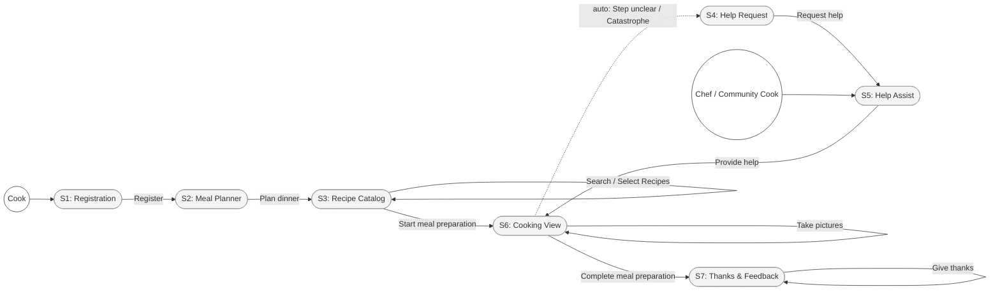
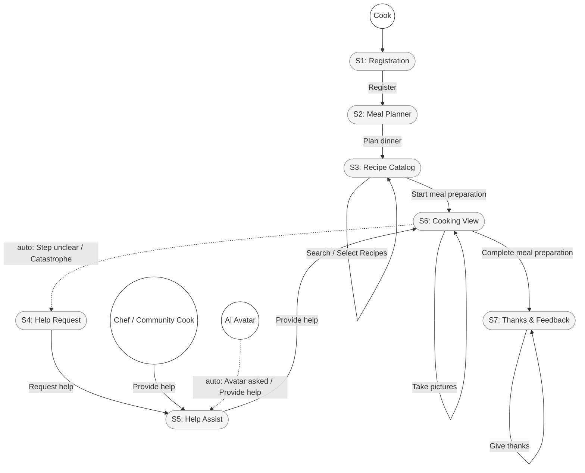

# Prompt 2026-09-03

Create a screenflow from the Event Model images. Use the provided skill.

[Skill](../Skills/CreateScreenflow/SKILL.md)

[References](../Skills/CreateScreenflow/references/reading-the-board.md)

# Answer

# Screen Flow — Larder

## 0. Inputs

* **Images used & order**: `LarderEventModel_I.jpg` $\rightarrow$ `EventModelLarder_II.jpg` $\rightarrow$ `EventModelLArder_III.jpg` (left-to-right chronological timeline).
* **Seam classifications**:
* **Image I $\rightarrow$ Image II**: *Overlap* (the `Help` bounding box, read model `Selected Recipes`, and `Take pictures` command bridge both views).
* **Image II $\rightarrow$ Image III**: *Overlap* (the `Sharing` lane, `Take pictures`, and `Give thanks` commands bridge Image II and III).

* **Lane analysis**:
* `Registration`, `Meal Planning`, `Sharing`, `Cook Assistance`, `Meal Preparation`: Contain UI wireframes and user interactions.
* `Notification` & `AI Avatar`: Carry system events and policy logic only (no standalone UI screens drawn).

* **Vocabulary**: Screen titles and transitions are derived directly from wireframe captions, commands, and read models on the board.

---

## 1. Screens

| Screen | Swimlane | Actor | Source | What happens here |
| --- | --- | --- | --- | --- |
| **S1: Registration** | Registration | Cook / User | Image I (WF 1) | User registers as a cook in the app. |
| **S2: Meal Planner** | Meal Planning | Cook | Image I (WF 2) | Cook initiates dinner planning. |
| **S3: Recipe Catalog** | Meal Planning | Cook | Image I & II (WF 3, 4) | Cook searches, filters, and selects recipes to prepare. |
| **S4: Help Request** | Cook Assistance | Cook | Image I & II (WF 5) | Cook requests assistance when blocked or facing cooking issues. |
| **S5: Help Assist** | Cook Assistance | Chef / Community Cook | Image I & II (WF 6) | Helpers review requested help and provide guidance. |
| **S6: Cooking View** | Meal Preparation | Cook | Image II & III (WF 7, 8) | Tracks active meal prep, image capture, recovery from errors, and completion. |
| **S7: Thanks & Feedback** | Sharing | Cook / Helper | Image III (WF 9) | Displays completion confirmation and allows giving thanks. |

---

## 2. Transitions

| From | Trigger (Command / Event) | To | Kind |
| --- | --- | --- | --- |
| `A0 (Cook)` | `Register` | `S1: Registration` | User |
| `S1: Registration` | `Register` | `S2: Meal Planner` | User |
| `S2: Meal Planner` | `Plan dinner` | `S3: Recipe Catalog` | User |
| `S3: Recipe Catalog` | `Search Recipes` / `Select Recipes` | `S3: Recipe Catalog` | User |
| `S3: Recipe Catalog` | `Start meal preparation` | `S6: Cooking View` | User |
| `S6: Cooking View` | `auto: Step unclear / Catastrophe` | `S4: Help Request` | Auto |
| `S6: Cooking View` | `Take pictures` | `S6: Cooking View` | User |
| `S4: Help Request` | `Request help` | `S5: Help Assist` | User |
| `A1 (Chef / Helper)` | `View help requests` | `S5: Help Assist` | User |
| `S5: Help Assist` | `Provide help` | `S6: Cooking View` | User |
| `S6: Cooking View` | `Complete meal preparation` | `S7: Thanks & Feedback` | User |
| `S7: Thanks & Feedback` | `Give thanks` | `S7: Thanks & Feedback` | User |

---

## 3. The flow

*Grey shapes represent UI screens; solid lines represent user actions; dashed lines represent automated triggers or state changes.*

---

## 4. Reachability check

* **Inbound/Outbound Edges**: Every screen has at least one inbound and one outbound transition.
* **Actor Paths**: The `Cook` reaches all main creation and prep screens; `Chef / Community Cook` enters directly at `S5: Help Assist`.
* **Loop Resolution**: The exception loop (`Cooking View` $\rightarrow$ `Help Request` $\rightarrow$ `Help Assist` $\rightarrow$ `Cooking View`) successfully returns the cook to active prep after receiving guidance (`Meal rescued`).
* **Status**: Pass.

---

## 5. Gaps & open questions

1. **Helper Authentication**: How do `Chef` and `Community Cook` roles log in or access `S5: Help Assist`? The board shows no registration or landing screen for non-Cook roles.
2. **Missing Ingredients Handling**: Image I shows events `Ingredients missing` and `Meal Planning stalled`, but no distinct UI flow or screen is drawn to resolve stalled planning.
3. **AI Avatar Presentation**: Does the AI Avatar respond within `S5: Help Assist` / `S6: Cooking View`, or does it present a separate conversational UI?
4. **Push Notifications**: `Community / Chef informed` exists in the `Notification` lane. Is there a push notification deep-link that lands helpers directly on `S5: Help Assist`?

# Further prompting

The help is missing the AI Avatar. Make the flow vertical.

# Screen Flow — Larder

## 0. Inputs

* **Images used & order**: `LarderEventModel_I.jpg` $\rightarrow$ `EventModelLarder_II.jpg` $\rightarrow$ `EventModelLArder_III.jpg`.

* **Layout adjustment**: Flow rendered vertically (`TD`) per request.
* **AI Avatar integration**: `AI Avatar` included as an automated assistant actor in the Cook Assistance / Help flow based on the `AI Avatar` swimlane events (`Avatar asked` $\rightarrow$ `Provide help` $\rightarrow$ `Help provided`).

* **Lane analysis**:
* `Registration`, `Meal Planning`, `Sharing`, `Cook Assistance`, `Meal Preparation`: Contain UI wireframes.

* `Notification` & `AI Avatar`: Contain automation policies and automated help handling.

---

## 1. Screens

| Screen | Swimlane | Actor | Source | What happens here |
| --- | --- | --- | --- | --- |
| **S1: Registration** | Registration | Cook / User | Image I (WF 1)

| User registers as a cook in the app.

|
| **S2: Meal Planner** | Meal Planning | Cook | Image I (WF 2)

| Cook initiates dinner planning.

|
| **S3: Recipe Catalog** | Meal Planning | Cook | Image I & II (WF 3, 4)

| Cook searches, filters, and selects recipes.

|
| **S4: Help Request** | Cook Assistance | Cook | Image I & II (WF 5)

| Cook requests help when blocked or facing an issue.

|
| **S5: Help Assist** | Cook Assistance | Chef / Community Cook / AI Avatar | Image I & II (WF 6)

| Human helpers or AI Avatar review and provide help.

|
| **S6: Cooking View** | Meal Preparation | Cook | Image II & III (WF 7, 8)

| Tracks active meal prep, photos, error recovery, and completion.

|
| **S7: Thanks & Feedback** | Sharing | Cook / Helper | Image III (WF 9)

| Displays completion confirmation and allows sending thanks.

|

---

## 2. Transitions

| From | Trigger (Command / Policy) | To | Kind |
| --- | --- | --- | --- |
| `A0 (Cook)` | `Register` | `S1: Registration` | User |
| `S1: Registration` | `Register` | `S2: Meal Planner` | User |
| `S2: Meal Planner` | `Plan dinner` | `S3: Recipe Catalog` | User |
| `S3: Recipe Catalog` | `Search Recipes` / `Select Recipes` | `S3: Recipe Catalog` | User |
| `S3: Recipe Catalog` | `Start meal preparation` | `S6: Cooking View` | User |
| `S6: Cooking View` | `auto: Step unclear / Catastrophe` | `S4: Help Request` | Auto |
| `S6: Cooking View` | `Take pictures` | `S6: Cooking View` | User |
| `S4: Help Request` | `Request help` | `S5: Help Assist` | User |
| `A1 (Chef / Community Cook)` | `Provide help` | `S5: Help Assist` | User |
| `A2 (AI Avatar)` | `auto: Avatar asked / Provide help` | `S5: Help Assist` | Auto |
| `S5: Help Assist` | `Provide help` | `S6: Cooking View` | User / Auto |
| `S6: Cooking View` | `Complete meal preparation` | `S7: Thanks & Feedback` | User |
| `S7: Thanks & Feedback` | `Give thanks` | `S7: Thanks & Feedback` | User |

---

## 3. The flow

*Grey shapes represent UI screens; white circles are entry points; solid lines represent direct user commands; dashed lines represent automated policy transitions.*

---

## 4. Reachability check

* **Inbound/Outbound Edges**: Every screen has functional entry and exit paths.
* **Help Integration**: `S5: Help Assist` is now reachable via both human helpers (`Chef / Community Cook`) and automated logic (`AI Avatar`).
* **Vertical Layout**: `TD` layout displays the sequential flow top-to-bottom without breaking node associations.
* **Status**: Pass.

---

## 5. Gaps & open questions

1. **AI vs Human Precedence**: When a help request is issued, does the `AI Avatar` respond immediately before human helpers (`Chef / Community Cook`), or do they answer concurrently?

2. **Helper Authentication**: How do `Chef` and `Community Cook` roles log in or access `S5: Help Assist`?

3. **Missing Ingredients Handling**: How are `Ingredients missing` and `Meal Planning stalled` events presented to the user in `S3: Recipe Catalog`?

4. **Push Notifications**: Does the `Community / Chef informed` notification deep-link directly into `S5: Help Assist`?

