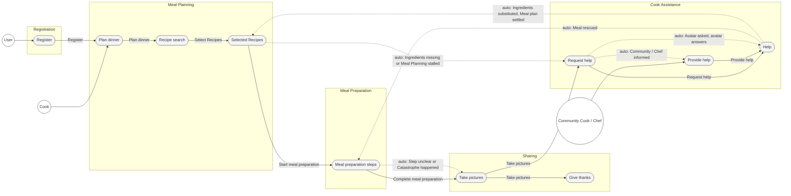

# Prompt 2026-09-03

/screen-flow-from-event-model

Create a screenflow from the Event Model images.

# Answer

# Screen Flow — Community Cooking (Larder Event Model)

Ten screens, three actors, one Mermaid flowchart. Extracted from the three board
images only; nothing added.

---

## 0. Inputs

**Images and order used** — from the filenames, left to right:

| Order | File | Covers |
|---|---|---|
| I | `LarderEventModel_I.jpg` | Registration · planning · the help workflow reached from *planning* trouble |
| II | `EventModelLarder_II.jpg` | Plan settling · meal preparation · the help workflow reached from *cooking* trouble · meal prepared |
| III | `EventModelLArder_III.jpg` | Pictures of the finished meal · thanks |

**Swimlanes recur identically in all three images**, same names, same
top-to-bottom order:

`Registration · Meal Planning · Sharing · Cook Assistance · Meal Preparaion · Notificaiton · AI Avatar`

(*Preparaion* and *Notificaiton* are the board's own spellings. Screen names
below use the corrected forms; the lane labels are left verbatim so anyone
holding the photos can match them.)

**Seams**

| Seam | Classification | Note |
|---|---|---|
| I → II | **Abutment** | I ends on the help workflow during planning; II opens on its outcome (`Ingredients substituted`, `Meal plan settled`). Nothing lost — but see §5 Q3: no connector is drawn between the help answer and either outcome. |
| I / II help block | **Recurrence, not duplication** | The identical block — `Request help` ⌘ → `Help requested` → `Community / Chef informed` + `Avatar asked` → `Help request` 👁 → `Provide help` ⌘ → `Help provided` → `Help` 👁 — appears in both images, matched on content **and** lane position. Read as **one** workflow reachable from two triggers. It is not two sets of screens. |
| I / II `Selected Recipes` | **Recurrence** | The same green read model with the same table wireframe above it, at the right of I and the left of II. One screen. |
| II → III | **Abutment** | II ends `Meal prepared`; III opens `Take pictures` → `Pictures taken` in Sharing. No connector crosses the seam — see §5 Q5. |
| II / III `Take pictures` | **Recurrence** | Same camera wireframe, same command, same Sharing lane, same `Pictures taken` event, same `Pictures` read model. **One screen, two inbound and two outbound edges.** This is the single most consequential call in the stitch — see §5 Q1. |

**No connector runs off a frame edge unresolved.**

**Lanes carrying no screens** — stated so it is clear they were not dropped:

- **Notificaiton** — `Community / Chef informed`, `Help request` 👁, `Thanks given`, and nothing else. No wireframe, no actor. Contributes edges only.
- **AI Avatar** — `Avatar asked`, `Help request` 👁, `Provide help` ⌘, `Help provided`. It carries a *command* sticky with no actor and no wireframe above it, which is a finding rather than a screen (§5 Q7). Contributes edges only.

**Not supplied, not asked for twice:** no Visual Glossary and no Domain Story
came with this request, so **every screen name is the board's own vocabulary**
(the wireframe's neighbouring command or read model). If you have the glossary
or the four Domain Stories the project's prototype readme mentions, the labels
are cheap to re-cut against them.

**Reading assumptions worth one sentence from the team**

- Wireframes are icon glyphs, not captioned boxes: a **table** icon = a list
  page, a **checklist** icon = a step list, a **camera** icon = the capture
  screen, a **pencil/form** icon = a form, a **phone** icon = the same screen on
  mobile. Screen identity was therefore decided by **lane + actor + read model**,
  not by the glyph, since the checklist glyph is reused three times for three
  different things.
- In image I the phone icon at the top sits between `Register` and
  `Plan dinner` under the `Cook` actor. Read as a mobile marker on the
  registration slice. If it belongs to `Plan dinner` instead, nothing in the
  flow changes.

---

## 1. Screens

| # | Screen | Swimlane | Actor | Source | What happens here |
|---|---|---|---|---|---|
| S1 | **Register** | Registration | User | I — form wireframe + `Register` ⌘ → `Cook registered` | The user signs up and becomes a Cook. |
| S2 | **Plan dinner** | Meal Planning | Cook | I — form wireframe + `Plan dinner` ⌘ | The cook starts a dinner. **No event is drawn under this command** (§5 Q6). |
| S3 | **Recipe search** | Meal Planning | Cook | I — table wireframe + `Search Recipes` ⌘ → `Recipes searched` → `Recipes` 👁; `Select Recipes` ⌘ → `Recipe selected` | Searching and picking recipes. Form and result list merged: the `Recipes` read model feeds straight back into the same wireframe, so searching again keeps the cook here. |
| S4 | **Selected Recipes** | Meal Planning | Cook | I & II — table wireframe + `Selected Recipes` 👁, fed by `Ingredients substituted` and `Meal plan settled` | What the cook has committed to cooking. The launch point for preparation. |
| S5 | **Request help** | Cook Assistance | Cook (requester) | I & II — form + phone wireframe, labelled `Help`, + `Request help` ⌘ → `Help requested` | The cook describes the trouble and asks. Reads `Pictures` when photos were taken first. |
| S6 | **Provide help** | Cook Assistance | Community Cook, Chef | I & II — form wireframe + `Provide help` ⌘ → `Help provided`, fed by the Notification lane's `Help request` 👁 | A responder reads the request and answers it. |
| S7 | **Help** | Cook Assistance | Cook (requester) | I & II — checklist + phone wireframe + `Help` 👁 | The cook reads the answers, from humans and from the avatar alike. |
| S8 | **Meal preparation steps** | Meal Preparaion | Cook | II — checklist wireframe + `Start meal preparation` ⌘ → `Meal preparation started`; checklist wireframe + `Complete meal preparation` ⌘ → `Meal prepared`; events `Step unclear`, `Catastrophe happened`, `Step competeted`, `Meal rescued`; `Selected Recipe` 👁 | Working through the recipe. **Two checklist wireframes merged into one screen** — same lane, same actor, same list, drawn at the start and again at the end (§5 Q2). |
| S9 | **Take pictures** | Sharing | Cook | II & III — camera wireframe + `Take pictures` ⌘ → `Pictures taken` → `Pictures` 👁 | Photographing. Drawn twice: once mid-catastrophe, once on the finished meal. **One screen** (§5 Q1). |
| S10 | **Give thanks** | Sharing | Cook | III — form wireframe + `Give thanks` ⌘ → `Thanks given`, fed by `Pictures` 👁 | Thanking whoever helped, with pictures attached. |

Ten screens. No screen here exists that no wireframe justifies, and no
wireframe on the board is unaccounted for.

---

## 2. Transitions

| From | Trigger | To | Kind |
|---|---|---|---|
| — | User enters | S1 Register | entry |
| — | Cook enters | S2 Plan dinner | entry |
| — | Community Cook / Chef enters | S6 Provide help | entry |
| S1 | `Register` | S2 Plan dinner | user — *no connector drawn; read from position* |
| S2 | `Plan dinner` | S3 Recipe search | user — *no event drawn under the command* |
| S3 | `Search Recipes` | S3 (stays) | user — `Recipes` 👁 feeds the same wireframe |
| S3 | `Select Recipes` | S4 Selected Recipes | user |
| S4 | `Ingredients missing` / `Meal Planning stalled` | S5 Request help | **auto — no command or policy drawn above either event** |
| S4 | `Start meal preparation` | S8 Meal preparation steps | user |
| S8 | `Step unclear` / `Catastrophe happened` | S9 Take pictures | **auto — no command or policy drawn above either event** |
| S8 | `Complete meal preparation` | S9 Take pictures | user — *across the II→III seam; no connector drawn* |
| S9 | `Take pictures` | S5 Request help | user — `Pictures` 👁 → `Help requested` (drawn, image II) |
| S9 | `Take pictures` | S10 Give thanks | user — `Pictures` 👁 → `Give thanks` ⌘ (drawn, image III) |
| S5 | `Request help` | S7 Help | user |
| S5 | `Community / Chef informed` | S6 Provide help | auto (Notification lane) |
| S5 | `Avatar asked` → `Provide help` → `Help provided` | S7 Help | auto (AI Avatar lane, no screen) |
| S6 | `Provide help` | S7 Help | user — lands on the **Cook's** screen, not the responder's |
| S7 | `Meal rescued` | S8 Meal preparation steps | **auto — machine icon on the sticky, no policy line drawn** |
| S7 | `Ingredients substituted` / `Meal plan settled` | S4 Selected Recipes | **auto — no command drawn above either event** |
| S10 | `Thanks given` | *(no screen — `Thanks` 👁 has no wireframe)* | auto, dangling (§5 Q4) |

---

## 3. The flow

`LR`, because the process is mostly linear with one help detour that recurs.

Screens are grey stadiums grouped by swimlane; circles are the three actors'
entry points; a **dashed** arrow means the user is moved without pressing
anything — and on this board **every one of the six dashed arrows is an
automation the board never draws a trigger for.**

Refusal self-loops are off by default. If you want the guards drawn as
`refused:` loops on S5, S8 and S10, say so — `event-model-invariant-finder`
produces them.

---

## 4. Reachability check

**Inbound edges** — every screen has one. ✅

**Outbound edges** — nine of ten. ❌ **S10 Give thanks is a terminal.**
`Thanks given` reaches the Notification lane and the `Thanks` 👁 read model, and
the read model has no wireframe, so the flow simply stops. The Community Cook
and the Chef enter this flow at S6 to answer and **never get a screen to read
their thanks on**. On a board whose whole reciprocity loop is *Thanks given*,
that is the sharpest hole in the navigation.

**Each actor reaches everything they own** —
User: S1. ✅
Cook: S2 → S3 → S4 → S8 → S9 → S5 → S7 → S10, all reachable. ✅
Community Cook / Chef: S6 only, and S6 has one inbound edge (`auto: Community /
Chef informed`) plus the actor entry. ✅ — but they own no *reading* screen at
all: `Help request` 👁 in the Notification lane feeds S6 rather than being a page
of its own, and `Thanks` / `Pictures` 👁 in image III have no wireframe.

**Every trouble branch has an exit** — ❌ **no.** Two failures:

- `Catastrophe happened` leaves S8 only along the success path: help arrives,
  `Meal rescued` fires, and the cook is back on S8. There is **no screen and no
  edge for a catastrophe that is not rescued** — no abandon, no serve-it-anyway,
  no order-a-takeaway. As drawn, the only way out of a disaster is to succeed.
- `Meal Planning stalled` leaves S4 only along the same shape: help arrives,
  ingredients get substituted, the plan settles. **No exit for a plan that
  cannot be unstalled.**

**One screen with two identical outbound edges** — S9 Take pictures leaves to
S5 and to S10 under the *same* label, `Take pictures`, and nothing on the board
distinguishes them. See Q1.

---

## 5. Gaps & open questions

**Q1 — Is `Take pictures` one screen or two?** The board draws the same camera
wireframe, command, event and read model in Sharing in both image II (mid
catastrophe) and image III (finished meal), so recurrence rules say **one
screen** — and that is how it is drawn above. But the two uses have different
audiences and lifetimes, and the flow shows the consequence: one screen with two
identical outbound edges, and a reader cannot tell which photos end up on a help
request and which on a public post. *Would settle it:* **can a cook attach the
catastrophe photos to their thanks, and the trophy shot to a help request?** If
no, these are two screens and the `Pictures` read model is two read models.
(Three prior analyses in this project reached "one word, two concepts" from
other directions.)

**Q2 — Is `Start meal preparation` on the same screen as `Complete meal
preparation`?** Merged into S8 above: same lane, same actor, same checklist
wireframe, one drawn at the start of preparation and one at the end, which the
method redraws to show information completeness rather than to show two pages.
*Would settle it:* **does the cook press Start on a recipe page, or on the step
list itself?** If the former, S4 → S8 is really S4 → *Start* → S8 and there is
an eleventh screen.

**Q3 — Six automations, six unstated triggers.** Every dashed arrow in §3 is an
event with **no command and no policy sticky drawn above it**:
`Ingredients missing`, `Meal Planning stalled`, `Step unclear`,
`Catastrophe happened`, `Step competeted`, `Ingredients substituted`,
`Meal plan settled`, and `Meal rescued` (which carries a machine icon but no
policy line). *Would settle it, per event:* **does the cook press something, or
does the system notice?** The answer decides whether each of these is a button
on an existing screen, a policy, or a screen nobody has drawn yet. Two of them
matter most: **what settles a meal plan** (there is no `Settle meal plan`
command anywhere on three images), and **what raises `Meal rescued`** — because
as drawn, the arrival of advice *is* the rescue.

**Q4 — `Thanks` and `Pictures` in image III have no wireframe.** They sit under
the `Community Cook` and `Chef` actor icons with no screen drawn above them, so
per the extraction rule they produce no node — which is why S10 is a terminal.
*Would settle it:* **is there a community feed where responders see thanks and
finished meals?** If yes, that is screen S11 and the flow closes; if no, the
reciprocity loop has no UI.

**Q5 — Nothing connects `Meal prepared` to `Take pictures`.** The II → III seam
is a clean abutment, and the edge `S8 --Complete meal preparation--> S9` above is
read from position, not from a drawn connector. *Would settle it:* **after
completing a meal, does the app take the cook to the camera, or does the cook
find it themselves?**

**Q6 — `Plan dinner` is a command with no event.** S2 exists because the
wireframe and command are drawn; what leaves it is not. *Would settle it:*
**what fact does planning a dinner create — `Dinner planned`?** Nothing
downstream currently reads anything S2 produces.

**Q7 — The AI Avatar lane holds a `Provide help` command with no actor.** A
command implies someone who decides; here the decider is a machine, and there is
no wireframe. Drawn as a dashed edge from S5 to S7 with no screen. *Would settle
it:* **is that a policy rather than a command — and does the cook see on S7
which answers came from the avatar and which from a person?** (The project's
`context-cut-cooking-rescue-story.md` argues for labelling avatar answers as
machine-generated behind an anticorruption layer; the Event Model's own grid
gives the avatar its own lane instead. Still worth settling on the board.)

**Q8 — `Cook registered` has no consumer.** Registration produces a Cook and
nothing on any of the three images reads one, so S1 connects onward only by
position. *Would settle it:* **which screen does a newly registered cook land
on, and does anything check that the requester on S5 is a registered cook?**

**Q9 — Are S3 and S4 one screen?** `Recipes` 👁 and `Selected Recipes` 👁 have
separate table wireframes, which is why they are two above, but both are plural
lists in the same lane for the same actor. *Would settle it:* **is the selected
set a separate page, or a filter on the search results?**

---

## Note on the prior read in this project

`prototype-community-cooking-event-model.md` was built from these same three
images and reported the same lane order, the same three seam classifications and
the same recurrence call on the help block — reached independently, before this
extraction. It also reported `Plan dinner` with no event, the two planning
trouble events with no command, `Meal rescued` with a machine marker and no
policy line, and the missing Meal Preparation aggregate. Nothing in this read
contradicts it. What is new here is the **navigation** consequence of those
findings: S9's two identical outbound edges, S10's dead end, and the fact that
neither trouble branch has a non-success exit.

# Further prompting

Can I get the mermaid code separately? Make it vertical instead LR.

# Answer

Same graph, flowchart TD — the swimlane subgraphs now stack top-to-bottom, which reads closer to the board's own lane order. Nothing else changed, so the two files stay in sync.

One thing to watch: with TD, Take pictures has two outbound edges under the same label going to different lanes, and Mermaid will route them past each other. If it looks cramped, the fix is answering Q1 rather than nudging the layout — if evidence photos and the trophy shot turn out to be two screens, that crossing disappears.

