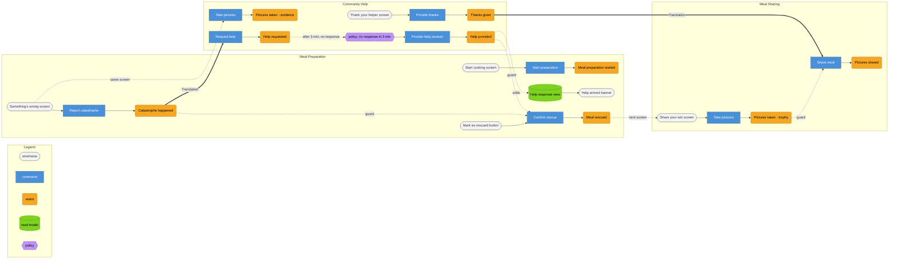

# Worked example — a six-sentence rescue story, three given contexts

Read this alongside SKILL.md's Workflow — each section below is the output of
the step with the same number. The scenario: a home-cooking app where a cook
gets into trouble mid-recipe and an AI persona, the "Grandma Avatar," helps.

**Inputs, as they arrived:**

- **Domain Story A** (Hofer & Schwentner notation, transcribed):
    1. Cook prepares Meal
    2. Cook burns Meal and takes Pictures
    3. Cook asks Grandma Avatar for Help with Catastrophe Pictures
    4. Grandma Avatar provides Help to rescue Meal
    5. Cook rescues Meal and takes Pictures
    6. Cook thanks Grandma Avatar and shares Pictures with Community

- **Bounded Contexts, given by the user** (from an earlier context-cutting
  session, not re-derived here): **Meal Preparation**, **Community Help**,
  **Meal Sharing**.

- **Found events, supplied by the user** (from an earlier EventStorming pass):
  `Meal preparation started` · `Catastrophe happened` · `Pictures taken`
  (appears twice) · `Help requested` · `Help provided` · `Meal rescued` ·
  `Thanks given` · `Pictures shared`, plus one policy noted on the board:
  *"if a Help request sits unanswered for a few minutes, the Grandma Avatar
  answers it."*

---

## 0. Inputs

Domain Story A above. Bounded contexts taken as given, unchanged. Found events
supplied; used as the backbone of the Big Picture below rather than re-derived.

## 1. Big Picture

Ordered, no swimlanes yet:

1. Meal preparation started
2. Catastrophe happened
3. Pictures taken *(evidence)*
4. Help requested
5. Help provided
6. Meal rescued
7. Pictures taken *(trophy)*
8. Thanks given
9. Pictures shared

**Assumptions flagged before going further.** Sentence 1 ("prepares") is
continuous; it is read as opening a lifecycle, so it becomes the discrete fact
`Meal preparation started`. And `Pictures taken` was supplied once but is
needed **twice**, for two different senses — the found events didn't
disambiguate them. Carried through as `Pictures taken (evidence)` and
`Pictures taken (trophy)` below; recommend renaming both before this goes on a
real board, since one name for two facts is exactly the kind of thing that
causes an implementation to merge two models that should stay separate.

## 2. Swimlane strip

| # | Event | Bounded Context | Source sentence(s) |
|---|-------|------------------|---------------------|
| 1 | Meal preparation started | Meal Preparation | 1 |
| 2 | Catastrophe happened | Meal Preparation | 2a |
| 3 | Pictures taken *(evidence)* | Community Help | 2b |
| 4 | Help requested | Community Help | 3 |
| 5 | Help provided | Community Help | 4 |
| 6 | Meal rescued | Meal Preparation | 5a |
| 7 | Pictures taken *(trophy)* | Meal Sharing | 5b |
| 8 | Thanks given | Community Help | 6a |
| 9 | Pictures shared | Meal Sharing | 6b |

Event 3 sits in Community Help rather than Meal Preparation because nothing
else on this model ever reads it except the help request it feeds — the same
call the given cut already made. If a future story has the cook keep that
photo for their own record independent of asking for help, this placement is
worth revisiting.

## 3. Workflow slices

```
@SLICE-01 [State Change] Meal Preparation — Start cooking
Wireframe  "Start cooking": recipe reference (pre-filled or picked), Start button
Scenario: A cook starts a recipe
  Given  (nothing — first event of a fresh preparation)
   When  Start preparation (recipe: "Tomato Risotto")
   Then  Meal preparation started (recipe: "Tomato Risotto", started_at: 18:02)
```

```
@SLICE-02 [State Change] Meal Preparation — Report a catastrophe
Wireframe  "Something's wrong" button, visible throughout cooking; free-text
           field
Scenario: A cook reports a catastrophe mid-recipe
  Given  Meal preparation started (recipe: "Tomato Risotto", started_at: 18:02)
   When  Report catastrophe (step: 4, description: "rice has scorched")
   Then  Catastrophe happened (step: 4, description: "rice has scorched",
         reported_at: 18:11)
```

```
@SLICE-03 [State Change] Community Help — Capture evidence
Wireframe  same "Something's wrong" screen, camera button
Scenario: A cook photographs the problem
  Given  Catastrophe happened (step: 4, description: "rice has scorched")
   When  Take pictures (of: catastrophe)
   Then  Pictures taken (of: catastrophe, ref: pic-991)
```

```
@SLICE-04 [Translation] Meal Preparation → Community Help — Ask for help
Crosses  the situation (recipe, step, description) and the evidence photo
Scenario: A catastrophe becomes a help request
  Given  Catastrophe happened (step: 4, description: "rice has scorched")
         Pictures taken (of: catastrophe, ref: pic-991)
   When  Request help (situation: "rice scorched at step 4", photo: pic-991)
   Then  Help requested (situation: "rice scorched at step 4", photo: pic-991,
         opened_at: 18:11)
```

```
@SLICE-05 [Automation] Community Help — Escalate to the avatar
Policy     "Escalate unanswered request": if Help requested has no Help
           provided within 3 minutes, the Grandma Avatar answers
Scenario: Nobody answers in time, so the avatar does
  Given  Help requested (situation: "rice scorched at step 4", photo: pic-991,
         opened_at: 18:11)
         3 minutes elapse, no Help provided
   When  Provide help (avatar) (request: ref-1)
   Then  Help provided (request: ref-1, responder: "Grandma Avatar",
         text: "add a splash of stock and lower the heat",
         machine_generated: true)
```

```
@SLICE-06 [State View] Meal Preparation — See the response
Wireframe  "Help arrived" banner: response text, responder name, a
           machine-generated label when relevant
Given  Help provided (request: ref-1, responder: "Grandma Avatar",
       text: "add a splash of stock and lower the heat",
       machine_generated: true)
Shows  "add a splash of stock and lower the heat" — Grandma Avatar (machine-
       generated)
```

```
@SLICE-07 [State Change] Meal Preparation — Confirm the rescue
Wireframe  "Mark as rescued" button, disabled until a response has arrived
Scenario: The cook confirms the meal is saved
  Given  Catastrophe happened (step: 4, …)
         Help provided (request: ref-1, …)
   When  Confirm rescue (step: 4)
   Then  Meal rescued (step: 4, confirmed_at: 18:15)

Scenario: A rescue cannot be confirmed before help has arrived
  Given  Catastrophe happened (step: 4, …)
         (no Help provided yet)
   When  Confirm rescue (step: 4)
   Then  the command is rejected with "no response has arrived yet"
```

The rejection scenario above is the direct, mechanical consequence of writing
a real Given for SLICE-07 — it encodes, without anyone having to say it aloud,
that *receiving advice is not the same as the meal being rescued*.

```
@SLICE-08 [State Change] Meal Sharing — Capture the result
Wireframe  "Share your win" screen, shown once the meal is marked rescued;
           camera button
Scenario: The cook photographs the finished meal
  Given  Meal rescued (step: 4, confirmed_at: 18:15)
   When  Take pictures (of: finished meal)
   Then  Pictures taken (of: finished meal, ref: pic-994)
```

This slice's wireframe appears at the natural moment — right after cooking —
even though the fact it produces belongs to Meal Sharing's model, not Meal
Preparation's. That's normal: the UI can sit at the seam between two contexts;
what decides ownership is which context's language the resulting event fits,
not which screen happened to be on when the button was pressed.

```
@SLICE-09 [State Change] Community Help — Say thanks
Wireframe  "Thank your helper" screen, responder name pre-filled from SLICE-06
Scenario: The cook thanks whoever helped
  Given  Help provided (request: ref-1, responder: "Grandma Avatar", …)
   When  Provide thanks (responder: "Grandma Avatar")
   Then  Thanks given (responder: "Grandma Avatar", thanked_at: 18:20)
```

```
@SLICE-10 [Translation] Community Help → Meal Sharing — Publish the post
Crosses  who helped (so the post can credit them)
Scenario: The rescue and the result are shared with the community
  Given  Thanks given (responder: "Grandma Avatar", thanked_at: 18:20)
         Pictures taken (of: finished meal, ref: pic-994)
   When  Share meal (photo: pic-994, credited_helper: "Grandma Avatar")
   Then  Pictures shared (photo: pic-994, credited_helper: "Grandma Avatar",
         shared_at: 18:21)
```

## 4. The grid — redraw spec

| Slice | Pattern | Trigger | Meal Preparation | Community Help | Meal Sharing |
|---|---|---|---|---|---|
| 01 | State Change | Start cooking screen | **Meal preparation started** | | |
| 02 | State Change | "Something's wrong" screen | **Catastrophe happened** | | |
| 03 | State Change | same screen, camera | | **Pictures taken (evidence)** | |
| 04 | Translation | border: Prep → Help | | **Help requested** | |
| 05 | Automation | policy, 3 min | | **Help provided** | |
| 06 | State View | "Help arrived" banner | *(reads 05)* | | |
| 07 | State Change | "Mark as rescued" button | **Meal rescued** | | |
| 08 | State Change | "Share your win" screen | | | **Pictures taken (trophy)** |
| 09 | State Change | "Thank your helper" screen | | **Thanks given** | |
| 10 | Translation | border: Help → Sharing | | | **Pictures shared** |

Per `references/mermaid-grid.md`, the full rendering draws wireframes,
commands, events, read models and the policy — not events alone:



Two edges are worth a second look: `W2 -. same screen .->` is the same
"wireframe sits at the seam" situation as SLICE-08's note above — one screen,
two commands owned by two different contexts — and `E5 -. adds .-> R1` is
what closes SLICE-06's read model back to the event that actually feeds it,
which the table above can only say in a footnote.

## 5. Information-completeness check

| Field (in Command/Read Model) | Slice | Source event | Traces? |
|---|---|---|---|
| `recipe` | 01 `Start preparation` | — (first event) | **No** — see finding below |
| `step`, `description` | 02 `Report catastrophe` | cook's own input at command time | Yes — human-supplied, not a derived fact |
| `situation`, `photo` | 04 `Request help` | Catastrophe happened, Pictures taken | Yes |
| `request` | 05 `Provide help (avatar)` | Help requested | Yes |
| `advice text` | 05 `Provide help (avatar)` | avatar's own generation | Yes — not expected to trace |
| guard: "a response exists" | 07 `Confirm rescue` | Help provided | Yes |
| `responder` | 09 `Provide thanks` | Help provided | Yes |
| `credited_helper`, `photo` | 10 `Share meal` | Thanks given, Pictures taken (trophy) | Yes |

**Findings:**

- **`recipe` on SLICE-01 doesn't trace.** Nothing upstream produced it — this
  model starts mid-process. Either that's deliberate (planning happens in a
  context outside this model's scope, and a recipe reference is simply
  expected to arrive from there) or a Translation slice from a Meal Planning
  context is missing at the very front of the timeline. Ask which.
- **The avatar's advice never received the recipe or ingredient list** — only
  a free-text `situation` and a photo crossed the border in SLICE-04. If good
  advice depends on knowing the actual recipe, SLICE-04's payload is
  incomplete and needs another field crossing the border; if the avatar truly
  works from a description and a photo alone, this is fine as designed. Worth
  a one-sentence confirmation either way.

## 6. Gaps & open questions

- **Only one responder appears anywhere in this story — the avatar.** Is a
  human-responder path (a "Community Cook" claiming the request before the
  timeout) missing from the story, which would make SLICE-05 sometimes a
  State Change instead of an Automation? Or is this deliberately the
  AI-assisted variant of the flow? This decides whether SLICE-05 needs a
  sibling slice.
- **No event closes a catastrophe that can't be rescued.** The model has one
  exit (`Meal rescued`) and no failure ending — worth asking whether that's
  acceptable for a first version or whether an `Abandon` command belongs on
  the timeline.
- **`Pictures taken` names two different facts.** Recommend the team rename
  them before this goes further (e.g. `Catastrophe photo captured` /
  `Finished-meal photo captured`) — carried through this model with a
  parenthetical only because the found events didn't disambiguate them.
- **The 3-minute escalation window is invented for this example** — the
  found policy note didn't give a number. Flag any placeholder duration like
  this rather than treating it as settled.

## 7. Contested calls & alternatives

**SLICE-05, Automation vs. manual State Change.** If the avatar isn't ready to
ship first, build SLICE-05 as a plain State Change (a human always answers)
and add the escalation policy in a later pass — cheaper to build correctly
once, and the Given/When/Then barely changes.

**SLICE-08's owning context.** The wireframe fires immediately after cooking,
but the event was placed in Meal Sharing rather than Meal Preparation, per the
given cut. Alternative: keep the raw photo owned by Meal Preparation and have
Meal Sharing hold only a reference to it — cheaper if nothing besides the post
ever needs the original image. Kept as given here; flag if the team disagrees.

**Coarser cut.** SLICE-09 and SLICE-10 could merge into one command
("Thank and share") if the product always treats them as a single gesture.
Rejected here because it removes the ability to thank privately without
publishing, which the two-slice version preserves for free.