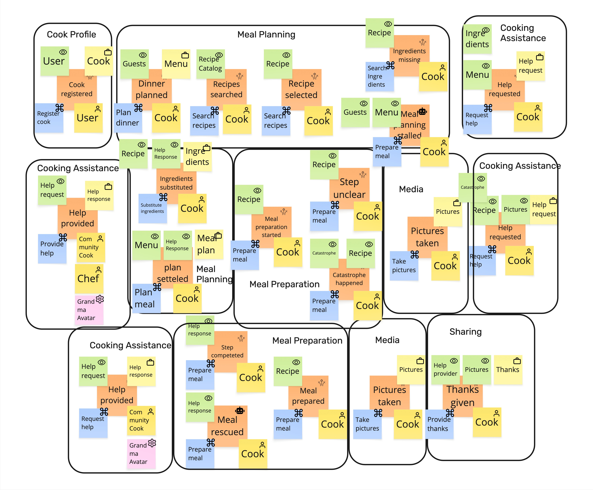

# Prompt 2026-09-08

Check EventStorming board against the Context Map. Use the provided skill.

[Skill](../Skills/ContextBoardEventStormingConsistency/SKILL.md)
[Refrences Checks](../Skills/ContextBoardEventStormingConsistency/references/checks.md)

# Answer

# Conformance Report — Context Map × EventStorming Board

## 0. Scope checked

I checked the supplied Context Map against the supplied EventStorming board using the uploaded consistency-check skill and its detection rules. The method treats the **board as evidence of observed producers/consumers and the map as a later claim**, so board silence is reported as “unsupported,” not automatically “wrong.”

Three provenance questions are not stated in the artifacts: whether this map was derived directly from this exact board, which artifact is newer, and whether the board represents the whole scope or one session slice. The skill says those facts can change the interpretation of unsupported nodes and edges.

**Assumption for this pass:** the map is intended to describe the domain shown on this board.

## 1. Verdict

**Diverged.**

The most important problem is not cosmetic: the map appears to have **collapsed or omitted the board's distinct `Cooking Help` context**, and several integrations have consequently been attached to `Cooking Assistance` instead. This then creates contract and direction problems around `Help request`, `Help response`, and `Pictures`.

My count from the legible evidence:

| Severity                                 | Findings |
| ---------------------------------------- | -------: |
| **Blocking**                             |        3 |
| **Significant**                          |        8 |
| **Minor**                                |        0 |
| **Needs clarification / board backfill** |        2 |

The skill specifically treats reversed producer/consumer direction and silently resolved contested ownership as blocking.

---

## 2. Board as read

After collapsing repeated appearances, I read these board contexts:

* `Cook Profile`
* `Meal Planning` — appears more than once
* `Cooking Assistance` — appears more than once
* `Cooking Help` — appears more than once
* `Meal Preparation` — appears more than once
* `Media` — appears more than once
* `Sharing`

`Grandma Avatar` appears as the external/pink participant in help provision.

The repeated `Meal Planning`, `Meal Preparation`, `Media`, `Cooking Assistance`, and `Cooking Help` bubbles are important: recurrence means “same context appears in multiple phases,” not “make multiple map nodes.” The consistency method explicitly requires recurrence to be collapsed before comparing nodes.

Some key board evidence is especially clear:

* `Meal Planning` writes **Menu**, **Ingredients**, and **Meal plan**.
* `Cooking Assistance` writes **Help request** and **Help response**.
* `Cooking Help` also writes **Help request** and **Help response**.
* `Media` writes **Pictures**.
* `Sharing` writes **Thanks**.
* `Recipe` is repeatedly **read**, but I do not see a board context writing it.
* `Pictures` is read in `Cooking Help` and `Sharing`.
* `Help response` is read in `Meal Planning` and `Meal Preparation`.

---

## 3. Context Map as read

Map nodes:

`Recipe Catalog`, `Cook Profile`, `Meal Planning`, `Grandma Avatar AI`, `Notification`, `Cooking Assistance`, `Media`, `Consent Management`, `Meal Preparation`, `Sharing`.

Notably absent:

**`Cooking Help`**

Notably present with no corresponding board bubble/evidence:

**`Notification`**
**`Consent Management`**

Important map contracts include:

* `Recipe Catalog → Meal Planning`: `Recipe`
* `Meal Planning → Cooking Assistance`: `Help request`
* `Cooking Assistance → Meal Planning`: `Help response`
* `Cooking Assistance → Meal Preparation`: `Help request`
* `Meal Preparation → Cooking Assistance`: `Help response`
* `Media → Cooking Assistance`: `Pictures`
* `Media → Sharing`: `Pictures`
* `Meal Preparation → Sharing`: `Help response`
* `Cook Profile → Consent Management`: `Consent`
* `Consent Management → Sharing`: `Consent`
* asynchronous help interaction between `Cooking Assistance` and `Grandma Avatar AI`

---

## 4. Term ledger

| Term               | Written by on board                                        | Read by on board                              | Map says / implies                                          | Verdict                                                 |
| ------------------ | ---------------------------------------------------------- | --------------------------------------------- | ----------------------------------------------------------- | ------------------------------------------------------- |
| **Cook**           | Cook Profile                                               | actors throughout board                       | Cook Profile                                                | consistent                                              |
| **Menu**           | Meal Planning                                              | Meal Planning, Cooking Assistance             | Meal Planning                                               | consistent                                              |
| **Ingredients**    | Meal Planning                                              | Cooking Assistance                            | Meal Planning **and Recipe Catalog appear to contain it**   | **OWN / clarification**                                 |
| **Meal plan**      | Meal Planning                                              | no clear cross-context reader                 | Meal Planning                                               | consistent locally                                      |
| **Help request**   | Cooking Assistance **and Cooking Help**                    | corresponding help-provision flows            | Cooking Assistance + Grandma Avatar AI; Cooking Help absent | **OWN / NODE**                                          |
| **Help response**  | Cooking Assistance **and Cooking Help**                    | Meal Planning, Meal Preparation               | Cooking Assistance + Grandma Avatar AI; Cooking Help absent | **OWN / DIR**                                           |
| **Recipe**         | no board writer visible                                    | Meal Planning, Meal Preparation, Cooking Help | Recipe Catalog                                              | plausible off-board upstream, but edges incomplete      |
| **Recipe Catalog** | no board writer visible                                    | Meal Planning                                 | Recipe Catalog node                                         | supported as an inferred upstream                       |
| **Pictures**       | Media                                                      | Cooking Help, Sharing                         | Media → Cooking Assistance and Sharing                      | **EDGE**                                                |
| **Catastrophe**    | associated with `Catastrophe happened` in Meal Preparation | Meal Preparation / Cooking Help               | no explicit border contract                                 | likely missing crossing; producer notation less certain |
| **Help provider**  | no explicit object writer visible                          | Sharing                                       | no matching contract                                        | **board gap / probable EDGE**                           |
| **Thanks**         | Sharing                                                    | nobody visible                                | Sharing                                                     | consistent/orphan                                       |
| **Consent**        | not present                                                | not present                                   | Cook Profile / Consent Management / Sharing                 | unsupported by board                                    |
| **Notification**   | not present                                                | not present                                   | Notification                                                | unsupported by board                                    |

The ledger is the core of the requested check: writer = upstream, and cross-context readers establish the edge.

---

# 5. Main findings

### F1 — `NODE` — `Cooking Help` is missing from the Context Map

**Significant — map moves**

The EventStorming board explicitly contains a separate `Cooking Help` bounded context, in at least two phases: one around `Help requested`, and another around `Help provided`.

The Context Map has only `Cooking Assistance`.

This should not be silently treated as recurrence: the board actually uses **two different bubble names**, `Cooking Assistance` and `Cooking Help`. The node-matching rules say two distinct board bubbles collapsed into one map node must be investigated as a collapse, not assumed to be synonyms.

**Recommendation:** add `Cooking Help` as a map node unless the team explicitly decided that `Cooking Help` and `Cooking Assistance` are one bounded context. If they are one, rename the board bubbles consistently and record that decision.

---

### F2 — `OWN` — `Help request` / `Help response` ownership is silently resolved

**Blocking — ask**

Both `Cooking Assistance` and `Cooking Help` visibly contain:

* a `Help requested` / `Help provided` flow,
* `Help request`,
* `Help response`.

So the board presents two contexts writing the same business terms.

The map removes `Cooking Help`, effectively resolving those objects into `Cooking Assistance`/`Grandma Avatar AI` without recording how ownership was settled.

That is exactly the skill's contested-ownership case: two contexts write one term and the map silently chooses one.

**Question that settles it:** Are `Help request` and `Help response` the same aggregate in both help contexts, or are there deliberately two different help models with the same names?

---

### F3 — `DIR` — `Help response` between Meal Preparation and Cooking Assistance is reversed

**Blocking — map moves**

The map shows:

**Meal Preparation → Cooking Assistance: `Help response`**

But the board shows `Help response` being produced by the help contexts and later consulted in `Meal Preparation`.

The observed direction is therefore:

**Cooking Assistance / Cooking Help → Meal Preparation**

not the reverse.

Direction is the most mechanical check in the skill: the producer is upstream, and a map arrow against that producer/consumer evidence is a real direction defect.

**Recommendation:** reverse that `Help response` integration, and first decide whether its actual producer is `Cooking Assistance`, `Cooking Help`, or both.

---

### F4 — `CONTRACT` — Meal Planning → Cooking Assistance names the wrong payload

**Significant — map moves**

The map says:

**Meal Planning → Cooking Assistance: `Help request`**

The board does **not** show Meal Planning producing `Help request`.

What the board does show is:

* `Ingredients substituted` in `Meal Planning`,
* an `Ingredients` business object there,
* `Ingredients` being read in `Cooking Assistance`.

So the board-supported crossing is much closer to:

**Meal Planning → Cooking Assistance: `Ingredients`**

while `Help request` originates inside the help contexts.

A contract naming a payload that its stated upstream does not produce is a `CONTRACT` finding.

---

### F5 — `CONTRACT` — Cooking Assistance → Meal Preparation `Help request` is unsupported

**Significant — back to the wall / map moves**

The map sends `Help request` from `Cooking Assistance` into `Meal Preparation`.

The board shows `Meal Preparation` consuming **Help response**, not `Help request`.

I therefore cannot find board evidence for this contract.

This does not prove the integration cannot exist; it means the supplied board does not support it.

---

### F6 — `EDGE` — Media is wired to the wrong help context

**Significant — map moves**

The board shows:

`Media` produces **Pictures** → `Cooking Help` reads **Pictures**.

The map instead says:

`Media → Cooking Assistance: Pictures`.

That looks like a downstream consequence of F1: once `Cooking Help` disappeared, its picture dependency was attached to `Cooking Assistance`.

**Recommendation:**

`Media → Cooking Help: Pictures`

`Media → Sharing: Pictures`

The second of those is already correctly present.

---

### F7 — `NODE` — Notification has no support on this board

**Significant — ask**

`Notification` is a map node, but I cannot find a Notification bubble, event, command, actor/system, or object on the EventStorming board.

Likewise, the asynchronous edge from `Cooking Assistance` into Notification has no observable crossing on this board.

The correct wording here is **unsupported**, not wrong: it may have been added after the workshop or come from another artifact. That distinction is explicitly required by the skill.

**Question:** Was Notification added after the EventStorming session or sourced from another model?

---

### F8 — `NODE` — Consent Management has no support on this board

**Significant — ask**

The map contains `Consent Management`, but the board has no corresponding context or visible `Consent` flow.

That also leaves these map edges unsupported:

* `Cook Profile → Consent Management`
* `Consent Management → Sharing`

Again: unsupported by this board, not necessarily an architectural mistake.

---

### F9 — `EDGE` — Recipe Catalog has more consumers than the map records

**Significant — map moves / ask**

The board repeatedly reads `Recipe` in:

* `Meal Planning`
* `Meal Preparation`
* `Cooking Help`

No local context visibly writes `Recipe`.

That is strong evidence for an off-board upstream, and `Recipe Catalog` is a plausible map representation of it.

However, the map only draws:

`Recipe Catalog → Meal Planning`.

The reverse sweep therefore finds at least the likely missing dependencies:

`Recipe Catalog → Meal Preparation`

`Recipe Catalog → Cooking Help`

The skill specifically requires this reverse sweep because crossings omitted from a Context Map are often more valuable than unsupported edges.

---

### F10 — `EDGE` — Meal Preparation → Sharing / `Help response` is unsupported

**Significant — map moves / back to the wall**

The map sends `Help response` from `Meal Preparation` to `Sharing`.

But the Sharing bubble reads:

* `Help provider`
* `Pictures`

and produces `Thanks`.

It does not visibly consume `Help response`, and Meal Preparation does not visibly produce it.

So both ends of this contract disagree with the board evidence.

There may indeed be a help-related dependency into Sharing, but the board currently names that information **Help provider**, not Help response.

---

### F11 — `OWN` / `TERM` — Ingredients appears to have two owners

**Blocking if it is one concept; otherwise clarify two models**

On the board, `Ingredients` is clearly written inside Meal Planning (`Ingredients substituted`) and later read by Cooking Assistance.

On the map, `Ingredients` also appears as an owned/yellow object inside `Recipe Catalog`.

If both stickies mean the same domain concept, the map gives an object to a context that the board does not show writing it, while Meal Planning demonstrably does write it.

If they are intentionally different concepts—for example “catalog recipe ingredients” versus “ingredients selected/substituted for this meal”—then using the same name across the border without recording the translation is a `TERM` issue.

**Recommendation:** distinguish the two terms, or establish one owner.

---

## 6. Undrawn edges / missing nodes

The reverse sweep produces this patch candidate set:

| Board evidence                                                | Context-map status                                                    |
| ------------------------------------------------------------- | --------------------------------------------------------------------- |
| Meal Planning → Cooking Assistance: **Ingredients**           | edge exists, **wrong contract**                                       |
| Help context → Meal Planning: **Help response**               | present from Cooking Assistance; Cooking Help contribution unresolved |
| Help context → Meal Preparation: **Help response**            | **map points opposite way**                                           |
| Media → Cooking Help: **Pictures**                            | **missing / attached to Cooking Assistance**                          |
| Media → Sharing: **Pictures**                                 | consistent                                                            |
| Recipe Catalog → Meal Preparation: **Recipe**                 | missing                                                               |
| Recipe Catalog → Cooking Help: **Recipe**                     | missing                                                               |
| Meal Preparation → Cooking Help: likely `Catastrophe` trigger | probable missing edge; notation less explicit                         |
| Help context → Sharing: likely `Help provider`                | board suggests a crossing but writer is not explicitly modelled       |

---

## 7. Allowed divergence

I did **not** report these as defects:

* The `ACL` around `Grandma Avatar AI`. The board shows the external Grandma Avatar participant, so an external map node is legitimate. The rules explicitly say not to flag external/pink participants merely for being represented as bounded contexts.
* Whether the external integration is drawn dashed, solid, synchronously or asynchronously where the board supplies no timing evidence.
* `CF`/Conformist choices where the board does not positively contradict them; relationship patterns are architectural decisions and absence of evidence alone is allowlisted.
* The repeated Meal Planning, Meal Preparation and Media bubbles being collapsed to one map node each. That part is correct.
* Layout and drawing style.

---

# 8. Patch list

### Context Map changes

1. **Add `Cooking Help`** as a separate node, unless the team explicitly confirms it should be merged with `Cooking Assistance`.
2. Reattach **Media → Cooking Help: Pictures**.
3. Replace **Meal Planning → Cooking Assistance: Help request** with the board-supported **Ingredients** contract.
4. Reverse the current `Help response` direction between Meal Preparation and the help domain: **help → Meal Preparation**.
5. Remove or justify the `Cooking Assistance → Meal Preparation: Help request` contract.
6. Remove or justify `Meal Preparation → Sharing: Help response`; model the board's `Help provider` crossing instead if that is the intended dependency.
7. Add Recipe Catalog consumers for **Meal Preparation** and **Cooking Help**, if `Recipe Catalog` is indeed the source of `Recipe`.
8. Mark `Notification` and `Consent Management` as off-board/newer-source contexts, or remove them from this board-derived map.
9. Resolve the ownership/name collision around **Ingredients**.
10. Resolve ownership of **Help request / Help response** before finalizing the help-related arrows.

### Back to the EventStorming wall

1. Decide explicitly whether `Cooking Assistance` and `Cooking Help` are genuinely separate bounded contexts.
2. If separate, distinguish their `Help request` and `Help response` models or record who owns the shared aggregate.
3. Show where `Recipe` actually comes from; the board currently only consumes it.
4. Clarify how `Help provider` is produced before Sharing consumes it.
5. Make the `Catastrophe happened → Request help` handoff explicit if that is the intended cross-context trigger.
6. Add Notification and Consent flows to the board if they really are part of this scenario.

## 9. Already consistent

Several important parts do match:

* One `Cook Profile` node for the board's Cook Profile.
* Repeated `Meal Planning` collapsed to one map context.
* Repeated `Meal Preparation` collapsed to one map context.
* Repeated `Media` collapsed to one map context.
* `Media → Sharing: Pictures`.
* `Recipe Catalog → Meal Planning: Recipe` is directionally plausible from the board's unwritten-but-read `Recipe`.
* `Grandma Avatar AI` as a separate external context is supported by the pink `Grandma Avatar` participant.
* `Cooking Assistance → Meal Planning: Help response` is consistent with `Help response` produced in the help context and read when the meal plan is settled.

The biggest correction is therefore **not a wholesale redraw**: restore/resolve `Cooking Help`, then repair the help-related integrations around that boundary.
