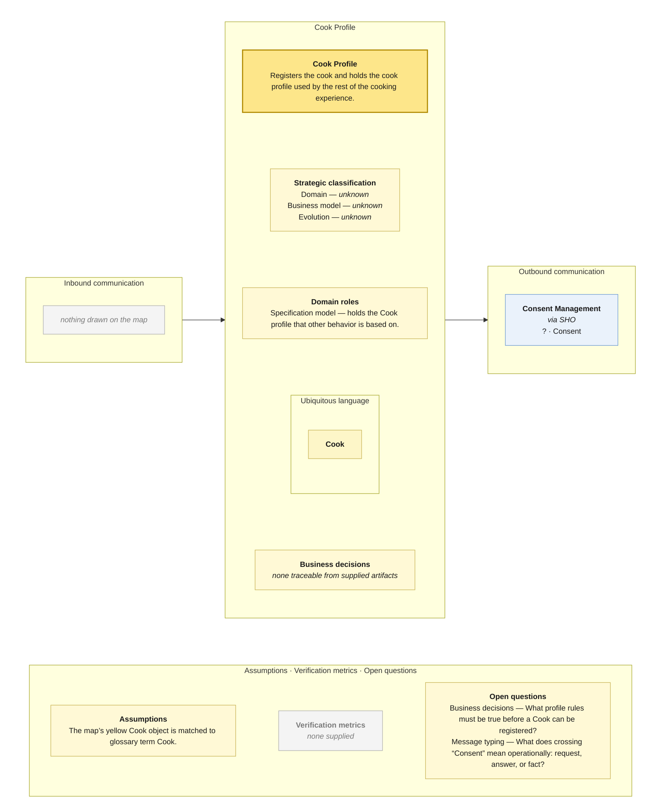

# Bounded Context Canvas — Cook Profile

> **Source:** supplied Context Map + supplied Visual Glossary · **Mode:** derived from the team's cut  
> **Provenance:** `(given)` stated by a source · `(derived)` read off one · `(proposed)` mine, confirm it · `(unknown)` nothing to derive from.

## Canvas

## Purpose  (derived)

Registers the cook and holds the cook profile used by the rest of the cooking experience.

## Strategic classification  (unknown)

| | |
|---|---|
| Domain | (unknown) — no Core Domain Chart supplied |
| Business model | (unknown) — no source supplied |
| Evolution | (unknown) — no Wardley/evolution source supplied |

## Domain roles  (derived)

- Specification model — holds the Cook profile that other behavior is based on.

## Inbound communication  (derived)

| Collaborator | Message | Type | What it carries | Evidence |
|---|---|---|---|---|
| — | — | — | — | nothing drawn on the map |

## Outbound communication  (derived)

| Message | Type | Collaborator | What it carries | Evidence |
|---|---|---|---|---|
| Consent | ? | Consent Management | border payload only; fields not supplied | synchronous · via SHO; Consent sticky on the Cook Profile → Consent Management border |

## Ubiquitous language  (given / derived)

The glossary slice is partitioned by the context map's ownership/read-model notation. Exact spelling differences between map and glossary are preserved in assumptions/open questions rather than silently normalized.

| Term | What it means *here* | Owned or borrowed | Cardinality / relation |
|---|---|---|---|
| Cook | The person registered as the cook. | owned / contested where noted | prepares 0..* Meal |

## Business decisions  (derived)

`(unknown)` — no context-local business decision can be traced confidently from the supplied artifacts.

## Assumptions  (derived)

- The map’s yellow Cook object is matched to glossary term Cook.

## Verification metrics  (unknown)

`none supplied`

## Open questions

- Business decisions — What profile rules must be true before a Cook can be registered?
- Message typing — What does crossing “Consent” mean operationally: request, answer, or fact?

## Border reconciliation

- `? · Consent` → **Consent Management**: matched by Consent Management's inbound table.
