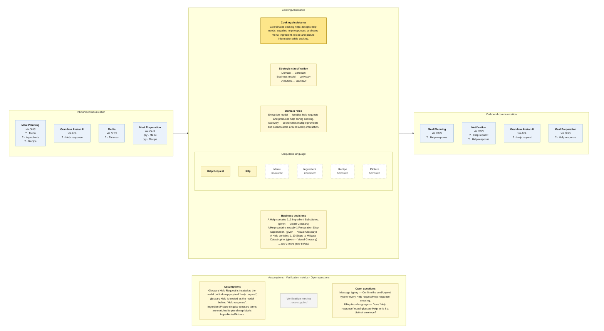

# Bounded Context Canvas — Cooking Assistance

> **Source:** supplied Context Map + supplied Visual Glossary · **Mode:** derived from the team's cut  
> **Provenance:** `(given)` stated by a source · `(derived)` read off one · `(proposed)` mine, confirm it · `(unknown)` nothing to derive from.

## Canvas

## Purpose  (derived)

Coordinates cooking help: accepts help needs, supplies help responses, and uses menu, ingredient, recipe and picture information while cooking.

## Strategic classification  (unknown)

| | |
|---|---|
| Domain | (unknown) — no Core Domain Chart supplied |
| Business model | (unknown) — no source supplied |
| Evolution | (unknown) — no Wardley/evolution source supplied |

## Domain roles  (derived)

- Execution model — handles help requests and produces help during cooking.
- Gateway — coordinates multiple providers and collaborators around a help interaction.

## Inbound communication  (derived)

| Collaborator | Message | Type | What it carries | Evidence |
|---|---|---|---|---|
| Meal Planning | Menu | ? | border payload only; fields not supplied | synchronous · via OHS; Menu sticky on the downward Meal Planning → Cooking Assistance border |
| Meal Planning | Ingredients | ? | border payload only; fields not supplied | synchronous · via OHS; Ingredients sticky on the downward Meal Planning → Cooking Assistance border |
| Meal Planning | Recipe | ? | border payload only; fields not supplied | synchronous · via OHS; Recipe read-model sticky on the downward Meal Planning → Cooking Assistance border |
| Grandma Avatar AI | Help response | ? | border payload only; fields not supplied | asynchronous · via ACL; Help response sticky on the dashed return border |
| Media | Pictures | ? | border payload only; fields not supplied | synchronous · via SHO; Pictures sticky on the Media → Cooking Assistance border |
| Meal Preparation | Menu | qry | border payload only; fields not supplied | synchronous · via OHS; green Menu read-model sticky on the upward Meal Preparation → Cooking Assistance border |
| Meal Preparation | Recipe | qry | border payload only; fields not supplied | synchronous · via OHS; green Recipe read-model sticky on the upward Meal Preparation → Cooking Assistance border |

## Outbound communication  (derived)

| Message | Type | Collaborator | What it carries | Evidence |
|---|---|---|---|---|
| Help response | ? | Meal Planning | border payload only; fields not supplied | synchronous · via OHS; Help response sticky on the upward Cooking Assistance → Meal Planning border |
| Help request | ? | Notification | border payload only; fields not supplied | asynchronous · via OHS; Help request sticky on the dashed Cooking Assistance → Notification border |
| Help response | ? | Notification | border payload only; fields not supplied | asynchronous · via OHS; Help response sticky on the dashed Cooking Assistance → Notification border |
| Help request | ? | Grandma Avatar AI | border payload only; fields not supplied | asynchronous · via ACL; Help request sticky on the dashed upward border |
| Help response | ? | Meal Preparation | border payload only; fields not supplied | synchronous · via OHS; Help response sticky on the downward Cooking Assistance → Meal Preparation border |

## Ubiquitous language  (given / derived)

The glossary slice is partitioned by the context map's ownership/read-model notation. Exact spelling differences between map and glossary are preserved in assumptions/open questions rather than silently normalized.

| Term | What it means *here* | Owned or borrowed | Cardinality / relation |
|---|---|---|---|
| Help Request | A request for help, specialized by the kind of cooking problem. | owned / contested where noted | may contain 0..10 Picture |
| Help | The help supplied for a request. | owned / contested where noted | contains 1..3 Ingredient Substitute; 1 Preparation Step Explanation; 1..10 Steps to Mitigate Catastrophe; 1..3 Menu proposal |
| Menu | Menu information used while assisting; owned by Meal Planning. | borrowed | borrowed |
| Ingredient | Ingredient information used while assisting; map says Ingredients. | borrowed | borrowed |
| Recipe | Recipe information used while assisting; owned by Recipe Catalog. | borrowed | borrowed |
| Picture | Pictures used as context; owned by Media. | borrowed | borrowed |

## Business decisions  (derived)

- A Help contains 1..3 Ingredient Substitutes. (given — Visual Glossary)
- A Help contains exactly 1 Preparation Step Explanation. (given — Visual Glossary)
- A Help contains 1..10 Steps to Mitigate Catastrophe. (given — Visual Glossary)
- A Help contains 1..3 Menu proposals. (given — Visual Glossary)

## Assumptions  (derived)

- Glossary Help Request is treated as the model behind map payload “Help request”; glossary Help is treated as the model behind “Help response”.
- Ingredient/Picture singular glossary terms are matched to plural map labels Ingredients/Pictures.

## Verification metrics  (unknown)

`none supplied`

## Open questions

- Message typing — Confirm the cmd/qry/evt type of every Help request/Help response crossing.
- Ubiquitous language — Does “Help response” equal glossary Help, or is it a distinct envelope?
- Boundary — Why does Meal Preparation query Menu and Recipe through Cooking Assistance when Meal Planning also exposes them directly?

## Border reconciliation

- `? · Help response` → **Meal Planning**: matched by Meal Planning's inbound table.
- `? · Help request` → **Notification**: matched by Notification's inbound table.
- `? · Help response` → **Notification**: matched by Notification's inbound table.
- `? · Help request` → **Grandma Avatar AI**: matched by Grandma Avatar AI's inbound table.
- `? · Help response` → **Meal Preparation**: matched by Meal Preparation's inbound table.
