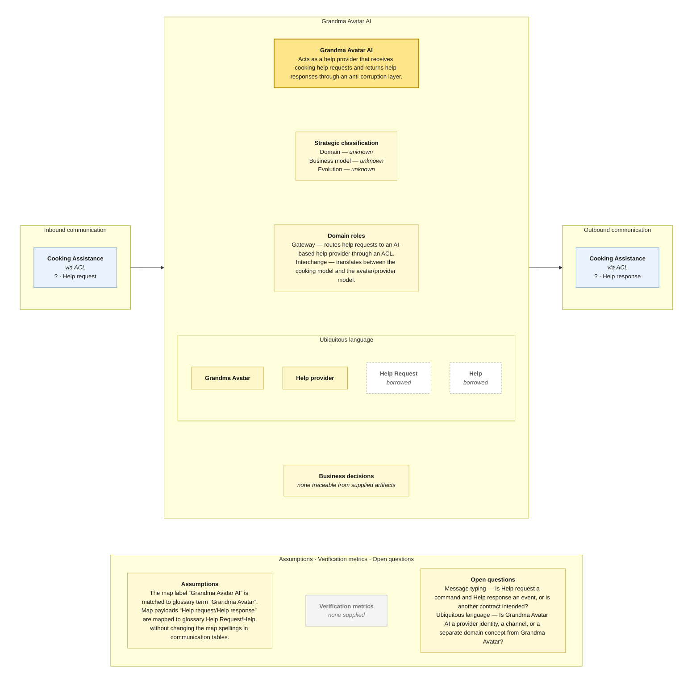

# Bounded Context Canvas — Grandma Avatar AI

> **Source:** supplied Context Map + supplied Visual Glossary · **Mode:** derived from the team's cut  
> **Provenance:** `(given)` stated by a source · `(derived)` read off one · `(proposed)` mine, confirm it · `(unknown)` nothing to derive from.

## Canvas

## Purpose  (derived)

Acts as a help provider that receives cooking help requests and returns help responses through an anti-corruption layer.

## Strategic classification  (unknown)

| | |
|---|---|
| Domain | (unknown) — no Core Domain Chart supplied |
| Business model | (unknown) — no source supplied |
| Evolution | (unknown) — no Wardley/evolution source supplied |

## Domain roles  (derived)

- Gateway — routes help requests to an AI-based help provider through an ACL.
- Interchange — translates between the cooking model and the avatar/provider model.

## Inbound communication  (derived)

| Collaborator | Message | Type | What it carries | Evidence |
|---|---|---|---|---|
| Cooking Assistance | Help request | ? | border payload only; fields not supplied | asynchronous · via ACL; Help request sticky on the dashed upward border |

## Outbound communication  (derived)

| Message | Type | Collaborator | What it carries | Evidence |
|---|---|---|---|---|
| Help response | ? | Cooking Assistance | border payload only; fields not supplied | asynchronous · via ACL; Help response sticky on the dashed return border |

## Ubiquitous language  (given / derived)

The glossary slice is partitioned by the context map's ownership/read-model notation. Exact spelling differences between map and glossary are preserved in assumptions/open questions rather than silently normalized.

| Term | What it means *here* | Owned or borrowed | Cardinality / relation |
|---|---|---|---|
| Grandma Avatar | An avatar that is a Help provider. | owned / contested where noted | is Help provider |
| Help provider | A provider capable of supplying Help. | owned / contested where noted | Grandma Avatar and Chef are Help providers |
| Help Request | A request for cooking help; owned in Cooking Assistance’s help model. | borrowed | borrowed |
| Help | The help supplied in response; owned in Cooking Assistance’s help model. | borrowed | borrowed |

## Business decisions  (derived)

`(unknown)` — no context-local business decision can be traced confidently from the supplied artifacts.

## Assumptions  (derived)

- The map label “Grandma Avatar AI” is matched to glossary term “Grandma Avatar”.
- Map payloads “Help request/Help response” are mapped to glossary Help Request/Help without changing the map spellings in communication tables.

## Verification metrics  (unknown)

`none supplied`

## Open questions

- Message typing — Is Help request a command and Help response an event, or is another contract intended?
- Ubiquitous language — Is Grandma Avatar AI a provider identity, a channel, or a separate domain concept from Grandma Avatar?

## Border reconciliation

- `? · Help response` → **Cooking Assistance**: matched by Cooking Assistance's inbound table.
