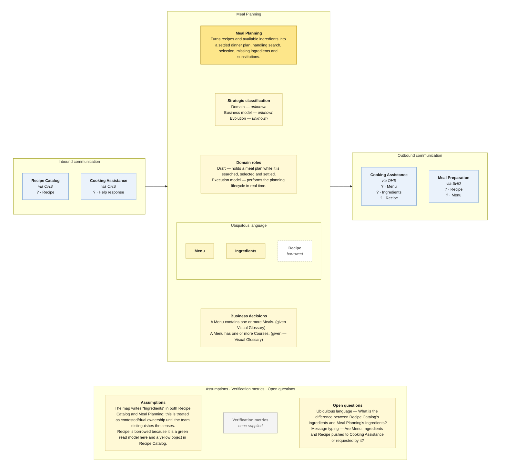

# Bounded Context Canvas — Meal Planning

> **Source:** supplied Context Map + supplied Visual Glossary · **Mode:** derived from the team's cut  
> **Provenance:** `(given)` stated by a source · `(derived)` read off one · `(proposed)` mine, confirm it · `(unknown)` nothing to derive from.

## Canvas

## Purpose  (derived)

Turns recipes and available ingredients into a settled dinner plan, handling search, selection, missing ingredients and substitutions.

## Strategic classification  (unknown)

| | |
|---|---|
| Domain | (unknown) — no Core Domain Chart supplied |
| Business model | (unknown) — no source supplied |
| Evolution | (unknown) — no Wardley/evolution source supplied |

## Domain roles  (derived)

- Draft — holds a meal plan while it is searched, selected and settled.
- Execution model — performs the planning lifecycle in real time.

## Inbound communication  (derived)

| Collaborator | Message | Type | What it carries | Evidence |
|---|---|---|---|---|
| Recipe Catalog | Recipe | ? | border payload only; fields not supplied | synchronous · via OHS; Recipe sticky on the Recipe Catalog → Meal Planning border |
| Cooking Assistance | Help response | ? | border payload only; fields not supplied | synchronous · via OHS; Help response sticky on the upward Cooking Assistance → Meal Planning border |

## Outbound communication  (derived)

| Message | Type | Collaborator | What it carries | Evidence |
|---|---|---|---|---|
| Menu | ? | Cooking Assistance | border payload only; fields not supplied | synchronous · via OHS; Menu sticky on the downward Meal Planning → Cooking Assistance border |
| Ingredients | ? | Cooking Assistance | border payload only; fields not supplied | synchronous · via OHS; Ingredients sticky on the downward Meal Planning → Cooking Assistance border |
| Recipe | ? | Cooking Assistance | border payload only; fields not supplied | synchronous · via OHS; Recipe read-model sticky on the downward Meal Planning → Cooking Assistance border |
| Recipe | ? | Meal Preparation | border payload only; fields not supplied | synchronous · via SHO; Recipe sticky on the long Meal Planning → Meal Preparation border |
| Menu | ? | Meal Preparation | border payload only; fields not supplied | synchronous · via SHO; Menu sticky on the long Meal Planning → Meal Preparation border |

## Ubiquitous language  (given / derived)

The glossary slice is partitioned by the context map's ownership/read-model notation. Exact spelling differences between map and glossary are preserved in assumptions/open questions rather than silently normalized.

| Term | What it means *here* | Owned or borrowed | Cardinality / relation |
|---|---|---|---|
| Menu | The planned set of food for the diner. | owned / contested where noted | has 1..* Course; contains 1..* Meal |
| Ingredients | Ingredients as used/adjusted by planning. | owned / contested where noted | spelling differs from glossary Ingredient |
| Recipe | Recipe definition selected during planning; owned by Recipe Catalog. | borrowed | borrowed |

## Business decisions  (derived)

- A Menu contains one or more Meals. (given — Visual Glossary)
- A Menu has one or more Courses. (given — Visual Glossary)

## Assumptions  (derived)

- The map writes “Ingredients” in both Recipe Catalog and Meal Planning; this is treated as contested/dual ownership until the team distinguishes the senses.
- Recipe is borrowed because it is a green read model here and a yellow object in Recipe Catalog.

## Verification metrics  (unknown)

`none supplied`

## Open questions

- Ubiquitous language — What is the difference between Recipe Catalog’s Ingredients and Meal Planning’s Ingredients?
- Message typing — Are Menu, Ingredients and Recipe pushed to Cooking Assistance or requested by it?
- Business decisions — What makes a meal plan “settled” and what conditions stall planning?

## Border reconciliation

- `? · Menu` → **Cooking Assistance**: matched by Cooking Assistance's inbound table.
- `? · Ingredients` → **Cooking Assistance**: matched by Cooking Assistance's inbound table.
- `? · Recipe` → **Cooking Assistance**: matched by Cooking Assistance's inbound table.
- `? · Recipe` → **Meal Preparation**: matched by Meal Preparation's inbound table.
- `? · Menu` → **Meal Preparation**: matched by Meal Preparation's inbound table.
