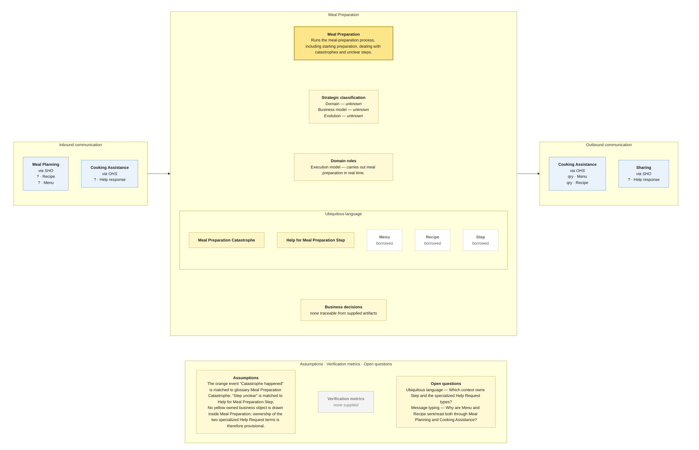

# Bounded Context Canvas — Meal Preparation

> **Source:** supplied Context Map + supplied Visual Glossary · **Mode:** derived from the team's cut  
> **Provenance:** `(given)` stated by a source · `(derived)` read off one · `(proposed)` mine, confirm it · `(unknown)` nothing to derive from.

## Canvas

## Purpose  (derived)

Runs the meal-preparation process, including starting preparation, dealing with catastrophes and unclear steps.

## Strategic classification  (unknown)

| | |
|---|---|
| Domain | (unknown) — no Core Domain Chart supplied |
| Business model | (unknown) — no source supplied |
| Evolution | (unknown) — no Wardley/evolution source supplied |

## Domain roles  (derived)

- Execution model — carries out meal preparation in real time.

## Inbound communication  (derived)

| Collaborator | Message | Type | What it carries | Evidence |
|---|---|---|---|---|
| Meal Planning | Recipe | ? | border payload only; fields not supplied | synchronous · via SHO; Recipe sticky on the long Meal Planning → Meal Preparation border |
| Meal Planning | Menu | ? | border payload only; fields not supplied | synchronous · via SHO; Menu sticky on the long Meal Planning → Meal Preparation border |
| Cooking Assistance | Help response | ? | border payload only; fields not supplied | synchronous · via OHS; Help response sticky on the downward Cooking Assistance → Meal Preparation border |

## Outbound communication  (derived)

| Message | Type | Collaborator | What it carries | Evidence |
|---|---|---|---|---|
| Menu | qry | Cooking Assistance | border payload only; fields not supplied | synchronous · via OHS; green Menu read-model sticky on the upward Meal Preparation → Cooking Assistance border |
| Recipe | qry | Cooking Assistance | border payload only; fields not supplied | synchronous · via OHS; green Recipe read-model sticky on the upward Meal Preparation → Cooking Assistance border |
| Help response | ? | Sharing | border payload only; fields not supplied | synchronous · via SHO; Help response sticky on the Meal Preparation → Sharing border |

## Ubiquitous language  (given / derived)

The glossary slice is partitioned by the context map's ownership/read-model notation. Exact spelling differences between map and glossary are preserved in assumptions/open questions rather than silently normalized.

| Term | What it means *here* | Owned or borrowed | Cardinality / relation |
|---|---|---|---|
| Meal Preparation Catastrophe | A catastrophe arising during meal preparation. | owned / contested where noted | is a Help Request subtype |
| Help for Meal Preparation Step | Help concerning a preparation step. | owned / contested where noted | is a Help Request subtype |
| Menu | Menu used during preparation; owned by Meal Planning. | borrowed | borrowed |
| Recipe | Recipe used during preparation; owned by Recipe Catalog. | borrowed | borrowed |
| Step | A step in a Recipe; glossary-defined, no exact owning object drawn in this context. | borrowed | borrowed/owner unresolved |

## Business decisions  (derived)

`(unknown)` — no context-local business decision can be traced confidently from the supplied artifacts.

## Assumptions  (derived)

- The orange event “Catastrophe happened” is matched to glossary Meal Preparation Catastrophe; “Step unclear” is matched to Help for Meal Preparation Step.
- No yellow owned business object is drawn inside Meal Preparation; ownership of the two specialized Help Request terms is therefore provisional.

## Verification metrics  (unknown)

`none supplied`

## Open questions

- Ubiquitous language — Which context owns Step and the specialized Help Request types?
- Message typing — Why are Menu and Recipe sent/read both through Meal Planning and Cooking Assistance?
- Business decisions — What makes a preparation step “unclear” or a situation a “catastrophe”?

## Border reconciliation

- `qry · Menu` → **Cooking Assistance**: matched by Cooking Assistance's inbound table.
- `qry · Recipe` → **Cooking Assistance**: matched by Cooking Assistance's inbound table.
- `? · Help response` → **Sharing**: matched by Sharing's inbound table.
