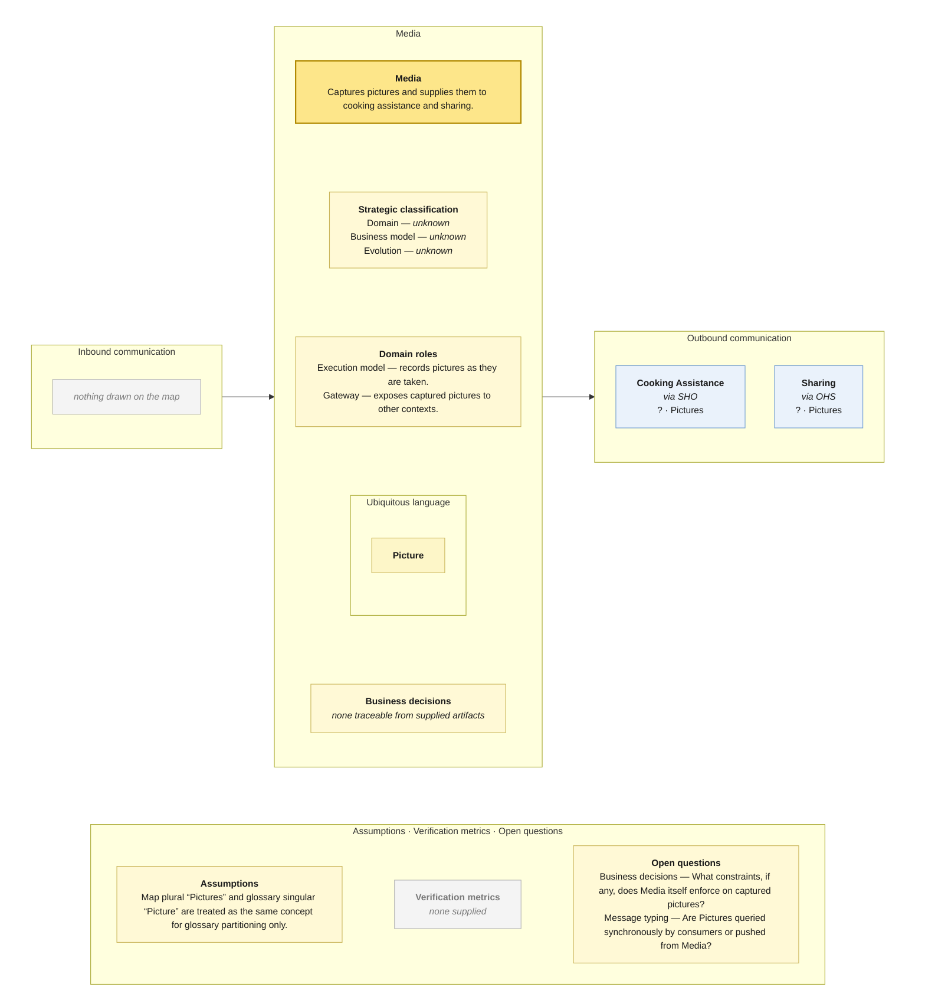

# Bounded Context Canvas — Media

> **Source:** supplied Context Map + supplied Visual Glossary · **Mode:** derived from the team's cut  
> **Provenance:** `(given)` stated by a source · `(derived)` read off one · `(proposed)` mine, confirm it · `(unknown)` nothing to derive from.

## Canvas

## Purpose  (derived)

Captures pictures and supplies them to cooking assistance and sharing.

## Strategic classification  (unknown)

| | |
|---|---|
| Domain | (unknown) — no Core Domain Chart supplied |
| Business model | (unknown) — no source supplied |
| Evolution | (unknown) — no Wardley/evolution source supplied |

## Domain roles  (derived)

- Execution model — records pictures as they are taken.
- Gateway — exposes captured pictures to other contexts.

## Inbound communication  (derived)

| Collaborator | Message | Type | What it carries | Evidence |
|---|---|---|---|---|
| — | — | — | — | nothing drawn on the map |

## Outbound communication  (derived)

| Message | Type | Collaborator | What it carries | Evidence |
|---|---|---|---|---|
| Pictures | ? | Cooking Assistance | border payload only; fields not supplied | synchronous · via SHO; Pictures sticky on the Media → Cooking Assistance border |
| Pictures | ? | Sharing | border payload only; fields not supplied | synchronous · via OHS; Pictures sticky on the Media → Sharing border |

## Ubiquitous language  (given / derived)

The glossary slice is partitioned by the context map's ownership/read-model notation. Exact spelling differences between map and glossary are preserved in assumptions/open questions rather than silently normalized.

| Term | What it means *here* | Owned or borrowed | Cardinality / relation |
|---|---|---|---|
| Picture | A picture attached to help or thanks. | owned / contested where noted | Help/Help Request/Thanks may contain pictures |

## Business decisions  (derived)

`(unknown)` — no context-local business decision can be traced confidently from the supplied artifacts.

## Assumptions  (derived)

- Map plural “Pictures” and glossary singular “Picture” are treated as the same concept for glossary partitioning only.

## Verification metrics  (unknown)

`none supplied`

## Open questions

- Business decisions — What constraints, if any, does Media itself enforce on captured pictures?
- Message typing — Are Pictures queried synchronously by consumers or pushed from Media?

## Border reconciliation

- `? · Pictures` → **Cooking Assistance**: matched by Cooking Assistance's inbound table.
- `? · Pictures` → **Sharing**: matched by Sharing's inbound table.
