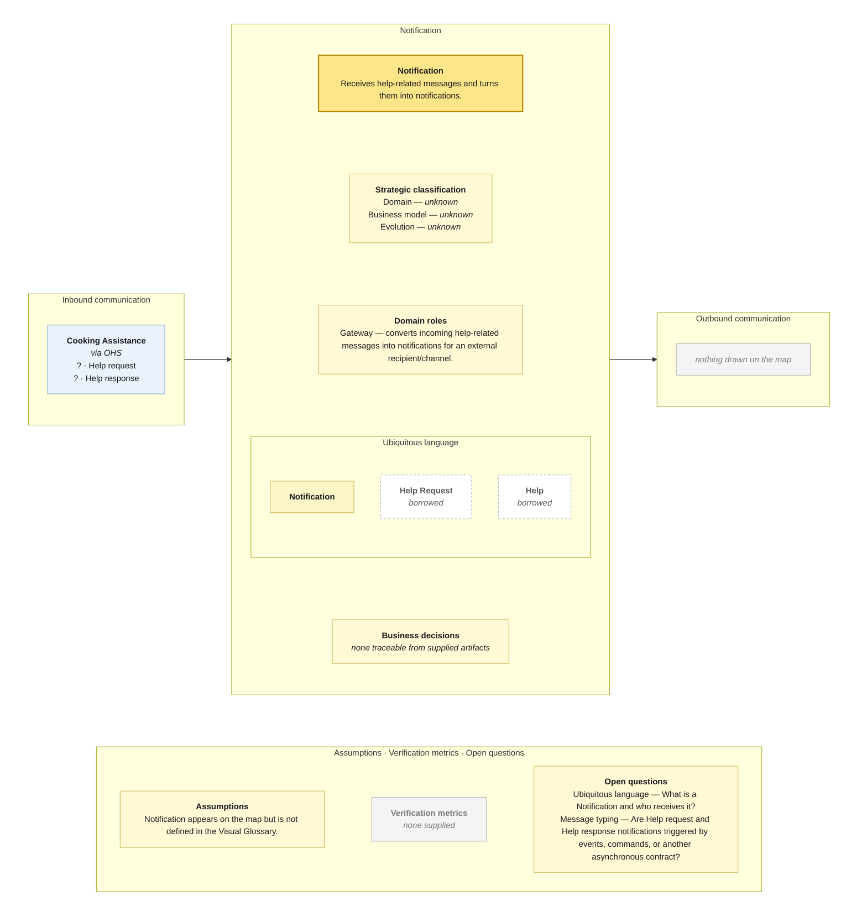

# Bounded Context Canvas — Notification

> **Source:** supplied Context Map + supplied Visual Glossary · **Mode:** derived from the team's cut  
> **Provenance:** `(given)` stated by a source · `(derived)` read off one · `(proposed)` mine, confirm it · `(unknown)` nothing to derive from.

## Canvas

## Purpose  (derived)

Receives help-related messages and turns them into notifications.

## Strategic classification  (unknown)

| | |
|---|---|
| Domain | (unknown) — no Core Domain Chart supplied |
| Business model | (unknown) — no source supplied |
| Evolution | (unknown) — no Wardley/evolution source supplied |

## Domain roles  (derived)

- Gateway — converts incoming help-related messages into notifications for an external recipient/channel.

## Inbound communication  (derived)

| Collaborator | Message | Type | What it carries | Evidence |
|---|---|---|---|---|
| Cooking Assistance | Help request | ? | border payload only; fields not supplied | asynchronous · via OHS; Help request sticky on the dashed Cooking Assistance → Notification border |
| Cooking Assistance | Help response | ? | border payload only; fields not supplied | asynchronous · via OHS; Help response sticky on the dashed Cooking Assistance → Notification border |

## Outbound communication  (derived)

| Message | Type | Collaborator | What it carries | Evidence |
|---|---|---|---|---|
| — | — | — | — | nothing drawn on the map |

## Ubiquitous language  (given / derived)

The glossary slice is partitioned by the context map's ownership/read-model notation. Exact spelling differences between map and glossary are preserved in assumptions/open questions rather than silently normalized.

| Term | What it means *here* | Owned or borrowed | Cardinality / relation |
|---|---|---|---|
| Notification | A notification emitted from help activity. | owned / contested where noted | no glossary definition supplied |
| Help Request | Help-related input originating in Cooking Assistance. | borrowed | borrowed |
| Help | Help-related response originating in Cooking Assistance. | borrowed | borrowed |

## Business decisions  (derived)

`(unknown)` — no context-local business decision can be traced confidently from the supplied artifacts.

## Assumptions  (derived)

- Notification appears on the map but is not defined in the Visual Glossary.

## Verification metrics  (unknown)

`none supplied`

## Open questions

- Ubiquitous language — What is a Notification and who receives it?
- Message typing — Are Help request and Help response notifications triggered by events, commands, or another asynchronous contract?

## Border reconciliation

- No outbound messages are drawn on the map.
