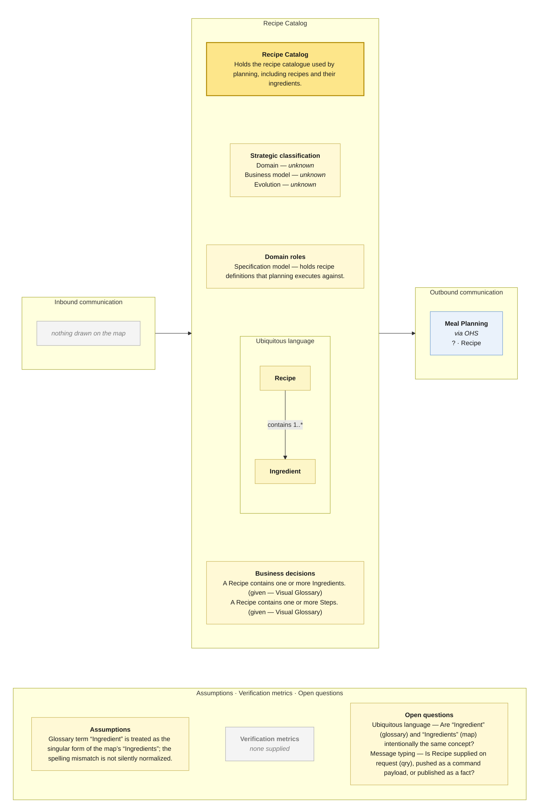

# Bounded Context Canvas — Recipe Catalog

> **Source:** supplied Context Map + supplied Visual Glossary · **Mode:** derived from the team's cut  
> **Provenance:** `(given)` stated by a source · `(derived)` read off one · `(proposed)` mine, confirm it · `(unknown)` nothing to derive from.

## Canvas

## Purpose  (derived)

Holds the recipe catalogue used by planning, including recipes and their ingredients.

## Strategic classification  (unknown)

| | |
|---|---|
| Domain | (unknown) — no Core Domain Chart supplied |
| Business model | (unknown) — no source supplied |
| Evolution | (unknown) — no Wardley/evolution source supplied |

## Domain roles  (derived)

- Specification model — holds recipe definitions that planning executes against.

## Inbound communication  (derived)

| Collaborator | Message | Type | What it carries | Evidence |
|---|---|---|---|---|
| — | — | — | — | nothing drawn on the map |

## Outbound communication  (derived)

| Message | Type | Collaborator | What it carries | Evidence |
|---|---|---|---|---|
| Recipe | ? | Meal Planning | border payload only; fields not supplied | synchronous · via OHS; Recipe sticky on the Recipe Catalog → Meal Planning border |

## Ubiquitous language  (given / derived)

The glossary slice is partitioned by the context map's ownership/read-model notation. Exact spelling differences between map and glossary are preserved in assumptions/open questions rather than silently normalized.

| Term | What it means *here* | Owned or borrowed | Cardinality / relation |
|---|---|---|---|
| Recipe | A recipe definition used to plan a meal. | owned / contested where noted | contains 1..* Ingredient; contains 1..* Step |
| Ingredient | An ingredient required by a recipe. | owned / contested where noted | 1..* per Recipe |

## Business decisions  (derived)

- A Recipe contains one or more Ingredients. (given — Visual Glossary)
- A Recipe contains one or more Steps. (given — Visual Glossary)

## Assumptions  (derived)

- Glossary term “Ingredient” is treated as the singular form of the map’s “Ingredients”; the spelling mismatch is not silently normalized.

## Verification metrics  (unknown)

`none supplied`

## Open questions

- Ubiquitous language — Are “Ingredient” (glossary) and “Ingredients” (map) intentionally the same concept?
- Message typing — Is Recipe supplied on request (qry), pushed as a command payload, or published as a fact?

## Border reconciliation

- `? · Recipe` → **Meal Planning**: matched by Meal Planning's inbound table.
